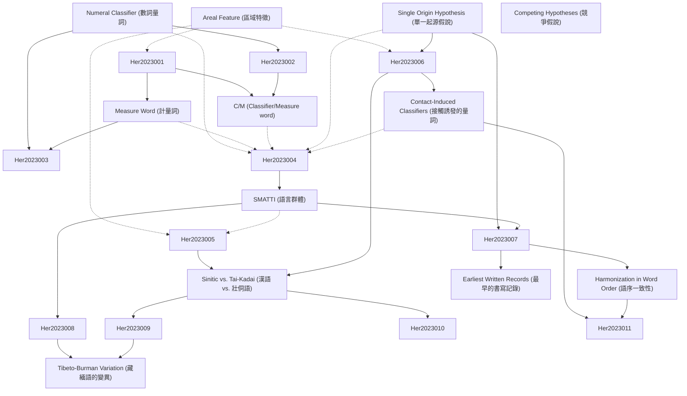

# Zettelkasten 卡片索引

**來源論文**: A single origin of numeral classifiers
**作者**: National Chengchi, Kadaiand Sinitic, Southeast Asia, Tunghai University, Papua New
**年份**: 2023
**生成日期**: 2025-11-04 14:53
**卡片總數**: 12

---

## 📚 卡片清單

### 1. [Numeral Classifier (數詞量詞)](zettel_cards/Her-2023-001.md)
- **ID**: `Her-2023-001`
- **類型**: 
- **核心**: “Numeral classifiers typically appear with a numeral quantifier.”
- **標籤**: `numeral classifier`, `measure word`, `classifier`, `linguistics`

### 2. [Measure Word (計量詞)](zettel_cards/Her-2023-002.md)
- **ID**: `Her-2023-002`
- **類型**: 
- **核心**: “The latter provideextrainformationintermsofthequantityoftheheadnoun,whileaCLF’ssemanticcontentoverlapswiththatoftheheadnoun.”
- **標籤**: `measure word`, `numeral classifier`, `semantics`, `linguistics`

### 3. [C/M (Classifier/Measure word)](zettel_cards/Her-2023-003.md)
- **ID**: `Her-2023-003`
- **類型**: 
- **核心**: “In this chapter we shall refer to the two as classifiers and measure words, and refer to the syntactic category formed by the two subcategories as C/Min short and ‘numeral classifiers’ in full.”
- **標籤**: `numeral classifier`, `measure word`, `syntactic category`, `linguistics`

### 4. [Areal Feature (區域特徵)](zettel_cards/Her-2023-004.md)
- **ID**: `Her-2023-004`
- **類型**: 
- **核心**: “The use of numeral classifiers, or C/Ms, has long been considered a prominent areal feature of languages in East and Southeast Asia.”
- **標籤**: `areal feature`, `language contact`, `diffusion`, `linguistics`

### 5. [Single Origin Hypothesis (單一起源假說)](zettel_cards/Her-2023-005.md)
- **ID**: `Her-2023-005`
- **類型**: 
- **核心**: “Our second, more important, goal is to explore a bold and yet appealing hypothesis that there is a single origin of numeral classifiers in Asia and the Pacific.”
- **標籤**: `single origin`, `hypothesis`, `numeral classifier`, `language evolution`

### 6. [SMATTI (語言群體)](zettel_cards/Her-2023-006.md)
- **ID**: `Her-2023-006`
- **類型**: 
- **核心**: “AnevenclearerpictureemergesfromFigure2,showingthedenseclusteringofclassifierlanguagesinEastandSoutheastAsia,wherethemajorityofsuchlanguagesbelongtosixlanguagegroups:Sinitic,Miao-Yao(Hmong-Mien),Austroasiatic,Tai-Kadai,Tibeto-Burman,andIndo-Aryanlanguages,hereafterreferredtoasSMATTI,anacronymproposedbyHeretal.(2015).”
- **標籤**: `SMATTI`, `language family`, `numeral classifier`, `East Asia`, `Southeast Asia`

### 7. [Sinitic vs. Tai-Kadai (漢語 vs. 壯侗語)](zettel_cards/Her-2023-007.md)
- **ID**: `Her-2023-007`
- **類型**: 
- **核心**: “WetaketheviewthatthisgrammaticalfeaturemostlikelyoriginatedineitherTai-KadaiorSiniticandfurtherarguethatSiniticenjoysaslightadvantagegiventheevidenceavailable.”
- **標籤**: `Sinitic`, `Tai-Kadai`, `language origin`, `numeral classifier`, `linguistic comparison`

### 8. [Contact-Induced Classifiers (接觸誘發的量詞)](zettel_cards/Her-2023-008.md)
- **ID**: `Her-2023-008`
- **類型**: 
- **核心**: “AnothermotivationforproposingasingleoriginfrominsideSMATTIistheclearsignsofcontact-inducedclassifiersinTibeto-Burman(TB).”
- **標籤**: `language contact`, `areal diffusion`, `Tibeto-Burman`, `numeral classifier`

### 9. [Harmonization in Word Order (語序一致性)](zettel_cards/Her-2023-009.md)
- **ID**: `Her-2023-009`
- **類型**: 
- **核心**: “There is harmonization in word order between C/M and base within a nominal phrase composed of Num, C/M, and N, as stated in (6), where C/M-final means [Num C/M], and C/M-initial, [C/M Num]; likewise, base-final means [n base], and base-initial, [base n]. C/M and base are seen as heads due to their function as the multiplicand.”
- **標籤**: `word order`, `numeral classifier`, `base`, `syntax`, `harmonization`

### 10. [Earliest Written Records (最早的書寫記錄)](zettel_cards/Her-2023-010.md)
- **ID**: `Her-2023-010`
- **類型**: 
- **核心**: “Besides the percentage, Chinese also shows signs of possible C/Ms as early as 3500 B.P. in its earliest written records, 甲骨文 Jiaguwen (oracle bone inscriptions) (e.g., Wang 1994).”
- **標籤**: `Sinitic`, `written records`, `oracle bone inscriptions`, `language history`, `time depth`

### 11. [Tibeto-Burman Variation (藏緬語的變異)](zettel_cards/Her-2023-011.md)
- **ID**: `Her-2023-011`
- **類型**: 
- **核心**: “The overall variation unique in TB is thus the result of varying degrees of language contact with neighboring classifier languages, where different sociolinguistic factors (e.g., geographical, economic, political, and cultural, etc.) must also play a profound role.”
- **標籤**: `Tibeto-Burman`, `language contact`, `areal diffusion`, `sociolinguistics`, `variation`

### 12. [Competing Hypotheses (競爭假說)](zettel_cards/Her-2023-012.md)
- **ID**: `Her-2023-012`
- **類型**: 
- **核心**: “Thissingleoriginhypothesisismeanttobejustthat,ahypothesis,onethatcompeteswithanumberofotherpossiblehypotheseswheretheriseofnumeralclassifiersinthelanguageorlanguagegroupsinquestionisduetofactorsindependentoflanguagecontact.”
- **標籤**: `hypothesis`, `single origin`, `independent development`, `language contact`, `scientific method`

---

## 🗺️ 概念網絡圖

---

## 🏷️ 標籤索引

### numeral classifier
- [[Her-2023-001]] Numeral Classifier (數詞量詞)
- [[Her-2023-002]] Measure Word (計量詞)
- [[Her-2023-003]] C/M (Classifier/Measure word)
- [[Her-2023-005]] Single Origin Hypothesis (單一起源假說)
- [[Her-2023-006]] SMATTI (語言群體)
- [[Her-2023-007]] Sinitic vs. Tai-Kadai (漢語 vs. 壯侗語)
- [[Her-2023-008]] Contact-Induced Classifiers (接觸誘發的量詞)
- [[Her-2023-009]] Harmonization in Word Order (語序一致性)

### measure word
- [[Her-2023-001]] Numeral Classifier (數詞量詞)
- [[Her-2023-002]] Measure Word (計量詞)
- [[Her-2023-003]] C/M (Classifier/Measure word)

### classifier
- [[Her-2023-001]] Numeral Classifier (數詞量詞)

### linguistics
- [[Her-2023-001]] Numeral Classifier (數詞量詞)
- [[Her-2023-002]] Measure Word (計量詞)
- [[Her-2023-003]] C/M (Classifier/Measure word)
- [[Her-2023-004]] Areal Feature (區域特徵)

### semantics
- [[Her-2023-002]] Measure Word (計量詞)

### syntactic category
- [[Her-2023-003]] C/M (Classifier/Measure word)

### areal feature
- [[Her-2023-004]] Areal Feature (區域特徵)

### language contact
- [[Her-2023-004]] Areal Feature (區域特徵)
- [[Her-2023-008]] Contact-Induced Classifiers (接觸誘發的量詞)
- [[Her-2023-011]] Tibeto-Burman Variation (藏緬語的變異)
- [[Her-2023-012]] Competing Hypotheses (競爭假說)

### diffusion
- [[Her-2023-004]] Areal Feature (區域特徵)

### single origin
- [[Her-2023-005]] Single Origin Hypothesis (單一起源假說)
- [[Her-2023-012]] Competing Hypotheses (競爭假說)

### hypothesis
- [[Her-2023-005]] Single Origin Hypothesis (單一起源假說)
- [[Her-2023-012]] Competing Hypotheses (競爭假說)

### language evolution
- [[Her-2023-005]] Single Origin Hypothesis (單一起源假說)

### SMATTI
- [[Her-2023-006]] SMATTI (語言群體)

### language family
- [[Her-2023-006]] SMATTI (語言群體)

### East Asia
- [[Her-2023-006]] SMATTI (語言群體)

### Southeast Asia
- [[Her-2023-006]] SMATTI (語言群體)

### Sinitic
- [[Her-2023-007]] Sinitic vs. Tai-Kadai (漢語 vs. 壯侗語)
- [[Her-2023-010]] Earliest Written Records (最早的書寫記錄)

### Tai-Kadai
- [[Her-2023-007]] Sinitic vs. Tai-Kadai (漢語 vs. 壯侗語)

### language origin
- [[Her-2023-007]] Sinitic vs. Tai-Kadai (漢語 vs. 壯侗語)

### linguistic comparison
- [[Her-2023-007]] Sinitic vs. Tai-Kadai (漢語 vs. 壯侗語)

### areal diffusion
- [[Her-2023-008]] Contact-Induced Classifiers (接觸誘發的量詞)
- [[Her-2023-011]] Tibeto-Burman Variation (藏緬語的變異)

### Tibeto-Burman
- [[Her-2023-008]] Contact-Induced Classifiers (接觸誘發的量詞)
- [[Her-2023-011]] Tibeto-Burman Variation (藏緬語的變異)

### word order
- [[Her-2023-009]] Harmonization in Word Order (語序一致性)

### base
- [[Her-2023-009]] Harmonization in Word Order (語序一致性)

### syntax
- [[Her-2023-009]] Harmonization in Word Order (語序一致性)

### harmonization
- [[Her-2023-009]] Harmonization in Word Order (語序一致性)

### written records
- [[Her-2023-010]] Earliest Written Records (最早的書寫記錄)

### oracle bone inscriptions
- [[Her-2023-010]] Earliest Written Records (最早的書寫記錄)

### language history
- [[Her-2023-010]] Earliest Written Records (最早的書寫記錄)

### time depth
- [[Her-2023-010]] Earliest Written Records (最早的書寫記錄)

### sociolinguistics
- [[Her-2023-011]] Tibeto-Burman Variation (藏緬語的變異)

### variation
- [[Her-2023-011]] Tibeto-Burman Variation (藏緬語的變異)

### independent development
- [[Her-2023-012]] Competing Hypotheses (競爭假說)

### scientific method
- [[Her-2023-012]] Competing Hypotheses (競爭假說)

---

## 📖 閱讀建議順序

1. [[Her-2023-001]] Numeral Classifier (數詞量詞)

2. [[Her-2023-002]] Measure Word (計量詞)

3. [[Her-2023-003]] C/M (Classifier/Measure word)

4. [[Her-2023-004]] Areal Feature (區域特徵)

5. [[Her-2023-005]] Single Origin Hypothesis (單一起源假說)

6. [[Her-2023-006]] SMATTI (語言群體)

7. [[Her-2023-007]] Sinitic vs. Tai-Kadai (漢語 vs. 壯侗語)

8. [[Her-2023-008]] Contact-Induced Classifiers (接觸誘發的量詞)

9. [[Her-2023-009]] Harmonization in Word Order (語序一致性)

10. [[Her-2023-010]] Earliest Written Records (最早的書寫記錄)

11. [[Her-2023-011]] Tibeto-Burman Variation (藏緬語的變異)

12. [[Her-2023-012]] Competing Hypotheses (競爭假說)

---

*本索引由 Knowledge Production System 自動生成*