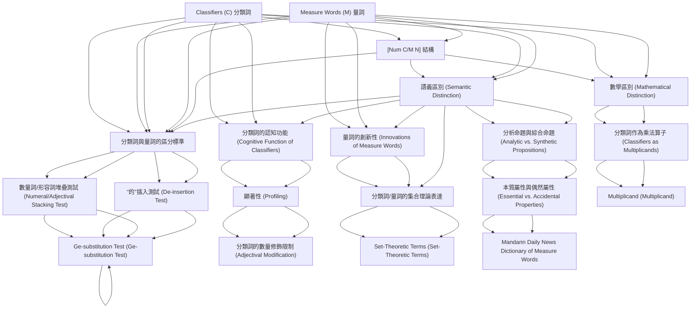

# Zettelkasten 卡片索引

**來源論文**: Her2012a_Profiling_One
**作者**: 
**年份**: 2025
**生成日期**: 2025-10-29 15:55
**卡片總數**: 20

---

## 📚 卡片清單

### 1. [Classifiers (C) 分類詞](zettel_cards/Linguistics-20251029-001.md)
- **ID**: `Linguistics-20251029-001`
- **類型**: 
- **核心**: "A classifier categorizes a class of nouns by picking out some salient perceptual properties, either physically or functionally based, which are permanently associated with entities named by the class of nouns;"
- **標籤**: `分類詞`, `量詞`, `語義`, `漢語`

### 2. [Measure Words (M) 量詞](zettel_cards/Linguistics-20251029-002.md)
- **ID**: `Linguistics-20251029-002`
- **類型**: 
- **核心**: "a measure word does not categorize but denotes the quantity of the entity named by noun."
- **標籤**: `量詞`, `分類詞`, `語義`, `漢語`

### 3. [[Num C/M N] 結構](zettel_cards/Linguistics-20251029-003.md)
- **ID**: `Linguistics-20251029-003`
- **類型**: 
- **核心**: "In spite of the same syntactic position C/M occupy in the [Num C/M N] sequence, in this paper we will fully justify the C/M distinction from three perspectives: semantic, mathematical, and cognitive."
- **標籤**: `句法結構`, `分類詞`, `量詞`, `數量詞`

### 4. [語義區別 (Semantic Distinction)](zettel_cards/Linguistics-20251029-004.md)
- **ID**: `Linguistics-20251029-004`
- **類型**: 
- **核心**: "C is semantically redundant; M is semantically substantive."
- **標籤**: `語義`, `分類詞`, `量詞`, `信息量`

### 5. [數學區別 (Mathematical Distinction)](zettel_cards/Linguistics-20251029-005.md)
- **ID**: `Linguistics-20251029-005`
- **類型**: 
- **核心**: "C’s value is necessarily 1 and M is not, thus ~1."
- **標籤**: `數學`, `分類詞`, `量詞`, `乘數`

### 6. [分類詞與量詞的區分標準](zettel_cards/Linguistics-20251029-006.md)
- **ID**: `Linguistics-20251029-006`
- **類型**: 
- **核心**: "Based on the insight that an M in a Chinese [Num C/M N] phrase is semantically substantive, while a C is semantically redundant and thus does not block numeral quantification or adjectival modification to the noun"
- **標籤**: `分類詞`, `量詞`, `漢語`, `判斷標準`

### 7. [分類詞的認知功能 (Cognitive Function of Classifiers)](zettel_cards/Linguistics-20251029-007.md)
- **ID**: `Linguistics-20251029-007`
- **類型**: 
- **核心**: "the semantically redundant C serves to profile an inherent semantic feature of N and thus selects a narrow class of N’s."
- **標籤**: `認知`, `分類詞`, `語義`, `名詞`

### 8. [量詞的創新性 (Innovations of Measure Words)](zettel_cards/Linguistics-20251029-008.md)
- **ID**: `Linguistics-20251029-008`
- **類型**: 
- **核心**: "M can be demonstrated to be more of a content word, thus open to innovations, while C is more a function word, thus forms a closed set resistant to innovations."
- **標籤**: `量詞`, `分類詞`, `語言演變`, `創新`

### 9. [分析命題與綜合命題 (Analytic vs. Synthetic Propositions)](zettel_cards/Linguistics-20251029-009.md)
- **ID**: `Linguistics-20251029-009`
- **類型**: 
- **核心**: "C indicates an essential property of the noun, and can be paraphrased as the predicate concept in an analytic proposition with the noun as the subject concept; M indicates an accidental property in terms of quantity, and can be restated as the predicate concept in a synthetic proposition with the noun as the subject concept."
- **標籤**: `語義`, `分析命題`, `綜合命題`, `分類詞`, `量詞`

### 10. [分類詞作為乘法算子 (Classifiers as Multiplicands)](zettel_cards/Linguistics-20251029-010.md)
- **ID**: `Linguistics-20251029-010`
- **類型**: 
- **核心**: "there is a multiplication relation between Num and C/M, i.e., [Num C/M] = [multiplier × multiplicand], but the crucial C/M distinction in terms of their mathematical value is that C’s value is necessarily 1, and M’s value is not necessarily 1, thus ~1."
- **標籤**: `數學`, `乘法`, `分類詞`, `量詞`

### 11. [數量詞/形容詞堆疊測試 (Numeral/Adjectival Stacking Test)](zettel_cards/Linguistics-20251029-011.md)
- **ID**: `Linguistics-20251029-011`
- **類型**: 
- **核心**: "If [Num X Num Y N] is well-formed, then X = M and Y = C/M."
- **標籤**: `診斷測試`, `量詞`, `分類詞`, `數量詞`

### 12. [“的”插入測試 (De-insertion Test)](zettel_cards/Linguistics-20251029-012.md)
- **ID**: `Linguistics-20251029-012`
- **類型**: 
- **核心**: "Test: [yi M/*C de N]"
- **標籤**: `診斷測試`, `量詞`, `分類詞`, `助詞`

### 13. [顯著性 (Profiling)](zettel_cards/Linguistics-20251029-013.md)
- **ID**: `Linguistics-20251029-013`
- **類型**: 
- **核心**: "the semantically redundant C nonetheless functions to profile an inherent semantic aspect of the head noun."
- **標籤**: `顯著性`, `語義`, `分類詞`, `認知`

### 14. [分類詞/量詞的集合理論表達](zettel_cards/Linguistics-20251029-014.md)
- **ID**: `Linguistics-20251029-014`
- **類型**: 
- **核心**: "Given a well-formed phrase [Num K N], X the set of properties denoted by K, and Y the set of properties denoted by N, K is C if X ⊂ Y; otherwise, K is M."
- **標籤**: `集合論`, `語義`, `分類詞`, `量詞`

### 15. [本質屬性與偶然屬性 (Essential vs. Accidental Properties)](zettel_cards/Linguistics-20251029-015.md)
- **ID**: `Linguistics-20251029-015`
- **類型**: 
- **核心**: "C indicates an essential property of the noun... M indicates an accidental property in terms of quantity..."
- **標籤**: `本質屬性`, `偶然屬性`, `分類詞`, `量詞`, `語義`

### 16. [Multiplicand (Multiplicand)](zettel_cards/Linguistics-20251029-016.md)
- **ID**: `Linguistics-20251029-016`
- **類型**: 
- **核心**: "[Num C/M] = [multiplier × multiplicand]"
- **標籤**: `乘數`, `被乘數`, `分類詞`, `量詞`, `數學`

### 17. [Ge-substitution Test (Ge-substitution Test)](zettel_cards/Linguistics-20251029-017.md)
- **ID**: `Linguistics-20251029-017`
- **類型**: 
- **核心**: "If [Num X N] = [Num ge N] semantically, then X = C."
- **標籤**: `代替測試`, `量詞`, `分類詞`, `語義`

### 18. [分類詞的數量修飾限制 (Adjectival Modification)](zettel_cards/Linguistics-20251029-018.md)
- **ID**: `Linguistics-20251029-018`
- **類型**: 
- **核心**: "modification or quantification on C is also on N."
- **標籤**: `修飾語`, `數量`, `分類詞`, `名詞`

### 19. [Set-Theoretic Terms (Set-Theoretic Terms)](zettel_cards/Linguistics-20251029-019.md)
- **ID**: `Linguistics-20251029-019`
- **類型**: 
- **核心**: "The semantic distinction of C/M can receive a mathematical interpretation in set-theoretic terms."
- **標籤**: `集合理論`, `語義區別`, `數學模型`

### 20. [Mandarin Daily News Dictionary of Measure Words](zettel_cards/Linguistics-20251029-020.md)
- **ID**: `Linguistics-20251029-020`
- **類型**: 
- **核心**: "report is given in section 6 on the classifiers identified from the category of ‘general measure words’ listed in 國語日報量詞典 Mandarin Daily News Dictionary of Measure Words [13], a dictionary based on Taiwan Mandarin data in the Sinica Corpus."
- **標籤**: `詞典`, `台灣閩南語`, `中研院`, `量詞`

---

## 🗺️ 概念網絡圖

---

## 🏷️ 標籤索引

### 分類詞
- [[Linguistics-20251029-001]] Classifiers (C) 分類詞
- [[Linguistics-20251029-002]] Measure Words (M) 量詞
- [[Linguistics-20251029-003]] [Num C/M N] 結構
- [[Linguistics-20251029-004]] 語義區別 (Semantic Distinction)
- [[Linguistics-20251029-005]] 數學區別 (Mathematical Distinction)
- [[Linguistics-20251029-006]] 分類詞與量詞的區分標準
- [[Linguistics-20251029-007]] 分類詞的認知功能 (Cognitive Function of Classifiers)
- [[Linguistics-20251029-008]] 量詞的創新性 (Innovations of Measure Words)
- [[Linguistics-20251029-009]] 分析命題與綜合命題 (Analytic vs. Synthetic Propositions)
- [[Linguistics-20251029-010]] 分類詞作為乘法算子 (Classifiers as Multiplicands)
- [[Linguistics-20251029-011]] 數量詞/形容詞堆疊測試 (Numeral/Adjectival Stacking Test)
- [[Linguistics-20251029-012]] “的”插入測試 (De-insertion Test)
- [[Linguistics-20251029-013]] 顯著性 (Profiling)
- [[Linguistics-20251029-014]] 分類詞/量詞的集合理論表達
- [[Linguistics-20251029-015]] 本質屬性與偶然屬性 (Essential vs. Accidental Properties)
- [[Linguistics-20251029-016]] Multiplicand (Multiplicand)
- [[Linguistics-20251029-017]] Ge-substitution Test (Ge-substitution Test)
- [[Linguistics-20251029-018]] 分類詞的數量修飾限制 (Adjectival Modification)

### 量詞
- [[Linguistics-20251029-001]] Classifiers (C) 分類詞
- [[Linguistics-20251029-002]] Measure Words (M) 量詞
- [[Linguistics-20251029-003]] [Num C/M N] 結構
- [[Linguistics-20251029-004]] 語義區別 (Semantic Distinction)
- [[Linguistics-20251029-005]] 數學區別 (Mathematical Distinction)
- [[Linguistics-20251029-006]] 分類詞與量詞的區分標準
- [[Linguistics-20251029-008]] 量詞的創新性 (Innovations of Measure Words)
- [[Linguistics-20251029-009]] 分析命題與綜合命題 (Analytic vs. Synthetic Propositions)
- [[Linguistics-20251029-010]] 分類詞作為乘法算子 (Classifiers as Multiplicands)
- [[Linguistics-20251029-011]] 數量詞/形容詞堆疊測試 (Numeral/Adjectival Stacking Test)
- [[Linguistics-20251029-012]] “的”插入測試 (De-insertion Test)
- [[Linguistics-20251029-014]] 分類詞/量詞的集合理論表達
- [[Linguistics-20251029-015]] 本質屬性與偶然屬性 (Essential vs. Accidental Properties)
- [[Linguistics-20251029-016]] Multiplicand (Multiplicand)
- [[Linguistics-20251029-017]] Ge-substitution Test (Ge-substitution Test)
- [[Linguistics-20251029-020]] Mandarin Daily News Dictionary of Measure Words

### 語義
- [[Linguistics-20251029-001]] Classifiers (C) 分類詞
- [[Linguistics-20251029-002]] Measure Words (M) 量詞
- [[Linguistics-20251029-004]] 語義區別 (Semantic Distinction)
- [[Linguistics-20251029-007]] 分類詞的認知功能 (Cognitive Function of Classifiers)
- [[Linguistics-20251029-009]] 分析命題與綜合命題 (Analytic vs. Synthetic Propositions)
- [[Linguistics-20251029-013]] 顯著性 (Profiling)
- [[Linguistics-20251029-014]] 分類詞/量詞的集合理論表達
- [[Linguistics-20251029-015]] 本質屬性與偶然屬性 (Essential vs. Accidental Properties)
- [[Linguistics-20251029-017]] Ge-substitution Test (Ge-substitution Test)

### 漢語
- [[Linguistics-20251029-001]] Classifiers (C) 分類詞
- [[Linguistics-20251029-002]] Measure Words (M) 量詞
- [[Linguistics-20251029-006]] 分類詞與量詞的區分標準

### 句法結構
- [[Linguistics-20251029-003]] [Num C/M N] 結構

### 數量詞
- [[Linguistics-20251029-003]] [Num C/M N] 結構
- [[Linguistics-20251029-011]] 數量詞/形容詞堆疊測試 (Numeral/Adjectival Stacking Test)

### 信息量
- [[Linguistics-20251029-004]] 語義區別 (Semantic Distinction)

### 數學
- [[Linguistics-20251029-005]] 數學區別 (Mathematical Distinction)
- [[Linguistics-20251029-010]] 分類詞作為乘法算子 (Classifiers as Multiplicands)
- [[Linguistics-20251029-016]] Multiplicand (Multiplicand)

### 乘數
- [[Linguistics-20251029-005]] 數學區別 (Mathematical Distinction)
- [[Linguistics-20251029-016]] Multiplicand (Multiplicand)

### 判斷標準
- [[Linguistics-20251029-006]] 分類詞與量詞的區分標準

### 認知
- [[Linguistics-20251029-007]] 分類詞的認知功能 (Cognitive Function of Classifiers)
- [[Linguistics-20251029-013]] 顯著性 (Profiling)

### 名詞
- [[Linguistics-20251029-007]] 分類詞的認知功能 (Cognitive Function of Classifiers)
- [[Linguistics-20251029-018]] 分類詞的數量修飾限制 (Adjectival Modification)

### 語言演變
- [[Linguistics-20251029-008]] 量詞的創新性 (Innovations of Measure Words)

### 創新
- [[Linguistics-20251029-008]] 量詞的創新性 (Innovations of Measure Words)

### 分析命題
- [[Linguistics-20251029-009]] 分析命題與綜合命題 (Analytic vs. Synthetic Propositions)

### 綜合命題
- [[Linguistics-20251029-009]] 分析命題與綜合命題 (Analytic vs. Synthetic Propositions)

### 乘法
- [[Linguistics-20251029-010]] 分類詞作為乘法算子 (Classifiers as Multiplicands)

### 診斷測試
- [[Linguistics-20251029-011]] 數量詞/形容詞堆疊測試 (Numeral/Adjectival Stacking Test)
- [[Linguistics-20251029-012]] “的”插入測試 (De-insertion Test)

### 助詞
- [[Linguistics-20251029-012]] “的”插入測試 (De-insertion Test)

### 顯著性
- [[Linguistics-20251029-013]] 顯著性 (Profiling)

### 集合論
- [[Linguistics-20251029-014]] 分類詞/量詞的集合理論表達

### 本質屬性
- [[Linguistics-20251029-015]] 本質屬性與偶然屬性 (Essential vs. Accidental Properties)

### 偶然屬性
- [[Linguistics-20251029-015]] 本質屬性與偶然屬性 (Essential vs. Accidental Properties)

### 被乘數
- [[Linguistics-20251029-016]] Multiplicand (Multiplicand)

### 代替測試
- [[Linguistics-20251029-017]] Ge-substitution Test (Ge-substitution Test)

### 修飾語
- [[Linguistics-20251029-018]] 分類詞的數量修飾限制 (Adjectival Modification)

### 數量
- [[Linguistics-20251029-018]] 分類詞的數量修飾限制 (Adjectival Modification)

### 集合理論
- [[Linguistics-20251029-019]] Set-Theoretic Terms (Set-Theoretic Terms)

### 語義區別
- [[Linguistics-20251029-019]] Set-Theoretic Terms (Set-Theoretic Terms)

### 數學模型
- [[Linguistics-20251029-019]] Set-Theoretic Terms (Set-Theoretic Terms)

### 詞典
- [[Linguistics-20251029-020]] Mandarin Daily News Dictionary of Measure Words

### 台灣閩南語
- [[Linguistics-20251029-020]] Mandarin Daily News Dictionary of Measure Words

### 中研院
- [[Linguistics-20251029-020]] Mandarin Daily News Dictionary of Measure Words

---

## 📖 閱讀建議順序

1. [[Linguistics-20251029-016]] Multiplicand (Multiplicand)

2. [[Linguistics-20251029-017]] Ge-substitution Test (Ge-substitution Test)

3. [[Linguistics-20251029-018]] 分類詞的數量修飾限制 (Adjectival Modification)

4. [[Linguistics-20251029-019]] Set-Theoretic Terms (Set-Theoretic Terms)

5. [[Linguistics-20251029-020]] Mandarin Daily News Dictionary of Measure Words

6. [[Linguistics-20251029-003]] [Num C/M N] 結構

7. [[Linguistics-20251029-005]] 數學區別 (Mathematical Distinction)

8. [[Linguistics-20251029-007]] 分類詞的認知功能 (Cognitive Function of Classifiers)

9. [[Linguistics-20251029-008]] 量詞的創新性 (Innovations of Measure Words)

10. [[Linguistics-20251029-009]] 分析命題與綜合命題 (Analytic vs. Synthetic Propositions)

11. [[Linguistics-20251029-010]] 分類詞作為乘法算子 (Classifiers as Multiplicands)

12. [[Linguistics-20251029-011]] 數量詞/形容詞堆疊測試 (Numeral/Adjectival Stacking Test)

13. [[Linguistics-20251029-012]] “的”插入測試 (De-insertion Test)

14. [[Linguistics-20251029-013]] 顯著性 (Profiling)

15. [[Linguistics-20251029-014]] 分類詞/量詞的集合理論表達

16. [[Linguistics-20251029-015]] 本質屬性與偶然屬性 (Essential vs. Accidental Properties)

17. [[Linguistics-20251029-006]] 分類詞與量詞的區分標準

18. [[Linguistics-20251029-001]] Classifiers (C) 分類詞

19. [[Linguistics-20251029-002]] Measure Words (M) 量詞

20. [[Linguistics-20251029-004]] 語義區別 (Semantic Distinction)

---

*本索引由 Knowledge Production System 自動生成*