# Zettelkasten 卡片索引

**來源論文**: Her2022_Defining_Classifiers
**作者**: 
**年份**: 2025
**生成日期**: 2025-10-29 15:56
**卡片總數**: 20

---

## 📚 卡片清單

### 1. [數詞分類詞 (Numeral Classifiers)](zettel_cards/Linguistics-20251029-001.md)
- **ID**: `Linguistics-20251029-001`
- **類型**: 
- **核心**: "This paper presents a precise definition of numeral classifiers, steps to identify a numeral classifier language, and a database of 3,338 languages, of which 723 languages have been identified as having a numeral classifier system."
- **標籤**: `數詞分類詞`, `分類詞語言`, `語言學`

### 2. [名詞分類系統 (Nominal Classification Systems)](zettel_cards/Linguistics-20251029-002.md)
- **ID**: `Linguistics-20251029-002`
- **類型**: 
- **核心**: "Categorization is one of the most frequent and essential tasks realized by humans, as elements and experience encountered may be more efficiently stored and retrieved in the brain if they are categorized and organized."
- **標籤**: `名詞分類`, `認知語言學`, `語言類型學`

### 3. [語法性別 (Grammatical Gender)](zettel_cards/Linguistics-20251029-003.md)
- **ID**: `Linguistics-20251029-003`
- **類型**: 
- **核心**: "Examples of grammatical gender are the common/neuter distinction in Swedish (Indo-European, Europe), the masculine/feminine/neuter1/neuter2 distinction in Mian (Trans-New Guinea, Papunesia; Fedden 2011), and the noun classes found in languages such as Swahili (Niger-Congo, Africa)."
- **標籤**: `語法性別`, `名詞類`, `語言類型學`

### 4. [數詞分類詞的語義特徵](zettel_cards/Linguistics-20251029-004.md)
- **ID**: `Linguistics-20251029-004`
- **類型**: 
- **核心**: "As shown in (1), classifiers can highlight various inherent features of a referent, including humanness (1a), shape (1b), and animacy (1c)."
- **標籤**: `數詞分類詞`, `語義學`, `人類性`, `形狀`, `有生性`

### 5. [WALS (World Atlas of Language Structures Online)](zettel_cards/Linguistics-20251029-005.md)
- **ID**: `Linguistics-20251029-005`
- **類型**: 
- **核心**: "The surveys in the World Atlas of Language Structures Online (WALS, Dryer and Haspelmath 2013) on gender/noun class systems (Corbett 2013; 43.6%, 112 of 257 languages having gender/noun class) and classifier systems (Gil 2013; 35%, 140 of 400 languages having a classifier system) give some indication of the worldwide prevalence of these systems."
- **標籤**: `WALS`, `語言類型學`, `語言地圖集`, `語法性別`, `分類詞系統`

### 6. [WACL (World Atlas of Classifier Languages)](zettel_cards/Linguistics-20251029-006.md)
- **ID**: `Linguistics-20251029-006`
- **類型**: 
- **核心**: "The database, named World Atlas of Classifier Languages (WACL), has been systematically constructed over the last 10 years via a manual survey of relevant literature and also an automatic scan of digitized grammars followed by manual checking."
- **標籤**: `WACL`, `分類詞語言地圖集`, `語言學資料庫`, `資料庫構建`

### 7. [認知顯著性 (Cognitive Salience)](zettel_cards/Linguistics-20251029-007.md)
- **ID**: `Linguistics-20251029-007`
- **類型**: 
- **核心**: "Within classifier languages, the most common classifiers relate to humanness, animacy, long-shape, and round-shape (Croft 1994). This is hypothesized to relate to the cognitive salience of these features..."
- **標籤**: `認知語言學`, `認知顯著性`, `分類詞`, `人類性`, `有生性`, `形狀`

### 8. [分類詞的功能 (Functions of Classifiers)](zettel_cards/Linguistics-20251029-008.md)
- **ID**: `Linguistics-20251029-008`
- **類型**: 
- **核心**: "Nominal classification systems are neither redundant nor arbitrary, as they fulfil various lexical and discourse functions (Allassonnière-Tang and Kilarski 2020; Eliasson and Tang 2018; Her and Lai 2012; Vittrant and Allassonnière-Tang 2021)."
- **標籤**: `分類詞`, `詞彙功能`, `篇章功能`, `語用學`

### 9. [數量/質量 區分 (Count/Mass Distinction)](zettel_cards/Linguistics-20251029-009.md)
- **ID**: `Linguistics-20251029-009`
- **類型**: 
- **核心**: "For instance, one of the most important functions of numeral classifiers relates to the count/mass distinction (Contini-Morava and Kilarski 2013; Jackendoff 1991; Wu and Her 2021)."
- **標籤**: `數量詞`, `質量詞`, `語義學`, `名詞分類詞`

### 10. [數詞分類詞與Mandarin Chinese](zettel_cards/Linguistics-20251029-010.md)
- **ID**: `Linguistics-20251029-010`
- **類型**: 
- **核心**: "For example, a large number of experimental studies of classifiers focused on Mandarin, while a higher diversity would be ideal (Saalbach and Imai 2012)."
- **標籤**: `數詞分類詞`, `Mandarin Chinese`, `實驗研究`

### 11. [分類詞資料庫的必要性](zettel_cards/Linguistics-20251029-011.md)
- **ID**: `Linguistics-20251029-011`
- **類型**: 
- **核心**: "Investigating such hypotheses quantitatively requires a large database of numeral classifier languages."
- **標籤**: `數詞分類詞`, `資料庫`, `數量分析`, `語言學研究`

### 12. [WACL的貢獻](zettel_cards/Linguistics-20251029-012.md)
- **ID**: `Linguistics-20251029-012`
- **類型**: 
- **核心**: "The open-access release of WACL is thus a significant contribution to linguistic research in providing (i) a precise definition and examples of how to identify numeral classifiers in language data and (ii) the largest dataset of numeral classifier languages in the world."
- **標籤**: `WACL`, `語言學研究`, `數詞分類詞`, `資料庫`

### 13. [研究方法：手動調查與自動掃描](zettel_cards/Linguistics-20251029-013.md)
- **ID**: `Linguistics-20251029-013`
- **類型**: 
- **核心**: "The database, named World Atlas of Classifier Languages (WACL), has been systematically constructed over the last 10 years via a manual survey of relevant literature and also an automatic scan of digitized grammars followed by manual checking."
- **標籤**: `資料庫構建`, `手動調查`, `自動掃描`, `語言學`

### 14. [分類詞的定義問題](zettel_cards/Linguistics-20251029-014.md)
- **ID**: `Linguistics-20251029-014`
- **類型**: 
- **核心**: "Even though the term ‘numeral classifier’ is quite frequently found in the literature on nominal classification (Aikhenvald 2000:30; Bisang 1999:113; Dixon 1986:105; Grinevald 2000:61), different sources tend to use different terms and some variety of names are found in the literature of nominal classification typologies and language descriptions (Blust 2009:292; Wu and Her 2021:42)."
- **標籤**: `數詞分類詞`, `定義`, `語言學術語`, `術語多樣性`

### 15. [分類詞的類型](zettel_cards/Linguistics-20251029-015.md)
- **ID**: `Linguistics-20251029-015`
- **類型**: 
- **核心**: "To start with, it is necessary to distinguish between several types of classifiers, which can be identified based on the classifier locus (Aikhenvald 2000; Grinevald 1999, 2000; Kilarski and Allassonnière-Tang 2021; Vittrant and Allassonnière-Tang 2021): numeral classifiers, noun classifiers, genitive classifiers, deictic classifiers, verbal classifiers, and locative classifiers (Grinevald 2000:62–68; Seifart 2010:721)."
- **標籤**: `分類詞`, `類型`, `數詞分類詞`, `名詞分類詞`, `屬格分類詞`, `指示分類詞`, `動詞分類詞`, `處所分類詞`

### 16. [數詞分類詞的次類型](zettel_cards/Linguistics-20251029-016.md)
- **ID**: `Linguistics-20251029-016`
- **類型**: 
- **核心**: "Numeral classifier systems are divided into two main subtypes based on different semantic (and sometimes"
- **標籤**: `數詞分類詞`, `次類型`, `語義學`

### 17. [數詞分類詞的起源](zettel_cards/Linguistics-20251029-017.md)
- **ID**: `Linguistics-20251029-017`
- **類型**: 
- **核心**: "the probable origin of numeral classifiers and the subsequent areal diffusion of this grammatical feature (Her and Li in press), the interaction of classifiers with other classification systems, e.g., genders and noun classes, and also with other grammatical features, e.g., numeral bases and plural markers."
- **標籤**: `數詞分類詞`, `起源`, `區域擴散`, `語法特徵`

### 18. [分類詞與其他分類系統的互動](zettel_cards/Linguistics-20251029-018.md)
- **ID**: `Linguistics-20251029-018`
- **類型**: 
- **核心**: "the interaction of classifiers with other classification systems, e.g., genders and noun classes, and also with other grammatical features, e.g., numeral bases and plural markers."
- **標籤**: `分類詞`, `語法性別`, `名詞類`, `數字基礎`, `複數標記`, `語法互動`

### 19. [語言學研究的貢獻](zettel_cards/Linguistics-20251029-019.md)
- **ID**: `Linguistics-20251029-019`
- **類型**: 
- **核心**: "As such it offers researchers a rich and stable data source for conducting typological, quantitative, and phylogenetic analyses on numeral classifiers."
- **標籤**: `數詞分類詞`, `類型學`, `數量分析`, `系統發生分析`, `語言學研究`

### 20. [未來研究方向](zettel_cards/Linguistics-20251029-020.md)
- **ID**: `Linguistics-20251029-020`
- **類型**: 
- **核心**: "The database will also be expanded with additional features relating to numeral classifiers in the future in order to allow more fine-grained analyses."
- **標籤**: `數詞分類詞`, `資料庫`, `未來研究`, `細緻分析`

---

## 🗺️ 概念網絡圖

```mermaid
graph TD

    Linguistics-20251029-001["數詞分類詞 (Numeral Classifiers)"]

    Linguistics-20251029-002["名詞分類系統 (Nominal Classification Systems)"]

    Linguistics-20251029-003["語法性別 (Grammatical Gender)"]

    Linguistics-20251029-004["數詞分類詞的語義特徵"]

    Linguistics-20251029-005["WALS (World Atlas of Language Structures Online)"]

    Linguistics-20251029-006["WACL (World Atlas of Classifier Languages)"]

    Linguistics-20251029-007["認知顯著性 (Cognitive Salience)"]

    Linguistics-20251029-008["分類詞的功能 (Functions of Classifiers)"]

    Linguistics-20251029-009["數量/質量 區分 (Count/Mass Distinction)"]

    Linguistics-20251029-010["數詞分類詞與Mandarin Chinese"]

    Linguistics-20251029-011["分類詞資料庫的必要性"]

    Linguistics-20251029-012["WACL的貢獻"]

    Linguistics-20251029-013["研究方法：手動調查與自動掃描"]

    Linguistics-20251029-014["分類詞的定義問題"]

    Linguistics-20251029-015["分類詞的類型"]

    Linguistics-20251029-016["數詞分類詞的次類型"]

    Linguistics-20251029-017["數詞分類詞的起源"]

    Linguistics-20251029-018["分類詞與其他分類系統的互動"]

    Linguistics-20251029-019["語言學研究的貢獻"]

    Linguistics-20251029-020["未來研究方向"]






    Linguistics-20251029-001 --> Linguistics-20251029-002

    Linguistics-20251029-001 --> Linguistics-20251029-006




    Linguistics-20251029-001 -.-> Linguistics-20251029-008





    Linguistics-20251029-001 --> Linguistics-20251029-002




    Linguistics-20251029-002 --> Linguistics-20251029-003

    Linguistics-20251029-002 --> Linguistics-20251029-004




    Linguistics-20251029-002 -.-> Linguistics-20251029-005





    Linguistics-20251029-002 --> Linguistics-20251029-003







    Linguistics-20251029-001 --> Linguistics-20251029-004




    Linguistics-20251029-004 --> Linguistics-20251029-007






    Linguistics-20251029-012 --> Linguistics-20251029-005





    Linguistics-20251029-005 -.-> Linguistics-20251029-002





    Linguistics-20251029-001 --> Linguistics-20251029-006




    Linguistics-20251029-006 --> Linguistics-20251029-012

    Linguistics-20251029-006 --> Linguistics-20251029-013






    Linguistics-20251029-004 --> Linguistics-20251029-007





    Linguistics-20251029-007 -.-> Linguistics-20251029-002







    Linguistics-20251029-008 -.-> Linguistics-20251029-001






    Linguistics-20251029-009 --> Linguistics-20251029-010






    Linguistics-20251029-009 --> Linguistics-20251029-010








    Linguistics-20251029-011 --> Linguistics-20251029-006






    Linguistics-20251029-006 --> Linguistics-20251029-012





    Linguistics-20251029-012 -.-> Linguistics-20251029-005





    Linguistics-20251029-006 --> Linguistics-20251029-013




    Linguistics-20251029-013 --> Linguistics-20251029-014






    Linguistics-20251029-013 --> Linguistics-20251029-014







    Linguistics-20251029-001 --> Linguistics-20251029-015







    Linguistics-20251029-001 --> Linguistics-20251029-016







    Linguistics-20251029-001 --> Linguistics-20251029-017







    Linguistics-20251029-001 --> Linguistics-20251029-018







    Linguistics-20251029-006 --> Linguistics-20251029-019







    Linguistics-20251029-006 --> Linguistics-20251029-020





```

---

## 🏷️ 標籤索引

### 數詞分類詞
- [[Linguistics-20251029-001]] 數詞分類詞 (Numeral Classifiers)
- [[Linguistics-20251029-004]] 數詞分類詞的語義特徵
- [[Linguistics-20251029-010]] 數詞分類詞與Mandarin Chinese
- [[Linguistics-20251029-011]] 分類詞資料庫的必要性
- [[Linguistics-20251029-012]] WACL的貢獻
- [[Linguistics-20251029-014]] 分類詞的定義問題
- [[Linguistics-20251029-015]] 分類詞的類型
- [[Linguistics-20251029-016]] 數詞分類詞的次類型
- [[Linguistics-20251029-017]] 數詞分類詞的起源
- [[Linguistics-20251029-019]] 語言學研究的貢獻
- [[Linguistics-20251029-020]] 未來研究方向

### 分類詞語言
- [[Linguistics-20251029-001]] 數詞分類詞 (Numeral Classifiers)

### 語言學
- [[Linguistics-20251029-001]] 數詞分類詞 (Numeral Classifiers)
- [[Linguistics-20251029-013]] 研究方法：手動調查與自動掃描

### 名詞分類
- [[Linguistics-20251029-002]] 名詞分類系統 (Nominal Classification Systems)

### 認知語言學
- [[Linguistics-20251029-002]] 名詞分類系統 (Nominal Classification Systems)
- [[Linguistics-20251029-007]] 認知顯著性 (Cognitive Salience)

### 語言類型學
- [[Linguistics-20251029-002]] 名詞分類系統 (Nominal Classification Systems)
- [[Linguistics-20251029-003]] 語法性別 (Grammatical Gender)
- [[Linguistics-20251029-005]] WALS (World Atlas of Language Structures Online)

### 語法性別
- [[Linguistics-20251029-003]] 語法性別 (Grammatical Gender)
- [[Linguistics-20251029-005]] WALS (World Atlas of Language Structures Online)
- [[Linguistics-20251029-018]] 分類詞與其他分類系統的互動

### 名詞類
- [[Linguistics-20251029-003]] 語法性別 (Grammatical Gender)
- [[Linguistics-20251029-018]] 分類詞與其他分類系統的互動

### 語義學
- [[Linguistics-20251029-004]] 數詞分類詞的語義特徵
- [[Linguistics-20251029-009]] 數量/質量 區分 (Count/Mass Distinction)
- [[Linguistics-20251029-016]] 數詞分類詞的次類型

### 人類性
- [[Linguistics-20251029-004]] 數詞分類詞的語義特徵
- [[Linguistics-20251029-007]] 認知顯著性 (Cognitive Salience)

### 形狀
- [[Linguistics-20251029-004]] 數詞分類詞的語義特徵
- [[Linguistics-20251029-007]] 認知顯著性 (Cognitive Salience)

### 有生性
- [[Linguistics-20251029-004]] 數詞分類詞的語義特徵
- [[Linguistics-20251029-007]] 認知顯著性 (Cognitive Salience)

### WALS
- [[Linguistics-20251029-005]] WALS (World Atlas of Language Structures Online)

### 語言地圖集
- [[Linguistics-20251029-005]] WALS (World Atlas of Language Structures Online)

### 分類詞系統
- [[Linguistics-20251029-005]] WALS (World Atlas of Language Structures Online)

### WACL
- [[Linguistics-20251029-006]] WACL (World Atlas of Classifier Languages)
- [[Linguistics-20251029-012]] WACL的貢獻

### 分類詞語言地圖集
- [[Linguistics-20251029-006]] WACL (World Atlas of Classifier Languages)

### 語言學資料庫
- [[Linguistics-20251029-006]] WACL (World Atlas of Classifier Languages)

### 資料庫構建
- [[Linguistics-20251029-006]] WACL (World Atlas of Classifier Languages)
- [[Linguistics-20251029-013]] 研究方法：手動調查與自動掃描

### 認知顯著性
- [[Linguistics-20251029-007]] 認知顯著性 (Cognitive Salience)

### 分類詞
- [[Linguistics-20251029-007]] 認知顯著性 (Cognitive Salience)
- [[Linguistics-20251029-008]] 分類詞的功能 (Functions of Classifiers)
- [[Linguistics-20251029-015]] 分類詞的類型
- [[Linguistics-20251029-018]] 分類詞與其他分類系統的互動

### 詞彙功能
- [[Linguistics-20251029-008]] 分類詞的功能 (Functions of Classifiers)

### 篇章功能
- [[Linguistics-20251029-008]] 分類詞的功能 (Functions of Classifiers)

### 語用學
- [[Linguistics-20251029-008]] 分類詞的功能 (Functions of Classifiers)

### 數量詞
- [[Linguistics-20251029-009]] 數量/質量 區分 (Count/Mass Distinction)

### 質量詞
- [[Linguistics-20251029-009]] 數量/質量 區分 (Count/Mass Distinction)

### 名詞分類詞
- [[Linguistics-20251029-009]] 數量/質量 區分 (Count/Mass Distinction)
- [[Linguistics-20251029-015]] 分類詞的類型

### Mandarin Chinese
- [[Linguistics-20251029-010]] 數詞分類詞與Mandarin Chinese

### 實驗研究
- [[Linguistics-20251029-010]] 數詞分類詞與Mandarin Chinese

### 資料庫
- [[Linguistics-20251029-011]] 分類詞資料庫的必要性
- [[Linguistics-20251029-012]] WACL的貢獻
- [[Linguistics-20251029-020]] 未來研究方向

### 數量分析
- [[Linguistics-20251029-011]] 分類詞資料庫的必要性
- [[Linguistics-20251029-019]] 語言學研究的貢獻

### 語言學研究
- [[Linguistics-20251029-011]] 分類詞資料庫的必要性
- [[Linguistics-20251029-012]] WACL的貢獻
- [[Linguistics-20251029-019]] 語言學研究的貢獻

### 手動調查
- [[Linguistics-20251029-013]] 研究方法：手動調查與自動掃描

### 自動掃描
- [[Linguistics-20251029-013]] 研究方法：手動調查與自動掃描

### 定義
- [[Linguistics-20251029-014]] 分類詞的定義問題

### 語言學術語
- [[Linguistics-20251029-014]] 分類詞的定義問題

### 術語多樣性
- [[Linguistics-20251029-014]] 分類詞的定義問題

### 類型
- [[Linguistics-20251029-015]] 分類詞的類型

### 屬格分類詞
- [[Linguistics-20251029-015]] 分類詞的類型

### 指示分類詞
- [[Linguistics-20251029-015]] 分類詞的類型

### 動詞分類詞
- [[Linguistics-20251029-015]] 分類詞的類型

### 處所分類詞
- [[Linguistics-20251029-015]] 分類詞的類型

### 次類型
- [[Linguistics-20251029-016]] 數詞分類詞的次類型

### 起源
- [[Linguistics-20251029-017]] 數詞分類詞的起源

### 區域擴散
- [[Linguistics-20251029-017]] 數詞分類詞的起源

### 語法特徵
- [[Linguistics-20251029-017]] 數詞分類詞的起源

### 數字基礎
- [[Linguistics-20251029-018]] 分類詞與其他分類系統的互動

### 複數標記
- [[Linguistics-20251029-018]] 分類詞與其他分類系統的互動

### 語法互動
- [[Linguistics-20251029-018]] 分類詞與其他分類系統的互動

### 類型學
- [[Linguistics-20251029-019]] 語言學研究的貢獻

### 系統發生分析
- [[Linguistics-20251029-019]] 語言學研究的貢獻

### 未來研究
- [[Linguistics-20251029-020]] 未來研究方向

### 細緻分析
- [[Linguistics-20251029-020]] 未來研究方向

---

## 📖 閱讀建議順序

1. [[Linguistics-20251029-003]] 語法性別 (Grammatical Gender)

2. [[Linguistics-20251029-005]] WALS (World Atlas of Language Structures Online)

3. [[Linguistics-20251029-007]] 認知顯著性 (Cognitive Salience)

4. [[Linguistics-20251029-008]] 分類詞的功能 (Functions of Classifiers)

5. [[Linguistics-20251029-010]] 數詞分類詞與Mandarin Chinese

6. [[Linguistics-20251029-011]] 分類詞資料庫的必要性

7. [[Linguistics-20251029-014]] 分類詞的定義問題

8. [[Linguistics-20251029-015]] 分類詞的類型

9. [[Linguistics-20251029-016]] 數詞分類詞的次類型

10. [[Linguistics-20251029-017]] 數詞分類詞的起源

11. [[Linguistics-20251029-018]] 分類詞與其他分類系統的互動

12. [[Linguistics-20251029-019]] 語言學研究的貢獻

13. [[Linguistics-20251029-020]] 未來研究方向

14. [[Linguistics-20251029-002]] 名詞分類系統 (Nominal Classification Systems)

15. [[Linguistics-20251029-004]] 數詞分類詞的語義特徵

16. [[Linguistics-20251029-009]] 數量/質量 區分 (Count/Mass Distinction)

17. [[Linguistics-20251029-012]] WACL的貢獻

18. [[Linguistics-20251029-013]] 研究方法：手動調查與自動掃描

19. [[Linguistics-20251029-006]] WACL (World Atlas of Classifier Languages)

20. [[Linguistics-20251029-001]] 數詞分類詞 (Numeral Classifiers)

---

*本索引由 Knowledge Production System 自動生成*