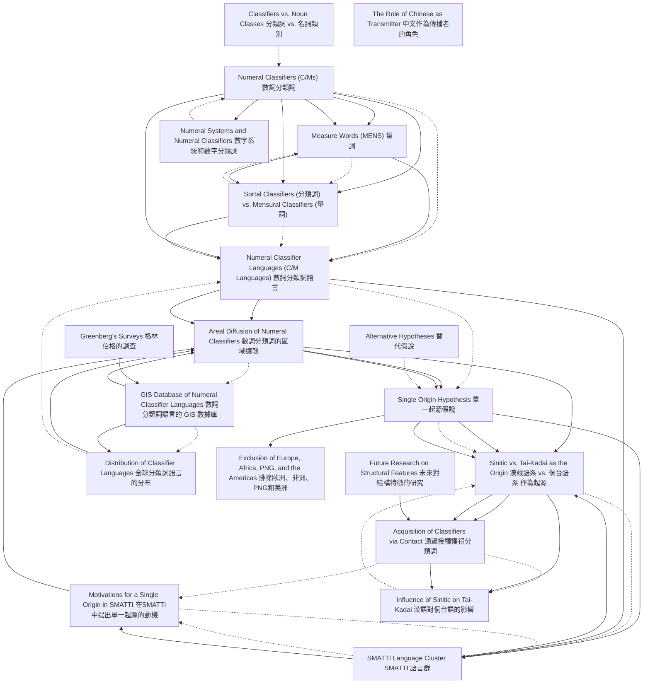

# Zettelkasten 卡片索引

**來源論文**: Her2023_Single_Origin_Classifiers
**作者**: 
**年份**: 2025
**生成日期**: 2025-10-29 15:54
**卡片總數**: 20

---

## 📚 卡片清單

### 1. [Numeral Classifiers (C/Ms) 數詞分類詞](zettel_cards/Linguistics-20251029-001.md)
- **ID**: `Linguistics-20251029-001`
- **類型**: 
- **核心**: Numeral classifiers typically appear with a numeral quantifier.
- **標籤**: `Numeral Classifier`, `Syntax`, `Semantics`

### 2. [Measure Words (MENS) 量詞](zettel_cards/Linguistics-20251029-002.md)
- **ID**: `Linguistics-20251029-002`
- **類型**: 
- **核心**: The latter provide extra information in terms of the quantity of the head noun, while a CLF’s semantic content overlaps with that of the head noun.
- **標籤**: `Measure Word`, `Semantics`, `Quantity`

### 3. [Sortal Classifiers (分類詞) vs. Mensural Classifiers (量詞)](zettel_cards/Linguistics-20251029-003.md)
- **ID**: `Linguistics-20251029-003`
- **類型**: 
- **核心**: The two subcategories, classifiers and measure words, are also known as ‘sortal classifiers’ and ‘mensural classifiers’
- **標籤**: `Classification`, `Sortal Classifier`, `Mensural Classifier`

### 4. [Numeral Classifier Languages (C/M Languages) 數詞分類詞語言](zettel_cards/Linguistics-20251029-004.md)
- **ID**: `Linguistics-20251029-004`
- **類型**: 
- **核心**: The use of numeral classifiers, or C/Ms, has long been considered a prominent areal feature of languages in East and Southeast Asia.
- **標籤**: `Areal Feature`, `Numeral Classifier`, `East Asia`

### 5. [Areal Diffusion of Numeral Classifiers 數詞分類詞的區域擴散](zettel_cards/Linguistics-20251029-005.md)
- **ID**: `Linguistics-20251029-005`
- **類型**: 
- **核心**: A hypothesis of a single origin seems appealing to account for this particular pattern of distribution.
- **標籤**: `Areal Diffusion`, `Single Origin`, `Language Contact`

### 6. [Single Origin Hypothesis 單一起源假說](zettel_cards/Linguistics-20251029-006.md)
- **ID**: `Linguistics-20251029-006`
- **類型**: 
- **核心**: We propose that in Asia and the Pacific numeral classifiers developed indigenously in one language group initially and all other classifier languages acquired this feature via language contact.
- **標籤**: `Single Origin`, `Asia`, `Pacific`, `Language Contact`

### 7. [Sinitic vs. Tai-Kadai as the Origin 漢藏語系 vs. 侗台語系 作為起源](zettel_cards/Linguistics-20251029-007.md)
- **ID**: `Linguistics-20251029-007`
- **類型**: 
- **核心**: Based on the evidence available, we argue that, between Tai-Kadai and Sinitic, the latter is more likely the single origin for Asia and the Pacific, and we also consider a possible cause of the rise of classifiers in Sinitic.
- **標籤**: `Sinitic`, `Tai-Kadai`, `Origin`, `Language Family`

### 8. [GIS Database of Numeral Classifier Languages 數詞分類詞語言的 GIS 數據庫](zettel_cards/Linguistics-20251029-008.md)
- **ID**: `Linguistics-20251029-008`
- **類型**: 
- **核心**: Our first goal is to introduce a geographic information system (GIS) database of 713 numeral classifier languages in the world.
- **標籤**: `GIS`, `Database`, `Numeral Classifier`, `Geographic Distribution`

### 9. [SMATTI Language Cluster SMATTI 語言群](zettel_cards/Linguistics-20251029-009.md)
- **ID**: `Linguistics-20251029-009`
- **類型**: 
- **核心**: …the language cluster of SMATTI (an acronym for Sinitic, Miao-Yao, Austroasiatic, Tai-Kadai, Tibeto-Burman, and Indo-Aryan) as a hotbed of numeral classifiers…
- **標籤**: `SMATTI`, `Language Cluster`, `Numeral Classifier`, `Hotbed`

### 10. [Acquisition of Classifiers via Contact 通過接觸獲得分類詞](zettel_cards/Linguistics-20251029-010.md)
- **ID**: `Linguistics-20251029-010`
- **類型**: 
- **核心**: Other language groups, including Tai-Kadai, acquired this feature via contact.
- **標籤**: `Language Contact`, `Acquisition`, `Tai-Kadai`

### 11. [Motivations for a Single Origin in SMATTI 在SMATTI中提出單一起源的動機](zettel_cards/Linguistics-20251029-011.md)
- **ID**: `Linguistics-20251029-011`
- **類型**: 
- **核心**: In this section, we demonstrate that the proposal for a single origin of numeral classifiers in Asia and the Pacific is motivated by the pattern of distribution of classifier languages in the region.
- **標籤**: `Single Origin`, `Motivation`, `SMATTI`, `Asia`, `Pacific`

### 12. [Distribution of Classifier Languages 全球分類詞語言的分布](zettel_cards/Linguistics-20251029-012.md)
- **ID**: `Linguistics-20251029-012`
- **類型**: 
- **核心**: Based on the distribution pattern of these 713 languages on a world map, a pattern emerges that is indeed rather similar to those in a diffusion scenario.
- **標籤**: `Geographic Distribution`, `Diffusion`, `World Map`

### 13. [Influence of Sinitic on Tai-Kadai 漢語對侗台語的影響](zettel_cards/Linguistics-20251029-013.md)
- **ID**: `Linguistics-20251029-013`
- **類型**: 
- **核心**: …and further propose a scenario for the rise of numeral classifiers in Tai-Kadai under the influence of Sinitic.
- **標籤**: `Sinitic`, `Tai-Kadai`, `Language Influence`, `Numeral Classifier`

### 14. [Numeral Systems and Numeral Classifiers 數字系統和數字分類詞](zettel_cards/Linguistics-20251029-014.md)
- **ID**: `Linguistics-20251029-014`
- **類型**: 
- **核心**: Given the intimate relation between numerals and numeral classifiers, in the present paper we will touch upon the numeral systems where such information is available as evidence for the hypothesis.
- **標籤**: `Numeral System`, `Numeral Classifier`, `Evidence`, `Hypothesis`

### 15. [Exclusion of Europe, Africa, PNG, and the Americas 排除歐洲、非洲、PNG和美洲](zettel_cards/Linguistics-20251029-015.md)
- **ID**: `Linguistics-20251029-015`
- **類型**: 
- **核心**: The hypothesis thus excludes Europe, Africa, Papua New Guinea, and the Americas, pending further research.
- **標籤**: `Scope`, `Exclusion`, `Hypothesis`

### 16. [Classifiers vs. Noun Classes 分類詞 vs. 名詞類別](zettel_cards/Linguistics-20251029-016.md)
- **ID**: `Linguistics-20251029-016`
- **類型**: 
- **核心**: This feature crucially distinguishes them from noun classes, or genders, which form an integral part of a noun, having nothing to do with the presence or absence of a numeral quantifier.
- **標籤**: `Classifier`, `Noun Class`, `Gender`, `Morphology`

### 17. [Greenberg's Surveys 格林伯格的調查](zettel_cards/Linguistics-20251029-017.md)
- **ID**: `Linguistics-20251029-017`
- **類型**: 
- **核心**: However, as several surveys demonstrate – most notably Greenberg (1990 [1972]), Aikhenvald (2000), and Gil (2013), each covering 103, 116, and 140 classifier languages, respectively – classifier languages also exist in the Pacific islands, Europe, and all other populated continents, except Australia.
- **標籤**: `Greenberg`, `Survey`, `Classifier Languages`, `Data Collection`

### 18. [Alternative Hypotheses 替代假說](zettel_cards/Linguistics-20251029-018.md)
- **ID**: `Linguistics-20251029-018`
- **類型**: 
- **核心**: This single origin hypothesis is meant to be just that, a hypothesis, one that competes with a number of other possible hypotheses where the rise of numeral classifiers in the language or language groups in question is due to factors independent of language contact.
- **標籤**: `Hypothesis`, `Single Origin`, `Alternative`, `Language Contact`, `Independent Development`

### 19. [The Role of Chinese as Transmitter 中文作為傳播者的角色](zettel_cards/Linguistics-20251029-019.md)
- **ID**: `Linguistics-20251029-019`
- **類型**: 
- **核心**: Rather, there was a single primary innovation where the principle was first created, and from where it radiated to all over the region.[…] In any case, there is no specific reason to assume that it was Chinese that was the first class language in Asia. For this particular sphere of linguistic phenomena, like for some others, the role of Chinese may well have been that of a transmitter, rather than that of an innovator.
- **標籤**: `Chinese`, `Transmitter`, `Innovator`, `Language Role`

### 20. [Future Research on Structural Features 未來對結構特徵的研究](zettel_cards/Linguistics-20251029-020.md)
- **ID**: `Linguistics-20251029-020`
- **類型**: 
- **核心**: In that spirit, in future research we should further look into other structural features besides classifiers and see if some of them can be attributed to a similar contact scenario.
- **標籤**: `Future Research`, `Structural Features`, `Language Contact`, `Classifier`

---

## 🗺️ 概念網絡圖

---

## 🏷️ 標籤索引

### Numeral Classifier
- [[Linguistics-20251029-001]] Numeral Classifiers (C/Ms) 數詞分類詞
- [[Linguistics-20251029-004]] Numeral Classifier Languages (C/M Languages) 數詞分類詞語言
- [[Linguistics-20251029-008]] GIS Database of Numeral Classifier Languages 數詞分類詞語言的 GIS 數據庫
- [[Linguistics-20251029-009]] SMATTI Language Cluster SMATTI 語言群
- [[Linguistics-20251029-013]] Influence of Sinitic on Tai-Kadai 漢語對侗台語的影響
- [[Linguistics-20251029-014]] Numeral Systems and Numeral Classifiers 數字系統和數字分類詞

### Syntax
- [[Linguistics-20251029-001]] Numeral Classifiers (C/Ms) 數詞分類詞

### Semantics
- [[Linguistics-20251029-001]] Numeral Classifiers (C/Ms) 數詞分類詞
- [[Linguistics-20251029-002]] Measure Words (MENS) 量詞

### Measure Word
- [[Linguistics-20251029-002]] Measure Words (MENS) 量詞

### Quantity
- [[Linguistics-20251029-002]] Measure Words (MENS) 量詞

### Classification
- [[Linguistics-20251029-003]] Sortal Classifiers (分類詞) vs. Mensural Classifiers (量詞)

### Sortal Classifier
- [[Linguistics-20251029-003]] Sortal Classifiers (分類詞) vs. Mensural Classifiers (量詞)

### Mensural Classifier
- [[Linguistics-20251029-003]] Sortal Classifiers (分類詞) vs. Mensural Classifiers (量詞)

### Areal Feature
- [[Linguistics-20251029-004]] Numeral Classifier Languages (C/M Languages) 數詞分類詞語言

### East Asia
- [[Linguistics-20251029-004]] Numeral Classifier Languages (C/M Languages) 數詞分類詞語言

### Areal Diffusion
- [[Linguistics-20251029-005]] Areal Diffusion of Numeral Classifiers 數詞分類詞的區域擴散

### Single Origin
- [[Linguistics-20251029-005]] Areal Diffusion of Numeral Classifiers 數詞分類詞的區域擴散
- [[Linguistics-20251029-006]] Single Origin Hypothesis 單一起源假說
- [[Linguistics-20251029-011]] Motivations for a Single Origin in SMATTI 在SMATTI中提出單一起源的動機
- [[Linguistics-20251029-018]] Alternative Hypotheses 替代假說

### Language Contact
- [[Linguistics-20251029-005]] Areal Diffusion of Numeral Classifiers 數詞分類詞的區域擴散
- [[Linguistics-20251029-006]] Single Origin Hypothesis 單一起源假說
- [[Linguistics-20251029-010]] Acquisition of Classifiers via Contact 通過接觸獲得分類詞
- [[Linguistics-20251029-018]] Alternative Hypotheses 替代假說
- [[Linguistics-20251029-020]] Future Research on Structural Features 未來對結構特徵的研究

### Asia
- [[Linguistics-20251029-006]] Single Origin Hypothesis 單一起源假說
- [[Linguistics-20251029-011]] Motivations for a Single Origin in SMATTI 在SMATTI中提出單一起源的動機

### Pacific
- [[Linguistics-20251029-006]] Single Origin Hypothesis 單一起源假說
- [[Linguistics-20251029-011]] Motivations for a Single Origin in SMATTI 在SMATTI中提出單一起源的動機

### Sinitic
- [[Linguistics-20251029-007]] Sinitic vs. Tai-Kadai as the Origin 漢藏語系 vs. 侗台語系 作為起源
- [[Linguistics-20251029-013]] Influence of Sinitic on Tai-Kadai 漢語對侗台語的影響

### Tai-Kadai
- [[Linguistics-20251029-007]] Sinitic vs. Tai-Kadai as the Origin 漢藏語系 vs. 侗台語系 作為起源
- [[Linguistics-20251029-010]] Acquisition of Classifiers via Contact 通過接觸獲得分類詞
- [[Linguistics-20251029-013]] Influence of Sinitic on Tai-Kadai 漢語對侗台語的影響

### Origin
- [[Linguistics-20251029-007]] Sinitic vs. Tai-Kadai as the Origin 漢藏語系 vs. 侗台語系 作為起源

### Language Family
- [[Linguistics-20251029-007]] Sinitic vs. Tai-Kadai as the Origin 漢藏語系 vs. 侗台語系 作為起源

### GIS
- [[Linguistics-20251029-008]] GIS Database of Numeral Classifier Languages 數詞分類詞語言的 GIS 數據庫

### Database
- [[Linguistics-20251029-008]] GIS Database of Numeral Classifier Languages 數詞分類詞語言的 GIS 數據庫

### Geographic Distribution
- [[Linguistics-20251029-008]] GIS Database of Numeral Classifier Languages 數詞分類詞語言的 GIS 數據庫
- [[Linguistics-20251029-012]] Distribution of Classifier Languages 全球分類詞語言的分布

### SMATTI
- [[Linguistics-20251029-009]] SMATTI Language Cluster SMATTI 語言群
- [[Linguistics-20251029-011]] Motivations for a Single Origin in SMATTI 在SMATTI中提出單一起源的動機

### Language Cluster
- [[Linguistics-20251029-009]] SMATTI Language Cluster SMATTI 語言群

### Hotbed
- [[Linguistics-20251029-009]] SMATTI Language Cluster SMATTI 語言群

### Acquisition
- [[Linguistics-20251029-010]] Acquisition of Classifiers via Contact 通過接觸獲得分類詞

### Motivation
- [[Linguistics-20251029-011]] Motivations for a Single Origin in SMATTI 在SMATTI中提出單一起源的動機

### Diffusion
- [[Linguistics-20251029-012]] Distribution of Classifier Languages 全球分類詞語言的分布

### World Map
- [[Linguistics-20251029-012]] Distribution of Classifier Languages 全球分類詞語言的分布

### Language Influence
- [[Linguistics-20251029-013]] Influence of Sinitic on Tai-Kadai 漢語對侗台語的影響

### Numeral System
- [[Linguistics-20251029-014]] Numeral Systems and Numeral Classifiers 數字系統和數字分類詞

### Evidence
- [[Linguistics-20251029-014]] Numeral Systems and Numeral Classifiers 數字系統和數字分類詞

### Hypothesis
- [[Linguistics-20251029-014]] Numeral Systems and Numeral Classifiers 數字系統和數字分類詞
- [[Linguistics-20251029-015]] Exclusion of Europe, Africa, PNG, and the Americas 排除歐洲、非洲、PNG和美洲
- [[Linguistics-20251029-018]] Alternative Hypotheses 替代假說

### Scope
- [[Linguistics-20251029-015]] Exclusion of Europe, Africa, PNG, and the Americas 排除歐洲、非洲、PNG和美洲

### Exclusion
- [[Linguistics-20251029-015]] Exclusion of Europe, Africa, PNG, and the Americas 排除歐洲、非洲、PNG和美洲

### Classifier
- [[Linguistics-20251029-016]] Classifiers vs. Noun Classes 分類詞 vs. 名詞類別
- [[Linguistics-20251029-020]] Future Research on Structural Features 未來對結構特徵的研究

### Noun Class
- [[Linguistics-20251029-016]] Classifiers vs. Noun Classes 分類詞 vs. 名詞類別

### Gender
- [[Linguistics-20251029-016]] Classifiers vs. Noun Classes 分類詞 vs. 名詞類別

### Morphology
- [[Linguistics-20251029-016]] Classifiers vs. Noun Classes 分類詞 vs. 名詞類別

### Greenberg
- [[Linguistics-20251029-017]] Greenberg's Surveys 格林伯格的調查

### Survey
- [[Linguistics-20251029-017]] Greenberg's Surveys 格林伯格的調查

### Classifier Languages
- [[Linguistics-20251029-017]] Greenberg's Surveys 格林伯格的調查

### Data Collection
- [[Linguistics-20251029-017]] Greenberg's Surveys 格林伯格的調查

### Alternative
- [[Linguistics-20251029-018]] Alternative Hypotheses 替代假說

### Independent Development
- [[Linguistics-20251029-018]] Alternative Hypotheses 替代假說

### Chinese
- [[Linguistics-20251029-019]] The Role of Chinese as Transmitter 中文作為傳播者的角色

### Transmitter
- [[Linguistics-20251029-019]] The Role of Chinese as Transmitter 中文作為傳播者的角色

### Innovator
- [[Linguistics-20251029-019]] The Role of Chinese as Transmitter 中文作為傳播者的角色

### Language Role
- [[Linguistics-20251029-019]] The Role of Chinese as Transmitter 中文作為傳播者的角色

### Future Research
- [[Linguistics-20251029-020]] Future Research on Structural Features 未來對結構特徵的研究

### Structural Features
- [[Linguistics-20251029-020]] Future Research on Structural Features 未來對結構特徵的研究

---

## 📖 閱讀建議順序

1. [[Linguistics-20251029-011]] Motivations for a Single Origin in SMATTI 在SMATTI中提出單一起源的動機

2. [[Linguistics-20251029-012]] Distribution of Classifier Languages 全球分類詞語言的分布

3. [[Linguistics-20251029-013]] Influence of Sinitic on Tai-Kadai 漢語對侗台語的影響

4. [[Linguistics-20251029-014]] Numeral Systems and Numeral Classifiers 數字系統和數字分類詞

5. [[Linguistics-20251029-015]] Exclusion of Europe, Africa, PNG, and the Americas 排除歐洲、非洲、PNG和美洲

6. [[Linguistics-20251029-016]] Classifiers vs. Noun Classes 分類詞 vs. 名詞類別

7. [[Linguistics-20251029-017]] Greenberg's Surveys 格林伯格的調查

8. [[Linguistics-20251029-018]] Alternative Hypotheses 替代假說

9. [[Linguistics-20251029-019]] The Role of Chinese as Transmitter 中文作為傳播者的角色

10. [[Linguistics-20251029-020]] Future Research on Structural Features 未來對結構特徵的研究

11. [[Linguistics-20251029-002]] Measure Words (MENS) 量詞

12. [[Linguistics-20251029-003]] Sortal Classifiers (分類詞) vs. Mensural Classifiers (量詞)

13. [[Linguistics-20251029-005]] Areal Diffusion of Numeral Classifiers 數詞分類詞的區域擴散

14. [[Linguistics-20251029-008]] GIS Database of Numeral Classifier Languages 數詞分類詞語言的 GIS 數據庫

15. [[Linguistics-20251029-009]] SMATTI Language Cluster SMATTI 語言群

16. [[Linguistics-20251029-010]] Acquisition of Classifiers via Contact 通過接觸獲得分類詞

17. [[Linguistics-20251029-004]] Numeral Classifier Languages (C/M Languages) 數詞分類詞語言

18. [[Linguistics-20251029-006]] Single Origin Hypothesis 單一起源假說

19. [[Linguistics-20251029-007]] Sinitic vs. Tai-Kadai as the Origin 漢藏語系 vs. 侗台語系 作為起源

20. [[Linguistics-20251029-001]] Numeral Classifiers (C/Ms) 數詞分類詞

---

*本索引由 Knowledge Production System 自動生成*