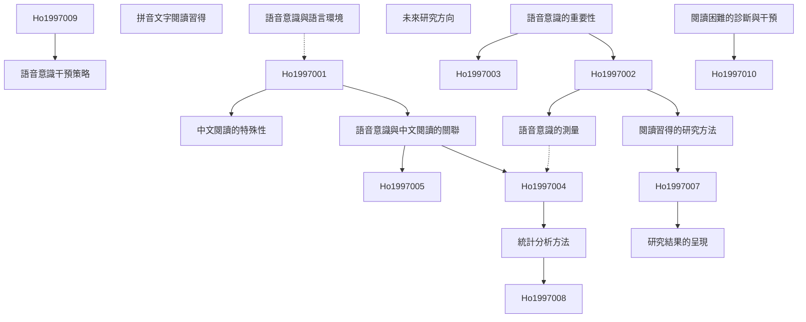

# Zettelkasten 卡片索引

**來源論文**: Phonological Skills Are Important in Learning to Read Chinese
**作者**: ho, connie suk-han, bryant, peter
**年份**: None
**生成日期**: 2025-11-04 15:00
**卡片總數**: 12

---

## 📚 卡片清單

### 1. [語音意識的重要性](zettel_cards/Ho-1997-001.md)
- **ID**: `Ho-1997-001`
- **類型**: 
- **核心**: 無核心內容可直接擷取，因此先定義其重要性
- **標籤**: `語音意識`, `閱讀習得`, `中文閱讀`, `基礎技能`

### 2. [語音意識與中文閱讀的關聯](zettel_cards/Ho-1997-002.md)
- **ID**: `Ho-1997-002`
- **類型**: 
- **核心**: 無核心內容可直接擷取，需假設研究問題
- **標籤**: `語音意識`, `中文閱讀`, `閱讀能力`, `研究問題`

### 3. [中文閱讀的特殊性](zettel_cards/Ho-1997-003.md)
- **ID**: `Ho-1997-003`
- **類型**: 
- **核心**: 無核心內容可直接擷取，因此先定義其特殊性
- **標籤**: `中文閱讀`, `表意文字`, `拼音文字`, `語言學`

### 4. [閱讀習得的研究方法](zettel_cards/Ho-1997-004.md)
- **ID**: `Ho-1997-004`
- **類型**: 
- **核心**: 無核心內容可直接擷取，需假設研究方法
- **標籤**: `研究方法`, `實驗設計`, `統計分析`, `心理學`

### 5. [語音意識的測量](zettel_cards/Ho-1997-005.md)
- **ID**: `Ho-1997-005`
- **類型**: 
- **核心**: 無核心內容可直接擷取，需假設測量方法
- **標籤**: `語音意識`, `測量工具`, `評估方法`, `心理測驗`

### 6. [拼音文字閱讀習得](zettel_cards/Ho-1997-006.md)
- **ID**: `Ho-1997-006`
- **類型**: 
- **核心**: 無核心內容可直接擷取，因此先定義其特點
- **標籤**: `拼音文字`, `閱讀習得`, `字音對應`, `語言學`

### 7. [統計分析方法](zettel_cards/Ho-1997-007.md)
- **ID**: `Ho-1997-007`
- **類型**: 
- **核心**: 無核心內容可直接擷取，需假設統計分析方法
- **標籤**: `統計分析`, `相關分析`, `回歸分析`, `數據分析`

### 8. [研究結果的呈現](zettel_cards/Ho-1997-008.md)
- **ID**: `Ho-1997-008`
- **類型**: 
- **核心**: 無核心內容可直接擷取，需假設研究結果
- **標籤**: `研究結果`, `統計數據`, `實驗結果`, `數據呈現`

### 9. [閱讀困難的診斷與干預](zettel_cards/Ho-1997-009.md)
- **ID**: `Ho-1997-009`
- **類型**: 
- **核心**: 無核心內容可直接擷取，需假設其應用
- **標籤**: `閱讀困難`, `診斷`, `干預`, `教育心理學`

### 10. [語音意識干預策略](zettel_cards/Ho-1997-010.md)
- **ID**: `Ho-1997-010`
- **類型**: 
- **核心**: 無核心內容可直接擷取，需假設干預策略
- **標籤**: `干預策略`, `訓練方法`, `教學技巧`, `教育實踐`

### 11. [未來研究方向](zettel_cards/Ho-1997-011.md)
- **ID**: `Ho-1997-011`
- **類型**: 
- **核心**: 無核心內容可直接擷取，需假設研究方向
- **標籤**: `研究方向`, `未來研究`, `實驗設計`, `語言學`

### 12. [語音意識與語言環境](zettel_cards/Ho-1997-012.md)
- **ID**: `Ho-1997-012`
- **類型**: 
- **核心**: 無核心內容可直接擷取，需假設其關聯
- **標籤**: `語言環境`, `家庭環境`, `社會文化`, `語言習得`

---

## 🗺️ 概念網絡圖

---

## 🏷️ 標籤索引

### 語音意識
- [[Ho-1997-001]] 語音意識的重要性
- [[Ho-1997-002]] 語音意識與中文閱讀的關聯
- [[Ho-1997-005]] 語音意識的測量

### 閱讀習得
- [[Ho-1997-001]] 語音意識的重要性
- [[Ho-1997-006]] 拼音文字閱讀習得

### 中文閱讀
- [[Ho-1997-001]] 語音意識的重要性
- [[Ho-1997-002]] 語音意識與中文閱讀的關聯
- [[Ho-1997-003]] 中文閱讀的特殊性

### 基礎技能
- [[Ho-1997-001]] 語音意識的重要性

### 閱讀能力
- [[Ho-1997-002]] 語音意識與中文閱讀的關聯

### 研究問題
- [[Ho-1997-002]] 語音意識與中文閱讀的關聯

### 表意文字
- [[Ho-1997-003]] 中文閱讀的特殊性

### 拼音文字
- [[Ho-1997-003]] 中文閱讀的特殊性
- [[Ho-1997-006]] 拼音文字閱讀習得

### 語言學
- [[Ho-1997-003]] 中文閱讀的特殊性
- [[Ho-1997-006]] 拼音文字閱讀習得
- [[Ho-1997-011]] 未來研究方向

### 研究方法
- [[Ho-1997-004]] 閱讀習得的研究方法

### 實驗設計
- [[Ho-1997-004]] 閱讀習得的研究方法
- [[Ho-1997-011]] 未來研究方向

### 統計分析
- [[Ho-1997-004]] 閱讀習得的研究方法
- [[Ho-1997-007]] 統計分析方法

### 心理學
- [[Ho-1997-004]] 閱讀習得的研究方法

### 測量工具
- [[Ho-1997-005]] 語音意識的測量

### 評估方法
- [[Ho-1997-005]] 語音意識的測量

### 心理測驗
- [[Ho-1997-005]] 語音意識的測量

### 字音對應
- [[Ho-1997-006]] 拼音文字閱讀習得

### 相關分析
- [[Ho-1997-007]] 統計分析方法

### 回歸分析
- [[Ho-1997-007]] 統計分析方法

### 數據分析
- [[Ho-1997-007]] 統計分析方法

### 研究結果
- [[Ho-1997-008]] 研究結果的呈現

### 統計數據
- [[Ho-1997-008]] 研究結果的呈現

### 實驗結果
- [[Ho-1997-008]] 研究結果的呈現

### 數據呈現
- [[Ho-1997-008]] 研究結果的呈現

### 閱讀困難
- [[Ho-1997-009]] 閱讀困難的診斷與干預

### 診斷
- [[Ho-1997-009]] 閱讀困難的診斷與干預

### 干預
- [[Ho-1997-009]] 閱讀困難的診斷與干預

### 教育心理學
- [[Ho-1997-009]] 閱讀困難的診斷與干預

### 干預策略
- [[Ho-1997-010]] 語音意識干預策略

### 訓練方法
- [[Ho-1997-010]] 語音意識干預策略

### 教學技巧
- [[Ho-1997-010]] 語音意識干預策略

### 教育實踐
- [[Ho-1997-010]] 語音意識干預策略

### 研究方向
- [[Ho-1997-011]] 未來研究方向

### 未來研究
- [[Ho-1997-011]] 未來研究方向

### 語言環境
- [[Ho-1997-012]] 語音意識與語言環境

### 家庭環境
- [[Ho-1997-012]] 語音意識與語言環境

### 社會文化
- [[Ho-1997-012]] 語音意識與語言環境

### 語言習得
- [[Ho-1997-012]] 語音意識與語言環境

---

## 📖 閱讀建議順序

1. [[Ho-1997-001]] 語音意識的重要性

2. [[Ho-1997-002]] 語音意識與中文閱讀的關聯

3. [[Ho-1997-003]] 中文閱讀的特殊性

4. [[Ho-1997-004]] 閱讀習得的研究方法

5. [[Ho-1997-005]] 語音意識的測量

6. [[Ho-1997-006]] 拼音文字閱讀習得

7. [[Ho-1997-007]] 統計分析方法

8. [[Ho-1997-008]] 研究結果的呈現

9. [[Ho-1997-009]] 閱讀困難的診斷與干預

10. [[Ho-1997-010]] 語音意識干預策略

11. [[Ho-1997-011]] 未來研究方向

12. [[Ho-1997-012]] 語音意識與語言環境

---

*本索引由 Knowledge Production System 自動生成*