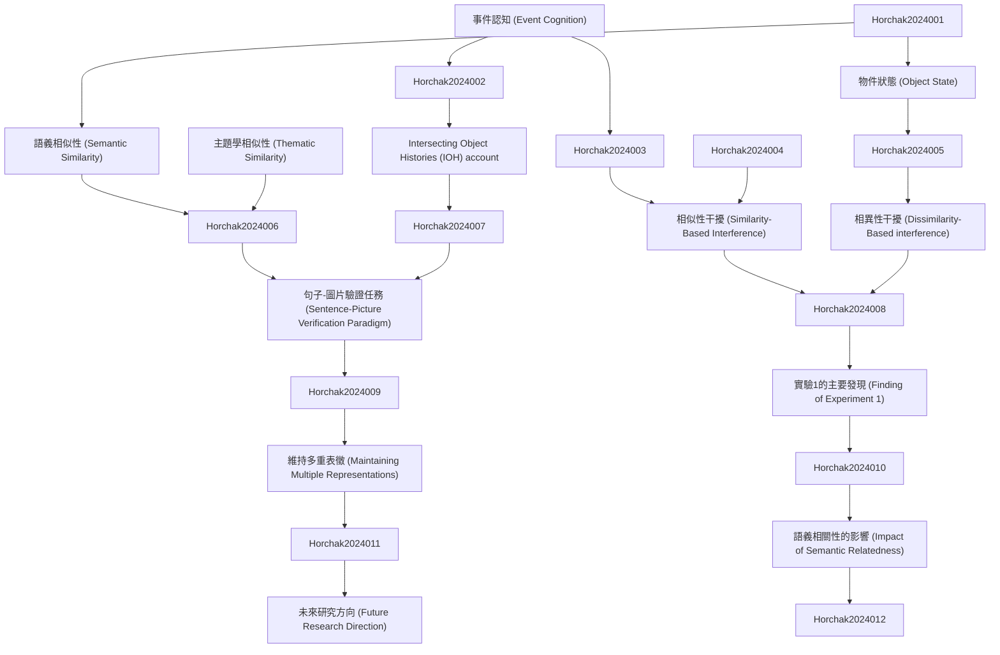

# Zettelkasten 卡片索引

**來源論文**: JournalofMemoryandLanguage135(2024)104478
**作者**: V. Garrido, V. Horchak, Instituto Universita, In Experiments
**年份**: 2024
**生成日期**: 2025-11-04 16:38
**卡片總數**: 12

---

## 📚 卡片清單

### 1. [事件認知 (Event Cognition)](zettel_cards/Horchak-2024-001.md)
- **ID**: `Horchak-2024-001`
- **類型**: 
- **核心**: "Many theories of event cognition and language processing suggest that comprehending an event is tantamount to constructing a mental representation of the described situation."
- **標籤**: `事件認知`, `語言處理`, `心理表徵`

### 2. [物件狀態 (Object State)](zettel_cards/Horchak-2024-002.md)
- **ID**: `Horchak-2024-002`
- **類型**: 
- **核心**: "According to this account, comprehenders need to encode changes in object state (i.e., the association of objects with their past selves through space and time) to build a rich representation of an event."
- **標籤**: `物件狀態`, `事件表徵`, `IOH account`

### 3. [語義相似性 (Semantic Similarity)](zettel_cards/Horchak-2024-003.md)
- **ID**: `Horchak-2024-003`
- **類型**: 
- **核心**: "Taxonomic similarity refers to the relationship between words or concepts that belong to the same hierarchical category, whereby similarity between concepts is defined as a function of feature overlap."
- **標籤**: `語義相似性`, `分類學相似性`, `主題學相似性`

### 4. [主題學相似性 (Thematic Similarity)](zettel_cards/Horchak-2024-004.md)
- **ID**: `Horchak-2024-004`
- **類型**: 
- **核心**: "Thematic similarity, on the other hand, is based on grouping concepts thematically based on temporal, spatial, causal, or functional relations between things."
- **標籤**: `主題學相似性`, `事件框架`, `語義關係`

### 5. [Intersecting Object Histories (IOH) account](zettel_cards/Horchak-2024-005.md)
- **ID**: `Horchak-2024-005`
- **類型**: 
- **核心**: "According to this account, comprehenders need to encode changes in object state (i.e., the association of objects with their past selves through space and time) to build a rich representation of an event."
- **標籤**: `物件歷史`, `事件理解`, `物件狀態改變`

### 6. [相似性干擾 (Similarity-Based Interference)](zettel_cards/Horchak-2024-006.md)
- **ID**: `Horchak-2024-006`
- **類型**: 
- **核心**: "Thus, on this view, greater semantic similarity between the items leads to greater similarity-based interference."
- **標籤**: `相似性干擾`, `語義競爭`, `語言理解`

### 7. [相異性干擾 (Dissimilarity-Based interference)](zettel_cards/Horchak-2024-007.md)
- **ID**: `Horchak-2024-007`
- **類型**: 
- **核心**: "Consequently, if dissimilarity-based interference is manifested in the degree of dissimilarity between the initial and modified states of an object, then an increase in the RTs to the pictured item (e.g., banana) in the substantial-change condition should scale inversely with the degree of change of the semantically related (e.g., mango) item (as rated by other participants)."
- **標籤**: `相異性干擾`, `物件狀態`, `反應時間`

### 8. [句子-圖片驗證任務 (Sentence-Picture Verification Paradigm)](zettel_cards/Horchak-2024-008.md)
- **ID**: `Horchak-2024-008`
- **類型**: 
- **核心**: "To address these questions, we used a sentence-picture verification paradigm where participants were asked to read sentences that either implied a minimal change of an object’s state (e.g., “Jane chose a banana”) or a substantial change (e.g., “Jane stepped on a banana”) and then verified whether a subsequently pictured object was mentioned in the sentence (i.e., banana)."
- **標籤**: `句子圖片驗證`, `實驗方法`, `語言理解`

### 9. [實驗1的主要發現 (Finding of Experiment 1)](zettel_cards/Horchak-2024-009.md)
- **ID**: `Horchak-2024-009`
- **類型**: 
- **核心**: "The results of Experiment 1 demonstrated that the objects in a modified state were verified faster when a sentence implied a substantial state-change rather than a minimal state-change."
- **標籤**: `實驗結果`, `物件狀態`, `語言理解`

### 10. [維持多重表徵 (Maintaining Multiple Representations)](zettel_cards/Horchak-2024-010.md)
- **ID**: `Horchak-2024-010`
- **類型**: 
- **核心**: "Importantly, verification latencies of pictures depicting original and modified states of an object in the substantial state-change condition were approximately similar, thus suggesting that language comprehenders maintain multiple representations of an object in different states."
- **標籤**: `多重表徵`, `物件狀態`, `事件理解`

### 11. [語義相關性的影響 (Impact of Semantic Relatedness)](zettel_cards/Horchak-2024-011.md)
- **ID**: `Horchak-2024-011`
- **類型**: 
- **核心**: "The results of Experiments 2A and 2B revealed that when participants had to indicate that a pictured object (e.g., banana) was not mentioned in the sentence, their verification latencies were slowed down when the sentence contained a semantically related item (e.g., mango) and described this item as being changed substantially by the action."
- **標籤**: `語義相關性`, `反應時間`, `句子驗證`

### 12. [未來研究方向 (Future Research Direction)](zettel_cards/Horchak-2024-012.md)
- **ID**: `Horchak-2024-012`
- **類型**: 
- **核心**: "Specifically, we investigated whether language comprehenders are sensitive to the linguistically determined states of an object (e.g., choose vs. step on a mango) when verifying a semantically similar pictured object (e.g., banana in either original or modified state)."
- **標籤**: `未來研究`, `語言理解`, `物件狀態`

---

## 🗺️ 概念網絡圖

---

## 🏷️ 標籤索引

### 事件認知
- [[Horchak-2024-001]] 事件認知 (Event Cognition)

### 語言處理
- [[Horchak-2024-001]] 事件認知 (Event Cognition)

### 心理表徵
- [[Horchak-2024-001]] 事件認知 (Event Cognition)

### 物件狀態
- [[Horchak-2024-002]] 物件狀態 (Object State)
- [[Horchak-2024-007]] 相異性干擾 (Dissimilarity-Based interference)
- [[Horchak-2024-009]] 實驗1的主要發現 (Finding of Experiment 1)
- [[Horchak-2024-010]] 維持多重表徵 (Maintaining Multiple Representations)
- [[Horchak-2024-012]] 未來研究方向 (Future Research Direction)

### 事件表徵
- [[Horchak-2024-002]] 物件狀態 (Object State)

### IOH account
- [[Horchak-2024-002]] 物件狀態 (Object State)

### 語義相似性
- [[Horchak-2024-003]] 語義相似性 (Semantic Similarity)

### 分類學相似性
- [[Horchak-2024-003]] 語義相似性 (Semantic Similarity)

### 主題學相似性
- [[Horchak-2024-003]] 語義相似性 (Semantic Similarity)
- [[Horchak-2024-004]] 主題學相似性 (Thematic Similarity)

### 事件框架
- [[Horchak-2024-004]] 主題學相似性 (Thematic Similarity)

### 語義關係
- [[Horchak-2024-004]] 主題學相似性 (Thematic Similarity)

### 物件歷史
- [[Horchak-2024-005]] Intersecting Object Histories (IOH) account

### 事件理解
- [[Horchak-2024-005]] Intersecting Object Histories (IOH) account
- [[Horchak-2024-010]] 維持多重表徵 (Maintaining Multiple Representations)

### 物件狀態改變
- [[Horchak-2024-005]] Intersecting Object Histories (IOH) account

### 相似性干擾
- [[Horchak-2024-006]] 相似性干擾 (Similarity-Based Interference)

### 語義競爭
- [[Horchak-2024-006]] 相似性干擾 (Similarity-Based Interference)

### 語言理解
- [[Horchak-2024-006]] 相似性干擾 (Similarity-Based Interference)
- [[Horchak-2024-008]] 句子-圖片驗證任務 (Sentence-Picture Verification Paradigm)
- [[Horchak-2024-009]] 實驗1的主要發現 (Finding of Experiment 1)
- [[Horchak-2024-012]] 未來研究方向 (Future Research Direction)

### 相異性干擾
- [[Horchak-2024-007]] 相異性干擾 (Dissimilarity-Based interference)

### 反應時間
- [[Horchak-2024-007]] 相異性干擾 (Dissimilarity-Based interference)
- [[Horchak-2024-011]] 語義相關性的影響 (Impact of Semantic Relatedness)

### 句子圖片驗證
- [[Horchak-2024-008]] 句子-圖片驗證任務 (Sentence-Picture Verification Paradigm)

### 實驗方法
- [[Horchak-2024-008]] 句子-圖片驗證任務 (Sentence-Picture Verification Paradigm)

### 實驗結果
- [[Horchak-2024-009]] 實驗1的主要發現 (Finding of Experiment 1)

### 多重表徵
- [[Horchak-2024-010]] 維持多重表徵 (Maintaining Multiple Representations)

### 語義相關性
- [[Horchak-2024-011]] 語義相關性的影響 (Impact of Semantic Relatedness)

### 句子驗證
- [[Horchak-2024-011]] 語義相關性的影響 (Impact of Semantic Relatedness)

### 未來研究
- [[Horchak-2024-012]] 未來研究方向 (Future Research Direction)

---

## 📖 閱讀建議順序

1. [[Horchak-2024-001]] 事件認知 (Event Cognition)

2. [[Horchak-2024-002]] 物件狀態 (Object State)

3. [[Horchak-2024-003]] 語義相似性 (Semantic Similarity)

4. [[Horchak-2024-004]] 主題學相似性 (Thematic Similarity)

5. [[Horchak-2024-005]] Intersecting Object Histories (IOH) account

6. [[Horchak-2024-006]] 相似性干擾 (Similarity-Based Interference)

7. [[Horchak-2024-007]] 相異性干擾 (Dissimilarity-Based interference)

8. [[Horchak-2024-008]] 句子-圖片驗證任務 (Sentence-Picture Verification Paradigm)

9. [[Horchak-2024-009]] 實驗1的主要發現 (Finding of Experiment 1)

10. [[Horchak-2024-010]] 維持多重表徵 (Maintaining Multiple Representations)

11. [[Horchak-2024-011]] 語義相關性的影響 (Impact of Semantic Relatedness)

12. [[Horchak-2024-012]] 未來研究方向 (Future Research Direction)

---

*本索引由 Knowledge Production System 自動生成*