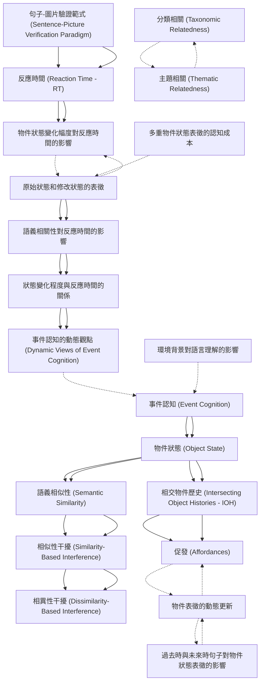

# Zettelkasten 卡片索引

**來源論文**: Horchak2024_Mental_Simulation
**作者**: 
**年份**: 2025
**生成日期**: 2025-10-29 16:33
**卡片總數**: 20

---

## 📚 卡片清單

### 1. [事件認知 (Event Cognition)](zettel_cards/CogSci-20251029-001.md)
- **ID**: `CogSci-20251029-001`
- **類型**: 
- **核心**: "Many theories of event cognition and language processing suggest that comprehending an event is tantamount to constructing a mental representation of the described situation."
- **標籤**: `事件認知`, `語言理解`, `心理表徵`

### 2. [物件狀態 (Object State)](zettel_cards/CogSci-20251029-002.md)
- **ID**: `CogSci-20251029-002`
- **類型**: 
- **核心**: "According to this account, comprehenders need to encode changes in object state (i.e., the association of objects with their past selves through space and time) to build a rich representation of an event."
- **標籤**: `物件狀態`, `事件表徵`, `語言理解`

### 3. [相交物件歷史 (Intersecting Object Histories - IOH)](zettel_cards/CogSci-20251029-003.md)
- **ID**: `CogSci-20251029-003`
- **類型**: 
- **核心**: "Another less-studied but equally fundamental element of event comprehension is object history, as suggested by the Intersecting Object Histories (IOH) account (Altmann & Ekves, 2019)."
- **標籤**: `IOH`, `物件歷史`, `事件理解`

### 4. [語義相似性 (Semantic Similarity)](zettel_cards/CogSci-20251029-004.md)
- **ID**: `CogSci-20251029-004`
- **類型**: 
- **核心**: "Specifically, we investigated whether language comprehenders are sensitive to the linguistically determined states of an object (e.g., choose vs. step on a mango) when verifying a semantically similar pictured object (e.g., banana in either original or modified state)."
- **標籤**: `語義相似性`, `語言理解`, `物件狀態`

### 5. [促發 (Affordances)](zettel_cards/CogSci-20251029-005.md)
- **ID**: `CogSci-20251029-005`
- **類型**: 
- **核心**: "Hence, the results are consistent with the notion of affordances, which refers to the possibility of an action on an object (Gibson, 1979; Symes et al., 2007)."
- **標籤**: `促發`, `物件`, `行動`

### 6. [句子-圖片驗證範式 (Sentence-Picture Verification Paradigm)](zettel_cards/CogSci-20251029-006.md)
- **ID**: `CogSci-20251029-006`
- **類型**: 
- **核心**: "For example, there is now quite a body of data from a sentence-picture verification paradigm showing that people rapidly integrate implied visual information about the object’s orientation (e.g., a nail in the wall vs. a nail in the floor) and shape..."
- **標籤**: `實驗方法`, `心理學`, `句子驗證`

### 7. [反應時間 (Reaction Time - RT)](zettel_cards/CogSci-20251029-007.md)
- **ID**: `CogSci-20251029-007`
- **類型**: 
- **核心**: "By segregating the data by pictures, they found that response times (RT) were faster whenever there was a match between the final state of an object depicted in the picture and the one implied by the past-tense sentence."
- **標籤**: `行為測量`, `實驗方法`, `心理學`

### 8. [相似性干擾 (Similarity-Based Interference)](zettel_cards/CogSci-20251029-008.md)
- **ID**: `CogSci-20251029-008`
- **類型**: 
- **核心**: "...representing information from a different, yet related, object may be difficult due to similarity-based interference (i.e., interference caused by the difference between distinct objects)..."
- **標籤**: `相似性`, `干擾`, `認知`

### 9. [相異性干擾 (Dissimilarity-Based Interference)](zettel_cards/CogSci-20251029-009.md)
- **ID**: `CogSci-20251029-009`
- **類型**: 
- **核心**: "...and/or dissimilarity-based interference (i.e., interference caused by the ‘before’ and ‘after’ object states)."
- **標籤**: `相異性`, `干擾`, `認知`

### 10. [物件狀態變化幅度對反應時間的影響](zettel_cards/CogSci-20251029-010.md)
- **ID**: `CogSci-20251029-010`
- **類型**: 
- **核心**: "The results of Experiment 1 demonstrated that the objects in a modified state were verified faster when a sentence implied a substantial state-change rather than a minimal state-change."
- **標籤**: `反應時間`, `物件狀態`, `實驗結果`

### 11. [原始狀態和修改狀態的表徵](zettel_cards/CogSci-20251029-011.md)
- **ID**: `CogSci-20251029-011`
- **類型**: 
- **核心**: "Importantly, verification latencies of pictures depicting original and modified states of an object in the substantial state-change condition were approximately similar, thus suggesting that language comprehenders maintain multiple representations of an object in different states."
- **標籤**: `物件表徵`, `多重表徵`, `實驗結果`

### 12. [語義相關性對反應時間的影響](zettel_cards/CogSci-20251029-012.md)
- **ID**: `CogSci-20251029-012`
- **類型**: 
- **核心**: "The results of Experiments 2A and 2B revealed that when participants had to indicate that a pictured object (e.g., banana) was not mentioned in the sentence, their verification latencies were slowed down when the sentence contained a semantically related item (e.g., mango) and described this item as being changed substantially by the action."
- **標籤**: `語義相關性`, `反應時間`, `實驗結果`

### 13. [狀態變化程度與反應時間的關係](zettel_cards/CogSci-20251029-013.md)
- **ID**: `CogSci-20251029-013`
- **類型**: 
- **核心**: "However, these verification latencies varied continuously with the degree of change: the more dissimilar the states of a semantically related item, the less time participants needed to verify a pictured object."
- **標籤**: `狀態變化`, `反應時間`, `實驗結果`

### 14. [事件認知的動態觀點 (Dynamic Views of Event Cognition)](zettel_cards/CogSci-20251029-014.md)
- **ID**: `CogSci-20251029-014`
- **類型**: 
- **核心**: "The results are discussed through the prism of theories emphasizing dynamic views of event cognition."
- **標籤**: `事件認知`, `動態觀點`, `理論`

### 15. [環境背景對語言理解的影響](zettel_cards/CogSci-20251029-015.md)
- **ID**: `CogSci-20251029-015`
- **類型**: 
- **核心**: "Altogether, these data converge on the conclusion that comprehenders draw information from the surrounding environment to be able to successfully understand language."
- **標籤**: `環境背景`, `語言理解`, `認知`

### 16. [過去時與未來時句子對物件狀態表徵的影響](zettel_cards/CogSci-20251029-016.md)
- **ID**: `CogSci-20251029-016`
- **類型**: 
- **核心**: "Interestingly, however, Kang et al. (2020) did not find the match advantage for the original object state when future-tense sentences (e.g., “Jane will choose a banana” vs. “Jane will step on a banana”) were used, thus suggesting that the associated representation of the initial (original) state was more accessible than the future (modified) state"
- **標籤**: `時態`, `物件狀態`, `語言理解`, `實驗結果`

### 17. [分類相關 (Taxonomic Relatedness)](zettel_cards/CogSci-20251029-017.md)
- **ID**: `CogSci-20251029-017`
- **類型**: 
- **核心**: "Before moving forward, it is important to clarify our treatment of semantic similarity in the present paper. We shall do so by highlighting the distinctions between two major kinds of semantic relations: taxonomic and thematic."
- **標籤**: `語義關係`, `分類`, `語義相似性`

### 18. [主題相關 (Thematic Relatedness)](zettel_cards/CogSci-20251029-018.md)
- **ID**: `CogSci-20251029-018`
- **類型**: 
- **核心**: "Before moving forward, it is important to clarify our treatment of semantic similarity in the present paper. We shall do so by highlighting the distinctions between two major kinds of semantic relations: taxonomic and thematic."
- **標籤**: `語義關係`, `主題`, `語義相似性`

### 19. [物件表徵的動態更新](zettel_cards/CogSci-20251029-019.md)
- **ID**: `CogSci-20251029-019`
- **類型**: 
- **核心**: "Specifically, future-tense sentences suggest equal affordance for both substantial-change (i.e., “will step on a banana”) and minimal-change (“will choose a banana”) conditions precisely because the subject intends to act on the object (i.e., “banana”) in its original state from the subject-centric current (not future) state of the world."
- **標籤**: `物件表徵`, `動態更新`, `語言理解`

### 20. [多重物件狀態表徵的認知成本](zettel_cards/CogSci-20251029-020.md)
- **ID**: `CogSci-20251029-020`
- **類型**: 
- **核心**: "Specifically, the authors demonstrated that when the object was described as being changed substantially by the action (e.g., “Jane stepped on a banana”), participants’ verification latencies of the objects in both the original (i.e., intact banana) and the modified states (i.e., smashed banana) were approximately the same."
- **標籤**: `多重表徵`, `認知成本`, `資源分配`

---

## 🗺️ 概念網絡圖

---

## 🏷️ 標籤索引

### 事件認知
- [[CogSci-20251029-001]] 事件認知 (Event Cognition)
- [[CogSci-20251029-014]] 事件認知的動態觀點 (Dynamic Views of Event Cognition)

### 語言理解
- [[CogSci-20251029-001]] 事件認知 (Event Cognition)
- [[CogSci-20251029-002]] 物件狀態 (Object State)
- [[CogSci-20251029-004]] 語義相似性 (Semantic Similarity)
- [[CogSci-20251029-015]] 環境背景對語言理解的影響
- [[CogSci-20251029-016]] 過去時與未來時句子對物件狀態表徵的影響
- [[CogSci-20251029-019]] 物件表徵的動態更新

### 心理表徵
- [[CogSci-20251029-001]] 事件認知 (Event Cognition)

### 物件狀態
- [[CogSci-20251029-002]] 物件狀態 (Object State)
- [[CogSci-20251029-004]] 語義相似性 (Semantic Similarity)
- [[CogSci-20251029-010]] 物件狀態變化幅度對反應時間的影響
- [[CogSci-20251029-016]] 過去時與未來時句子對物件狀態表徵的影響

### 事件表徵
- [[CogSci-20251029-002]] 物件狀態 (Object State)

### IOH
- [[CogSci-20251029-003]] 相交物件歷史 (Intersecting Object Histories - IOH)

### 物件歷史
- [[CogSci-20251029-003]] 相交物件歷史 (Intersecting Object Histories - IOH)

### 事件理解
- [[CogSci-20251029-003]] 相交物件歷史 (Intersecting Object Histories - IOH)

### 語義相似性
- [[CogSci-20251029-004]] 語義相似性 (Semantic Similarity)
- [[CogSci-20251029-017]] 分類相關 (Taxonomic Relatedness)
- [[CogSci-20251029-018]] 主題相關 (Thematic Relatedness)

### 促發
- [[CogSci-20251029-005]] 促發 (Affordances)

### 物件
- [[CogSci-20251029-005]] 促發 (Affordances)

### 行動
- [[CogSci-20251029-005]] 促發 (Affordances)

### 實驗方法
- [[CogSci-20251029-006]] 句子-圖片驗證範式 (Sentence-Picture Verification Paradigm)
- [[CogSci-20251029-007]] 反應時間 (Reaction Time - RT)

### 心理學
- [[CogSci-20251029-006]] 句子-圖片驗證範式 (Sentence-Picture Verification Paradigm)
- [[CogSci-20251029-007]] 反應時間 (Reaction Time - RT)

### 句子驗證
- [[CogSci-20251029-006]] 句子-圖片驗證範式 (Sentence-Picture Verification Paradigm)

### 行為測量
- [[CogSci-20251029-007]] 反應時間 (Reaction Time - RT)

### 相似性
- [[CogSci-20251029-008]] 相似性干擾 (Similarity-Based Interference)

### 干擾
- [[CogSci-20251029-008]] 相似性干擾 (Similarity-Based Interference)
- [[CogSci-20251029-009]] 相異性干擾 (Dissimilarity-Based Interference)

### 認知
- [[CogSci-20251029-008]] 相似性干擾 (Similarity-Based Interference)
- [[CogSci-20251029-009]] 相異性干擾 (Dissimilarity-Based Interference)
- [[CogSci-20251029-015]] 環境背景對語言理解的影響

### 相異性
- [[CogSci-20251029-009]] 相異性干擾 (Dissimilarity-Based Interference)

### 反應時間
- [[CogSci-20251029-010]] 物件狀態變化幅度對反應時間的影響
- [[CogSci-20251029-012]] 語義相關性對反應時間的影響
- [[CogSci-20251029-013]] 狀態變化程度與反應時間的關係

### 實驗結果
- [[CogSci-20251029-010]] 物件狀態變化幅度對反應時間的影響
- [[CogSci-20251029-011]] 原始狀態和修改狀態的表徵
- [[CogSci-20251029-012]] 語義相關性對反應時間的影響
- [[CogSci-20251029-013]] 狀態變化程度與反應時間的關係
- [[CogSci-20251029-016]] 過去時與未來時句子對物件狀態表徵的影響

### 物件表徵
- [[CogSci-20251029-011]] 原始狀態和修改狀態的表徵
- [[CogSci-20251029-019]] 物件表徵的動態更新

### 多重表徵
- [[CogSci-20251029-011]] 原始狀態和修改狀態的表徵
- [[CogSci-20251029-020]] 多重物件狀態表徵的認知成本

### 語義相關性
- [[CogSci-20251029-012]] 語義相關性對反應時間的影響

### 狀態變化
- [[CogSci-20251029-013]] 狀態變化程度與反應時間的關係

### 動態觀點
- [[CogSci-20251029-014]] 事件認知的動態觀點 (Dynamic Views of Event Cognition)

### 理論
- [[CogSci-20251029-014]] 事件認知的動態觀點 (Dynamic Views of Event Cognition)

### 環境背景
- [[CogSci-20251029-015]] 環境背景對語言理解的影響

### 時態
- [[CogSci-20251029-016]] 過去時與未來時句子對物件狀態表徵的影響

### 語義關係
- [[CogSci-20251029-017]] 分類相關 (Taxonomic Relatedness)
- [[CogSci-20251029-018]] 主題相關 (Thematic Relatedness)

### 分類
- [[CogSci-20251029-017]] 分類相關 (Taxonomic Relatedness)

### 主題
- [[CogSci-20251029-018]] 主題相關 (Thematic Relatedness)

### 動態更新
- [[CogSci-20251029-019]] 物件表徵的動態更新

### 認知成本
- [[CogSci-20251029-020]] 多重物件狀態表徵的認知成本

### 資源分配
- [[CogSci-20251029-020]] 多重物件狀態表徵的認知成本

---

## 📖 閱讀建議順序

1. [[CogSci-20251029-005]] 促發 (Affordances)

2. [[CogSci-20251029-009]] 相異性干擾 (Dissimilarity-Based Interference)

3. [[CogSci-20251029-010]] 物件狀態變化幅度對反應時間的影響

4. [[CogSci-20251029-014]] 事件認知的動態觀點 (Dynamic Views of Event Cognition)

5. [[CogSci-20251029-015]] 環境背景對語言理解的影響

6. [[CogSci-20251029-016]] 過去時與未來時句子對物件狀態表徵的影響

7. [[CogSci-20251029-017]] 分類相關 (Taxonomic Relatedness)

8. [[CogSci-20251029-018]] 主題相關 (Thematic Relatedness)

9. [[CogSci-20251029-019]] 物件表徵的動態更新

10. [[CogSci-20251029-020]] 多重物件狀態表徵的認知成本

11. [[CogSci-20251029-001]] 事件認知 (Event Cognition)

12. [[CogSci-20251029-003]] 相交物件歷史 (Intersecting Object Histories - IOH)

13. [[CogSci-20251029-004]] 語義相似性 (Semantic Similarity)

14. [[CogSci-20251029-006]] 句子-圖片驗證範式 (Sentence-Picture Verification Paradigm)

15. [[CogSci-20251029-007]] 反應時間 (Reaction Time - RT)

16. [[CogSci-20251029-008]] 相似性干擾 (Similarity-Based Interference)

17. [[CogSci-20251029-011]] 原始狀態和修改狀態的表徵

18. [[CogSci-20251029-012]] 語義相關性對反應時間的影響

19. [[CogSci-20251029-013]] 狀態變化程度與反應時間的關係

20. [[CogSci-20251029-002]] 物件狀態 (Object State)

---

*本索引由 Knowledge Production System 自動生成*