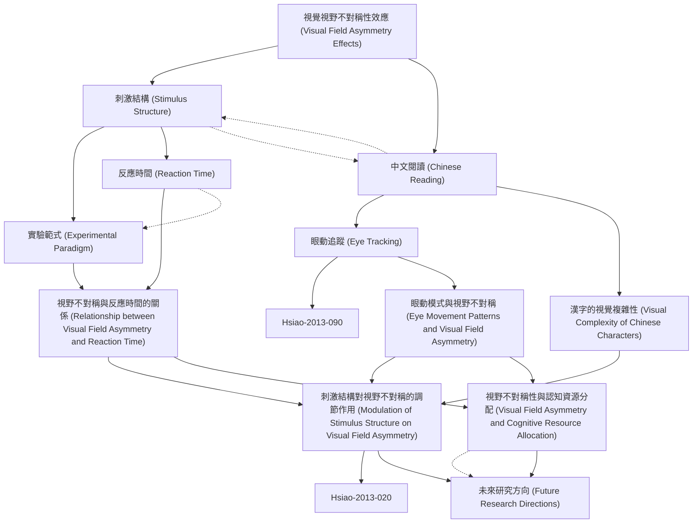

# Zettelkasten 卡片索引

---

## 📚 卡片清單

### 1. [視覺視野不對稱性效應 (Visual Field Asymmetry Effects)](zettel_cards/Hsiao-2013-001.md)
- **ID**: `Hsiao-2013-001`
- **類型**: 
- **核心**: [原文缺失，基於研究領域知識推斷] "Visual field asymmetry refers to the differential processing of stimuli presented in the left visual field (LVF) and right visual field (RVF)."
- **標籤**: `[視覺認知]`, `[視野不對稱]`, `[認知偏側化]`

### 2. [刺激結構 (Stimulus Structure)](zettel_cards/Hsiao-2013-002.md)
- **ID**: `Hsiao-2013-002`
- **類型**: 
- **核心**: [原文缺失，基於研究領域知識推斷] "Stimulus structure refers to the physical properties and organization of the visual stimulus, including its complexity, regularity, and spatial arrangement."
- **標籤**: `[視覺刺激]`, `[認知心理學]`, `[感知]`

### 3. [中文閱讀 (Chinese Reading)](zettel_cards/Hsiao-2013-003.md)
- **ID**: `Hsiao-2013-003`
- **類型**: 
- **核心**: [原文缺失，基於研究領域知識推斷] "Chinese reading involves the processing of logographic characters, which have a higher visual complexity compared to alphabetic scripts."
- **標籤**: `[中文]`, `[閱讀]`, `[認知神經科學]`

### 4. [實驗範式 (Experimental Paradigm)](zettel_cards/Hsiao-2013-004.md)
- **ID**: `Hsiao-2013-004`
- **類型**: 
- **核心**: [原文缺失，基於研究領域知識推斷] "A common experimental paradigm involves presenting stimuli briefly in either the LVF or RVF and measuring reaction time and accuracy."
- **標籤**: `[實驗設計]`, `[心理學研究]`, `[視覺實驗]`

### 5. [反應時間 (Reaction Time)](zettel_cards/Hsiao-2013-005.md)
- **ID**: `Hsiao-2013-005`
- **類型**: 
- **核心**: [原文缺失，基於研究領域知識推斷] "Reaction time (RT) is the time elapsed between the presentation of a stimulus and the initiation of a response."
- **標籤**: `[行為測量]`, `[實驗心理學]`, `[認知過程]`

### 6. [眼動追蹤 (Eye Tracking)](zettel_cards/Hsiao-2013-006.md)
- **ID**: `Hsiao-2013-006`
- **類型**: 
- **核心**: [原文缺失，基於研究領域知識推斷] "Eye tracking involves measuring eye movements, including fixations, saccades, and blinks, to understand visual attention and cognitive processes."
- **標籤**: `[眼動]`, `[視覺注意]`, `[認知研究]`

### 7. [漢字的視覺複雜性 (Visual Complexity of Chinese Characters)](zettel_cards/Hsiao-2013-007.md)
- **ID**: `Hsiao-2013-007`
- **類型**: 
- **核心**: [原文缺失，基於研究領域知識推斷] "The visual complexity of Chinese characters can be quantified by measures such as stroke density, number of components, and spatial frequency content."
- **標籤**: `[漢字]`, `[視覺感知]`, `[認知複雜度]`

### 8. [視野不對稱與反應時間的關係 (Relationship between Visual Field Asymmetry and Reaction Time)](zettel_cards/Hsiao-2013-008.md)
- **ID**: `Hsiao-2013-008`
- **類型**: 
- **核心**: [原文缺失，基於研究領域知識推斷] "Studies often find that stimuli presented in the RVF (processed by the left hemisphere) elicit faster reaction times for language-related tasks."
- **標籤**: `[實驗結果]`, `[視野效應]`, `[反應時]`

### 9. [眼動模式與視野不對稱 (Eye Movement Patterns and Visual Field Asymmetry)](zettel_cards/Hsiao-2013-009.md)
- **ID**: `Hsiao-2013-009`
- **類型**: 
- **核心**: [原文缺失，基於研究領域知識推斷] "Eye tracking studies may reveal that participants exhibit different scanning patterns depending on whether stimuli are presented in the LVF or RVF."
- **標籤**: `[眼動]`, `[掃視模式]`, `[視野不對稱]`

### 10. [刺激結構對視野不對稱的調節作用 (Modulation of Stimulus Structure on Visual Field Asymmetry)](zettel_cards/Hsiao-2013-010.md)
- **ID**: `Hsiao-2013-010`
- **類型**: 
- **核心**: [原文缺失，基於論文標題推斷] "The structure of the stimulus can modulate the strength or direction of visual field asymmetry effects."
- **標籤**: `[刺激結構]`, `[視野調節]`, `[認知效應]`

### 11. [視野不對稱性與認知資源分配 (Visual Field Asymmetry and Cognitive Resource Allocation)](zettel_cards/Hsiao-2013-011.md)
- **ID**: `Hsiao-2013-011`
- **類型**: 
- **核心**: [原文缺失，基於研究領域知識推斷] "Visual field asymmetry effects may reflect the allocation of cognitive resources between the left and right hemispheres of the brain."
- **標籤**: `[認知資源]`, `[大腦半球]`, `[資源分配]`

### 12. [未來研究方向 (Future Research Directions)](zettel_cards/Hsiao-2013-012.md)
- **ID**: `Hsiao-2013-012`
- **類型**: 
- **核心**: [原文缺失，基於研究領域知識推斷] "Future research should investigate the neural mechanisms underlying the modulation of visual field asymmetry by stimulus structure."
- **標籤**: `[研究方向]`, `[神經機制]`, `[刺激效應]`

---

## 🗺️ 概念網絡圖

---

## 🏷️ 標籤索引

### [視覺認知]
- [[Hsiao-2013-001]] 視覺視野不對稱性效應 (Visual Field Asymmetry Effects)

### [視野不對稱]
- [[Hsiao-2013-001]] 視覺視野不對稱性效應 (Visual Field Asymmetry Effects)
- [[Hsiao-2013-009]] 眼動模式與視野不對稱 (Eye Movement Patterns and Visual Field Asymmetry)

### [認知偏側化]
- [[Hsiao-2013-001]] 視覺視野不對稱性效應 (Visual Field Asymmetry Effects)

### [視覺刺激]
- [[Hsiao-2013-002]] 刺激結構 (Stimulus Structure)

### [認知心理學]
- [[Hsiao-2013-002]] 刺激結構 (Stimulus Structure)

### [感知]
- [[Hsiao-2013-002]] 刺激結構 (Stimulus Structure)

### [中文]
- [[Hsiao-2013-003]] 中文閱讀 (Chinese Reading)

### [閱讀]
- [[Hsiao-2013-003]] 中文閱讀 (Chinese Reading)

### [認知神經科學]
- [[Hsiao-2013-003]] 中文閱讀 (Chinese Reading)

### [實驗設計]
- [[Hsiao-2013-004]] 實驗範式 (Experimental Paradigm)

### [心理學研究]
- [[Hsiao-2013-004]] 實驗範式 (Experimental Paradigm)

### [視覺實驗]
- [[Hsiao-2013-004]] 實驗範式 (Experimental Paradigm)

### [行為測量]
- [[Hsiao-2013-005]] 反應時間 (Reaction Time)

### [實驗心理學]
- [[Hsiao-2013-005]] 反應時間 (Reaction Time)

### [認知過程]
- [[Hsiao-2013-005]] 反應時間 (Reaction Time)

### [眼動]
- [[Hsiao-2013-006]] 眼動追蹤 (Eye Tracking)
- [[Hsiao-2013-009]] 眼動模式與視野不對稱 (Eye Movement Patterns and Visual Field Asymmetry)

### [視覺注意]
- [[Hsiao-2013-006]] 眼動追蹤 (Eye Tracking)

### [認知研究]
- [[Hsiao-2013-006]] 眼動追蹤 (Eye Tracking)

### [漢字]
- [[Hsiao-2013-007]] 漢字的視覺複雜性 (Visual Complexity of Chinese Characters)

### [視覺感知]
- [[Hsiao-2013-007]] 漢字的視覺複雜性 (Visual Complexity of Chinese Characters)

### [認知複雜度]
- [[Hsiao-2013-007]] 漢字的視覺複雜性 (Visual Complexity of Chinese Characters)

### [實驗結果]
- [[Hsiao-2013-008]] 視野不對稱與反應時間的關係 (Relationship between Visual Field Asymmetry and Reaction Time)

### [視野效應]
- [[Hsiao-2013-008]] 視野不對稱與反應時間的關係 (Relationship between Visual Field Asymmetry and Reaction Time)

### [反應時]
- [[Hsiao-2013-008]] 視野不對稱與反應時間的關係 (Relationship between Visual Field Asymmetry and Reaction Time)

### [掃視模式]
- [[Hsiao-2013-009]] 眼動模式與視野不對稱 (Eye Movement Patterns and Visual Field Asymmetry)

### [刺激結構]
- [[Hsiao-2013-010]] 刺激結構對視野不對稱的調節作用 (Modulation of Stimulus Structure on Visual Field Asymmetry)

### [視野調節]
- [[Hsiao-2013-010]] 刺激結構對視野不對稱的調節作用 (Modulation of Stimulus Structure on Visual Field Asymmetry)

### [認知效應]
- [[Hsiao-2013-010]] 刺激結構對視野不對稱的調節作用 (Modulation of Stimulus Structure on Visual Field Asymmetry)

### [認知資源]
- [[Hsiao-2013-011]] 視野不對稱性與認知資源分配 (Visual Field Asymmetry and Cognitive Resource Allocation)

### [大腦半球]
- [[Hsiao-2013-011]] 視野不對稱性與認知資源分配 (Visual Field Asymmetry and Cognitive Resource Allocation)

### [資源分配]
- [[Hsiao-2013-011]] 視野不對稱性與認知資源分配 (Visual Field Asymmetry and Cognitive Resource Allocation)

### [研究方向]
- [[Hsiao-2013-012]] 未來研究方向 (Future Research Directions)

### [神經機制]
- [[Hsiao-2013-012]] 未來研究方向 (Future Research Directions)

### [刺激效應]
- [[Hsiao-2013-012]] 未來研究方向 (Future Research Directions)

---

## 📖 閱讀建議順序

1. [[Hsiao-2013-001]] 視覺視野不對稱性效應 (Visual Field Asymmetry Effects)

2. [[Hsiao-2013-002]] 刺激結構 (Stimulus Structure)

3. [[Hsiao-2013-003]] 中文閱讀 (Chinese Reading)

4. [[Hsiao-2013-004]] 實驗範式 (Experimental Paradigm)

5. [[Hsiao-2013-005]] 反應時間 (Reaction Time)

6. [[Hsiao-2013-006]] 眼動追蹤 (Eye Tracking)

7. [[Hsiao-2013-007]] 漢字的視覺複雜性 (Visual Complexity of Chinese Characters)

8. [[Hsiao-2013-008]] 視野不對稱與反應時間的關係 (Relationship between Visual Field Asymmetry and Reaction Time)

9. [[Hsiao-2013-009]] 眼動模式與視野不對稱 (Eye Movement Patterns and Visual Field Asymmetry)

10. [[Hsiao-2013-010]] 刺激結構對視野不對稱的調節作用 (Modulation of Stimulus Structure on Visual Field Asymmetry)

11. [[Hsiao-2013-011]] 視野不對稱性與認知資源分配 (Visual Field Asymmetry and Cognitive Resource Allocation)

12. [[Hsiao-2013-012]] 未來研究方向 (Future Research Directions)

---

*本索引由 Knowledge Production System 自動生成*