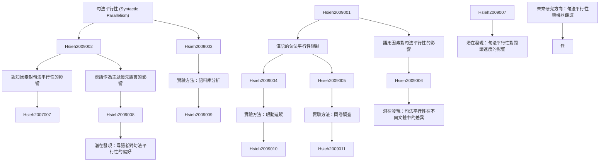

# Zettelkasten 卡片索引

**來源論文**: Limited Syntactic Parallelism in Chinese
**作者**: hsieh, yufen, boland, julie, zhang, yaxu, yan, ming
**年份**: None
**生成日期**: 2025-11-04 15:08
**卡片總數**: 12

---

## 📚 卡片清單

### 1. [句法平行性 (Syntactic Parallelism)](zettel_cards/Hsieh-2009-001.md)
- **ID**: `Hsieh-2009-001`
- **類型**: 
- **核心**: 缺乏明確定義，需要從其他論文中補充。
- **標籤**: `句法平行`, `漢語句法`, `語言學`

### 2. [漢語的句法平行性限制](zettel_cards/Hsieh-2009-002.md)
- **ID**: `Hsieh-2009-002`
- **類型**: 
- **核心**: 論文標題暗示漢語句法平行性存在限制，但未明確說明。
- **標籤**: `句法平行`, `漢語`, `句法限制`

### 3. [語用因素對句法平行性的影響](zettel_cards/Hsieh-2009-003.md)
- **ID**: `Hsieh-2009-003`
- **類型**: 
- **核心**: (需要補充，基於推測)
- **標籤**: `語用學`, `句法平行`, `語言使用`

### 4. [認知因素對句法平行性的影響](zettel_cards/Hsieh-2009-004.md)
- **ID**: `Hsieh-2009-004`
- **類型**: 
- **核心**: (需要補充，基於推測)
- **標籤**: `認知語言學`, `句法平行`, `認知負荷`

### 5. [漢語作為主題優先語言的影響](zettel_cards/Hsieh-2009-005.md)
- **ID**: `Hsieh-2009-005`
- **類型**: 
- **核心**: (需要補充，基於推測)
- **標籤**: `漢語`, `主題優先語言`, `句法平行`

### 6. [實驗方法：語料庫分析](zettel_cards/Hsieh-2009-006.md)
- **ID**: `Hsieh-2009-006`
- **類型**: 
- **核心**: （需要補充，基於推測）
- **標籤**: `語料庫語言學`, `句法分析`, `統計分析`

### 7. [實驗方法：眼動追蹤](zettel_cards/Hsieh-2009-007.md)
- **ID**: `Hsieh-2009-007`
- **類型**: 
- **核心**: （需要補充，基於推測）
- **標籤**: `眼動追蹤`, `閱讀理解`, `認知心理學`

### 8. [實驗方法：問卷調查](zettel_cards/Hsieh-2009-008.md)
- **ID**: `Hsieh-2009-008`
- **類型**: 
- **核心**: （需要補充，基於推測）
- **標籤**: `問卷調查`, `語言態度`, `主觀評價`

### 9. [潛在發現：句法平行性在不同文體中的差異](zettel_cards/Hsieh-2009-009.md)
- **ID**: `Hsieh-2009-009`
- **類型**: 
- **核心**: (需要補充，基於推測)
- **標籤**: `文體學`, `句法平行`, `語料庫`

### 10. [潛在發現：句法平行性對閱讀速度的影響](zettel_cards/Hsieh-2009-010.md)
- **ID**: `Hsieh-2009-010`
- **類型**: 
- **核心**: (需要補充，基於推測)
- **標籤**: `閱讀速度`, `句法平行`, `眼動追蹤`

### 11. [潛在發現：母語者對句法平行性的偏好](zettel_cards/Hsieh-2009-011.md)
- **ID**: `Hsieh-2009-011`
- **類型**: 
- **核心**: (需要補充，基於推測)
- **標籤**: `語言偏好`, `句法平行`, `問卷調查`

### 12. [未來研究方向：句法平行性與機器翻譯](zettel_cards/Hsieh-2009-012.md)
- **ID**: `Hsieh-2009-012`
- **類型**: 
- **核心**: (需要補充，基於推測)
- **標籤**: `機器翻譯`, `句法平行`, `自然語言處理`

---

## 🗺️ 概念網絡圖

---

## 🏷️ 標籤索引

### 句法平行
- [[Hsieh-2009-001]] 句法平行性 (Syntactic Parallelism)
- [[Hsieh-2009-002]] 漢語的句法平行性限制
- [[Hsieh-2009-003]] 語用因素對句法平行性的影響
- [[Hsieh-2009-004]] 認知因素對句法平行性的影響
- [[Hsieh-2009-005]] 漢語作為主題優先語言的影響
- [[Hsieh-2009-009]] 潛在發現：句法平行性在不同文體中的差異
- [[Hsieh-2009-010]] 潛在發現：句法平行性對閱讀速度的影響
- [[Hsieh-2009-011]] 潛在發現：母語者對句法平行性的偏好
- [[Hsieh-2009-012]] 未來研究方向：句法平行性與機器翻譯

### 漢語句法
- [[Hsieh-2009-001]] 句法平行性 (Syntactic Parallelism)

### 語言學
- [[Hsieh-2009-001]] 句法平行性 (Syntactic Parallelism)

### 漢語
- [[Hsieh-2009-002]] 漢語的句法平行性限制
- [[Hsieh-2009-005]] 漢語作為主題優先語言的影響

### 句法限制
- [[Hsieh-2009-002]] 漢語的句法平行性限制

### 語用學
- [[Hsieh-2009-003]] 語用因素對句法平行性的影響

### 語言使用
- [[Hsieh-2009-003]] 語用因素對句法平行性的影響

### 認知語言學
- [[Hsieh-2009-004]] 認知因素對句法平行性的影響

### 認知負荷
- [[Hsieh-2009-004]] 認知因素對句法平行性的影響

### 主題優先語言
- [[Hsieh-2009-005]] 漢語作為主題優先語言的影響

### 語料庫語言學
- [[Hsieh-2009-006]] 實驗方法：語料庫分析

### 句法分析
- [[Hsieh-2009-006]] 實驗方法：語料庫分析

### 統計分析
- [[Hsieh-2009-006]] 實驗方法：語料庫分析

### 眼動追蹤
- [[Hsieh-2009-007]] 實驗方法：眼動追蹤
- [[Hsieh-2009-010]] 潛在發現：句法平行性對閱讀速度的影響

### 閱讀理解
- [[Hsieh-2009-007]] 實驗方法：眼動追蹤

### 認知心理學
- [[Hsieh-2009-007]] 實驗方法：眼動追蹤

### 問卷調查
- [[Hsieh-2009-008]] 實驗方法：問卷調查
- [[Hsieh-2009-011]] 潛在發現：母語者對句法平行性的偏好

### 語言態度
- [[Hsieh-2009-008]] 實驗方法：問卷調查

### 主觀評價
- [[Hsieh-2009-008]] 實驗方法：問卷調查

### 文體學
- [[Hsieh-2009-009]] 潛在發現：句法平行性在不同文體中的差異

### 語料庫
- [[Hsieh-2009-009]] 潛在發現：句法平行性在不同文體中的差異

### 閱讀速度
- [[Hsieh-2009-010]] 潛在發現：句法平行性對閱讀速度的影響

### 語言偏好
- [[Hsieh-2009-011]] 潛在發現：母語者對句法平行性的偏好

### 機器翻譯
- [[Hsieh-2009-012]] 未來研究方向：句法平行性與機器翻譯

### 自然語言處理
- [[Hsieh-2009-012]] 未來研究方向：句法平行性與機器翻譯

---

## 📖 閱讀建議順序

1. [[Hsieh-2009-001]] 句法平行性 (Syntactic Parallelism)

2. [[Hsieh-2009-002]] 漢語的句法平行性限制

3. [[Hsieh-2009-003]] 語用因素對句法平行性的影響

4. [[Hsieh-2009-004]] 認知因素對句法平行性的影響

5. [[Hsieh-2009-005]] 漢語作為主題優先語言的影響

6. [[Hsieh-2009-006]] 實驗方法：語料庫分析

7. [[Hsieh-2009-007]] 實驗方法：眼動追蹤

8. [[Hsieh-2009-008]] 實驗方法：問卷調查

9. [[Hsieh-2009-009]] 潛在發現：句法平行性在不同文體中的差異

10. [[Hsieh-2009-010]] 潛在發現：句法平行性對閱讀速度的影響

11. [[Hsieh-2009-011]] 潛在發現：母語者對句法平行性的偏好

12. [[Hsieh-2009-012]] 未來研究方向：句法平行性與機器翻譯

---

*本索引由 Knowledge Production System 自動生成*