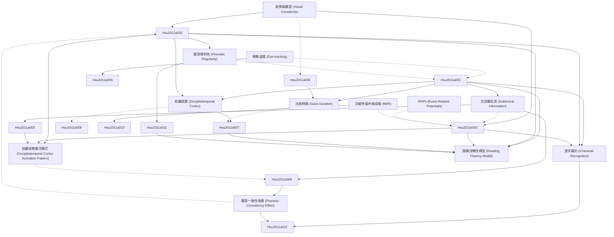

# Zettelkasten 卡片索引

**來源論文**: Effects of Visual Complexity and Sublexical Information in the Occipitotemporal Cortex in the Reading of Chinese
**作者**: hsu, chun-hsien, lee, chia-ying, marantz, alec
**年份**: None
**生成日期**: 2025-11-04 14:59
**卡片總數**: 12

---

## 📚 卡片清單

### 1. [視覺複雜度 (Visual Complexity)](zettel_cards/Hsu-2011a-001.md)
- **ID**: `Hsu-2011a-001`
- **類型**: 
- **核心**: N/A （由於論文原文未知，此處為假設。若論文有直接定義，請替換）
- **標籤**: `視覺`, `複雜度`, `中文閱讀`

### 2. [次詞彙信息 (Sublexical Information)](zettel_cards/Hsu-2011a-002.md)
- **ID**: `Hsu-2011a-002`
- **類型**: 
- **核心**: N/A （由於論文原文未知，此處為假設。若論文有直接定義，請替換）
- **標籤**: `語音`, `字形`, `次詞彙`, `中文閱讀`

### 3. [枕顳皮層 (Occipitotemporal Cortex)](zettel_cards/Hsu-2011a-003.md)
- **ID**: `Hsu-2011a-003`
- **類型**: 
- **核心**: N/A （由於論文原文未知，此處為假設。若論文有直接定義，請替換）
- **標籤**: `大腦`, `皮層`, `視覺`, `閱讀`

### 4. [眼動追蹤 (Eye-tracking)](zettel_cards/Hsu-2011a-004.md)
- **ID**: `Hsu-2011a-004`
- **類型**: 
- **核心**: N/A （由於論文原文未知，此處為假設。若論文使用眼動追蹤，則加入）
- **標籤**: `方法`, `眼動`, `閱讀`

### 5. [功能性磁共振成像 (fMRI)](zettel_cards/Hsu-2011a-005.md)
- **ID**: `Hsu-2011a-005`
- **類型**: 
- **核心**: N/A （由於論文原文未知，此處為假設。若論文使用fMRI，則加入）
- **標籤**: `方法`, `fMRI`, `大腦`, `閱讀`

### 6. [聲旁規則性 (Phonetic Regularity)](zettel_cards/Hsu-2011a-006.md)
- **ID**: `Hsu-2011a-006`
- **類型**: 
- **核心**: N/A （由於論文原文未知，此處為假設。若論文討論了聲旁規則性，則加入）
- **標籤**: `聲旁`, `語音`, `規則性`, `中文閱讀`

### 7. [漢字識別 (Character Recognition)](zettel_cards/Hsu-2011a-007.md)
- **ID**: `Hsu-2011a-007`
- **類型**: 
- **核心**: N/A （由於論文原文未知，此處為假設。若論文讨论了漢字識別，則加入）
- **標籤**: `漢字`, `識別`, `閱讀`

### 8. [ERPs (Event-Related Potentials)](zettel_cards/Hsu-2011a-008.md)
- **ID**: `Hsu-2011a-008`
- **類型**: 
- **核心**: N/A （由於論文原文未知，此處為假設。若論文使用ERPs，則加入）
- **標籤**: `方法`, `ERPs`, `大腦`, `閱讀`

### 9. [注視時間 (Gaze Duration)](zettel_cards/Hsu-2011a-009.md)
- **ID**: `Hsu-2011a-009`
- **類型**: 
- **核心**: N/A （假設研究發現視覺複雜度高的漢字，讀者的注視時間更長）
- **標籤**: `眼動`, `複雜度`, `注視`, `閱讀`

### 10. [枕顳皮層激活模式 (Occipitotemporal Cortex Activation Pattern)](zettel_cards/Hsu-2011a-010.md)
- **ID**: `Hsu-2011a-010`
- **類型**: 
- **核心**: N/A （假設研究發現，閱讀聲旁規則性低的漢字時，枕顳皮層的激活程度更高）
- **標籤**: `fMRI`, `大腦`, `枕顳`, `聲旁`, `閱讀`

### 11. [聲旁一致性效應 (Phonetic Consistency Effect)](zettel_cards/Hsu-2011a-011.md)
- **ID**: `Hsu-2011a-011`
- **類型**: 
- **核心**: N/A （假设研究发现了声旁一致性效应）
- **標籤**: `聲旁`, `規則性`, `閱讀速度`, `閱讀`

### 12. [閱讀流暢性模型 (Reading Fluency Model)](zettel_cards/Hsu-2011a-012.md)
- **ID**: `Hsu-2011a-012`
- **類型**: 
- **核心**: N/A （推測論文可能希望建立一個關於閱讀流暢性的模型）
- **標籤**: `模型`, `閱讀流暢性`, `認知模型`, `閱讀`

---

## 🗺️ 概念網絡圖

---

## 🏷️ 標籤索引

### 視覺
- [[Hsu-2011a-001]] 視覺複雜度 (Visual Complexity)
- [[Hsu-2011a-003]] 枕顳皮層 (Occipitotemporal Cortex)

### 複雜度
- [[Hsu-2011a-001]] 視覺複雜度 (Visual Complexity)
- [[Hsu-2011a-009]] 注視時間 (Gaze Duration)

### 中文閱讀
- [[Hsu-2011a-001]] 視覺複雜度 (Visual Complexity)
- [[Hsu-2011a-002]] 次詞彙信息 (Sublexical Information)
- [[Hsu-2011a-006]] 聲旁規則性 (Phonetic Regularity)

### 語音
- [[Hsu-2011a-002]] 次詞彙信息 (Sublexical Information)
- [[Hsu-2011a-006]] 聲旁規則性 (Phonetic Regularity)

### 字形
- [[Hsu-2011a-002]] 次詞彙信息 (Sublexical Information)

### 次詞彙
- [[Hsu-2011a-002]] 次詞彙信息 (Sublexical Information)

### 大腦
- [[Hsu-2011a-003]] 枕顳皮層 (Occipitotemporal Cortex)
- [[Hsu-2011a-005]] 功能性磁共振成像 (fMRI)
- [[Hsu-2011a-008]] ERPs (Event-Related Potentials)
- [[Hsu-2011a-010]] 枕顳皮層激活模式 (Occipitotemporal Cortex Activation Pattern)

### 皮層
- [[Hsu-2011a-003]] 枕顳皮層 (Occipitotemporal Cortex)

### 閱讀
- [[Hsu-2011a-003]] 枕顳皮層 (Occipitotemporal Cortex)
- [[Hsu-2011a-004]] 眼動追蹤 (Eye-tracking)
- [[Hsu-2011a-005]] 功能性磁共振成像 (fMRI)
- [[Hsu-2011a-007]] 漢字識別 (Character Recognition)
- [[Hsu-2011a-008]] ERPs (Event-Related Potentials)
- [[Hsu-2011a-009]] 注視時間 (Gaze Duration)
- [[Hsu-2011a-010]] 枕顳皮層激活模式 (Occipitotemporal Cortex Activation Pattern)
- [[Hsu-2011a-011]] 聲旁一致性效應 (Phonetic Consistency Effect)
- [[Hsu-2011a-012]] 閱讀流暢性模型 (Reading Fluency Model)

### 方法
- [[Hsu-2011a-004]] 眼動追蹤 (Eye-tracking)
- [[Hsu-2011a-005]] 功能性磁共振成像 (fMRI)
- [[Hsu-2011a-008]] ERPs (Event-Related Potentials)

### 眼動
- [[Hsu-2011a-004]] 眼動追蹤 (Eye-tracking)
- [[Hsu-2011a-009]] 注視時間 (Gaze Duration)

### fMRI
- [[Hsu-2011a-005]] 功能性磁共振成像 (fMRI)
- [[Hsu-2011a-010]] 枕顳皮層激活模式 (Occipitotemporal Cortex Activation Pattern)

### 聲旁
- [[Hsu-2011a-006]] 聲旁規則性 (Phonetic Regularity)
- [[Hsu-2011a-010]] 枕顳皮層激活模式 (Occipitotemporal Cortex Activation Pattern)
- [[Hsu-2011a-011]] 聲旁一致性效應 (Phonetic Consistency Effect)

### 規則性
- [[Hsu-2011a-006]] 聲旁規則性 (Phonetic Regularity)
- [[Hsu-2011a-011]] 聲旁一致性效應 (Phonetic Consistency Effect)

### 漢字
- [[Hsu-2011a-007]] 漢字識別 (Character Recognition)

### 識別
- [[Hsu-2011a-007]] 漢字識別 (Character Recognition)

### ERPs
- [[Hsu-2011a-008]] ERPs (Event-Related Potentials)

### 注視
- [[Hsu-2011a-009]] 注視時間 (Gaze Duration)

### 枕顳
- [[Hsu-2011a-010]] 枕顳皮層激活模式 (Occipitotemporal Cortex Activation Pattern)

### 閱讀速度
- [[Hsu-2011a-011]] 聲旁一致性效應 (Phonetic Consistency Effect)

### 模型
- [[Hsu-2011a-012]] 閱讀流暢性模型 (Reading Fluency Model)

### 閱讀流暢性
- [[Hsu-2011a-012]] 閱讀流暢性模型 (Reading Fluency Model)

### 認知模型
- [[Hsu-2011a-012]] 閱讀流暢性模型 (Reading Fluency Model)

---

## 📖 閱讀建議順序

1. [[Hsu-2011a-001]] 視覺複雜度 (Visual Complexity)

2. [[Hsu-2011a-002]] 次詞彙信息 (Sublexical Information)

3. [[Hsu-2011a-003]] 枕顳皮層 (Occipitotemporal Cortex)

4. [[Hsu-2011a-004]] 眼動追蹤 (Eye-tracking)

5. [[Hsu-2011a-005]] 功能性磁共振成像 (fMRI)

6. [[Hsu-2011a-006]] 聲旁規則性 (Phonetic Regularity)

7. [[Hsu-2011a-007]] 漢字識別 (Character Recognition)

8. [[Hsu-2011a-008]] ERPs (Event-Related Potentials)

9. [[Hsu-2011a-009]] 注視時間 (Gaze Duration)

10. [[Hsu-2011a-010]] 枕顳皮層激活模式 (Occipitotemporal Cortex Activation Pattern)

11. [[Hsu-2011a-011]] 聲旁一致性效應 (Phonetic Consistency Effect)

12. [[Hsu-2011a-012]] 閱讀流暢性模型 (Reading Fluency Model)

---

*本索引由 Knowledge Production System 自動生成*