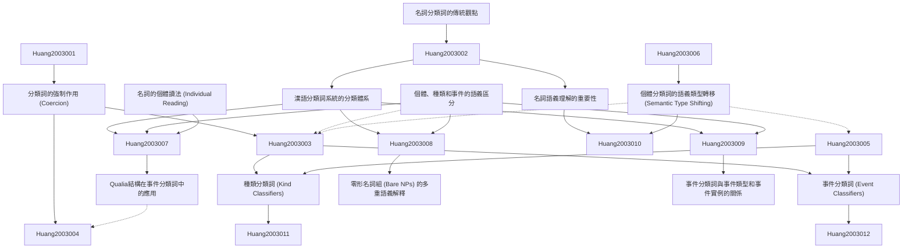

# Zettelkasten 卡片索引

---

## 📚 卡片清單

### 1. [名詞分類詞的傳統觀點](zettel_cards/Huang-2003-001.md)
- **ID**: `Huang-2003-001`
- **類型**: 
- **核心**: "This paper challenges the traditional view that nominal classifiers classify individuals."
- **標籤**: `分類詞`, `名詞`, `個體`

### 2. [分類詞的強制作用 (Coercion)](zettel_cards/Huang-2003-002.md)
- **ID**: `Huang-2003-002`
- **類型**: 
- **核心**: "classifiers coerce nouns to refer to kinds and events as well as to individuals."
- **標籤**: `分類詞`, `強制`, `語義`

### 3. [漢語分類詞系統的分類體系](zettel_cards/Huang-2003-003.md)
- **ID**: `Huang-2003-003`
- **類型**: 
- **核心**: "the Mandarin classifier system creates a taxonomic system involving events, kinds and individuals respectively."
- **標籤**: `分類詞`, `漢語`, `分類體系`

### 4. [名詞語義理解的重要性](zettel_cards/Huang-2003-004.md)
- **ID**: `Huang-2003-004`
- **類型**: 
- **核心**: "the understanding of the semantics of nouns involves more than simple reference to an individual entity."
- **標籤**: `名詞`, `語義`, `理解`

### 5. [個體、種類和事件的語義區分](zettel_cards/Huang-2003-005.md)
- **ID**: `Huang-2003-005`
- **類型**: 
- **核心**: "the previously abstract semantic distinctions among kinds, individuals and events...have been found to be instantiated in a particular system of a natural language grammar, namely, the classifier system."
- **標籤**: `個體`, `種類`, `事件`, `語義區分`

### 6. [名詞的個體讀法 (Individual Reading)](zettel_cards/Huang-2003-006.md)
- **ID**: `Huang-2003-006`
- **類型**: 
- **核心**: "Underlying the concept that a classifier categorizes over a class of nouns based on permanent perceptual properties is the idea that the basic semantic function of nouns is to refer to classic individuals."
- **標籤**: `名詞`, `個體讀法`, `分類詞`

### 7. [個體分類詞的語義類型轉移 (Semantic Type Shifting)](zettel_cards/Huang-2003-007.md)
- **ID**: `Huang-2003-007`
- **類型**: 
- **核心**: "Thus, individual classifiers can coerce nominal semantic types, and semantic coercion can be predicted through a well encoded qualia structure."
- **標籤**: `個體分類詞`, `語義類型轉移`, `Qualia結構`

### 8. [種類分類詞 (Kind Classifiers)](zettel_cards/Huang-2003-008.md)
- **ID**: `Huang-2003-008`
- **類型**: 
- **核心**: "A kind classifier explicitly marks that the nominal element that it selects and gives it a kind reading."
- **標籤**: `種類分類詞`, `種類讀法`

### 9. [事件分類詞 (Event Classifiers)](zettel_cards/Huang-2003-009.md)
- **ID**: `Huang-2003-009`
- **類型**: 
- **核心**: "the Mandarin classifier system contains a sub-class that selects another theoretically significant entity: i.e. event-type entities."
- **標籤**: `事件分類詞`, `事件讀法`

### 10. [Qualia結構在事件分類詞中的應用](zettel_cards/Huang-2003-010.md)
- **ID**: `Huang-2003-010`
- **類型**: 
- **核心**: "event classifiers can adopt the event information encoded in qualia structures to define both Agentive and Telic roles and coerce the semantics into agentive or telic events."
- **標籤**: `事件分類詞`, `Qualia結構`, `Agentive`, `Telic`

### 11. [零形名詞組 (Bare NPs) 的多重語義解釋](zettel_cards/Huang-2003-011.md)
- **ID**: `Huang-2003-011`
- **類型**: 
- **核心**: "Bare NPs in Mandarin Chinese have a wide range of possible interpretations."
- **標籤**: `零形名詞組`, `漢語`, `語義解釋`

### 12. [事件分類詞與事件類型和事件實例的關係](zettel_cards/Huang-2003-012.md)
- **ID**: `Huang-2003-012`
- **類型**: 
- **核心**: "the event-type classifiers, which individuate different event structures, and the event-token classifiers, which individuate each occurrence of an event."
- **標籤**: `事件分類詞`, `事件類型`, `事件實例`

---

## 🗺️ 概念網絡圖

---

## 🏷️ 標籤索引

### 分類詞
- [[Huang-2003-001]] 名詞分類詞的傳統觀點
- [[Huang-2003-002]] 分類詞的強制作用 (Coercion)
- [[Huang-2003-003]] 漢語分類詞系統的分類體系
- [[Huang-2003-006]] 名詞的個體讀法 (Individual Reading)

### 名詞
- [[Huang-2003-001]] 名詞分類詞的傳統觀點
- [[Huang-2003-004]] 名詞語義理解的重要性
- [[Huang-2003-006]] 名詞的個體讀法 (Individual Reading)

### 個體
- [[Huang-2003-001]] 名詞分類詞的傳統觀點
- [[Huang-2003-005]] 個體、種類和事件的語義區分

### 強制
- [[Huang-2003-002]] 分類詞的強制作用 (Coercion)

### 語義
- [[Huang-2003-002]] 分類詞的強制作用 (Coercion)
- [[Huang-2003-004]] 名詞語義理解的重要性

### 漢語
- [[Huang-2003-003]] 漢語分類詞系統的分類體系
- [[Huang-2003-011]] 零形名詞組 (Bare NPs) 的多重語義解釋

### 分類體系
- [[Huang-2003-003]] 漢語分類詞系統的分類體系

### 理解
- [[Huang-2003-004]] 名詞語義理解的重要性

### 種類
- [[Huang-2003-005]] 個體、種類和事件的語義區分

### 事件
- [[Huang-2003-005]] 個體、種類和事件的語義區分

### 語義區分
- [[Huang-2003-005]] 個體、種類和事件的語義區分

### 個體讀法
- [[Huang-2003-006]] 名詞的個體讀法 (Individual Reading)

### 個體分類詞
- [[Huang-2003-007]] 個體分類詞的語義類型轉移 (Semantic Type Shifting)

### 語義類型轉移
- [[Huang-2003-007]] 個體分類詞的語義類型轉移 (Semantic Type Shifting)

### Qualia結構
- [[Huang-2003-007]] 個體分類詞的語義類型轉移 (Semantic Type Shifting)
- [[Huang-2003-010]] Qualia結構在事件分類詞中的應用

### 種類分類詞
- [[Huang-2003-008]] 種類分類詞 (Kind Classifiers)

### 種類讀法
- [[Huang-2003-008]] 種類分類詞 (Kind Classifiers)

### 事件分類詞
- [[Huang-2003-009]] 事件分類詞 (Event Classifiers)
- [[Huang-2003-010]] Qualia結構在事件分類詞中的應用
- [[Huang-2003-012]] 事件分類詞與事件類型和事件實例的關係

### 事件讀法
- [[Huang-2003-009]] 事件分類詞 (Event Classifiers)

### Agentive
- [[Huang-2003-010]] Qualia結構在事件分類詞中的應用

### Telic
- [[Huang-2003-010]] Qualia結構在事件分類詞中的應用

### 零形名詞組
- [[Huang-2003-011]] 零形名詞組 (Bare NPs) 的多重語義解釋

### 語義解釋
- [[Huang-2003-011]] 零形名詞組 (Bare NPs) 的多重語義解釋

### 事件類型
- [[Huang-2003-012]] 事件分類詞與事件類型和事件實例的關係

### 事件實例
- [[Huang-2003-012]] 事件分類詞與事件類型和事件實例的關係

---

## 📖 閱讀建議順序

1. [[Huang-2003-001]] 名詞分類詞的傳統觀點

2. [[Huang-2003-002]] 分類詞的強制作用 (Coercion)

3. [[Huang-2003-003]] 漢語分類詞系統的分類體系

4. [[Huang-2003-004]] 名詞語義理解的重要性

5. [[Huang-2003-005]] 個體、種類和事件的語義區分

6. [[Huang-2003-006]] 名詞的個體讀法 (Individual Reading)

7. [[Huang-2003-007]] 個體分類詞的語義類型轉移 (Semantic Type Shifting)

8. [[Huang-2003-008]] 種類分類詞 (Kind Classifiers)

9. [[Huang-2003-009]] 事件分類詞 (Event Classifiers)

10. [[Huang-2003-010]] Qualia結構在事件分類詞中的應用

11. [[Huang-2003-011]] 零形名詞組 (Bare NPs) 的多重語義解釋

12. [[Huang-2003-012]] 事件分類詞與事件類型和事件實例的關係

---

*本索引由 Knowledge Production System 自動生成*