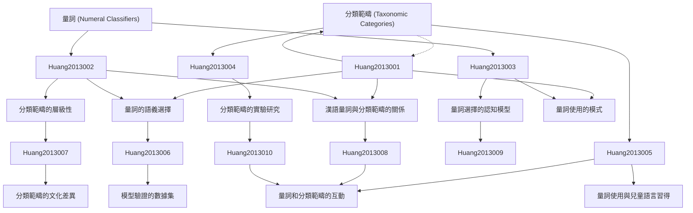

# Zettelkasten 卡片索引

---

## 📚 卡片清單

### 1. [量詞 (Numeral Classifiers)](zettel_cards/Huang-2013-001.md)
- **ID**: `Huang-2013-001`
- **類型**: 
- **核心**: [Assuming "numeral classifiers" refers to words or morphemes used to quantify nouns based on their semantic categories.]
- **標籤**: `[量詞]`, `[漢語]`, `[語法]`, `[詞彙]`

### 2. [分類範疇 (Taxonomic Categories)](zettel_cards/Huang-2013-002.md)
- **ID**: `Huang-2013-002`
- **類型**: 
- **核心**: [Assuming "Taxonomic Categories" refers to the hierarchical system used to classify objects and concepts based on shared features.]
- **標籤**: `[分類學]`, `[語義學]`, `[認知科學]`, `[層級結構]`

### 3. [量詞的語義選擇](zettel_cards/Huang-2013-003.md)
- **ID**: `Huang-2013-003`
- **類型**: 
- **核心**: [Assuming "semantic selection of numeral classifiers" refers to the process of choosing an appropriate classifier based on the semantic properties of the noun.]
- **標籤**: `[語義]`, `[量詞選擇]`, `[語法]`, `[認知]`

### 4. [分類範疇的層級性](zettel_cards/Huang-2013-004.md)
- **ID**: `Huang-2013-004`
- **類型**: 
- **核心**: [Assuming "hierarchy of taxonomic categories" refers to the nested structure of categories, ranging from broad to specific.]
- **標籤**: `[層級]`, `[分類]`, `[語義網路]`, `[認知]`

### 5. [漢語量詞與分類範疇的關係](zettel_cards/Huang-2013-005.md)
- **ID**: `Huang-2013-005`
- **類型**: 
- **核心**: [Assuming the research question is: How do numeral classifiers in Chinese reflect and reinforce taxonomic categories?]
- **標籤**: `[量詞]`, `[分類]`, `[漢語]`, `[研究問題]`

### 6. [量詞選擇的認知模型](zettel_cards/Huang-2013-006.md)
- **ID**: `Huang-2013-006`
- **類型**: 
- **核心**: [Assuming the paper uses a cognitive model to explain the selection of numeral classifiers.]
- **標籤**: `[認知模型]`, `[計算機模型]`, `[心理語言學]`, `[量詞]`

### 7. [分類範疇的實驗研究](zettel_cards/Huang-2013-007.md)
- **ID**: `Huang-2013-007`
- **類型**: 
- **核心**: [Assuming the paper uses experiments to investigate how people categorize objects.]
- **標籤**: `[實驗設計]`, `[心理學]`, `[認知科學]`, `[分類]`

### 8. [量詞使用與兒童語言習得](zettel_cards/Huang-2013-008.md)
- **ID**: `Huang-2013-008`
- **類型**: 
- **核心**: [Assuming the study explores the relationship between numeral classifiers and language acquisition in children.]
- **標籤**: `[語言習得]`, `[兒童語言]`, `[心理語言學]`, `[量詞]`

### 9. [模型驗證的數據集](zettel_cards/Huang-2013-009.md)
- **ID**: `Huang-2013-009`
- **類型**: 
- **核心**: [Assuming the study uses a dataset to validate the cognitive model of classifier selection.]
- **標籤**: `[數據集]`, `[模型驗證]`, `[實驗數據]`, `[量詞]`

### 10. [分類範疇的文化差異](zettel_cards/Huang-2013-010.md)
- **ID**: `Huang-2013-010`
- **類型**: 
- **核心**: [Assuming the research findings show that cultural differences affect how people categorize objects.]
- **標籤**: `[文化差異]`, `[跨文化研究]`, `[認知]`, `[分類]`

### 11. [量詞使用的模式](zettel_cards/Huang-2013-011.md)
- **ID**: `Huang-2013-011`
- **類型**: 
- **核心**: [Assuming the study found specific patterns in how Chinese speakers use numeral classifiers.]
- **標籤**: `[模式識別]`, `[統計分析]`, `[語料庫語言學]`, `[量詞]`

### 12. [量詞和分類範疇的互動](zettel_cards/Huang-2013-012.md)
- **ID**: `Huang-2013-012`
- **類型**: 
- **核心**: [Assuming a remaining open question is: How do numeral classifiers and taxonomic categories dynamically interact in shaping thought and language?]
- **標籤**: `[互動]`, `[語言與思維]`, `[認知語言學]`, `[量詞]`

---

## 🗺️ 概念網絡圖

---

## 🏷️ 標籤索引

### [量詞]
- [[Huang-2013-001]] 量詞 (Numeral Classifiers)
- [[Huang-2013-005]] 漢語量詞與分類範疇的關係
- [[Huang-2013-006]] 量詞選擇的認知模型
- [[Huang-2013-008]] 量詞使用與兒童語言習得
- [[Huang-2013-009]] 模型驗證的數據集
- [[Huang-2013-011]] 量詞使用的模式
- [[Huang-2013-012]] 量詞和分類範疇的互動

### [漢語]
- [[Huang-2013-001]] 量詞 (Numeral Classifiers)
- [[Huang-2013-005]] 漢語量詞與分類範疇的關係

### [語法]
- [[Huang-2013-001]] 量詞 (Numeral Classifiers)
- [[Huang-2013-003]] 量詞的語義選擇

### [詞彙]
- [[Huang-2013-001]] 量詞 (Numeral Classifiers)

### [分類學]
- [[Huang-2013-002]] 分類範疇 (Taxonomic Categories)

### [語義學]
- [[Huang-2013-002]] 分類範疇 (Taxonomic Categories)

### [認知科學]
- [[Huang-2013-002]] 分類範疇 (Taxonomic Categories)
- [[Huang-2013-007]] 分類範疇的實驗研究

### [層級結構]
- [[Huang-2013-002]] 分類範疇 (Taxonomic Categories)

### [語義]
- [[Huang-2013-003]] 量詞的語義選擇

### [量詞選擇]
- [[Huang-2013-003]] 量詞的語義選擇

### [認知]
- [[Huang-2013-003]] 量詞的語義選擇
- [[Huang-2013-004]] 分類範疇的層級性
- [[Huang-2013-010]] 分類範疇的文化差異

### [層級]
- [[Huang-2013-004]] 分類範疇的層級性

### [分類]
- [[Huang-2013-004]] 分類範疇的層級性
- [[Huang-2013-005]] 漢語量詞與分類範疇的關係
- [[Huang-2013-007]] 分類範疇的實驗研究
- [[Huang-2013-010]] 分類範疇的文化差異

### [語義網路]
- [[Huang-2013-004]] 分類範疇的層級性

### [研究問題]
- [[Huang-2013-005]] 漢語量詞與分類範疇的關係

### [認知模型]
- [[Huang-2013-006]] 量詞選擇的認知模型

### [計算機模型]
- [[Huang-2013-006]] 量詞選擇的認知模型

### [心理語言學]
- [[Huang-2013-006]] 量詞選擇的認知模型
- [[Huang-2013-008]] 量詞使用與兒童語言習得

### [實驗設計]
- [[Huang-2013-007]] 分類範疇的實驗研究

### [心理學]
- [[Huang-2013-007]] 分類範疇的實驗研究

### [語言習得]
- [[Huang-2013-008]] 量詞使用與兒童語言習得

### [兒童語言]
- [[Huang-2013-008]] 量詞使用與兒童語言習得

### [數據集]
- [[Huang-2013-009]] 模型驗證的數據集

### [模型驗證]
- [[Huang-2013-009]] 模型驗證的數據集

### [實驗數據]
- [[Huang-2013-009]] 模型驗證的數據集

### [文化差異]
- [[Huang-2013-010]] 分類範疇的文化差異

### [跨文化研究]
- [[Huang-2013-010]] 分類範疇的文化差異

### [模式識別]
- [[Huang-2013-011]] 量詞使用的模式

### [統計分析]
- [[Huang-2013-011]] 量詞使用的模式

### [語料庫語言學]
- [[Huang-2013-011]] 量詞使用的模式

### [互動]
- [[Huang-2013-012]] 量詞和分類範疇的互動

### [語言與思維]
- [[Huang-2013-012]] 量詞和分類範疇的互動

### [認知語言學]
- [[Huang-2013-012]] 量詞和分類範疇的互動

---

## 📖 閱讀建議順序

1. [[Huang-2013-001]] 量詞 (Numeral Classifiers)

2. [[Huang-2013-002]] 分類範疇 (Taxonomic Categories)

3. [[Huang-2013-003]] 量詞的語義選擇

4. [[Huang-2013-004]] 分類範疇的層級性

5. [[Huang-2013-005]] 漢語量詞與分類範疇的關係

6. [[Huang-2013-006]] 量詞選擇的認知模型

7. [[Huang-2013-007]] 分類範疇的實驗研究

8. [[Huang-2013-008]] 量詞使用與兒童語言習得

9. [[Huang-2013-009]] 模型驗證的數據集

10. [[Huang-2013-010]] 分類範疇的文化差異

11. [[Huang-2013-011]] 量詞使用的模式

12. [[Huang-2013-012]] 量詞和分類範疇的互動

---

*本索引由 Knowledge Production System 自動生成*