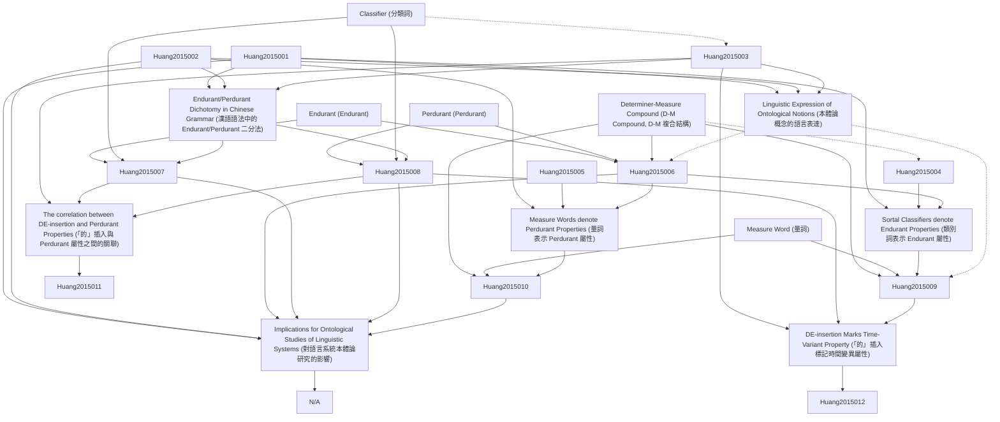

# Zettelkasten 卡片索引

**來源論文**: HuangLinguaSinica (2015) 1:1
**作者**: Open Access, Ren Huang, Chinese Grammar, R.Chao
**年份**: 2015
**生成日期**: 2025-11-04 16:36
**卡片總數**: 12

---

## 📚 卡片清單

### 1. [Endurant (Endurant)](zettel_cards/Huang-2015-001.md)
- **ID**: `Huang-2015-001`
- **類型**: 
- **核心**: "To paraphrase the position taken in DOLCE ontology (Descriptive Ontology for Linguistic and Cognitive Engineering, Gangemi et al. 2010), an endurant, is (the concept of) an entity that has spatial components but does not depend on a specific time of occurrence."
- **標籤**: `Ontology`, `Endurant`, `Time-Invariance`

### 2. [Perdurant (Perdurant)](zettel_cards/Huang-2015-002.md)
- **ID**: `Huang-2015-002`
- **類型**: 
- **核心**: "A perdurant is (the concept of) an entity which has a time element crucially associated with its meaning."
- **標籤**: `Ontology`, `Perdurant`, `Time-Dependence`

### 3. [Determiner-Measure Compound (D-M Compound, D-M 複合結構)](zettel_cards/Huang-2015-003.md)
- **ID**: `Huang-2015-003`
- **類型**: 
- **核心**: "Classifiers are given the grammatical category of Measure (M) in Determiner-Measure Compound (D-M Compound), a grammatical category specific to Chinese introducedinY.R.Chao’s(1968)Chinesegrammar."
- **標籤**: `Chinese Grammar`, `Classifier`, `Measure Word`

### 4. [Classifier (分類詞)](zettel_cards/Huang-2015-004.md)
- **ID**: `Huang-2015-004`
- **類型**: 
- **核心**: "SubsequentstudiesofChinesetypicallyadoptthegenerallinguistictermofclassifier(Aikenvald2003)andeitherrefertoChao’sMasaclassifier(e.g.Li and Thompson 1981) or assume that it can be further subdivided into two categories: classifiers and measure words (Tai 1994)."
- **標籤**: `Chinese Grammar`, `Classifier`, `Measure Word`

### 5. [Measure Word (量詞)](zettel_cards/Huang-2015-005.md)
- **ID**: `Huang-2015-005`
- **類型**: 
- **核心**: "Many later studies tried to account for the classifiers/measure words contrast via semantic or syntactic tests without reaching a definite conclusion."
- **標籤**: `Chinese Grammar`, `Measure Word`, `Classifier`

### 6. [Endurant/Perdurant Dichotomy in Chinese Grammar (漢語語法中的 Endurant/Perdurant 二分法)](zettel_cards/Huang-2015-006.md)
- **ID**: `Huang-2015-006`
- **類型**: 
- **核心**: "This paper adopts and merges two lines of Chao’s research to show that the ontological concept of endurant vs. perdurant is elegantly instantiated in Chinesegrammar, andbythecategoryofMinparticular."
- **標籤**: `Chinese Grammar`, `Ontology`, `Endurant`, `Perdurant`

### 7. [Sortal Classifiers denote Endurant Properties (類別詞表示 Endurant 屬性)](zettel_cards/Huang-2015-007.md)
- **ID**: `Huang-2015-007`
- **類型**: 
- **核心**: "First, as the most typical sortal classifier, individual classifiers typically select common nouns, which of course are endurant entities."
- **標籤**: `Chinese Grammar`, `Sortal Classifier`, `Endurant`

### 8. [Measure Words denote Perdurant Properties (量詞表示 Perdurant 屬性)](zettel_cards/Huang-2015-008.md)
- **ID**: `Huang-2015-008`
- **類型**: 
- **核心**: "The standard measurement system is a property introduced independent of the entity. It is not a propertythatisinherentto the entity andindependent oftime. Instead, it refers to perdurant information, as the measurement is only true at a particular point in time of thatparticularinstantiationoftheentityandmay varyintime."
- **標籤**: `Chinese Grammar`, `Measure Word`, `Perdurant`

### 9. [The correlation between DE-insertion and Perdurant Properties (「的」插入與 Perdurant 屬性之間的關聯)](zettel_cards/Huang-2015-009.md)
- **ID**: `Huang-2015-009`
- **類型**: 
- **核心**: "There is a clear contrast between endurant M, i.e. sortal classifiers in 13, and perdurant M. i.e. measure words in 14, which demonstrate that DE-insertion is allowed only when the M selects perdurant properties and that in general, DE-insertion does not changethemeaningofperdurantD-Mcompounds."
- **標籤**: `Chinese Grammar`, `DE-insertion`, `Perdurant`, `Sortal Classifier`, `Measure Word`

### 10. [DE-insertion Marks Time-Variant Property (「的」插入標記時間變異屬性)](zettel_cards/Huang-2015-010.md)
- **ID**: `Huang-2015-010`
- **類型**: 
- **核心**: "Following the generalization obtained so far, we can account for this contrast observed in Chao (1968) by hypothesizing that the insertion of 的 de ‘DE’ in a compound or noun phrase requires a time-variant/perdurant interpretation of the pre-head element."
- **標籤**: `Chinese Grammar`, `DE-insertion`, `Perdurant`, `Time-Variant`

### 11. [Linguistic Expression of Ontological Notions (本體論概念的語言表達)](zettel_cards/Huang-2015-011.md)
- **ID**: `Huang-2015-011`
- **類型**: 
- **核心**: "I have shown in this paper that the Chinese classifier system offers robust linguistic ex-pression of the ontological notions of endurant vs. perdurant."
- **標籤**: `Ontology`, `Linguistics`, `Chinese`, `Endurant`, `Perdurant`

### 12. [Implications for Ontological Studies of Linguistic Systems (對語言系統本體論研究的影響)](zettel_cards/Huang-2015-012.md)
- **ID**: `Huang-2015-012`
- **類型**: 
- **核心**: N/A (This card summarizes the broader implications of the study)
- **標籤**: `Ontology`, `Linguistics`, `Chinese`, `Classifier`, `Future Research`

---

## 🗺️ 概念網絡圖

---

## 🏷️ 標籤索引

### Ontology
- [[Huang-2015-001]] Endurant (Endurant)
- [[Huang-2015-002]] Perdurant (Perdurant)
- [[Huang-2015-006]] Endurant/Perdurant Dichotomy in Chinese Grammar (漢語語法中的 Endurant/Perdurant 二分法)
- [[Huang-2015-011]] Linguistic Expression of Ontological Notions (本體論概念的語言表達)
- [[Huang-2015-012]] Implications for Ontological Studies of Linguistic Systems (對語言系統本體論研究的影響)

### Endurant
- [[Huang-2015-001]] Endurant (Endurant)
- [[Huang-2015-006]] Endurant/Perdurant Dichotomy in Chinese Grammar (漢語語法中的 Endurant/Perdurant 二分法)
- [[Huang-2015-007]] Sortal Classifiers denote Endurant Properties (類別詞表示 Endurant 屬性)
- [[Huang-2015-011]] Linguistic Expression of Ontological Notions (本體論概念的語言表達)

### Time-Invariance
- [[Huang-2015-001]] Endurant (Endurant)

### Perdurant
- [[Huang-2015-002]] Perdurant (Perdurant)
- [[Huang-2015-006]] Endurant/Perdurant Dichotomy in Chinese Grammar (漢語語法中的 Endurant/Perdurant 二分法)
- [[Huang-2015-008]] Measure Words denote Perdurant Properties (量詞表示 Perdurant 屬性)
- [[Huang-2015-009]] The correlation between DE-insertion and Perdurant Properties (「的」插入與 Perdurant 屬性之間的關聯)
- [[Huang-2015-010]] DE-insertion Marks Time-Variant Property (「的」插入標記時間變異屬性)
- [[Huang-2015-011]] Linguistic Expression of Ontological Notions (本體論概念的語言表達)

### Time-Dependence
- [[Huang-2015-002]] Perdurant (Perdurant)

### Chinese Grammar
- [[Huang-2015-003]] Determiner-Measure Compound (D-M Compound, D-M 複合結構)
- [[Huang-2015-004]] Classifier (分類詞)
- [[Huang-2015-005]] Measure Word (量詞)
- [[Huang-2015-006]] Endurant/Perdurant Dichotomy in Chinese Grammar (漢語語法中的 Endurant/Perdurant 二分法)
- [[Huang-2015-007]] Sortal Classifiers denote Endurant Properties (類別詞表示 Endurant 屬性)
- [[Huang-2015-008]] Measure Words denote Perdurant Properties (量詞表示 Perdurant 屬性)
- [[Huang-2015-009]] The correlation between DE-insertion and Perdurant Properties (「的」插入與 Perdurant 屬性之間的關聯)
- [[Huang-2015-010]] DE-insertion Marks Time-Variant Property (「的」插入標記時間變異屬性)

### Classifier
- [[Huang-2015-003]] Determiner-Measure Compound (D-M Compound, D-M 複合結構)
- [[Huang-2015-004]] Classifier (分類詞)
- [[Huang-2015-005]] Measure Word (量詞)
- [[Huang-2015-012]] Implications for Ontological Studies of Linguistic Systems (對語言系統本體論研究的影響)

### Measure Word
- [[Huang-2015-003]] Determiner-Measure Compound (D-M Compound, D-M 複合結構)
- [[Huang-2015-004]] Classifier (分類詞)
- [[Huang-2015-005]] Measure Word (量詞)
- [[Huang-2015-008]] Measure Words denote Perdurant Properties (量詞表示 Perdurant 屬性)
- [[Huang-2015-009]] The correlation between DE-insertion and Perdurant Properties (「的」插入與 Perdurant 屬性之間的關聯)

### Sortal Classifier
- [[Huang-2015-007]] Sortal Classifiers denote Endurant Properties (類別詞表示 Endurant 屬性)
- [[Huang-2015-009]] The correlation between DE-insertion and Perdurant Properties (「的」插入與 Perdurant 屬性之間的關聯)

### DE-insertion
- [[Huang-2015-009]] The correlation between DE-insertion and Perdurant Properties (「的」插入與 Perdurant 屬性之間的關聯)
- [[Huang-2015-010]] DE-insertion Marks Time-Variant Property (「的」插入標記時間變異屬性)

### Time-Variant
- [[Huang-2015-010]] DE-insertion Marks Time-Variant Property (「的」插入標記時間變異屬性)

### Linguistics
- [[Huang-2015-011]] Linguistic Expression of Ontological Notions (本體論概念的語言表達)
- [[Huang-2015-012]] Implications for Ontological Studies of Linguistic Systems (對語言系統本體論研究的影響)

### Chinese
- [[Huang-2015-011]] Linguistic Expression of Ontological Notions (本體論概念的語言表達)
- [[Huang-2015-012]] Implications for Ontological Studies of Linguistic Systems (對語言系統本體論研究的影響)

### Future Research
- [[Huang-2015-012]] Implications for Ontological Studies of Linguistic Systems (對語言系統本體論研究的影響)

---

## 📖 閱讀建議順序

1. [[Huang-2015-001]] Endurant (Endurant)

2. [[Huang-2015-002]] Perdurant (Perdurant)

3. [[Huang-2015-003]] Determiner-Measure Compound (D-M Compound, D-M 複合結構)

4. [[Huang-2015-004]] Classifier (分類詞)

5. [[Huang-2015-005]] Measure Word (量詞)

6. [[Huang-2015-006]] Endurant/Perdurant Dichotomy in Chinese Grammar (漢語語法中的 Endurant/Perdurant 二分法)

7. [[Huang-2015-007]] Sortal Classifiers denote Endurant Properties (類別詞表示 Endurant 屬性)

8. [[Huang-2015-008]] Measure Words denote Perdurant Properties (量詞表示 Perdurant 屬性)

9. [[Huang-2015-009]] The correlation between DE-insertion and Perdurant Properties (「的」插入與 Perdurant 屬性之間的關聯)

10. [[Huang-2015-010]] DE-insertion Marks Time-Variant Property (「的」插入標記時間變異屬性)

11. [[Huang-2015-011]] Linguistic Expression of Ontological Notions (本體論概念的語言表達)

12. [[Huang-2015-012]] Implications for Ontological Studies of Linguistic Systems (對語言系統本體論研究的影響)

---

*本索引由 Knowledge Production System 自動生成*