# Zettelkasten 卡片索引

**來源論文**: Huang2003_Classifier_Coercion
**作者**: 
**年份**: 2025
**生成日期**: 2025-10-29 15:49
**卡片總數**: 20

---

## 📚 卡片清單

### 1. [個體 (Individuals)](zettel_cards/Linguistics-20251029-001.md)
- **ID**: `Linguistics-20251029-001`
- **類型**: 
- **核心**: "ThroughoutthisbookIhaveadoptedtheviewpointofnaı¨verealism,according to which the ontological structure of the world is objectively independent both ofperceptionandcognitionandalsooflanguage....Accordingtotheviewpoint adopted here, the world contains a number of first-order entities (with first-order properties) which fall into certain ontological categories (or natural kinds); it also contains aggregates of stuff or matter (with first-order proper-ties), portions of which can be individuated, quantified, enumerated—and thus treatedlinguisticallyasentities—byusingthelexicalandgrammaticalresources of particular natural languages."
- **標籤**: `個體`, `詞彙語義學`, `形式語義學`

### 2. [種類 (Kinds)](zettel_cards/Linguistics-20251029-002.md)
- **ID**: `Linguistics-20251029-002`
- **類型**: 
- **核心**: "In the above passage, Lyons argues for the existence of kinds and individuals, as well groups of individuals that can be apportioned."
- **標籤**: `種類`, `詞彙語義學`, `形式語義學`

### 3. [事件 (Events)](zettel_cards/Linguistics-20251029-003.md)
- **ID**: `Linguistics-20251029-003`
- **類型**: 
- **核心**: "Higher-order languages, then, allow users to understand abstract concepts as con-crete (i.e. through metaphorization). Higher-order languages can also describe the events in which first-order entities are involved."
- **標籤**: `事件`, `詞彙語義學`, `形式語義學`

### 4. [名詞分類詞 (Classifiers)](zettel_cards/Linguistics-20251029-004.md)
- **ID**: `Linguistics-20251029-004`
- **類型**: 
- **核心**: "This paper challenges the traditional view that nominal classifiers classify individuals. Instead, we suggest that classifiers coerce nouns to refer to kinds and events as well as to individuals."
- **標籤**: `分類詞`, `名詞`, `語法`, `強制轉型`

### 5. [強制轉型 (Coercion)](zettel_cards/Linguistics-20251029-005.md)
- **ID**: `Linguistics-20251029-005`
- **類型**: 
- **核心**: "Instead, we suggest that classifiers coerce nouns to refer to kinds and events as well as to individuals."
- **標籤**: `強制轉型`, `語義學`, `分類詞`

### 6. [分類詞的語法功能 (Grammatical Function of Classifiers)](zettel_cards/Linguistics-20251029-006.md)
- **ID**: `Linguistics-20251029-006`
- **類型**: 
- **核心**: "In other words, there are two possible levels of grammatica-lization. A distinction is grammaticalized if the contrasting elements can be dis-tinguished by some representational clues. However, a system of categorization is grammaticalized only when the whole system is given corresponding grammatical representations."
- **標籤**: `語法化`, `分類詞`, `語法功能`

### 7. [個體、種類和事件的分類系統 (Taxonomic System)](zettel_cards/Linguistics-20251029-007.md)
- **ID**: `Linguistics-20251029-007`
- **類型**: 
- **核心**: "Moreover, the Mandarin classifier system creates a taxonomic system involving events, kinds and individuals respectively. Within each classifier type an independent classification system ofthecollocatingnountypeiscreated."
- **標籤**: `分類系統`, `個體`, `種類`, `事件`, `漢語`

### 8. [分類詞與量詞的區別 (Classifiers vs. Measure Words)](zettel_cards/Linguistics-20251029-008.md)
- **ID**: `Linguistics-20251029-008`
- **類型**: 
- **核心**: "However, another tradition is based on the premise that measure words are dis-tinguishable from classifiers on the basis of a simple syntactic test (Kuo, 1998; Tai and Chao, 1994): Can the genitive de particle be inserted between the classifier/ measurewordanditsnoun?"
- **標籤**: `分類詞`, `量詞`, `漢語`, `語法測試`

### 9. [個體名詞的分類詞 (Classifiers for Individuals)](zettel_cards/Linguistics-20251029-009.md)
- **ID**: `Linguistics-20251029-009`
- **類型**: 
- **核心**: "In the third section, we present evidence for the individual readings of nouns and demonstrate that nouns can occur with more than one indi-vidual classifier, and that these occurrences coerce different meanings from the noun."
- **標籤**: `個體名詞`, `分類詞`, `漢語`, `語義強制`

### 10. [種類名詞的分類詞 (Classifiers for Kinds)](zettel_cards/Linguistics-20251029-010.md)
- **ID**: `Linguistics-20251029-010`
- **類型**: 
- **核心**: "In the fourth section, we discuss the kind readings of classifiers and demon-strate that kind classifiers select a particular class of nouns."
- **標籤**: `種類名詞`, `分類詞`, `漢語`, `語義選擇`

### 11. [事件名詞的分類詞 (Classifiers for Events)](zettel_cards/Linguistics-20251029-011.md)
- **ID**: `Linguistics-20251029-011`
- **類型**: 
- **核心**: "In the fifth section, we demonstrate that the Mandarin classifier system also contains classifiers that can coerce an event reading from a nominal."
- **標籤**: `事件名詞`, `分類詞`, `漢語`, `語義強制`

### 12. [漢語分類詞系統的獨特性 (Uniqueness of Chinese Classifier System)](zettel_cards/Linguistics-20251029-012.md)
- **ID**: `Linguistics-20251029-012`
- **類型**: 
- **核心**: "First, previous cases all involve grammatical devices that are independently motivated and are taken from separate grammatical levels or systems, while the classifier system we discuss here is a single integral grammatical system. Second, previous cases involve representa-tional clues that typically, but not always, mark the semantic distinction, while the Chinese classifier system entails the exact grammatical function to categorize these semantic distinctions."
- **標籤**: `漢語`, `分類詞`, `獨特性`, `語法系統`

### 13. [個體、種類和事件的分類學意義 (Taxonomic Significance)](zettel_cards/Linguistics-20251029-013.md)
- **ID**: `Linguistics-20251029-013`
- **類型**: 
- **核心**: "The fact that the more abstract noun types (i.e. events and kinds) can be classified by a grammaticalized system offers the strongest empirical support for their conceptual felicity, since it is the first time that previously abstract semantic distinctions between kinds, individuals and events is found to be instantiated as a particular system of a natural language grammar."
- **標籤**: `個體`, `種類`, `事件`, `分類學`, `經驗證據`

### 14. [Lyons的觀點 (Lyons' Viewpoint)](zettel_cards/Linguistics-20251029-014.md)
- **ID**: `Linguistics-20251029-014`
- **類型**: 
- **核心**: "Lyons is less certain about the concept of event being present in all natural lan-guages, asthe followingpassage shows:"
- **標籤**: `Lyons`, `語義學`, `事件`, `自然語言`

### 15. [Tai的定義 (Tai's Definition)](zettel_cards/Linguistics-20251029-015.md)
- **ID**: `Linguistics-20251029-015`
- **類型**: 
- **核心**: "A classifier categorizes a class of nouns by picking out some salient perceptual properties, wheth"
- **標籤**: `分類詞`, `Tai`, `感知屬性`, `名詞分類`

### 16. [個體分類詞的語義強制性 (Semantic Coercion by Individual Classifiers)](zettel_cards/Linguistics-20251029-016.md)
- **ID**: `Linguistics-20251029-016`
- **類型**: 
- **核心**: "nouns can occur with more than one indi-vidual classifier, and that these occurrences coerce different meanings from the noun."
- **標籤**: `個體分類詞`, `語義強制`, `多重分類`

### 17. [種類分類詞的選擇性 (Selectivity of Kind Classifiers)](zettel_cards/Linguistics-20251029-017.md)
- **ID**: `Linguistics-20251029-017`
- **類型**: 
- **核心**: "kind classifiers select a particular class of nouns."
- **標籤**: `種類分類詞`, `選擇性`, `名詞類別`

### 18. [事件分類詞的轉型作用 (Transformative Role of Event Classifiers)](zettel_cards/Linguistics-20251029-018.md)
- **ID**: `Linguistics-20251029-018`
- **類型**: 
- **核心**: "Mandarin classifier system also contains classifiers that can coerce an event reading from a nominal."
- **標籤**: `事件分類詞`, `轉型`, `事件讀法`

### 19. [分類詞系統的整合性 (Integrality of Classifier System)](zettel_cards/Linguistics-20251029-019.md)
- **ID**: `Linguistics-20251029-019`
- **類型**: 
- **核心**: "the classifier system we discuss here is a single integral grammatical system."
- **標籤**: `分類詞`, `整合性`, `語法系統`

### 20. [分類系統的語義有效性 (Semantic Felicity)](zettel_cards/Linguistics-20251029-020.md)
- **ID**: `Linguistics-20251029-020`
- **類型**: 
- **核心**: "the strongest empirical support for their conceptual felicity, since it is the first time that previously abstract semantic distinctions between kinds, individuals and events is found to be instantiated as a particular system of a natural language grammar."
- **標籤**: `語義有效性`, `經驗支持`, `個體`, `種類`, `事件`

---

## 🗺️ 概念網絡圖

```mermaid
graph TD

    Linguistics-20251029-001["個體 (Individuals)"]

    Linguistics-20251029-002["種類 (Kinds)"]

    Linguistics-20251029-003["事件 (Events)"]

    Linguistics-20251029-004["名詞分類詞 (Classifiers)"]

    Linguistics-20251029-005["強制轉型 (Coercion)"]

    Linguistics-20251029-006["分類詞的語法功能 (Grammatical Function of Classifiers)"]

    Linguistics-20251029-007["個體、種類和事件的分類系統 (Taxonomic System)"]

    Linguistics-20251029-008["分類詞與量詞的區別 (Classifiers vs. Measure Words)"]

    Linguistics-20251029-009["個體名詞的分類詞 (Classifiers for Individuals)"]

    Linguistics-20251029-010["種類名詞的分類詞 (Classifiers for Kinds)"]

    Linguistics-20251029-011["事件名詞的分類詞 (Classifiers for Events)"]

    Linguistics-20251029-012["漢語分類詞系統的獨特性 (Uniqueness of Chinese Classifier System)"]

    Linguistics-20251029-013["個體、種類和事件的分類學意義 (Taxonomic Significance)"]

    Linguistics-20251029-014["Lyons的觀點 (Lyons' Viewpoint)"]

    Linguistics-20251029-015["Tai的定義 (Tai's Definition)"]

    Linguistics-20251029-016["個體分類詞的語義強制性 (Semantic Coercion by Individual Classifiers)"]

    Linguistics-20251029-017["種類分類詞的選擇性 (Selectivity of Kind Classifiers)"]

    Linguistics-20251029-018["事件分類詞的轉型作用 (Transformative Role of Event Classifiers)"]

    Linguistics-20251029-019["分類詞系統的整合性 (Integrality of Classifier System)"]

    Linguistics-20251029-020["分類系統的語義有效性 (Semantic Felicity)"]






    Linguistics-20251029-001 --> Linguistics-20251029-002

    Linguistics-20251029-001 --> Linguistics-20251029-003




    Linguistics-20251029-001 -.-> Linguistics-20251029-007





    Linguistics-20251029-001 --> Linguistics-20251029-002




    Linguistics-20251029-002 --> Linguistics-20251029-004




    Linguistics-20251029-002 -.-> Linguistics-20251029-007





    Linguistics-20251029-001 --> Linguistics-20251029-003




    Linguistics-20251029-003 --> Linguistics-20251029-005




    Linguistics-20251029-003 -.-> Linguistics-20251029-007





    Linguistics-20251029-002 --> Linguistics-20251029-004




    Linguistics-20251029-004 --> Linguistics-20251029-006




    Linguistics-20251029-004 -.-> Linguistics-20251029-008





    Linguistics-20251029-003 --> Linguistics-20251029-005

    Linguistics-20251029-004 --> Linguistics-20251029-005




    Linguistics-20251029-005 --> Linguistics-20251029-009




    Linguistics-20251029-005 -.-> Linguistics-20251029-010





    Linguistics-20251029-004 --> Linguistics-20251029-006




    Linguistics-20251029-006 --> Linguistics-20251029-011




    Linguistics-20251029-006 -.-> Linguistics-20251029-012





    Linguistics-20251029-001 --> Linguistics-20251029-007

    Linguistics-20251029-002 --> Linguistics-20251029-007

    Linguistics-20251029-003 --> Linguistics-20251029-007




    Linguistics-20251029-007 --> Linguistics-20251029-013




    Linguistics-20251029-007 -.-> Linguistics-20251029-014





    Linguistics-20251029-004 --> Linguistics-20251029-008







    Linguistics-20251029-001 --> Linguistics-20251029-009

    Linguistics-20251029-005 --> Linguistics-20251029-009




    Linguistics-20251029-009 --> Linguistics-20251029-016






    Linguistics-20251029-002 --> Linguistics-20251029-010

    Linguistics-20251029-005 --> Linguistics-20251029-010




    Linguistics-20251029-010 --> Linguistics-20251029-017






    Linguistics-20251029-003 --> Linguistics-20251029-011

    Linguistics-20251029-006 --> Linguistics-20251029-011




    Linguistics-20251029-011 --> Linguistics-20251029-018






    Linguistics-20251029-006 --> Linguistics-20251029-012





    Linguistics-20251029-012 -.-> Linguistics-20251029-019





    Linguistics-20251029-007 --> Linguistics-20251029-013




    Linguistics-20251029-013 --> Linguistics-20251029-020








    Linguistics-20251029-014 -.-> Linguistics-20251029-007









    Linguistics-20251029-009 --> Linguistics-20251029-016







    Linguistics-20251029-010 --> Linguistics-20251029-017







    Linguistics-20251029-011 --> Linguistics-20251029-018









    Linguistics-20251029-019 -.-> Linguistics-20251029-012





    Linguistics-20251029-013 --> Linguistics-20251029-020





```

---

## 🏷️ 標籤索引

### 個體
- [[Linguistics-20251029-001]] 個體 (Individuals)
- [[Linguistics-20251029-007]] 個體、種類和事件的分類系統 (Taxonomic System)
- [[Linguistics-20251029-013]] 個體、種類和事件的分類學意義 (Taxonomic Significance)
- [[Linguistics-20251029-020]] 分類系統的語義有效性 (Semantic Felicity)

### 詞彙語義學
- [[Linguistics-20251029-001]] 個體 (Individuals)
- [[Linguistics-20251029-002]] 種類 (Kinds)
- [[Linguistics-20251029-003]] 事件 (Events)

### 形式語義學
- [[Linguistics-20251029-001]] 個體 (Individuals)
- [[Linguistics-20251029-002]] 種類 (Kinds)
- [[Linguistics-20251029-003]] 事件 (Events)

### 種類
- [[Linguistics-20251029-002]] 種類 (Kinds)
- [[Linguistics-20251029-007]] 個體、種類和事件的分類系統 (Taxonomic System)
- [[Linguistics-20251029-013]] 個體、種類和事件的分類學意義 (Taxonomic Significance)
- [[Linguistics-20251029-020]] 分類系統的語義有效性 (Semantic Felicity)

### 事件
- [[Linguistics-20251029-003]] 事件 (Events)
- [[Linguistics-20251029-007]] 個體、種類和事件的分類系統 (Taxonomic System)
- [[Linguistics-20251029-013]] 個體、種類和事件的分類學意義 (Taxonomic Significance)
- [[Linguistics-20251029-014]] Lyons的觀點 (Lyons' Viewpoint)
- [[Linguistics-20251029-020]] 分類系統的語義有效性 (Semantic Felicity)

### 分類詞
- [[Linguistics-20251029-004]] 名詞分類詞 (Classifiers)
- [[Linguistics-20251029-005]] 強制轉型 (Coercion)
- [[Linguistics-20251029-006]] 分類詞的語法功能 (Grammatical Function of Classifiers)
- [[Linguistics-20251029-008]] 分類詞與量詞的區別 (Classifiers vs. Measure Words)
- [[Linguistics-20251029-009]] 個體名詞的分類詞 (Classifiers for Individuals)
- [[Linguistics-20251029-010]] 種類名詞的分類詞 (Classifiers for Kinds)
- [[Linguistics-20251029-011]] 事件名詞的分類詞 (Classifiers for Events)
- [[Linguistics-20251029-012]] 漢語分類詞系統的獨特性 (Uniqueness of Chinese Classifier System)
- [[Linguistics-20251029-015]] Tai的定義 (Tai's Definition)
- [[Linguistics-20251029-019]] 分類詞系統的整合性 (Integrality of Classifier System)

### 名詞
- [[Linguistics-20251029-004]] 名詞分類詞 (Classifiers)

### 語法
- [[Linguistics-20251029-004]] 名詞分類詞 (Classifiers)

### 強制轉型
- [[Linguistics-20251029-004]] 名詞分類詞 (Classifiers)
- [[Linguistics-20251029-005]] 強制轉型 (Coercion)

### 語義學
- [[Linguistics-20251029-005]] 強制轉型 (Coercion)
- [[Linguistics-20251029-014]] Lyons的觀點 (Lyons' Viewpoint)

### 語法化
- [[Linguistics-20251029-006]] 分類詞的語法功能 (Grammatical Function of Classifiers)

### 語法功能
- [[Linguistics-20251029-006]] 分類詞的語法功能 (Grammatical Function of Classifiers)

### 分類系統
- [[Linguistics-20251029-007]] 個體、種類和事件的分類系統 (Taxonomic System)

### 漢語
- [[Linguistics-20251029-007]] 個體、種類和事件的分類系統 (Taxonomic System)
- [[Linguistics-20251029-008]] 分類詞與量詞的區別 (Classifiers vs. Measure Words)
- [[Linguistics-20251029-009]] 個體名詞的分類詞 (Classifiers for Individuals)
- [[Linguistics-20251029-010]] 種類名詞的分類詞 (Classifiers for Kinds)
- [[Linguistics-20251029-011]] 事件名詞的分類詞 (Classifiers for Events)
- [[Linguistics-20251029-012]] 漢語分類詞系統的獨特性 (Uniqueness of Chinese Classifier System)

### 量詞
- [[Linguistics-20251029-008]] 分類詞與量詞的區別 (Classifiers vs. Measure Words)

### 語法測試
- [[Linguistics-20251029-008]] 分類詞與量詞的區別 (Classifiers vs. Measure Words)

### 個體名詞
- [[Linguistics-20251029-009]] 個體名詞的分類詞 (Classifiers for Individuals)

### 語義強制
- [[Linguistics-20251029-009]] 個體名詞的分類詞 (Classifiers for Individuals)
- [[Linguistics-20251029-011]] 事件名詞的分類詞 (Classifiers for Events)
- [[Linguistics-20251029-016]] 個體分類詞的語義強制性 (Semantic Coercion by Individual Classifiers)

### 種類名詞
- [[Linguistics-20251029-010]] 種類名詞的分類詞 (Classifiers for Kinds)

### 語義選擇
- [[Linguistics-20251029-010]] 種類名詞的分類詞 (Classifiers for Kinds)

### 事件名詞
- [[Linguistics-20251029-011]] 事件名詞的分類詞 (Classifiers for Events)

### 獨特性
- [[Linguistics-20251029-012]] 漢語分類詞系統的獨特性 (Uniqueness of Chinese Classifier System)

### 語法系統
- [[Linguistics-20251029-012]] 漢語分類詞系統的獨特性 (Uniqueness of Chinese Classifier System)
- [[Linguistics-20251029-019]] 分類詞系統的整合性 (Integrality of Classifier System)

### 分類學
- [[Linguistics-20251029-013]] 個體、種類和事件的分類學意義 (Taxonomic Significance)

### 經驗證據
- [[Linguistics-20251029-013]] 個體、種類和事件的分類學意義 (Taxonomic Significance)

### Lyons
- [[Linguistics-20251029-014]] Lyons的觀點 (Lyons' Viewpoint)

### 自然語言
- [[Linguistics-20251029-014]] Lyons的觀點 (Lyons' Viewpoint)

### Tai
- [[Linguistics-20251029-015]] Tai的定義 (Tai's Definition)

### 感知屬性
- [[Linguistics-20251029-015]] Tai的定義 (Tai's Definition)

### 名詞分類
- [[Linguistics-20251029-015]] Tai的定義 (Tai's Definition)

### 個體分類詞
- [[Linguistics-20251029-016]] 個體分類詞的語義強制性 (Semantic Coercion by Individual Classifiers)

### 多重分類
- [[Linguistics-20251029-016]] 個體分類詞的語義強制性 (Semantic Coercion by Individual Classifiers)

### 種類分類詞
- [[Linguistics-20251029-017]] 種類分類詞的選擇性 (Selectivity of Kind Classifiers)

### 選擇性
- [[Linguistics-20251029-017]] 種類分類詞的選擇性 (Selectivity of Kind Classifiers)

### 名詞類別
- [[Linguistics-20251029-017]] 種類分類詞的選擇性 (Selectivity of Kind Classifiers)

### 事件分類詞
- [[Linguistics-20251029-018]] 事件分類詞的轉型作用 (Transformative Role of Event Classifiers)

### 轉型
- [[Linguistics-20251029-018]] 事件分類詞的轉型作用 (Transformative Role of Event Classifiers)

### 事件讀法
- [[Linguistics-20251029-018]] 事件分類詞的轉型作用 (Transformative Role of Event Classifiers)

### 整合性
- [[Linguistics-20251029-019]] 分類詞系統的整合性 (Integrality of Classifier System)

### 語義有效性
- [[Linguistics-20251029-020]] 分類系統的語義有效性 (Semantic Felicity)

### 經驗支持
- [[Linguistics-20251029-020]] 分類系統的語義有效性 (Semantic Felicity)

---

## 📖 閱讀建議順序

1. [[Linguistics-20251029-008]] 分類詞與量詞的區別 (Classifiers vs. Measure Words)

2. [[Linguistics-20251029-012]] 漢語分類詞系統的獨特性 (Uniqueness of Chinese Classifier System)

3. [[Linguistics-20251029-014]] Lyons的觀點 (Lyons' Viewpoint)

4. [[Linguistics-20251029-015]] Tai的定義 (Tai's Definition)

5. [[Linguistics-20251029-016]] 個體分類詞的語義強制性 (Semantic Coercion by Individual Classifiers)

6. [[Linguistics-20251029-017]] 種類分類詞的選擇性 (Selectivity of Kind Classifiers)

7. [[Linguistics-20251029-018]] 事件分類詞的轉型作用 (Transformative Role of Event Classifiers)

8. [[Linguistics-20251029-019]] 分類詞系統的整合性 (Integrality of Classifier System)

9. [[Linguistics-20251029-020]] 分類系統的語義有效性 (Semantic Felicity)

10. [[Linguistics-20251029-007]] 個體、種類和事件的分類系統 (Taxonomic System)

11. [[Linguistics-20251029-009]] 個體名詞的分類詞 (Classifiers for Individuals)

12. [[Linguistics-20251029-010]] 種類名詞的分類詞 (Classifiers for Kinds)

13. [[Linguistics-20251029-011]] 事件名詞的分類詞 (Classifiers for Events)

14. [[Linguistics-20251029-013]] 個體、種類和事件的分類學意義 (Taxonomic Significance)

15. [[Linguistics-20251029-005]] 強制轉型 (Coercion)

16. [[Linguistics-20251029-006]] 分類詞的語法功能 (Grammatical Function of Classifiers)

17. [[Linguistics-20251029-002]] 種類 (Kinds)

18. [[Linguistics-20251029-003]] 事件 (Events)

19. [[Linguistics-20251029-004]] 名詞分類詞 (Classifiers)

20. [[Linguistics-20251029-001]] 個體 (Individuals)

---

*本索引由 Knowledge Production System 自動生成*