# Zettelkasten 卡片索引

**來源論文**: Huang2015_Endurant_Perdurant
**作者**: 
**年份**: 2025
**生成日期**: 2025-10-29 15:58
**卡片總數**: 20

---

## 📚 卡片清單

### 1. [Ontology（本體論）](zettel_cards/Linguistics-20251029-001.md)
- **ID**: `Linguistics-20251029-001`
- **類型**: 
- **核心**: Ontology in its modern form is the study of how knowledge is organized and represented in knowledge systems.
- **標籤**: `Ontology`, `Knowledge Representation`, `Knowledge Systems`

### 2. [OntoLex](zettel_cards/Linguistics-20251029-002.md)
- **ID**: `Linguistics-20251029-002`
- **類型**: 
- **核心**: the interface between lexica as knowledge representation systems for languages and ontology
- **標籤**: `OntoLex`, `Lexicon`, `Ontology`, `Knowledge Representation`

### 3. [Endurant（持續體）](zettel_cards/Linguistics-20251029-003.md)
- **ID**: `Linguistics-20251029-003`
- **類型**: 
- **核心**: an endurant, is (the concept of) an entity that has spatial components but does not depend on a specific time of occurrence.
- **標籤**: `Endurant`, `Ontology`, `Time`, `Spatial Components`

### 4. [Perdurant（歷時體）](zettel_cards/Linguistics-20251029-004.md)
- **ID**: `Linguistics-20251029-004`
- **類型**: 
- **核心**: a perdurant is (the concept of) an entity which has a time element crucially associated with its meaning.
- **標籤**: `Perdurant`, `Ontology`, `Time`, `Process`

### 5. [Chinese Classifier System（漢語量詞系統）](zettel_cards/Linguistics-20251029-005.md)
- **ID**: `Linguistics-20251029-005`
- **類型**: 
- **核心**: the classifier system, which marks linguistic classifications of objects, should be the first system to be examined.
- **標籤**: `Classifier`, `Measure Word`, `Chinese Grammar`, `Ontology`

### 6. [Knowledge Representation System（知識表示系統）](zettel_cards/Linguistics-20251029-006.md)
- **ID**: `Linguistics-20251029-006`
- **類型**: 
- **核心**: Ontology studies the system for knowledge representation in terms of basic concepts and how these concepts are organized in terms of relations
- **標籤**: `Knowledge Representation`, `Ontology`, `Concepts`, `Relations`

### 7. [Determiner-Measure Compound (D-M Compound)（限定詞-量詞複合結構）](zettel_cards/Linguistics-20251029-007.md)
- **ID**: `Linguistics-20251029-007`
- **類型**: 
- **核心**: Classifiers are given the grammatical category of Measure (M) in Determiner-Measure Compound (D-M Compound), a grammatical category specific to Chinese
- **標籤**: `D-M Compound`, `Classifier`, `Measure Word`, `Chinese Grammar`

### 8. [Classifiers vs. Measure Words（分類詞 vs. 計量詞）](zettel_cards/Linguistics-20251029-008.md)
- **ID**: `Linguistics-20251029-008`
- **類型**: 
- **核心**: Tai (1994) stipulate that M contains two distinct categories: classifiers and measure words
- **標籤**: `Classifier`, `Measure Word`, `Chinese Grammar`, `Categorization`

### 9. [Semantic Motivation of Classifiers（量詞的語義動機）](zettel_cards/Linguistics-20251029-009.md)
- **ID**: `Linguistics-20251029-009`
- **類型**: 
- **核心**: it has been shown in cognitive studies that the use of classifiers is semantically motivated
- **標籤**: `Classifier`, `Semantics`, `Cognitive Linguistics`, `Motivation`

### 10. [Endurant/Perdurant Dichotomy in Chinese Grammar（漢語語法中的持續體/歷時體二分法）](zettel_cards/Linguistics-20251029-010.md)
- **ID**: `Linguistics-20251029-010`
- **類型**: 
- **核心**: This paper adopts and merges two lines of Chao’s research to show that the ontological concept of endurant vs. perdurant is elegantly instantiated in Chinese grammar, and by the category of M in particular.
- **標籤**: `Endurant`, `Perdurant`, `Chinese Grammar`, `Classifier`, `Ontology`

### 11. [Noun Phrase M's (名詞短語量詞)](zettel_cards/Linguistics-20251029-011.md)
- **ID**: `Linguistics-20251029-011`
- **類型**: 
- **核心**: The current study focuses on noun phrase M’s that have been typically treated in Chinese linguistics as part of the linguistic system of classifiers
- **標籤**: `Noun Phrase`, `Measure Words`, `Classifiers`, `Chinese Linguistics`

### 12. [Logical Relations in Chinese Grammar](zettel_cards/Linguistics-20251029-012.md)
- **ID**: `Linguistics-20251029-012`
- **類型**: 
- **核心**: This paper is not concerned with Chinese logic as a part of technical Chinese philosophy, but rather, with the ways in which some elementary logical notions find expression in the Chinese language.
- **標籤**: `Chinese Grammar`, `Logic`, `Logical Notions`, `Chinese Language`

### 13. [Radical-Based Writing System and Ontology](zettel_cards/Linguistics-20251029-013.md)
- **ID**: `Linguistics-20251029-013`
- **類型**: 
- **核心**: Chinese is a language that has been shown to explicitly encode ontology with its radical-based writing system
- **標籤**: `Chinese`, `Writing System`, `Radicals`, `Ontology`, `Encoding`

### 14. [Conceptual Basis of Linguistic Representation](zettel_cards/Linguistics-20251029-014.md)
- **ID**: `Linguistics-20251029-014`
- **類型**: 
- **核心**: Wiebusch (1995), in fact, studied the classification of Chinese classifiers in relation to the radical systems, underlining the conceptual basis of the linguistic representation of classification in Chinese.
- **標籤**: `Chinese classifiers`, `Radical systems`, `Conceptual basis`, `Linguistic representation`

### 15. [Broad Conceptual Coverage of Classifiers](zettel_cards/Linguistics-20251029-015.md)
- **ID**: `Linguistics-20251029-015`
- **類型**: 
- **核心**: First, it is unique among classifier languages in the world to have classifiers for events and kinds in addition to individual objects
- **標籤**: `Classifier languages`, `Classifiers`, `Events`, `Kinds`, `Objects`

### 16. [Neurological Evidence for Classifier Use](zettel_cards/Linguistics-20251029-016.md)
- **ID**: `Linguistics-20251029-016`
- **類型**: 
- **核心**: there is neurological evidence for speakers to use classifiers to predict the semantic classes of nouns
- **標籤**: `Neurological evidence`, `Classifiers`, `Semantic classes`, `Nouns`

### 17. [Automatic Extraction of Noun Class System](zettel_cards/Linguistics-20251029-017.md)
- **ID**: `Linguistics-20251029-017`
- **類型**: 
- **核心**: Huang et al. (1998) demonstrated that a Chinese noun class system could be automatically extracted based on the collocation of noun and classifiers.
- **標籤**: `Noun class system`, `Automatic extraction`, `Collocation`, `Classifiers`

### 18. [Conceptual Robustness and Linguistic Expression](zettel_cards/Linguistics-20251029-018.md)
- **ID**: `Linguistics-20251029-018`
- **類型**: 
- **核心**: Chinese classifier system has both the conceptual robustness and the corresponding linguistic expressions needed to provide direct evidence of study of a shared knowledge representation.
- **標籤**: `Conceptual robustness`, `Linguistic expression`, `Knowledge representation`, `Chinese classifier system`

### 19. [Common Upper Ontology](zettel_cards/Linguistics-20251029-019.md)
- **ID**: `Linguistics-20251029-019`
- **類型**: 
- **核心**: the construction of a common upper ontology for all ontological systems then become a foundational task in the study of ontology
- **標籤**: `Upper Ontology`, `Ontology`, `Knowledge Systems`, `Common Knowledge`

### 20. [Semantic Turn of the World Wide Web](zettel_cards/Linguistics-20251029-020.md)
- **ID**: `Linguistics-20251029-020`
- **類型**: 
- **核心**: With the web becoming the primary source for information, which causes both the supply of information and desire for that information to increase exponentially, the need to directly process the semantics of web-based content has become urgent (i.e. the semantic turn of the world wide web).
- **標籤**: `Semantic Web`, `World Wide Web`, `Semantics`, `Information Processing`

---

## 🗺️ 概念網絡圖

```mermaid
graph TD

    Linguistics-20251029-001["Ontology（本體論）"]

    Linguistics-20251029-002["OntoLex"]

    Linguistics-20251029-003["Endurant（持續體）"]

    Linguistics-20251029-004["Perdurant（歷時體）"]

    Linguistics-20251029-005["Chinese Classifier System（漢語量詞系統）"]

    Linguistics-20251029-006["Knowledge Representation System（知識表示系統）"]

    Linguistics-20251029-007["Determiner-Measure Compound (D-M Compound)（限定詞-量詞複合結構）"]

    Linguistics-20251029-008["Classifiers vs. Measure Words（分類詞 vs. 計量詞）"]

    Linguistics-20251029-009["Semantic Motivation of Classifiers（量詞的語義動機）"]

    Linguistics-20251029-010["Endurant/Perdurant Dichotomy in Chinese Grammar（漢語語法中的持續體/歷時體二分法）"]

    Linguistics-20251029-011["Noun Phrase M's (名詞短語量詞)"]

    Linguistics-20251029-012["Logical Relations in Chinese Grammar"]

    Linguistics-20251029-013["Radical-Based Writing System and Ontology"]

    Linguistics-20251029-014["Conceptual Basis of Linguistic Representation"]

    Linguistics-20251029-015["Broad Conceptual Coverage of Classifiers"]

    Linguistics-20251029-016["Neurological Evidence for Classifier Use"]

    Linguistics-20251029-017["Automatic Extraction of Noun Class System"]

    Linguistics-20251029-018["Conceptual Robustness and Linguistic Expression"]

    Linguistics-20251029-019["Common Upper Ontology"]

    Linguistics-20251029-020["Semantic Turn of the World Wide Web"]






    Linguistics-20251029-001 --> Linguistics-20251029-002

    Linguistics-20251029-001 --> Linguistics-20251029-006






    Linguistics-20251029-001 --> Linguistics-20251029-002




    Linguistics-20251029-002 --> Linguistics-20251029-003




    Linguistics-20251029-002 -.-> Linguistics-20251029-006





    Linguistics-20251029-002 --> Linguistics-20251029-003




    Linguistics-20251029-003 --> Linguistics-20251029-004

    Linguistics-20251029-003 --> Linguistics-20251029-010






    Linguistics-20251029-002 --> Linguistics-20251029-004




    Linguistics-20251029-004 --> Linguistics-20251029-010







    Linguistics-20251029-005 --> Linguistics-20251029-007

    Linguistics-20251029-005 --> Linguistics-20251029-008




    Linguistics-20251029-005 -.-> Linguistics-20251029-009





    Linguistics-20251029-001 --> Linguistics-20251029-006





    Linguistics-20251029-006 -.-> Linguistics-20251029-002





    Linguistics-20251029-005 --> Linguistics-20251029-007




    Linguistics-20251029-007 --> Linguistics-20251029-008






    Linguistics-20251029-007 --> Linguistics-20251029-008





    Linguistics-20251029-008 -.-> Linguistics-20251029-009





    Linguistics-20251029-005 --> Linguistics-20251029-009





    Linguistics-20251029-009 -.-> Linguistics-20251029-008





    Linguistics-20251029-003 --> Linguistics-20251029-010

    Linguistics-20251029-004 --> Linguistics-20251029-010




    Linguistics-20251029-010 --> Linguistics-20251029-011






    Linguistics-20251029-010 --> Linguistics-20251029-011








    Linguistics-20251029-012 --> Linguistics-20251029-010







    Linguistics-20251029-013 --> Linguistics-20251029-005






    Linguistics-20251029-013 --> Linguistics-20251029-014







    Linguistics-20251029-005 --> Linguistics-20251029-015







    Linguistics-20251029-009 --> Linguistics-20251029-016







    Linguistics-20251029-005 --> Linguistics-20251029-017







    Linguistics-20251029-005 --> Linguistics-20251029-018







    Linguistics-20251029-001 --> Linguistics-20251029-019







    Linguistics-20251029-001 --> Linguistics-20251029-020





```

---

## 🏷️ 標籤索引

### Ontology
- [[Linguistics-20251029-001]] Ontology（本體論）
- [[Linguistics-20251029-002]] OntoLex
- [[Linguistics-20251029-003]] Endurant（持續體）
- [[Linguistics-20251029-004]] Perdurant（歷時體）
- [[Linguistics-20251029-005]] Chinese Classifier System（漢語量詞系統）
- [[Linguistics-20251029-006]] Knowledge Representation System（知識表示系統）
- [[Linguistics-20251029-010]] Endurant/Perdurant Dichotomy in Chinese Grammar（漢語語法中的持續體/歷時體二分法）
- [[Linguistics-20251029-013]] Radical-Based Writing System and Ontology
- [[Linguistics-20251029-019]] Common Upper Ontology

### Knowledge Representation
- [[Linguistics-20251029-001]] Ontology（本體論）
- [[Linguistics-20251029-002]] OntoLex
- [[Linguistics-20251029-006]] Knowledge Representation System（知識表示系統）

### Knowledge Systems
- [[Linguistics-20251029-001]] Ontology（本體論）
- [[Linguistics-20251029-019]] Common Upper Ontology

### OntoLex
- [[Linguistics-20251029-002]] OntoLex

### Lexicon
- [[Linguistics-20251029-002]] OntoLex

### Endurant
- [[Linguistics-20251029-003]] Endurant（持續體）
- [[Linguistics-20251029-010]] Endurant/Perdurant Dichotomy in Chinese Grammar（漢語語法中的持續體/歷時體二分法）

### Time
- [[Linguistics-20251029-003]] Endurant（持續體）
- [[Linguistics-20251029-004]] Perdurant（歷時體）

### Spatial Components
- [[Linguistics-20251029-003]] Endurant（持續體）

### Perdurant
- [[Linguistics-20251029-004]] Perdurant（歷時體）
- [[Linguistics-20251029-010]] Endurant/Perdurant Dichotomy in Chinese Grammar（漢語語法中的持續體/歷時體二分法）

### Process
- [[Linguistics-20251029-004]] Perdurant（歷時體）

### Classifier
- [[Linguistics-20251029-005]] Chinese Classifier System（漢語量詞系統）
- [[Linguistics-20251029-007]] Determiner-Measure Compound (D-M Compound)（限定詞-量詞複合結構）
- [[Linguistics-20251029-008]] Classifiers vs. Measure Words（分類詞 vs. 計量詞）
- [[Linguistics-20251029-009]] Semantic Motivation of Classifiers（量詞的語義動機）
- [[Linguistics-20251029-010]] Endurant/Perdurant Dichotomy in Chinese Grammar（漢語語法中的持續體/歷時體二分法）

### Measure Word
- [[Linguistics-20251029-005]] Chinese Classifier System（漢語量詞系統）
- [[Linguistics-20251029-007]] Determiner-Measure Compound (D-M Compound)（限定詞-量詞複合結構）
- [[Linguistics-20251029-008]] Classifiers vs. Measure Words（分類詞 vs. 計量詞）

### Chinese Grammar
- [[Linguistics-20251029-005]] Chinese Classifier System（漢語量詞系統）
- [[Linguistics-20251029-007]] Determiner-Measure Compound (D-M Compound)（限定詞-量詞複合結構）
- [[Linguistics-20251029-008]] Classifiers vs. Measure Words（分類詞 vs. 計量詞）
- [[Linguistics-20251029-010]] Endurant/Perdurant Dichotomy in Chinese Grammar（漢語語法中的持續體/歷時體二分法）
- [[Linguistics-20251029-012]] Logical Relations in Chinese Grammar

### Concepts
- [[Linguistics-20251029-006]] Knowledge Representation System（知識表示系統）

### Relations
- [[Linguistics-20251029-006]] Knowledge Representation System（知識表示系統）

### D-M Compound
- [[Linguistics-20251029-007]] Determiner-Measure Compound (D-M Compound)（限定詞-量詞複合結構）

### Categorization
- [[Linguistics-20251029-008]] Classifiers vs. Measure Words（分類詞 vs. 計量詞）

### Semantics
- [[Linguistics-20251029-009]] Semantic Motivation of Classifiers（量詞的語義動機）
- [[Linguistics-20251029-020]] Semantic Turn of the World Wide Web

### Cognitive Linguistics
- [[Linguistics-20251029-009]] Semantic Motivation of Classifiers（量詞的語義動機）

### Motivation
- [[Linguistics-20251029-009]] Semantic Motivation of Classifiers（量詞的語義動機）

### Noun Phrase
- [[Linguistics-20251029-011]] Noun Phrase M's (名詞短語量詞)

### Measure Words
- [[Linguistics-20251029-011]] Noun Phrase M's (名詞短語量詞)

### Classifiers
- [[Linguistics-20251029-011]] Noun Phrase M's (名詞短語量詞)
- [[Linguistics-20251029-015]] Broad Conceptual Coverage of Classifiers
- [[Linguistics-20251029-016]] Neurological Evidence for Classifier Use
- [[Linguistics-20251029-017]] Automatic Extraction of Noun Class System

### Chinese Linguistics
- [[Linguistics-20251029-011]] Noun Phrase M's (名詞短語量詞)

### Logic
- [[Linguistics-20251029-012]] Logical Relations in Chinese Grammar

### Logical Notions
- [[Linguistics-20251029-012]] Logical Relations in Chinese Grammar

### Chinese Language
- [[Linguistics-20251029-012]] Logical Relations in Chinese Grammar

### Chinese
- [[Linguistics-20251029-013]] Radical-Based Writing System and Ontology

### Writing System
- [[Linguistics-20251029-013]] Radical-Based Writing System and Ontology

### Radicals
- [[Linguistics-20251029-013]] Radical-Based Writing System and Ontology

### Encoding
- [[Linguistics-20251029-013]] Radical-Based Writing System and Ontology

### Chinese classifiers
- [[Linguistics-20251029-014]] Conceptual Basis of Linguistic Representation

### Radical systems
- [[Linguistics-20251029-014]] Conceptual Basis of Linguistic Representation

### Conceptual basis
- [[Linguistics-20251029-014]] Conceptual Basis of Linguistic Representation

### Linguistic representation
- [[Linguistics-20251029-014]] Conceptual Basis of Linguistic Representation

### Classifier languages
- [[Linguistics-20251029-015]] Broad Conceptual Coverage of Classifiers

### Events
- [[Linguistics-20251029-015]] Broad Conceptual Coverage of Classifiers

### Kinds
- [[Linguistics-20251029-015]] Broad Conceptual Coverage of Classifiers

### Objects
- [[Linguistics-20251029-015]] Broad Conceptual Coverage of Classifiers

### Neurological evidence
- [[Linguistics-20251029-016]] Neurological Evidence for Classifier Use

### Semantic classes
- [[Linguistics-20251029-016]] Neurological Evidence for Classifier Use

### Nouns
- [[Linguistics-20251029-016]] Neurological Evidence for Classifier Use

### Noun class system
- [[Linguistics-20251029-017]] Automatic Extraction of Noun Class System

### Automatic extraction
- [[Linguistics-20251029-017]] Automatic Extraction of Noun Class System

### Collocation
- [[Linguistics-20251029-017]] Automatic Extraction of Noun Class System

### Conceptual robustness
- [[Linguistics-20251029-018]] Conceptual Robustness and Linguistic Expression

### Linguistic expression
- [[Linguistics-20251029-018]] Conceptual Robustness and Linguistic Expression

### Knowledge representation
- [[Linguistics-20251029-018]] Conceptual Robustness and Linguistic Expression

### Chinese classifier system
- [[Linguistics-20251029-018]] Conceptual Robustness and Linguistic Expression

### Upper Ontology
- [[Linguistics-20251029-019]] Common Upper Ontology

### Common Knowledge
- [[Linguistics-20251029-019]] Common Upper Ontology

### Semantic Web
- [[Linguistics-20251029-020]] Semantic Turn of the World Wide Web

### World Wide Web
- [[Linguistics-20251029-020]] Semantic Turn of the World Wide Web

### Information Processing
- [[Linguistics-20251029-020]] Semantic Turn of the World Wide Web

---

## 📖 閱讀建議順序

1. [[Linguistics-20251029-006]] Knowledge Representation System（知識表示系統）

2. [[Linguistics-20251029-008]] Classifiers vs. Measure Words（分類詞 vs. 計量詞）

3. [[Linguistics-20251029-011]] Noun Phrase M's (名詞短語量詞)

4. [[Linguistics-20251029-012]] Logical Relations in Chinese Grammar

5. [[Linguistics-20251029-014]] Conceptual Basis of Linguistic Representation

6. [[Linguistics-20251029-015]] Broad Conceptual Coverage of Classifiers

7. [[Linguistics-20251029-016]] Neurological Evidence for Classifier Use

8. [[Linguistics-20251029-017]] Automatic Extraction of Noun Class System

9. [[Linguistics-20251029-018]] Conceptual Robustness and Linguistic Expression

10. [[Linguistics-20251029-019]] Common Upper Ontology

11. [[Linguistics-20251029-020]] Semantic Turn of the World Wide Web

12. [[Linguistics-20251029-003]] Endurant（持續體）

13. [[Linguistics-20251029-004]] Perdurant（歷時體）

14. [[Linguistics-20251029-007]] Determiner-Measure Compound (D-M Compound)（限定詞-量詞複合結構）

15. [[Linguistics-20251029-009]] Semantic Motivation of Classifiers（量詞的語義動機）

16. [[Linguistics-20251029-010]] Endurant/Perdurant Dichotomy in Chinese Grammar（漢語語法中的持續體/歷時體二分法）

17. [[Linguistics-20251029-013]] Radical-Based Writing System and Ontology

18. [[Linguistics-20251029-002]] OntoLex

19. [[Linguistics-20251029-001]] Ontology（本體論）

20. [[Linguistics-20251029-005]] Chinese Classifier System（漢語量詞系統）

---

*本索引由 Knowledge Production System 自動生成*