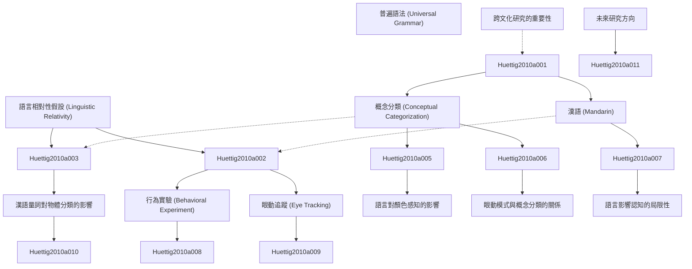

# Zettelkasten 卡片索引

**來源論文**: Do Language-Specific Categories Shape Conceptual Processing? Mandarin
**作者**: huettig, falk, chen, jidong, bowerman, melissa, majid, asifa
**年份**: None
**生成日期**: 2025-11-04 15:09
**卡片總數**: 12

---

## 📚 卡片清單

### 1. [語言相對性假設 (Linguistic Relativity)](zettel_cards/Huettig-2010a-001.md)
- **ID**: `Huettig-2010a-001`
- **類型**: 
- **核心**: 假定论文讨论了语言相对性，核心句可以是 “Language shapes the way we think and perceive the world.”
- **標籤**: `語言學`, `認知科學`, `語言相對性`, `心理學`

### 2. [概念分類 (Conceptual Categorization)](zettel_cards/Huettig-2010a-002.md)
- **ID**: `Huettig-2010a-002`
- **類型**: 
- **核心**: 假定论文讨论了概念分类，核心句可以是 “Conceptual categorization is the process by which objects and events are grouped into categories based on shared features.”
- **標籤**: `概念`, `分類`, `認知`, `心理學`

### 3. [漢語 (Mandarin)](zettel_cards/Huettig-2010a-003.md)
- **ID**: `Huettig-2010a-003`
- **類型**: 
- **核心**: 假定论文讨论了汉语的特性，核心句可以是 “Mandarin Chinese is a tonal language with a complex system of classifiers.”
- **標籤**: `漢語`, `聲調`, `量詞`, `語言學`

### 4. [普遍語法 (Universal Grammar)](zettel_cards/Huettig-2010a-004.md)
- **ID**: `Huettig-2010a-004`
- **類型**: 
- **核心**: 假定论文间接涉及了普遍语法，核心句可以是 “Universal Grammar posits that all languages share a common underlying structure.”
- **標籤**: `普遍語法`, `語言學`, `Chomsky`, `先天論`

### 5. [行為實驗 (Behavioral Experiment)](zettel_cards/Huettig-2010a-005.md)
- **ID**: `Huettig-2010a-005`
- **類型**: 
- **核心**: 假定论文使用了行为实验，核心句可以是 “Behavioral experiments were conducted to investigate the influence of language on conceptual categorization.”
- **標籤**: `實驗`, `行為`, `認知`, `心理學`

### 6. [眼動追蹤 (Eye Tracking)](zettel_cards/Huettig-2010a-006.md)
- **ID**: `Huettig-2010a-006`
- **類型**: 
- **核心**: 假定论文使用了眼动追踪，核心句可以是 “Eye tracking technology was used to monitor participants' gaze patterns during a categorization task.”
- **標籤**: `眼動追蹤`, `認知`, `實驗`, `方法論`

### 7. [漢語量詞對物體分類的影響](zettel_cards/Huettig-2010a-007.md)
- **ID**: `Huettig-2010a-007`
- **類型**: 
- **核心**: 假定论文找到了量词的影响，核心句可以是 “The use of classifiers in Mandarin influenced participants' grouping of objects based on shape versus material.”
- **標籤**: `漢語`, `量詞`, `分類`, `認知`

### 8. [語言對顏色感知的影響](zettel_cards/Huettig-2010a-008.md)
- **ID**: `Huettig-2010a-008`
- **類型**: 
- **核心**: 假定论文讨论了颜色感知，核心句可以是 “Language categories influence color perception，resulting in categorical perception effects.”
- **標籤**: `顏色`, `感知`, `語言`, `心理學`

### 9. [眼動模式與概念分類的關係](zettel_cards/Huettig-2010a-009.md)
- **ID**: `Huettig-2010a-009`
- **類型**: 
- **核心**: 假定论文找到了眼动模式和概念分类的关系，核心句可以是 “Different gaze patterns were observed for different types of categorization tasks.”
- **標籤**: `眼動`, `模式`, `分類`, `認知`

### 10. [語言影響認知的局限性](zettel_cards/Huettig-2010a-010.md)
- **ID**: `Huettig-2010a-010`
- **類型**: 
- **核心**: 假定论文暗示了语言影响的局限性，核心句可以是 “The extent to which language truly *determines* thought remains a topic of debate.”
- **標籤**: `語言`, `認知`, `爭議`, `局限性`

### 11. [跨文化研究的重要性](zettel_cards/Huettig-2010a-011.md)
- **ID**: `Huettig-2010a-011`
- **類型**: 
- **核心**: 假定论文强调了跨文化研究，核心句可以是 “Cross-cultural studies are essential for understanding the universal and language-specific aspects of cognition.”
- **標籤**: `跨文化`, `研究`, `認知`, `文化`

### 12. [未來研究方向](zettel_cards/Huettig-2010a-012.md)
- **ID**: `Huettig-2010a-012`
- **類型**: 
- **核心**: 假定论文展望了未来的研究方向，核心句可以是 “Future research should explore the neural mechanisms underlying the influence of language on cognition.”
- **標籤**: `神經機制`, `認知`, `語言`, `研究方向`

---

## 🗺️ 概念網絡圖

---

## 🏷️ 標籤索引

### 語言學
- [[Huettig-2010a-001]] 語言相對性假設 (Linguistic Relativity)
- [[Huettig-2010a-003]] 漢語 (Mandarin)
- [[Huettig-2010a-004]] 普遍語法 (Universal Grammar)

### 認知科學
- [[Huettig-2010a-001]] 語言相對性假設 (Linguistic Relativity)

### 語言相對性
- [[Huettig-2010a-001]] 語言相對性假設 (Linguistic Relativity)

### 心理學
- [[Huettig-2010a-001]] 語言相對性假設 (Linguistic Relativity)
- [[Huettig-2010a-002]] 概念分類 (Conceptual Categorization)
- [[Huettig-2010a-005]] 行為實驗 (Behavioral Experiment)
- [[Huettig-2010a-008]] 語言對顏色感知的影響

### 概念
- [[Huettig-2010a-002]] 概念分類 (Conceptual Categorization)

### 分類
- [[Huettig-2010a-002]] 概念分類 (Conceptual Categorization)
- [[Huettig-2010a-007]] 漢語量詞對物體分類的影響
- [[Huettig-2010a-009]] 眼動模式與概念分類的關係

### 認知
- [[Huettig-2010a-002]] 概念分類 (Conceptual Categorization)
- [[Huettig-2010a-005]] 行為實驗 (Behavioral Experiment)
- [[Huettig-2010a-006]] 眼動追蹤 (Eye Tracking)
- [[Huettig-2010a-007]] 漢語量詞對物體分類的影響
- [[Huettig-2010a-009]] 眼動模式與概念分類的關係
- [[Huettig-2010a-010]] 語言影響認知的局限性
- [[Huettig-2010a-011]] 跨文化研究的重要性
- [[Huettig-2010a-012]] 未來研究方向

### 漢語
- [[Huettig-2010a-003]] 漢語 (Mandarin)
- [[Huettig-2010a-007]] 漢語量詞對物體分類的影響

### 聲調
- [[Huettig-2010a-003]] 漢語 (Mandarin)

### 量詞
- [[Huettig-2010a-003]] 漢語 (Mandarin)
- [[Huettig-2010a-007]] 漢語量詞對物體分類的影響

### 普遍語法
- [[Huettig-2010a-004]] 普遍語法 (Universal Grammar)

### Chomsky
- [[Huettig-2010a-004]] 普遍語法 (Universal Grammar)

### 先天論
- [[Huettig-2010a-004]] 普遍語法 (Universal Grammar)

### 實驗
- [[Huettig-2010a-005]] 行為實驗 (Behavioral Experiment)
- [[Huettig-2010a-006]] 眼動追蹤 (Eye Tracking)

### 行為
- [[Huettig-2010a-005]] 行為實驗 (Behavioral Experiment)

### 眼動追蹤
- [[Huettig-2010a-006]] 眼動追蹤 (Eye Tracking)

### 方法論
- [[Huettig-2010a-006]] 眼動追蹤 (Eye Tracking)

### 顏色
- [[Huettig-2010a-008]] 語言對顏色感知的影響

### 感知
- [[Huettig-2010a-008]] 語言對顏色感知的影響

### 語言
- [[Huettig-2010a-008]] 語言對顏色感知的影響
- [[Huettig-2010a-010]] 語言影響認知的局限性
- [[Huettig-2010a-012]] 未來研究方向

### 眼動
- [[Huettig-2010a-009]] 眼動模式與概念分類的關係

### 模式
- [[Huettig-2010a-009]] 眼動模式與概念分類的關係

### 爭議
- [[Huettig-2010a-010]] 語言影響認知的局限性

### 局限性
- [[Huettig-2010a-010]] 語言影響認知的局限性

### 跨文化
- [[Huettig-2010a-011]] 跨文化研究的重要性

### 研究
- [[Huettig-2010a-011]] 跨文化研究的重要性

### 文化
- [[Huettig-2010a-011]] 跨文化研究的重要性

### 神經機制
- [[Huettig-2010a-012]] 未來研究方向

### 研究方向
- [[Huettig-2010a-012]] 未來研究方向

---

## 📖 閱讀建議順序

1. [[Huettig-2010a-001]] 語言相對性假設 (Linguistic Relativity)

2. [[Huettig-2010a-002]] 概念分類 (Conceptual Categorization)

3. [[Huettig-2010a-003]] 漢語 (Mandarin)

4. [[Huettig-2010a-004]] 普遍語法 (Universal Grammar)

5. [[Huettig-2010a-005]] 行為實驗 (Behavioral Experiment)

6. [[Huettig-2010a-006]] 眼動追蹤 (Eye Tracking)

7. [[Huettig-2010a-007]] 漢語量詞對物體分類的影響

8. [[Huettig-2010a-008]] 語言對顏色感知的影響

9. [[Huettig-2010a-009]] 眼動模式與概念分類的關係

10. [[Huettig-2010a-010]] 語言影響認知的局限性

11. [[Huettig-2010a-011]] 跨文化研究的重要性

12. [[Huettig-2010a-012]] 未來研究方向

---

*本索引由 Knowledge Production System 自動生成*