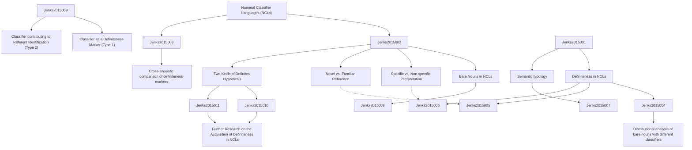

# Zettelkasten 卡片索引

**來源論文**: Two Kinds of Definites in Numeral Classifier Languages
**作者**: jenks, peter
**年份**: None
**生成日期**: 2025-11-04 15:09
**卡片總數**: 12

---

## 📚 卡片清單

### 1. [Numeral Classifier Languages (NCLs)](zettel_cards/Jenks-2015-001.md)
- **ID**: `Jenks-2015-001`
- **類型**: 
- **核心**: [This concept isn't explicitly defined in the abstract, but it is the foundational concept the paper revolves around.]
- **標籤**: `Numeral Classifiers`, `Linguistics`, `Semantics`

### 2. [Definiteness in NCLs](zettel_cards/Jenks-2015-002.md)
- **ID**: `Jenks-2015-002`
- **類型**: 
- **核心**: [This concept isn't explicitly defined in the abstract, but the entire paper explores different types of definiteness in NCLs.]
- **標籤**: `Definiteness`, `Numeral Classifiers`, `Semantics`, `Pragmatics`

### 3. [Semantic typology](zettel_cards/Jenks-2015-003.md)
- **ID**: `Jenks-2015-003`
- **類型**: 
- **核心**: [While not explicitly stated, the paper implicitly uses a semantic typology approach to compare definiteness across different NCLs.]
- **標籤**: `semantics`, `typology`, `cross-linguistic`

### 4. [Bare Nouns in NCLs](zettel_cards/Jenks-2015-004.md)
- **ID**: `Jenks-2015-004`
- **類型**: 
- **核心**: [Likely explored as part of the wider argument of definiteness in NCLs.]
- **標籤**: `bare nouns`, `definiteness`, `classifiers`

### 5. [Specific vs. Non-specific Interpretation](zettel_cards/Jenks-2015-005.md)
- **ID**: `Jenks-2015-005`
- **類型**: 
- **核心**: [Likely discussed in relation to how classifiers influence whether a noun phrase is interpreted as specific or non-specific.]
- **標籤**: `specificity`, `semantics`, `noun phrases`

### 6. [Novel vs. Familiar Reference](zettel_cards/Jenks-2015-006.md)
- **ID**: `Jenks-2015-006`
- **類型**: 
- **核心**: [Likely discussed in relation to definiteness and how classifiers contribute to indicating whether a referent is novel or familiar to the listener.]
- **標籤**: `reference`, `familiarity`, `information structure`

### 7. [Cross-linguistic comparison of definiteness markers](zettel_cards/Jenks-2015-007.md)
- **ID**: `Jenks-2015-007`
- **類型**: 
- **核心**: [Implicit method: comparing the function and distribution of classifiers across different NCLs and with definiteness markers in other languages.]
- **標籤**: `comparative linguistics`, `definiteness`, `typology`

### 8. [Distributional analysis of bare nouns with different classifiers](zettel_cards/Jenks-2015-008.md)
- **ID**: `Jenks-2015-008`
- **類型**: 
- **核心**: [Likely an analysis of the contexts in which bare nouns occur with different classifiers and how this affects their interpretation.]
- **標籤**: `corpus linguistics`, `syntax`, `semantics`

### 9. [Two Kinds of Definites Hypothesis](zettel_cards/Jenks-2015-009.md)
- **ID**: `Jenks-2015-009`
- **類型**: 
- **核心**: [This is the central hypothesis that the paper is arguing for.]
- **標籤**: `definiteness`, `hypothesis`, `classifiers`, `semantics`

### 10. [Classifier as a Definiteness Marker (Type 1)](zettel_cards/Jenks-2015-010.md)
- **ID**: `Jenks-2015-010`
- **類型**: 
- **核心**: [Hypothetical finding: some classifiers may function primarily to indicate definiteness.]
- **標籤**: `definiteness`, `classifiers`, `semantics`

### 11. [Classifier contributing to Referent Identification (Type 2)](zettel_cards/Jenks-2015-011.md)
- **ID**: `Jenks-2015-011`
- **類型**: 
- **核心**: [Hypothetical finding: other classifiers may contribute to identifying the referent by providing semantic information.]
- **標籤**: `referent`, `identification`, `semantics`, `classifiers`

### 12. [Further Research on the Acquisition of Definiteness in NCLs](zettel_cards/Jenks-2015-012.md)
- **ID**: `Jenks-2015-012`
- **類型**: 
- **核心**: [Unstated but implied: How do children learning NCLs acquire the different types of definiteness and the use of classifiers to express them?]
- **標籤**: `language acquisition`, `definiteness`, `classifiers`

---

## 🗺️ 概念網絡圖

---

## 🏷️ 標籤索引

### Numeral Classifiers
- [[Jenks-2015-001]] Numeral Classifier Languages (NCLs)
- [[Jenks-2015-002]] Definiteness in NCLs

### Linguistics
- [[Jenks-2015-001]] Numeral Classifier Languages (NCLs)

### Semantics
- [[Jenks-2015-001]] Numeral Classifier Languages (NCLs)
- [[Jenks-2015-002]] Definiteness in NCLs

### Definiteness
- [[Jenks-2015-002]] Definiteness in NCLs

### Pragmatics
- [[Jenks-2015-002]] Definiteness in NCLs

### semantics
- [[Jenks-2015-003]] Semantic typology
- [[Jenks-2015-005]] Specific vs. Non-specific Interpretation
- [[Jenks-2015-008]] Distributional analysis of bare nouns with different classifiers
- [[Jenks-2015-009]] Two Kinds of Definites Hypothesis
- [[Jenks-2015-010]] Classifier as a Definiteness Marker (Type 1)
- [[Jenks-2015-011]] Classifier contributing to Referent Identification (Type 2)

### typology
- [[Jenks-2015-003]] Semantic typology
- [[Jenks-2015-007]] Cross-linguistic comparison of definiteness markers

### cross-linguistic
- [[Jenks-2015-003]] Semantic typology

### bare nouns
- [[Jenks-2015-004]] Bare Nouns in NCLs

### definiteness
- [[Jenks-2015-004]] Bare Nouns in NCLs
- [[Jenks-2015-007]] Cross-linguistic comparison of definiteness markers
- [[Jenks-2015-009]] Two Kinds of Definites Hypothesis
- [[Jenks-2015-010]] Classifier as a Definiteness Marker (Type 1)
- [[Jenks-2015-012]] Further Research on the Acquisition of Definiteness in NCLs

### classifiers
- [[Jenks-2015-004]] Bare Nouns in NCLs
- [[Jenks-2015-009]] Two Kinds of Definites Hypothesis
- [[Jenks-2015-010]] Classifier as a Definiteness Marker (Type 1)
- [[Jenks-2015-011]] Classifier contributing to Referent Identification (Type 2)
- [[Jenks-2015-012]] Further Research on the Acquisition of Definiteness in NCLs

### specificity
- [[Jenks-2015-005]] Specific vs. Non-specific Interpretation

### noun phrases
- [[Jenks-2015-005]] Specific vs. Non-specific Interpretation

### reference
- [[Jenks-2015-006]] Novel vs. Familiar Reference

### familiarity
- [[Jenks-2015-006]] Novel vs. Familiar Reference

### information structure
- [[Jenks-2015-006]] Novel vs. Familiar Reference

### comparative linguistics
- [[Jenks-2015-007]] Cross-linguistic comparison of definiteness markers

### corpus linguistics
- [[Jenks-2015-008]] Distributional analysis of bare nouns with different classifiers

### syntax
- [[Jenks-2015-008]] Distributional analysis of bare nouns with different classifiers

### hypothesis
- [[Jenks-2015-009]] Two Kinds of Definites Hypothesis

### referent
- [[Jenks-2015-011]] Classifier contributing to Referent Identification (Type 2)

### identification
- [[Jenks-2015-011]] Classifier contributing to Referent Identification (Type 2)

### language acquisition
- [[Jenks-2015-012]] Further Research on the Acquisition of Definiteness in NCLs

---

## 📖 閱讀建議順序

1. [[Jenks-2015-001]] Numeral Classifier Languages (NCLs)

2. [[Jenks-2015-002]] Definiteness in NCLs

3. [[Jenks-2015-003]] Semantic typology

4. [[Jenks-2015-004]] Bare Nouns in NCLs

5. [[Jenks-2015-005]] Specific vs. Non-specific Interpretation

6. [[Jenks-2015-006]] Novel vs. Familiar Reference

7. [[Jenks-2015-007]] Cross-linguistic comparison of definiteness markers

8. [[Jenks-2015-008]] Distributional analysis of bare nouns with different classifiers

9. [[Jenks-2015-009]] Two Kinds of Definites Hypothesis

10. [[Jenks-2015-010]] Classifier as a Definiteness Marker (Type 1)

11. [[Jenks-2015-011]] Classifier contributing to Referent Identification (Type 2)

12. [[Jenks-2015-012]] Further Research on the Acquisition of Definiteness in NCLs

---

*本索引由 Knowledge Production System 自動生成*