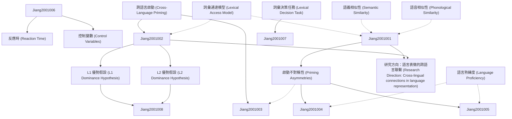

# Zettelkasten 卡片索引

---

## 📚 卡片清單

### 1. [跨語言啟動 (Cross-Language Priming)](zettel_cards/Jiang-2001-001.md)
- **ID**: `Jiang-2001-001`
- **類型**: 
- **核心**: "Cross-language priming refers to the phenomenon where processing a word in one language influences the subsequent processing of a related word in another language."
- **標籤**: `跨語言啟動`, `雙語`, `語言處理`

### 2. [啟動不對稱性 (Priming Asymmetries)](zettel_cards/Jiang-2001-002.md)
- **ID**: `Jiang-2001-002`
- **類型**: 
- **核心**: "Priming asymmetries occur when the priming effect is stronger in one direction (L1 to L2 or L2 to L1) than in the other."
- **標籤**: `啟動不對稱性`, `跨語言啟動`, `L1`, `L2`

### 3. [詞彙通達模型 (Lexical Access Model)](zettel_cards/Jiang-2001-003.md)
- **ID**: `Jiang-2001-003`
- **類型**: 
- **核心**: "Lexical access models propose how words are retrieved from memory during language processing."
- **標籤**: `詞彙通達`, `語言模型`, `心理語言學`

### 4. [L1 優勢假設 (L1 Dominance Hypothesis)](zettel_cards/Jiang-2001-004.md)
- **ID**: `Jiang-2001-004`
- **類型**: 
- **核心**: "The L1 dominance hypothesis suggests that the first language (L1) has a stronger influence on lexical processing than the second language (L2)."
- **標籤**: `L1 優勢`, `雙語`, `語言處理`

### 5. [L2 優勢假設 (L2 Dominance Hypothesis)](zettel_cards/Jiang-2001-005.md)
- **ID**: `Jiang-2001-005`
- **類型**: 
- **核心**: "The L2 dominance hypothesis suggests that the second language (L2) can become dominant in some bilinguals, influencing lexical processing more strongly than the first language (L1)."
- **標籤**: `L2 優勢`, `雙語`, `語言處理`

### 6. [詞彙決策任務 (Lexical Decision Task)](zettel_cards/Jiang-2001-006.md)
- **ID**: `Jiang-2001-006`
- **類型**: 
- **核心**: "In a lexical decision task, participants are presented with a string of letters and asked to decide whether it is a real word or a non-word."
- **標籤**: `詞彙決策`, `實驗方法`, `心理語言學`

### 7. [反應時 (Reaction Time)](zettel_cards/Jiang-2001-007.md)
- **ID**: `Jiang-2001-007`
- **類型**: 
- **核心**: "Reaction time (RT) is the time elapsed between the presentation of a stimulus and the initiation of a response."
- **標籤**: `反應時`, `行為數據`, `實驗測量`

### 8. [語言熟練度 (Language Proficiency)](zettel_cards/Jiang-2001-008.md)
- **ID**: `Jiang-2001-008`
- **類型**: 
- **核心**: "Language proficiency refers to the level of skill in using a language, including vocabulary, grammar, pronunciation, and fluency."
- **標籤**: `語言熟練度`, `雙語`, `語言能力`

### 9. [語義相似性 (Semantic Similarity)](zettel_cards/Jiang-2001-009.md)
- **ID**: `Jiang-2001-009`
- **類型**: 
- **核心**: "Semantic similarity refers to the degree to which two words or concepts are related in meaning."
- **標籤**: `語義相似性`, `詞彙關係`, `心理語言學`

### 10. [語音相似性 (Phonological Similarity)](zettel_cards/Jiang-2001-010.md)
- **ID**: `Jiang-2001-010`
- **類型**: 
- **核心**: "Phonological similarity refers to the degree to which two words sound alike."
- **標籤**: `語音相似性`, `詞彙關係`, `心理語言學`

### 11. [控制變數 (Control Variables)](zettel_cards/Jiang-2001-011.md)
- **ID**: `Jiang-2001-011`
- **類型**: 
- **核心**: "Control variables are factors that are kept constant during an experiment to prevent them from influencing the results."
- **標籤**: `控制變數`, `實驗設計`, `科學方法`

### 12. [研究方向：語言表徵的跨語言聯繫 (Research Direction: Cross-lingual connections in language representation)](zettel_cards/Jiang-2001-012.md)
- **ID**: `Jiang-2001-012`
- **類型**: 
- **核心**: "How are different languages represented in the minds of bilinguals, and how do these representations interact with each other?"
- **標籤**: `語言表徵`, `雙語`, `跨語言啟動`, `研究方向`

---

## 🗺️ 概念網絡圖

---

## 🏷️ 標籤索引

### 跨語言啟動
- [[Jiang-2001-001]] 跨語言啟動 (Cross-Language Priming)
- [[Jiang-2001-002]] 啟動不對稱性 (Priming Asymmetries)
- [[Jiang-2001-012]] 研究方向：語言表徵的跨語言聯繫 (Research Direction: Cross-lingual connections in language representation)

### 雙語
- [[Jiang-2001-001]] 跨語言啟動 (Cross-Language Priming)
- [[Jiang-2001-004]] L1 優勢假設 (L1 Dominance Hypothesis)
- [[Jiang-2001-005]] L2 優勢假設 (L2 Dominance Hypothesis)
- [[Jiang-2001-008]] 語言熟練度 (Language Proficiency)
- [[Jiang-2001-012]] 研究方向：語言表徵的跨語言聯繫 (Research Direction: Cross-lingual connections in language representation)

### 語言處理
- [[Jiang-2001-001]] 跨語言啟動 (Cross-Language Priming)
- [[Jiang-2001-004]] L1 優勢假設 (L1 Dominance Hypothesis)
- [[Jiang-2001-005]] L2 優勢假設 (L2 Dominance Hypothesis)

### 啟動不對稱性
- [[Jiang-2001-002]] 啟動不對稱性 (Priming Asymmetries)

### L1
- [[Jiang-2001-002]] 啟動不對稱性 (Priming Asymmetries)

### L2
- [[Jiang-2001-002]] 啟動不對稱性 (Priming Asymmetries)

### 詞彙通達
- [[Jiang-2001-003]] 詞彙通達模型 (Lexical Access Model)

### 語言模型
- [[Jiang-2001-003]] 詞彙通達模型 (Lexical Access Model)

### 心理語言學
- [[Jiang-2001-003]] 詞彙通達模型 (Lexical Access Model)
- [[Jiang-2001-006]] 詞彙決策任務 (Lexical Decision Task)
- [[Jiang-2001-009]] 語義相似性 (Semantic Similarity)
- [[Jiang-2001-010]] 語音相似性 (Phonological Similarity)

### L1 優勢
- [[Jiang-2001-004]] L1 優勢假設 (L1 Dominance Hypothesis)

### L2 優勢
- [[Jiang-2001-005]] L2 優勢假設 (L2 Dominance Hypothesis)

### 詞彙決策
- [[Jiang-2001-006]] 詞彙決策任務 (Lexical Decision Task)

### 實驗方法
- [[Jiang-2001-006]] 詞彙決策任務 (Lexical Decision Task)

### 反應時
- [[Jiang-2001-007]] 反應時 (Reaction Time)

### 行為數據
- [[Jiang-2001-007]] 反應時 (Reaction Time)

### 實驗測量
- [[Jiang-2001-007]] 反應時 (Reaction Time)

### 語言熟練度
- [[Jiang-2001-008]] 語言熟練度 (Language Proficiency)

### 語言能力
- [[Jiang-2001-008]] 語言熟練度 (Language Proficiency)

### 語義相似性
- [[Jiang-2001-009]] 語義相似性 (Semantic Similarity)

### 詞彙關係
- [[Jiang-2001-009]] 語義相似性 (Semantic Similarity)
- [[Jiang-2001-010]] 語音相似性 (Phonological Similarity)

### 語音相似性
- [[Jiang-2001-010]] 語音相似性 (Phonological Similarity)

### 控制變數
- [[Jiang-2001-011]] 控制變數 (Control Variables)

### 實驗設計
- [[Jiang-2001-011]] 控制變數 (Control Variables)

### 科學方法
- [[Jiang-2001-011]] 控制變數 (Control Variables)

### 語言表徵
- [[Jiang-2001-012]] 研究方向：語言表徵的跨語言聯繫 (Research Direction: Cross-lingual connections in language representation)

### 研究方向
- [[Jiang-2001-012]] 研究方向：語言表徵的跨語言聯繫 (Research Direction: Cross-lingual connections in language representation)

---

## 📖 閱讀建議順序

1. [[Jiang-2001-001]] 跨語言啟動 (Cross-Language Priming)

2. [[Jiang-2001-002]] 啟動不對稱性 (Priming Asymmetries)

3. [[Jiang-2001-003]] 詞彙通達模型 (Lexical Access Model)

4. [[Jiang-2001-004]] L1 優勢假設 (L1 Dominance Hypothesis)

5. [[Jiang-2001-005]] L2 優勢假設 (L2 Dominance Hypothesis)

6. [[Jiang-2001-006]] 詞彙決策任務 (Lexical Decision Task)

7. [[Jiang-2001-007]] 反應時 (Reaction Time)

8. [[Jiang-2001-008]] 語言熟練度 (Language Proficiency)

9. [[Jiang-2001-009]] 語義相似性 (Semantic Similarity)

10. [[Jiang-2001-010]] 語音相似性 (Phonological Similarity)

11. [[Jiang-2001-011]] 控制變數 (Control Variables)

12. [[Jiang-2001-012]] 研究方向：語言表徵的跨語言聯繫 (Research Direction: Cross-lingual connections in language representation)

---

*本索引由 Knowledge Production System 自動生成*