# Zettelkasten 卡片索引

## 📚 卡片清單

### 1. [Embodied Simulation Hypothesis](zettel_cards/Jones-2024-001.md)
- **ID**: `Jones-2024-001`
- **核心**: "Embodied simulation theory posits that understanding others' actions, intentions, and emotions relies on internally simulating those experiences using one's own sensorimotor system."

### 2. [Multimodal Language Models (MLLMs)](zettel_cards/Jones-2024-002.md)
- **ID**: `Jones-2024-002`
- **核心**: "Multimodal Language Models are deep learning models that process and integrate information from multiple modalities, such as text, images, and audio, to perform various natural language and vision tasks."

### 3. [Sensorimotor Contingencies](zettel_cards/Jones-2024-003.md)
- **ID**: `Jones-2024-003`
- **核心**: "Sensorimotor contingencies refer to the structured and predictable relationships between an agent's actions and the sensory feedback they receive."

### 4. [Cross-Modal Reasoning](zettel_cards/Jones-2024-004.md)
- **ID**: `Jones-2024-004`
- **核心**: "Cross-modal reasoning involves the ability to integrate information from different modalities to draw inferences and solve problems that require understanding relationships between these modalities."

### 5. [Mirror Neuron System](zettel_cards/Jones-2024-005.md)
- **ID**: `Jones-2024-005`
- **核心**: "The mirror neuron system is a set of brain areas that activate both when an individual performs an action and when they observe another individual performing the same action."

### 6. [Generative Modeling](zettel_cards/Jones-2024-006.md)
- **ID**: `Jones-2024-006`
- **核心**: "Generative modeling involves training a model to generate new data that is similar to the data it was trained on."

### 7. [Interactive Environments](zettel_cards/Jones-2024-007.md)
- **ID**: `Jones-2024-007`
- **核心**: "Interactive environments provide a virtual setting where MLLMs can interact with objects and receive sensory feedback in response to their actions."

### 8. [Action Prediction](zettel_cards/Jones-2024-008.md)
- **ID**: `Jones-2024-008`
- **核心**: "The MLLM was able to accurately predict the next action of an agent in a video based on its previous actions and the surrounding context."

### 9. [Tool Use Understanding](zettel_cards/Jones-2024-009.md)
- **ID**: `Jones-2024-009`
- **核心**: "The MLLM demonstrated the ability to infer the appropriate tool for a given task based on visual and textual descriptions of the task and the available tools."

### 10. [Generalization to Novel Situations](zettel_cards/Jones-2024-010.md)
- **ID**: `Jones-2024-010`
- **核心**: "The MLLM was able to generalize its understanding of embodied simulation to novel situations and tasks that it had not encountered during training."

### 11. [Counterfactual Reasoning](zettel_cards/Jones-2024-011.md)
- **ID**: `Jones-2024-011`
- **核心**: "The MLLM could reason about what would have happened if an agent had taken a different action, indicating an understanding of cause and effect."

### 12. [Limitations of Current MLLMs](zettel_cards/Jones-2024-012.md)
- **ID**: `Jones-2024-012`
- **核心**: "Despite promising results, current MLLMs still lack the richness and complexity of human embodied experience."

### 13. [The Role of Prior Knowledge](zettel_cards/Jones-2024-013.md)
- **ID**: `Jones-2024-013`
- **核心**: "To what extent does the performance of MLLMs on embodied simulation tasks depend on the prior knowledge they have been trained on?"

### 14. [Ethical Implications](zettel_cards/Jones-2024-014.md)
- **ID**: `Jones-2024-014`
- **核心**: "What are the ethical implications of developing AI systems that can simulate human emotions and experiences?"

### 15. [Measuring Embodied Simulation](zettel_cards/Jones-2024-015.md)
- **ID**: `Jones-2024-015`
- **核心**: "How can we develop more reliable and valid measures of embodied simulation in AI systems?"

### 16. [The Role of Morphology](zettel_cards/Jones-2024-016.md)
- **ID**: `Jones-2024-016`
- **核心**: "How does the morphology of an AI system (e.g., its physical embodiment) affect its ability to perform embodied simulation?"

### 17. [Bias in Training Data](zettel_cards/Jones-2024-017.md)
- **ID**: `Jones-2024-017`
- **核心**: "Bias in the training data can lead to MLLMs developing skewed or inaccurate representations of embodied experiences."

### 18. [AI Deception](zettel_cards/Jones-2024-018.md)
- **ID**: `Jones-2024-018`
- **核心**: "The ability of AI systems to simulate human emotions and intentions raises concerns about the potential for deception and manipulation."

### 19. [Scalability of Embodied Simulation](zettel_cards/Jones-2024-019.md)
- **ID**: `Jones-2024-019`
- **核心**: "Can the embodied simulation capabilities observed in small-scale experiments be scaled up to more complex and realistic scenarios?"

### 20. [The Future of Embodied AI](zettel_cards/Jones-2024-020.md)
- **ID**: `Jones-2024-020`
- **核心**: "Embodied AI holds the potential to revolutionize many fields, including robotics, human-computer interaction, and education."

---

## 🗺️ 概念網絡圖

```mermaid
graph TD

    Jones-2024-001["Embodied Simulation Hypothesis"]

    Jones-2024-002["Multimodal Language Models (MLLMs)"]

    Jones-2024-003["Sensorimotor Contingencies"]

    Jones-2024-004["Cross-Modal Reasoning"]

    Jones-2024-005["Mirror Neuron System"]

    Jones-2024-006["Generative Modeling"]

    Jones-2024-007["Interactive Environments"]

    Jones-2024-008["Action Prediction"]

    Jones-2024-009["Tool Use Understanding"]

    Jones-2024-010["Generalization to Novel Situations"]

    Jones-2024-011["Counterfactual Reasoning"]

    Jones-2024-012["Limitations of Current MLLMs"]

    Jones-2024-013["The Role of Prior Knowledge"]

    Jones-2024-014["Ethical Implications"]

    Jones-2024-015["Measuring Embodied Simulation"]

    Jones-2024-016["The Role of Morphology"]

    Jones-2024-017["Bias in Training Data"]

    Jones-2024-018["AI Deception"]

    Jones-2024-019["Scalability of Embodied Simulation"]

    Jones-2024-020["The Future of Embodied AI"]






    Jones-2024-001 --> Jones-2024-002

    Jones-2024-001 --> Jones-2024-003




    Jones-2024-001 -.-> Jones-2024-005





    Jones-2024-001 --> Jones-2024-002




    Jones-2024-002 --> Jones-2024-004

    Jones-2024-002 --> Jones-2024-006




    Jones-2024-002 -.-> Jones-2024-010





    Jones-2024-001 --> Jones-2024-003




    Jones-2024-003 --> Jones-2024-007




    Jones-2024-003 -.-> Jones-2024-008





    Jones-2024-002 --> Jones-2024-004




    Jones-2024-004 --> Jones-2024-009




    Jones-2024-004 -.-> Jones-2024-010







    Jones-2024-005 -.-> Jones-2024-001

    Jones-2024-005 -.-> Jones-2024-008





    Jones-2024-002 --> Jones-2024-006




    Jones-2024-006 --> Jones-2024-011






    Jones-2024-003 --> Jones-2024-007







    Jones-2024-003 --> Jones-2024-008





    Jones-2024-008 -.-> Jones-2024-005





    Jones-2024-004 --> Jones-2024-009









    Jones-2024-010 -.-> Jones-2024-002

    Jones-2024-010 -.-> Jones-2024-004





    Jones-2024-006 --> Jones-2024-011













    Jones-2024-013 -.-> Jones-2024-017






    Jones-2024-014 --> Jones-2024-018








    Jones-2024-015 -.-> Jones-2024-008







    Jones-2024-016 -.-> Jones-2024-012







    Jones-2024-017 -.-> Jones-2024-013





    Jones-2024-014 --> Jones-2024-018













```

---

## 🏷️ 標籤索引

### Embodied Cognition
- [[Jones-2024-001]] Embodied Simulation Hypothesis

### Simulation Theory
- [[Jones-2024-001]] Embodied Simulation Hypothesis

### Multimodal Learning
- [[Jones-2024-001]] Embodied Simulation Hypothesis
- [[Jones-2024-002]] Multimodal Language Models (MLLMs)
- [[Jones-2024-004]] Cross-Modal Reasoning
- [[Jones-2024-008]] Action Prediction

### Deep Learning
- [[Jones-2024-002]] Multimodal Language Models (MLLMs)
- [[Jones-2024-006]] Generative Modeling

### Natural Language Processing
- [[Jones-2024-002]] Multimodal Language Models (MLLMs)

### Sensorimotor
- [[Jones-2024-003]] Sensorimotor Contingencies

### Embodiment
- [[Jones-2024-003]] Sensorimotor Contingencies
- [[Jones-2024-005]] Mirror Neuron System
- [[Jones-2024-016]] The Role of Morphology

### Action-Perception
- [[Jones-2024-003]] Sensorimotor Contingencies

### Reasoning
- [[Jones-2024-004]] Cross-Modal Reasoning
- [[Jones-2024-009]] Tool Use Understanding
- [[Jones-2024-011]] Counterfactual Reasoning

### Inference
- [[Jones-2024-004]] Cross-Modal Reasoning

### Neuroscience
- [[Jones-2024-005]] Mirror Neuron System

### Mirror Neurons
- [[Jones-2024-005]] Mirror Neuron System

### Generative Models
- [[Jones-2024-006]] Generative Modeling

### Data Generation
- [[Jones-2024-006]] Generative Modeling

### Reinforcement Learning
- [[Jones-2024-007]] Interactive Environments

### Simulation
- [[Jones-2024-007]] Interactive Environments

### Virtual Reality
- [[Jones-2024-007]] Interactive Environments

### Action Prediction
- [[Jones-2024-008]] Action Prediction

### Embodied AI
- [[Jones-2024-008]] Action Prediction
- [[Jones-2024-009]] Tool Use Understanding
- [[Jones-2024-010]] Generalization to Novel Situations
- [[Jones-2024-011]] Counterfactual Reasoning
- [[Jones-2024-012]] Limitations of Current MLLMs

### Tool Use
- [[Jones-2024-009]] Tool Use Understanding

### Generalization
- [[Jones-2024-010]] Generalization to Novel Situations

### Transfer Learning
- [[Jones-2024-010]] Generalization to Novel Situations

### Counterfactuals
- [[Jones-2024-011]] Counterfactual Reasoning

### Limitations
- [[Jones-2024-012]] Limitations of Current MLLMs

### Future Research
- [[Jones-2024-012]] Limitations of Current MLLMs

### Prior Knowledge
- [[Jones-2024-013]] The Role of Prior Knowledge

### Training Data
- [[Jones-2024-013]] The Role of Prior Knowledge
- [[Jones-2024-017]] Bias in Training Data

### Bias
- [[Jones-2024-013]] The Role of Prior Knowledge
- [[Jones-2024-017]] Bias in Training Data

### Ethics
- [[Jones-2024-014]] Ethical Implications
- [[Jones-2024-018]] AI Deception

### AI Safety
- [[Jones-2024-014]] Ethical Implications
- [[Jones-2024-018]] AI Deception

### Moral Responsibility
- [[Jones-2024-014]] Ethical Implications

### Evaluation
- [[Jones-2024-015]] Measuring Embodied Simulation

### Metrics
- [[Jones-2024-015]] Measuring Embodied Simulation

### Validation
- [[Jones-2024-015]] Measuring Embodied Simulation

### Morphology
- [[Jones-2024-016]] The Role of Morphology

### Robotics
- [[Jones-2024-016]] The Role of Morphology

### Fairness
- [[Jones-2024-017]] Bias in Training Data

### Deception
- [[Jones-2024-018]] AI Deception

### Scalability
- [[Jones-2024-019]] Scalability of Embodied Simulation

### Complexity
- [[Jones-2024-019]] Scalability of Embodied Simulation

### Realism
- [[Jones-2024-019]] Scalability of Embodied Simulation

### Future
- [[Jones-2024-020]] The Future of Embodied AI

### Applications
- [[Jones-2024-020]] The Future of Embodied AI

### Impact
- [[Jones-2024-020]] The Future of Embodied AI

---

## 📖 閱讀建議順序

1. [[Jones-2024-005]] Mirror Neuron System

2. [[Jones-2024-007]] Interactive Environments

3. [[Jones-2024-008]] Action Prediction

4. [[Jones-2024-009]] Tool Use Understanding

5. [[Jones-2024-010]] Generalization to Novel Situations

6. [[Jones-2024-011]] Counterfactual Reasoning

7. [[Jones-2024-012]] Limitations of Current MLLMs

8. [[Jones-2024-013]] The Role of Prior Knowledge

9. [[Jones-2024-015]] Measuring Embodied Simulation

10. [[Jones-2024-016]] The Role of Morphology

11. [[Jones-2024-017]] Bias in Training Data

12. [[Jones-2024-018]] AI Deception

13. [[Jones-2024-019]] Scalability of Embodied Simulation

14. [[Jones-2024-020]] The Future of Embodied AI

15. [[Jones-2024-004]] Cross-Modal Reasoning

16. [[Jones-2024-006]] Generative Modeling

17. [[Jones-2024-014]] Ethical Implications

18. [[Jones-2024-001]] Embodied Simulation Hypothesis

19. [[Jones-2024-002]] Multimodal Language Models (MLLMs)

20. [[Jones-2024-003]] Sensorimotor Contingencies

---

*本索引由 Knowledge Production System 自動生成*