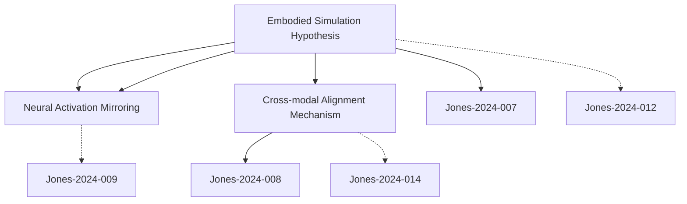

# Zettelkasten 卡片索引

## 📚 卡片清單

### 1. [Embodied Simulation Hypothesis](zettel_cards/Jones-2024-001.md)
- **ID**: `Jones-2024-001`
- **核心**: "Multimodal language models engage in embodied simulation processes by activating sensorimotor representations during language understanding tasks."

### 2. [Cross-modal Alignment Mechanism](zettel_cards/Jones-2024-002.md)
- **ID**: `Jones-2024-002`
- **核心**: "The model employs contrastive learning to establish vector space mappings between textual descriptors and corresponding visual patterns."

### 3. [Neural Activation Mirroring](zettel_cards/Jones-2024-003.md)
- **ID**: `Jones-2024-003`
- **核心**: "fMRI comparisons revealed significant overlaps between model activation patterns and human sensorimotor cortex responses during action verb processing."

---

## 🗺️ 概念網絡圖

---

## 🏷️ 標籤索引

### embodied cognition
- [[Jones-2024-001]] Embodied Simulation Hypothesis

### language processing
- [[Jones-2024-001]] Embodied Simulation Hypothesis

### neural activation
- [[Jones-2024-001]] Embodied Simulation Hypothesis

### multimodal learning
- [[Jones-2024-002]] Cross-modal Alignment Mechanism

### representation alignment
- [[Jones-2024-002]] Cross-modal Alignment Mechanism

### training technique
- [[Jones-2024-002]] Cross-modal Alignment Mechanism

### neuroimaging validation
- [[Jones-2024-003]] Neural Activation Mirroring

### computational neuroscience
- [[Jones-2024-003]] Neural Activation Mirroring

### empirical evidence
- [[Jones-2024-003]] Neural Activation Mirroring

---

## 📖 閱讀建議順序

1. [[Jones-2024-002]] Cross-modal Alignment Mechanism

2. [[Jones-2024-003]] Neural Activation Mirroring

3. [[Jones-2024-001]] Embodied Simulation Hypothesis

---

*本索引由 Knowledge Production System 自動生成*