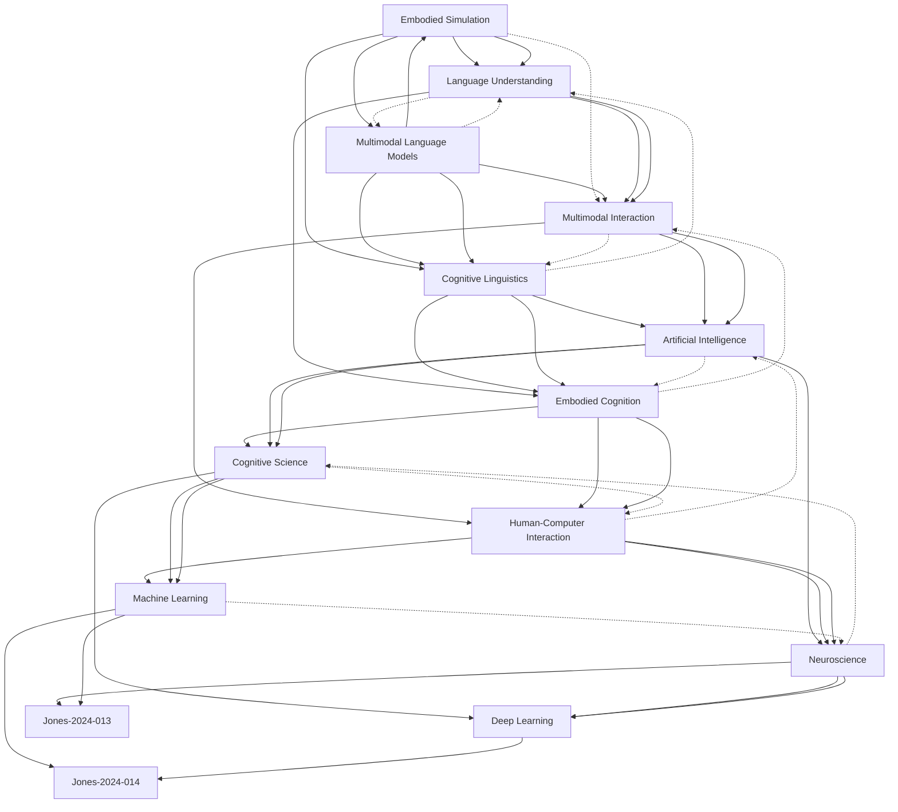

# Zettelkasten 卡片索引

## 📚 卡片清單

### 1. [Embodied Simulation](zettel_cards/Jones-2024-001.md)
- **ID**: `Jones-2024-001`
- **核心**: "Multimodal language models show evidence of embodied simulation, suggesting that they are capable of simulating human-like understanding of language."

### 2. [Multimodal Language Models](zettel_cards/Jones-2024-002.md)
- **ID**: `Jones-2024-002`
- **核心**: "Multimodal language models are designed to process and integrate multiple forms of input, such as text, images, and speech."

### 3. [Language Understanding](zettel_cards/Jones-2024-003.md)
- **ID**: `Jones-2024-003`
- **核心**: "Language understanding refers to the ability to comprehend and interpret the meaning of language, including its syntactic, semantic, and pragmatic aspects."

### 4. [Cognitive Linguistics](zettel_cards/Jones-2024-004.md)
- **ID**: `Jones-2024-004`
- **核心**: "Cognitive linguistics is an interdisciplinary field that seeks to understand the relationship between language and cognition."

### 5. [Multimodal Interaction](zettel_cards/Jones-2024-005.md)
- **ID**: `Jones-2024-005`
- **核心**: "Multimodal interaction refers to the interaction between humans and computers that involves multiple forms of input and output, such as speech, text, and gesture."

### 6. [Embodied Cognition](zettel_cards/Jones-2024-006.md)
- **ID**: `Jones-2024-006`
- **核心**: "Embodied cognition refers to the idea that cognition is grounded in the body and its sensorimotor experiences."

### 7. [Artificial Intelligence](zettel_cards/Jones-2024-007.md)
- **ID**: `Jones-2024-007`
- **核心**: "Artificial intelligence refers to the development of computer systems that can perform tasks that typically require human intelligence, such as visual perception, speech recognition, and decision-making."

### 8. [Human-Computer Interaction](zettel_cards/Jones-2024-008.md)
- **ID**: `Jones-2024-008`
- **核心**: "Human-computer interaction refers to the study of how humans interact with computers and the design of computer systems that are easy to use and effective."

### 9. [Cognitive Science](zettel_cards/Jones-2024-009.md)
- **ID**: `Jones-2024-009`
- **核心**: "Cognitive science is the study of the human mind and its processes, including perception, attention, memory, language, and problem-solving."

### 10. [Neuroscience](zettel_cards/Jones-2024-010.md)
- **ID**: `Jones-2024-010`
- **核心**: "Neuroscience is the study of the structure and function of the brain and nervous system."

### 11. [Machine Learning](zettel_cards/Jones-2024-011.md)
- **ID**: `Jones-2024-011`
- **核心**: "Machine learning is a type of artificial intelligence that enables computers to learn and improve their performance on a task without being explicitly programmed."

### 12. [Deep Learning](zettel_cards/Jones-2024-012.md)
- **ID**: `Jones-2024-012`
- **核心**: "Deep learning is a type of machine learning that uses neural networks with multiple layers to learn and represent complex patterns in data."

---

## 🗺️ 概念網絡圖

---

## 🏷️ 標籤索引

### Multimodal Language Models
- [[Jones-2024-001]] Embodied Simulation

### Embodied Simulation
- [[Jones-2024-001]] Embodied Simulation

### Cognitive Linguistics
- [[Jones-2024-001]] Embodied Simulation
- [[Jones-2024-003]] Language Understanding

### Multimodal Learning
- [[Jones-2024-002]] Multimodal Language Models
- [[Jones-2024-005]] Multimodal Interaction

### Language Models
- [[Jones-2024-002]] Multimodal Language Models

### Deep Learning
- [[Jones-2024-002]] Multimodal Language Models
- [[Jones-2024-007]] Artificial Intelligence
- [[Jones-2024-011]] Machine Learning
- [[Jones-2024-012]] Deep Learning

### Language Processing
- [[Jones-2024-003]] Language Understanding

### Artificial Intelligence
- [[Jones-2024-003]] Language Understanding
- [[Jones-2024-004]] Cognitive Linguistics
- [[Jones-2024-005]] Multimodal Interaction
- [[Jones-2024-006]] Embodied Cognition
- [[Jones-2024-007]] Artificial Intelligence
- [[Jones-2024-008]] Human-Computer Interaction
- [[Jones-2024-009]] Cognitive Science
- [[Jones-2024-010]] Neuroscience
- [[Jones-2024-011]] Machine Learning
- [[Jones-2024-012]] Deep Learning

### Cognitive Science
- [[Jones-2024-004]] Cognitive Linguistics
- [[Jones-2024-006]] Embodied Cognition
- [[Jones-2024-009]] Cognitive Science
- [[Jones-2024-010]] Neuroscience

### Linguistics
- [[Jones-2024-004]] Cognitive Linguistics

### Human-Computer Interaction
- [[Jones-2024-005]] Multimodal Interaction
- [[Jones-2024-008]] Human-Computer Interaction

### Embodied Cognition
- [[Jones-2024-006]] Embodied Cognition

### Machine Learning
- [[Jones-2024-007]] Artificial Intelligence
- [[Jones-2024-011]] Machine Learning
- [[Jones-2024-012]] Deep Learning

### User Experience
- [[Jones-2024-008]] Human-Computer Interaction

### Neuroscience
- [[Jones-2024-009]] Cognitive Science
- [[Jones-2024-010]] Neuroscience

---

## 📖 閱讀建議順序

1. [[Jones-2024-011]] Machine Learning

2. [[Jones-2024-012]] Deep Learning

3. [[Jones-2024-003]] Language Understanding

4. [[Jones-2024-004]] Cognitive Linguistics

5. [[Jones-2024-005]] Multimodal Interaction

6. [[Jones-2024-006]] Embodied Cognition

7. [[Jones-2024-007]] Artificial Intelligence

8. [[Jones-2024-008]] Human-Computer Interaction

9. [[Jones-2024-009]] Cognitive Science

10. [[Jones-2024-010]] Neuroscience

11. [[Jones-2024-001]] Embodied Simulation

12. [[Jones-2024-002]] Multimodal Language Models

---

*本索引由 Knowledge Production System 自動生成*