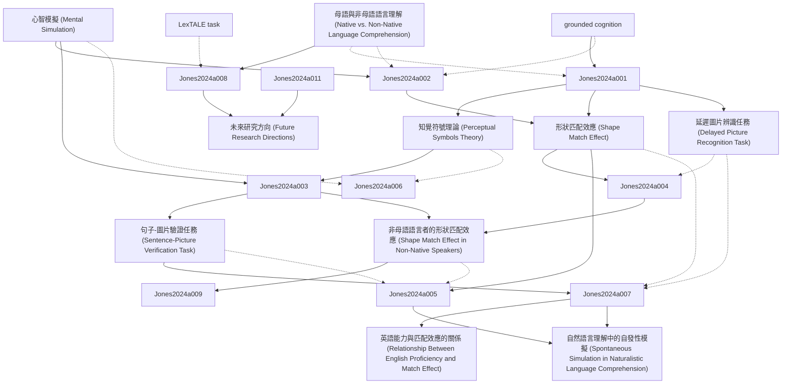

# Zettelkasten 卡片索引

**來源論文**: Journal Pre-proof
**作者**: Journal Pre, Sean Trott, Encode Implied, Language Comprehenders, Diane Pecher, Revised Date, Accepted Date, Received Date
**年份**: 2024
**生成日期**: 2025-11-04 16:41
**卡片總數**: 12

---

## 📚 卡片清單

### 1. [心智模擬 (Mental Simulation)](zettel_cards/Jones-2024a-001.md)
- **ID**: `Jones-2024a-001`
- **類型**: 
- **核心**: "Barsalou (1999) proposes that conceptual knowledge is represented by mental simulations containing perceptual information derived from actual experiences."
- **標籤**: `心智模擬`, `具身認知`, `概念表徵`

### 2. [知覺符號理論 (Perceptual Symbols Theory)](zettel_cards/Jones-2024a-002.md)
- **ID**: `Jones-2024a-002`
- **類型**: 
- **核心**: "instead of amodal propositional processing, conceptual knowledge is represented through mental simulations of sensorimotor experiences."
- **標籤**: `知覺符號`, `具身認知`, `概念表徵`

### 3. [形狀匹配效應 (Shape Match Effect)](zettel_cards/Jones-2024a-003.md)
- **ID**: `Jones-2024a-003`
- **類型**: 
- **核心**: "participants respond faster and more accurately when the shape of the object in the picture matches the shape that was implied by the sentence than when they mismatch."
- **標籤**: `形狀匹配`, `句子-圖片驗證`, `心智模擬`

### 4. [句子-圖片驗證任務 (Sentence-Picture Verification Task)](zettel_cards/Jones-2024a-004.md)
- **ID**: `Jones-2024a-004`
- **類型**: 
- **核心**: "The sentence-picture verification task provides evidence that readers construct visual simulations of objects that vary as a function of linguistic context."
- **標籤**: `句子-圖片驗證`, `實驗方法`, `心理語言學`

### 5. [延遲圖片辨識任務 (Delayed Picture Recognition Task)](zettel_cards/Jones-2024a-005.md)
- **ID**: `Jones-2024a-005`
- **類型**: 
- **核心**: "Studies using this paradigm reveal better recognition memory when the perceptual characteristics of the object in the picture match those implied by the sentence than when they mismatch, providing evidence for spontaneous mental simulation during language comprehension."
- **標籤**: `延遲辨識`, `記憶測驗`, `心智模擬`

### 6. [母語與非母語語言理解 (Native vs. Non-Native Language Comprehension)](zettel_cards/Jones-2024a-006.md)
- **ID**: `Jones-2024a-006`
- **類型**: 
- **核心**: "These differences raise the question of whether the nature of meaning processing might differ as well."
- **標籤**: `母語`, `非母語`, `語言理解`, `心智模擬`

### 7. [非母語語言者的形狀匹配效應 (Shape Match Effect in Non-Native Speakers)](zettel_cards/Jones-2024a-007.md)
- **ID**: `Jones-2024a-007`
- **類型**: 
- **核心**: "The current study successfully replicates the shape match effect in sentence-picture verification (Zwaan et al., 2002) for non-native English language comprehenders, indicating native-like visual simulations."
- **標籤**: `形狀匹配`, `非母語`, `句子-圖片驗證`, `心智模擬`

### 8. [英語能力與匹配效應的關係 (Relationship Between English Proficiency and Match Effect)](zettel_cards/Jones-2024a-008.md)
- **ID**: `Jones-2024a-008`
- **類型**: 
- **核心**: "Additional correlational analyses revealed no relationship between English proficiency and the size of the match effect."
- **標籤**: `英語能力`, `相關性分析`, `形狀匹配`, `非母語`

### 9. [自然語言理解中的自發性模擬 (Spontaneous Simulation in Naturalistic Language Comprehension)](zettel_cards/Jones-2024a-009.md)
- **ID**: `Jones-2024a-009`
- **類型**: 
- **核心**: "participants displayed better delayoed recognition memory when the shape of the depicted objects matched the shape that was implied by the sentence than when it did not, suggesting that visual simulations were generated spontaneously in naturalistic non-native language comprehension."
- **標籤**: `自發性`, `延遲辨識`, `非母語`, `心智模擬`

### 10. [grounded cognition](zettel_cards/Jones-2024a-010.md)
- **ID**: `Jones-2024a-010`
- **類型**: 
- **核心**: "According to a strong version of the Pgrounded cognition view, conceptual memory relies on sensorimotor processes to ground concelptual representations"
- **標籤**: `具身認知`, `感覺運動過程`, `概念表徵`

### 11. [LexTALE task](zettel_cards/Jones-2024a-011.md)
- **ID**: `Jones-2024a-011`
- **類型**: 
- **核心**: "We conduct correlational analyses to investigate whether the degree of mental simulation was related to the level of English language proficiency, as measured by thoe LexTALE task, a validated and performance-based test of proficiency"
- **標籤**: `LexTALE`, `英語能力測驗`, `詞彙知識`

### 12. [未來研究方向 (Future Research Directions)](zettel_cards/Jones-2024a-012.md)
- **ID**: `Jones-2024a-012`
- **類型**: 
- **核心**: "Nevertheless, it might be fruitful for future studies to use other language proficiency measures in addition to LexTALE."
- **標籤**: `研究方向`, `英語能力`, `心智模擬`, `非母語`

---

## 🗺️ 概念網絡圖

---

## 🏷️ 標籤索引

### 心智模擬
- [[Jones-2024a-001]] 心智模擬 (Mental Simulation)
- [[Jones-2024a-003]] 形狀匹配效應 (Shape Match Effect)
- [[Jones-2024a-005]] 延遲圖片辨識任務 (Delayed Picture Recognition Task)
- [[Jones-2024a-006]] 母語與非母語語言理解 (Native vs. Non-Native Language Comprehension)
- [[Jones-2024a-007]] 非母語語言者的形狀匹配效應 (Shape Match Effect in Non-Native Speakers)
- [[Jones-2024a-009]] 自然語言理解中的自發性模擬 (Spontaneous Simulation in Naturalistic Language Comprehension)
- [[Jones-2024a-012]] 未來研究方向 (Future Research Directions)

### 具身認知
- [[Jones-2024a-001]] 心智模擬 (Mental Simulation)
- [[Jones-2024a-002]] 知覺符號理論 (Perceptual Symbols Theory)
- [[Jones-2024a-010]] grounded cognition

### 概念表徵
- [[Jones-2024a-001]] 心智模擬 (Mental Simulation)
- [[Jones-2024a-002]] 知覺符號理論 (Perceptual Symbols Theory)
- [[Jones-2024a-010]] grounded cognition

### 知覺符號
- [[Jones-2024a-002]] 知覺符號理論 (Perceptual Symbols Theory)

### 形狀匹配
- [[Jones-2024a-003]] 形狀匹配效應 (Shape Match Effect)
- [[Jones-2024a-007]] 非母語語言者的形狀匹配效應 (Shape Match Effect in Non-Native Speakers)
- [[Jones-2024a-008]] 英語能力與匹配效應的關係 (Relationship Between English Proficiency and Match Effect)

### 句子-圖片驗證
- [[Jones-2024a-003]] 形狀匹配效應 (Shape Match Effect)
- [[Jones-2024a-004]] 句子-圖片驗證任務 (Sentence-Picture Verification Task)
- [[Jones-2024a-007]] 非母語語言者的形狀匹配效應 (Shape Match Effect in Non-Native Speakers)

### 實驗方法
- [[Jones-2024a-004]] 句子-圖片驗證任務 (Sentence-Picture Verification Task)

### 心理語言學
- [[Jones-2024a-004]] 句子-圖片驗證任務 (Sentence-Picture Verification Task)

### 延遲辨識
- [[Jones-2024a-005]] 延遲圖片辨識任務 (Delayed Picture Recognition Task)
- [[Jones-2024a-009]] 自然語言理解中的自發性模擬 (Spontaneous Simulation in Naturalistic Language Comprehension)

### 記憶測驗
- [[Jones-2024a-005]] 延遲圖片辨識任務 (Delayed Picture Recognition Task)

### 母語
- [[Jones-2024a-006]] 母語與非母語語言理解 (Native vs. Non-Native Language Comprehension)

### 非母語
- [[Jones-2024a-006]] 母語與非母語語言理解 (Native vs. Non-Native Language Comprehension)
- [[Jones-2024a-007]] 非母語語言者的形狀匹配效應 (Shape Match Effect in Non-Native Speakers)
- [[Jones-2024a-008]] 英語能力與匹配效應的關係 (Relationship Between English Proficiency and Match Effect)
- [[Jones-2024a-009]] 自然語言理解中的自發性模擬 (Spontaneous Simulation in Naturalistic Language Comprehension)
- [[Jones-2024a-012]] 未來研究方向 (Future Research Directions)

### 語言理解
- [[Jones-2024a-006]] 母語與非母語語言理解 (Native vs. Non-Native Language Comprehension)

### 英語能力
- [[Jones-2024a-008]] 英語能力與匹配效應的關係 (Relationship Between English Proficiency and Match Effect)
- [[Jones-2024a-012]] 未來研究方向 (Future Research Directions)

### 相關性分析
- [[Jones-2024a-008]] 英語能力與匹配效應的關係 (Relationship Between English Proficiency and Match Effect)

### 自發性
- [[Jones-2024a-009]] 自然語言理解中的自發性模擬 (Spontaneous Simulation in Naturalistic Language Comprehension)

### 感覺運動過程
- [[Jones-2024a-010]] grounded cognition

### LexTALE
- [[Jones-2024a-011]] LexTALE task

### 英語能力測驗
- [[Jones-2024a-011]] LexTALE task

### 詞彙知識
- [[Jones-2024a-011]] LexTALE task

### 研究方向
- [[Jones-2024a-012]] 未來研究方向 (Future Research Directions)

---

## 📖 閱讀建議順序

1. [[Jones-2024a-001]] 心智模擬 (Mental Simulation)

2. [[Jones-2024a-002]] 知覺符號理論 (Perceptual Symbols Theory)

3. [[Jones-2024a-003]] 形狀匹配效應 (Shape Match Effect)

4. [[Jones-2024a-004]] 句子-圖片驗證任務 (Sentence-Picture Verification Task)

5. [[Jones-2024a-005]] 延遲圖片辨識任務 (Delayed Picture Recognition Task)

6. [[Jones-2024a-006]] 母語與非母語語言理解 (Native vs. Non-Native Language Comprehension)

7. [[Jones-2024a-007]] 非母語語言者的形狀匹配效應 (Shape Match Effect in Non-Native Speakers)

8. [[Jones-2024a-008]] 英語能力與匹配效應的關係 (Relationship Between English Proficiency and Match Effect)

9. [[Jones-2024a-009]] 自然語言理解中的自發性模擬 (Spontaneous Simulation in Naturalistic Language Comprehension)

10. [[Jones-2024a-010]] grounded cognition

11. [[Jones-2024a-011]] LexTALE task

12. [[Jones-2024a-012]] 未來研究方向 (Future Research Directions)

---

*本索引由 Knowledge Production System 自動生成*