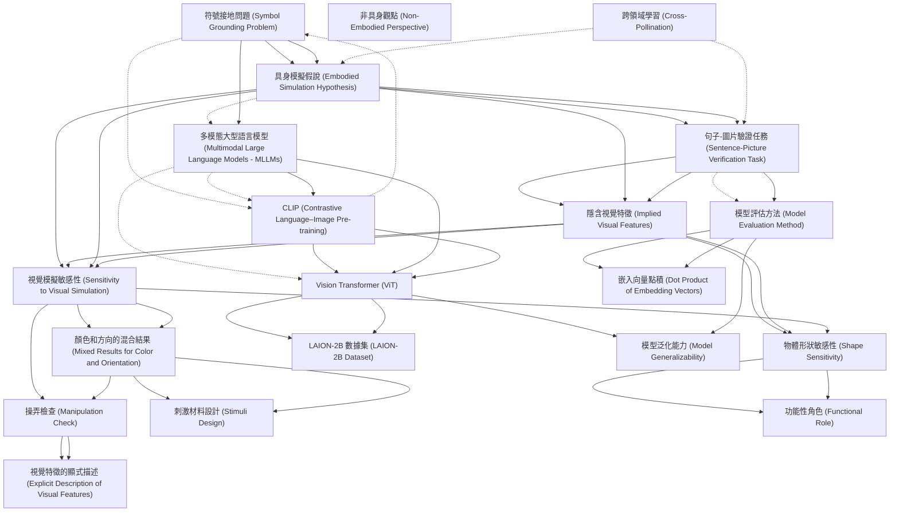

# Zettelkasten 卡片索引

**來源論文**: Jones-2024a_Mental_Simulation
**作者**: 
**年份**: 2025
**生成日期**: 2025-10-29 16:40
**卡片總數**: 20

---

## 📚 卡片清單

### 1. [符號接地問題 (Symbol Grounding Problem)](zettel_cards/CogSci-20251029-001.md)
- **ID**: `CogSci-20251029-001`
- **類型**: 
- **核心**: "MultimodalLargeLanguageModels(MLLMs...maybeapartialsolutiontothissymbolgroundingproblem(Harnad, 1990)."
- **標籤**: `符號接地`, `多模態`, `語言模型`, `認知科學`

### 2. [具身模擬假說 (Embodied Simulation Hypothesis)](zettel_cards/CogSci-20251029-002.md)
- **ID**: `CogSci-20251029-002`
- **類型**: 
- **核心**: "Theembodiedsimulationhypothesis...arguesthatlanguageunderstandinginvolvestheactivation of grounded representations, i.e. that thesameneuraltissuerecruitedtoperceiveorparticipateinanevent...is alsoengagedtounderstandlanguageaboutthatevent..."
- **標籤**: `具身認知`, `模擬`, `語言理解`, `認知神經科學`

### 3. [句子-圖片驗證任務 (Sentence-Picture Verification Task)](zettel_cards/CogSci-20251029-003.md)
- **ID**: `CogSci-20251029-003`
- **類型**: 
- **核心**: "In this task, participants read a shortsentence...thenseeapictureofanobject...andmustdecidewhethertheobjectwasmentionedintheprecedingsentence."
- **標籤**: `心理語言學`, `實驗方法`, `認知實驗`

### 4. [隱含視覺特徵 (Implied Visual Features)](zettel_cards/CogSci-20251029-004.md)
- **ID**: `CogSci-20251029-004`
- **類型**: 
- **核心**: "...humansmustbeinferringvisualfeaturesbasedonpropertiesoftheeventitself(e.g.,aneggcookinginaskillet)."
- **標籤**: `視覺特徵`, `語義推斷`, `語言理解`

### 5. [多模態大型語言模型 (Multimodal Large Language Models - MLLMs)](zettel_cards/CogSci-20251029-005.md)
- **ID**: `CogSci-20251029-005`
- **類型**: 
- **核心**: "MultimodalLargeLanguageModels(MLLMs...whichlearntoassociatelinguisticrepresentationswithdatafrom othermodalities..."
- **標籤**: `多模態學習`, `語言模型`, `深度學習`, `人工智慧`

### 6. [CLIP (Contrastive Language–Image Pre-training)](zettel_cards/CogSci-20251029-006.md)
- **ID**: `CogSci-20251029-006`
- **類型**: 
- **核心**: "CLIP (Contrastive Language–Image Pre-training)employscontrastivelearningtoassociate imageswithtextdescriptions..."
- **標籤**: `對比學習`, `圖像文本對齊`, `預訓練模型`

### 7. [視覺模擬敏感性 (Sensitivity to Visual Simulation)](zettel_cards/CogSci-20251029-007.md)
- **ID**: `CogSci-20251029-007`
- **類型**: 
- **核心**: "WefindthatMLLMsaresensitivetoimplicit visualfeatureslikeobjectshape..."
- **標籤**: `視覺模擬`, `形狀`, `顏色`, `方向`, `MLLM`

### 8. [非具身觀點 (Non-Embodied Perspective)](zettel_cards/CogSci-20251029-008.md)
- **ID**: `CogSci-20251029-008`
- **類型**: 
- **核心**: (Implicitly defined through contrast with embodied simulation. No direct quote available, representing a contrasting view.)
- **標籤**: `符號主義`, `計算主義`, `認知科學`

### 9. [Vision Transformer (ViT)](zettel_cards/CogSci-20251029-009.md)
- **ID**: `CogSci-20251029-009`
- **類型**: 
- **核心**: "TheVisionTransformer(ViT)architectureadapts the Transformer to handle visual data..."
- **標籤**: `視覺`, `Transformer`, `深度學習`, `圖像處理`

### 10. [模型評估方法 (Model Evaluation Method)](zettel_cards/CogSci-20251029-010.md)
- **ID**: `CogSci-20251029-010`
- **類型**: 
- **核心**: "Ourprimaryquestionwaswhetheramodel’srepresentation of a given linguistic input...wasmoresimilartoitsrepresentationofanimagethatmatchedanimpliedvisualfeature...compared to an image that did not..."
- **標籤**: `模型評估`, `相似度`, `嵌入向量`, `語言理解`

### 11. [物體形狀敏感性 (Shape Sensitivity)](zettel_cards/CogSci-20251029-011.md)
- **ID**: `CogSci-20251029-011`
- **類型**: 
- **核心**: "This suggeststhatMLLMsactivateimplicitinformationaboutobjectshape whenitisimpliedbyaverbaldescriptionofanevent."
- **標籤**: `形狀`, `隱含資訊`, `語言理解`, `MLLM`

### 12. [顏色和方向的混合結果 (Mixed Results for Color and Orientation)](zettel_cards/CogSci-20251029-012.md)
- **ID**: `CogSci-20251029-012`
- **類型**: 
- **核心**: "Wefindmixedresultsforcolorandorientation..."
- **標籤**: `顏色`, `方向`, `視覺特徵`, `MLLM`

### 13. [操弄檢查 (Manipulation Check)](zettel_cards/CogSci-20251029-013.md)
- **ID**: `CogSci-20251029-013`
- **類型**: 
- **核心**: "Totestthispossibility,weranafollow-up“manipulationcheck”todeterminewhetherthe MLLMsweresensitivetoorientationandcolorwhen theywereexplicitlymentionedinthetext."
- **標籤**: `實驗驗證`, `顏色`, `方向`, `MLLM`

### 14. [嵌入向量點積 (Dot Product of Embedding Vectors)](zettel_cards/CogSci-20251029-014.md)
- **ID**: `CogSci-20251029-014`
- **類型**: 
- **核心**: "Foreachsentence-imagepair,wefound thedotproductbetweentheMLLMembeddingof the sentence and the image."
- **標籤**: `嵌入`, `向量`, `相似度`, `計算方法`

### 15. [LAION-2B 數據集 (LAION-2B Dataset)](zettel_cards/CogSci-20251029-015.md)
- **ID**: `CogSci-20251029-015`
- **類型**: 
- **核心**: "...wastrainedontheLAION2B datasetfor16epochs(Schuhmannetal.,2022)."
- **標籤**: `數據集`, `圖像文本對`, `大型數據集`

### 16. [刺激材料設計 (Stimuli Design)](zettel_cards/CogSci-20251029-016.md)
- **ID**: `CogSci-20251029-016`
- **類型**: 
- **核心**: "Items were organized as quadruplets, consisting ofapairofimagesandapairofsentences. Sentencepairsdifferedbyimplyingthatanobjecthad acertainvisualproperty(shape,color,orien-tation)."
- **標籤**: `實驗設計`, `刺激材料`, `形狀`, `顏色`, `方向`

### 17. [功能性角色 (Functional Role)](zettel_cards/CogSci-20251029-017.md)
- **ID**: `CogSci-20251029-017`
- **類型**: 
- **核心**: "...withthepotentialtoestablishwhethergroundedrepresentationsplayafunctional roleinlanguageprocessing."
- **標籤**: `功能性`, `具身表示`, `語言處理`, `研究方向`

### 18. [視覺特徵的顯式描述 (Explicit Description of Visual Features)](zettel_cards/CogSci-20251029-018.md)
- **ID**: `CogSci-20251029-018`
- **類型**: 
- **核心**: "Theanal-ysiswasvirtuallyidenticaltotheprimaryanalysis above, except that we used a sentence template thatexplicitly describedspecificvisualfeaturesof theobjectinquestion..."
- **標籤**: `顯式資訊`, `視覺`, `實驗方法`, `MLLM`

### 19. [跨領域學習 (Cross-Pollination)](zettel_cards/CogSci-20251029-019.md)
- **ID**: `CogSci-20251029-019`
- **類型**: 
- **核心**: "Wesuggestthatboth humanpsycholinguisticsandcomputationalmodelsoflanguagecouldbenefitfromcross-pollination..."
- **標籤**: `心理語言學`, `計算模型`, `跨領域`, `研究方向`

### 20. [模型泛化能力 (Model Generalizability)](zettel_cards/CogSci-20251029-020.md)
- **ID**: `CogSci-20251029-020`
- **類型**: 
- **核心**: "WeevaluatefourdifferentCLIP-basedVisionTransformerswithdifferentnumbersofparametersand trainingregimesinordertotestthegeneralizability androbustnessofimpliedvisualfeatureeffects."
- **標籤**: `泛化`, `模型評估`, `視覺特徵`, `MLLM`

---

## 🗺️ 概念網絡圖

---

## 🏷️ 標籤索引

### 符號接地
- [[CogSci-20251029-001]] 符號接地問題 (Symbol Grounding Problem)

### 多模態
- [[CogSci-20251029-001]] 符號接地問題 (Symbol Grounding Problem)

### 語言模型
- [[CogSci-20251029-001]] 符號接地問題 (Symbol Grounding Problem)
- [[CogSci-20251029-005]] 多模態大型語言模型 (Multimodal Large Language Models - MLLMs)

### 認知科學
- [[CogSci-20251029-001]] 符號接地問題 (Symbol Grounding Problem)
- [[CogSci-20251029-008]] 非具身觀點 (Non-Embodied Perspective)

### 具身認知
- [[CogSci-20251029-002]] 具身模擬假說 (Embodied Simulation Hypothesis)

### 模擬
- [[CogSci-20251029-002]] 具身模擬假說 (Embodied Simulation Hypothesis)

### 語言理解
- [[CogSci-20251029-002]] 具身模擬假說 (Embodied Simulation Hypothesis)
- [[CogSci-20251029-004]] 隱含視覺特徵 (Implied Visual Features)
- [[CogSci-20251029-010]] 模型評估方法 (Model Evaluation Method)
- [[CogSci-20251029-011]] 物體形狀敏感性 (Shape Sensitivity)

### 認知神經科學
- [[CogSci-20251029-002]] 具身模擬假說 (Embodied Simulation Hypothesis)

### 心理語言學
- [[CogSci-20251029-003]] 句子-圖片驗證任務 (Sentence-Picture Verification Task)
- [[CogSci-20251029-019]] 跨領域學習 (Cross-Pollination)

### 實驗方法
- [[CogSci-20251029-003]] 句子-圖片驗證任務 (Sentence-Picture Verification Task)
- [[CogSci-20251029-018]] 視覺特徵的顯式描述 (Explicit Description of Visual Features)

### 認知實驗
- [[CogSci-20251029-003]] 句子-圖片驗證任務 (Sentence-Picture Verification Task)

### 視覺特徵
- [[CogSci-20251029-004]] 隱含視覺特徵 (Implied Visual Features)
- [[CogSci-20251029-012]] 顏色和方向的混合結果 (Mixed Results for Color and Orientation)
- [[CogSci-20251029-020]] 模型泛化能力 (Model Generalizability)

### 語義推斷
- [[CogSci-20251029-004]] 隱含視覺特徵 (Implied Visual Features)

### 多模態學習
- [[CogSci-20251029-005]] 多模態大型語言模型 (Multimodal Large Language Models - MLLMs)

### 深度學習
- [[CogSci-20251029-005]] 多模態大型語言模型 (Multimodal Large Language Models - MLLMs)
- [[CogSci-20251029-009]] Vision Transformer (ViT)

### 人工智慧
- [[CogSci-20251029-005]] 多模態大型語言模型 (Multimodal Large Language Models - MLLMs)

### 對比學習
- [[CogSci-20251029-006]] CLIP (Contrastive Language–Image Pre-training)

### 圖像文本對齊
- [[CogSci-20251029-006]] CLIP (Contrastive Language–Image Pre-training)

### 預訓練模型
- [[CogSci-20251029-006]] CLIP (Contrastive Language–Image Pre-training)

### 視覺模擬
- [[CogSci-20251029-007]] 視覺模擬敏感性 (Sensitivity to Visual Simulation)

### 形狀
- [[CogSci-20251029-007]] 視覺模擬敏感性 (Sensitivity to Visual Simulation)
- [[CogSci-20251029-011]] 物體形狀敏感性 (Shape Sensitivity)
- [[CogSci-20251029-016]] 刺激材料設計 (Stimuli Design)

### 顏色
- [[CogSci-20251029-007]] 視覺模擬敏感性 (Sensitivity to Visual Simulation)
- [[CogSci-20251029-012]] 顏色和方向的混合結果 (Mixed Results for Color and Orientation)
- [[CogSci-20251029-013]] 操弄檢查 (Manipulation Check)
- [[CogSci-20251029-016]] 刺激材料設計 (Stimuli Design)

### 方向
- [[CogSci-20251029-007]] 視覺模擬敏感性 (Sensitivity to Visual Simulation)
- [[CogSci-20251029-012]] 顏色和方向的混合結果 (Mixed Results for Color and Orientation)
- [[CogSci-20251029-013]] 操弄檢查 (Manipulation Check)
- [[CogSci-20251029-016]] 刺激材料設計 (Stimuli Design)

### MLLM
- [[CogSci-20251029-007]] 視覺模擬敏感性 (Sensitivity to Visual Simulation)
- [[CogSci-20251029-011]] 物體形狀敏感性 (Shape Sensitivity)
- [[CogSci-20251029-012]] 顏色和方向的混合結果 (Mixed Results for Color and Orientation)
- [[CogSci-20251029-013]] 操弄檢查 (Manipulation Check)
- [[CogSci-20251029-018]] 視覺特徵的顯式描述 (Explicit Description of Visual Features)
- [[CogSci-20251029-020]] 模型泛化能力 (Model Generalizability)

### 符號主義
- [[CogSci-20251029-008]] 非具身觀點 (Non-Embodied Perspective)

### 計算主義
- [[CogSci-20251029-008]] 非具身觀點 (Non-Embodied Perspective)

### 視覺
- [[CogSci-20251029-009]] Vision Transformer (ViT)
- [[CogSci-20251029-018]] 視覺特徵的顯式描述 (Explicit Description of Visual Features)

### Transformer
- [[CogSci-20251029-009]] Vision Transformer (ViT)

### 圖像處理
- [[CogSci-20251029-009]] Vision Transformer (ViT)

### 模型評估
- [[CogSci-20251029-010]] 模型評估方法 (Model Evaluation Method)
- [[CogSci-20251029-020]] 模型泛化能力 (Model Generalizability)

### 相似度
- [[CogSci-20251029-010]] 模型評估方法 (Model Evaluation Method)
- [[CogSci-20251029-014]] 嵌入向量點積 (Dot Product of Embedding Vectors)

### 嵌入向量
- [[CogSci-20251029-010]] 模型評估方法 (Model Evaluation Method)

### 隱含資訊
- [[CogSci-20251029-011]] 物體形狀敏感性 (Shape Sensitivity)

### 實驗驗證
- [[CogSci-20251029-013]] 操弄檢查 (Manipulation Check)

### 嵌入
- [[CogSci-20251029-014]] 嵌入向量點積 (Dot Product of Embedding Vectors)

### 向量
- [[CogSci-20251029-014]] 嵌入向量點積 (Dot Product of Embedding Vectors)

### 計算方法
- [[CogSci-20251029-014]] 嵌入向量點積 (Dot Product of Embedding Vectors)

### 數據集
- [[CogSci-20251029-015]] LAION-2B 數據集 (LAION-2B Dataset)

### 圖像文本對
- [[CogSci-20251029-015]] LAION-2B 數據集 (LAION-2B Dataset)

### 大型數據集
- [[CogSci-20251029-015]] LAION-2B 數據集 (LAION-2B Dataset)

### 實驗設計
- [[CogSci-20251029-016]] 刺激材料設計 (Stimuli Design)

### 刺激材料
- [[CogSci-20251029-016]] 刺激材料設計 (Stimuli Design)

### 功能性
- [[CogSci-20251029-017]] 功能性角色 (Functional Role)

### 具身表示
- [[CogSci-20251029-017]] 功能性角色 (Functional Role)

### 語言處理
- [[CogSci-20251029-017]] 功能性角色 (Functional Role)

### 研究方向
- [[CogSci-20251029-017]] 功能性角色 (Functional Role)
- [[CogSci-20251029-019]] 跨領域學習 (Cross-Pollination)

### 顯式資訊
- [[CogSci-20251029-018]] 視覺特徵的顯式描述 (Explicit Description of Visual Features)

### 計算模型
- [[CogSci-20251029-019]] 跨領域學習 (Cross-Pollination)

### 跨領域
- [[CogSci-20251029-019]] 跨領域學習 (Cross-Pollination)

### 泛化
- [[CogSci-20251029-020]] 模型泛化能力 (Model Generalizability)

---

## 📖 閱讀建議順序

1. [[CogSci-20251029-008]] 非具身觀點 (Non-Embodied Perspective)

2. [[CogSci-20251029-014]] 嵌入向量點積 (Dot Product of Embedding Vectors)

3. [[CogSci-20251029-015]] LAION-2B 數據集 (LAION-2B Dataset)

4. [[CogSci-20251029-016]] 刺激材料設計 (Stimuli Design)

5. [[CogSci-20251029-017]] 功能性角色 (Functional Role)

6. [[CogSci-20251029-018]] 視覺特徵的顯式描述 (Explicit Description of Visual Features)

7. [[CogSci-20251029-019]] 跨領域學習 (Cross-Pollination)

8. [[CogSci-20251029-020]] 模型泛化能力 (Model Generalizability)

9. [[CogSci-20251029-006]] CLIP (Contrastive Language–Image Pre-training)

10. [[CogSci-20251029-011]] 物體形狀敏感性 (Shape Sensitivity)

11. [[CogSci-20251029-013]] 操弄檢查 (Manipulation Check)

12. [[CogSci-20251029-001]] 符號接地問題 (Symbol Grounding Problem)

13. [[CogSci-20251029-003]] 句子-圖片驗證任務 (Sentence-Picture Verification Task)

14. [[CogSci-20251029-004]] 隱含視覺特徵 (Implied Visual Features)

15. [[CogSci-20251029-005]] 多模態大型語言模型 (Multimodal Large Language Models - MLLMs)

16. [[CogSci-20251029-007]] 視覺模擬敏感性 (Sensitivity to Visual Simulation)

17. [[CogSci-20251029-009]] Vision Transformer (ViT)

18. [[CogSci-20251029-010]] 模型評估方法 (Model Evaluation Method)

19. [[CogSci-20251029-012]] 顏色和方向的混合結果 (Mixed Results for Color and Orientation)

20. [[CogSci-20251029-002]] 具身模擬假說 (Embodied Simulation Hypothesis)

---

*本索引由 Knowledge Production System 自動生成*