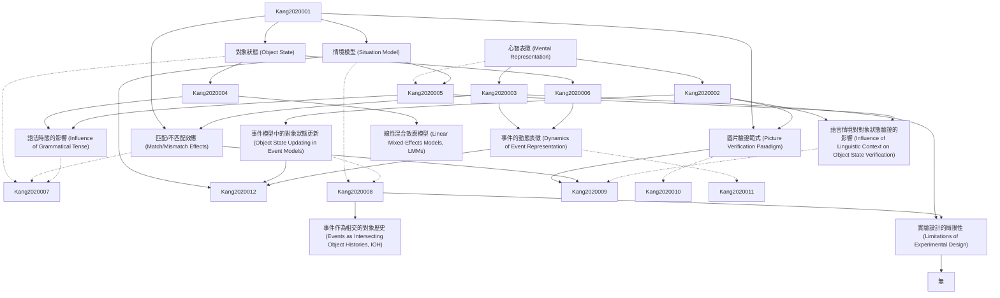

# Zettelkasten 卡片索引

**來源論文**: Memory&Cognition(2020)48:390–399
**作者**: M.Altmann, Keywords Objectstate, H.Joergensen, A.Zwaan
**年份**: 2020
**生成日期**: 2025-11-04 16:38
**卡片總數**: 12

---

## 📚 卡片清單

### 1. [心智表徵 (Mental Representation)](zettel_cards/Kang-2020-001.md)
- **ID**: `Kang-2020-001`
- **類型**: 
- **核心**: "Tounderstandlanguagepeopleformmentalrepresentationsofdescribedsituations."
- **標籤**: `心智模型`, `語言理解`, `情境模擬`

### 2. [對象狀態 (Object State)](zettel_cards/Kang-2020-002.md)
- **ID**: `Kang-2020-002`
- **類型**: 
- **核心**: "the picture either showed an intact original state or a modified state of an object."
- **標籤**: `對象`, `狀態改變`, `語言理解`

### 3. [情境模型 (Situation Model)](zettel_cards/Kang-2020-003.md)
- **ID**: `Kang-2020-003`
- **類型**: 
- **核心**: "understandinglanguageinvolvestheconstructionofamental situation as a ‘simulation’ of real-world experiences in the spatiotemporal framework"
- **標籤**: `語言理解`, `情境認知`, `空間時間框架`

### 4. [圖片驗證範式 (Picture Verification Paradigm)](zettel_cards/Kang-2020-004.md)
- **ID**: `Kang-2020-004`
- **類型**: 
- **核心**: "Usingthepictureverificationparadigm,StanfieldandZwaan (2001)askedparticipantstoreadsentenceslikeBThecarpenter poundedthenailintothewall,^andtoverifywhetheranobject displayed on a picture (e.g., a nail) was mentioned in the sen- tence."
- **標籤**: `實驗方法`, `語言理解`, `心理學`

### 5. [匹配/不匹配效應 (Match/Mismatch Effects)](zettel_cards/Kang-2020-005.md)
- **ID**: `Kang-2020-005`
- **類型**: 
- **核心**: "participants reacted faster to the pictured object (e.g., a horizontally oriented nail) that was com- patible with its implied orientation as described in the sentence"
- **標籤**: `反應時間`, `語言理解`, `實驗結果`

### 6. [事件模型中的對象狀態更新 (Object State Updating in Event Models)](zettel_cards/Kang-2020-006.md)
- **ID**: `Kang-2020-006`
- **類型**: 
- **核心**: "the object is linked to multiple ‘states’ of itself across time – before and after this change."
- **標籤**: `事件模型`, `狀態改變`, `時間`

### 7. [語言情境對對象狀態驗證的影響 (Influence of Linguistic Context on Object State Verification)](zettel_cards/Kang-2020-007.md)
- **ID**: `Kang-2020-007`
- **類型**: 
- **核心**: "the linguistic context has an impact on the activation of object- state representations."
- **標籤**: `語言情境`, `對象狀態`, `反應時間`

### 8. [事件的動態表徵 (Dynamics of Event Representation)](zettel_cards/Kang-2020-008.md)
- **ID**: `Kang-2020-008`
- **類型**: 
- **核心**: "Our findings highlight the need to take account of the dynamicsof event representation in language comprehension that capturesthe interplay betweengeneralsemanticknowledgeaboutobjectsandtheepisodicknowledgeintroducedbythesententialcontext."
- **標籤**: `事件`, `表徵`, `語言理解`

### 9. [語法時態的影響 (Influence of Grammatical Tense)](zettel_cards/Kang-2020-009.md)
- **ID**: `Kang-2020-009`
- **類型**: 
- **核心**: "the match/mismatch effects were only revealed after reading the past tense (Experiment 2) sentences but not the future-tense sentences (Experiment 3)."
- **標籤**: `語法`, `時態`, `語言理解`

### 10. [線性混合效應模型 (Linear Mixed-Effects Models, LMMs)](zettel_cards/Kang-2020-010.md)
- **ID**: `Kang-2020-010`
- **類型**: 
- **核心**: "Thelinearmixed-effectsmodels (LMMs) using the lme 4 package (Bates et al., 2015; Baayen, Davidson,&Bates,2008)ofR(RCoreTeam,2016)wereused forstatisticalanalysis."
- **標籤**: `統計分析`, `實驗數據`, `lme4`

### 11. [事件作為相交的對象歷史 (Events as Intersecting Object Histories, IOH)](zettel_cards/Kang-2020-011.md)
- **ID**: `Kang-2020-011`
- **類型**: 
- **核心**: "Altmann and Ekves (2019) further proposed the Bevents as intersecting object histories^ (IOH) model that encodingevents(whetherwedirectlyexperiencethemorlearn about them through language) involves constructing dynamic representationsofintersectingobjecthistories."
- **標籤**: `事件`, `對象`, `歷史`

### 12. [實驗設計的局限性 (Limitations of Experimental Design)](zettel_cards/Kang-2020-012.md)
- **ID**: `Kang-2020-012`
- **類型**: 
- **核心**: "Onelimitationofthisstudyisthatwemeasuredtheactiva- tion of object representation at the end of sentence reading, whichmayonlybeabletocapturepartoftheactivationpro- cessing."
- **標籤**: `實驗設計`, `語言理解`, `方法論`

---

## 🗺️ 概念網絡圖

---

## 🏷️ 標籤索引

### 心智模型
- [[Kang-2020-001]] 心智表徵 (Mental Representation)

### 語言理解
- [[Kang-2020-001]] 心智表徵 (Mental Representation)
- [[Kang-2020-002]] 對象狀態 (Object State)
- [[Kang-2020-003]] 情境模型 (Situation Model)
- [[Kang-2020-004]] 圖片驗證範式 (Picture Verification Paradigm)
- [[Kang-2020-005]] 匹配/不匹配效應 (Match/Mismatch Effects)
- [[Kang-2020-008]] 事件的動態表徵 (Dynamics of Event Representation)
- [[Kang-2020-009]] 語法時態的影響 (Influence of Grammatical Tense)
- [[Kang-2020-012]] 實驗設計的局限性 (Limitations of Experimental Design)

### 情境模擬
- [[Kang-2020-001]] 心智表徵 (Mental Representation)

### 對象
- [[Kang-2020-002]] 對象狀態 (Object State)
- [[Kang-2020-011]] 事件作為相交的對象歷史 (Events as Intersecting Object Histories, IOH)

### 狀態改變
- [[Kang-2020-002]] 對象狀態 (Object State)
- [[Kang-2020-006]] 事件模型中的對象狀態更新 (Object State Updating in Event Models)

### 情境認知
- [[Kang-2020-003]] 情境模型 (Situation Model)

### 空間時間框架
- [[Kang-2020-003]] 情境模型 (Situation Model)

### 實驗方法
- [[Kang-2020-004]] 圖片驗證範式 (Picture Verification Paradigm)

### 心理學
- [[Kang-2020-004]] 圖片驗證範式 (Picture Verification Paradigm)

### 反應時間
- [[Kang-2020-005]] 匹配/不匹配效應 (Match/Mismatch Effects)
- [[Kang-2020-007]] 語言情境對對象狀態驗證的影響 (Influence of Linguistic Context on Object State Verification)

### 實驗結果
- [[Kang-2020-005]] 匹配/不匹配效應 (Match/Mismatch Effects)

### 事件模型
- [[Kang-2020-006]] 事件模型中的對象狀態更新 (Object State Updating in Event Models)

### 時間
- [[Kang-2020-006]] 事件模型中的對象狀態更新 (Object State Updating in Event Models)

### 語言情境
- [[Kang-2020-007]] 語言情境對對象狀態驗證的影響 (Influence of Linguistic Context on Object State Verification)

### 對象狀態
- [[Kang-2020-007]] 語言情境對對象狀態驗證的影響 (Influence of Linguistic Context on Object State Verification)

### 事件
- [[Kang-2020-008]] 事件的動態表徵 (Dynamics of Event Representation)
- [[Kang-2020-011]] 事件作為相交的對象歷史 (Events as Intersecting Object Histories, IOH)

### 表徵
- [[Kang-2020-008]] 事件的動態表徵 (Dynamics of Event Representation)

### 語法
- [[Kang-2020-009]] 語法時態的影響 (Influence of Grammatical Tense)

### 時態
- [[Kang-2020-009]] 語法時態的影響 (Influence of Grammatical Tense)

### 統計分析
- [[Kang-2020-010]] 線性混合效應模型 (Linear Mixed-Effects Models, LMMs)

### 實驗數據
- [[Kang-2020-010]] 線性混合效應模型 (Linear Mixed-Effects Models, LMMs)

### lme4
- [[Kang-2020-010]] 線性混合效應模型 (Linear Mixed-Effects Models, LMMs)

### 歷史
- [[Kang-2020-011]] 事件作為相交的對象歷史 (Events as Intersecting Object Histories, IOH)

### 實驗設計
- [[Kang-2020-012]] 實驗設計的局限性 (Limitations of Experimental Design)

### 方法論
- [[Kang-2020-012]] 實驗設計的局限性 (Limitations of Experimental Design)

---

## 📖 閱讀建議順序

1. [[Kang-2020-001]] 心智表徵 (Mental Representation)

2. [[Kang-2020-002]] 對象狀態 (Object State)

3. [[Kang-2020-003]] 情境模型 (Situation Model)

4. [[Kang-2020-004]] 圖片驗證範式 (Picture Verification Paradigm)

5. [[Kang-2020-005]] 匹配/不匹配效應 (Match/Mismatch Effects)

6. [[Kang-2020-006]] 事件模型中的對象狀態更新 (Object State Updating in Event Models)

7. [[Kang-2020-007]] 語言情境對對象狀態驗證的影響 (Influence of Linguistic Context on Object State Verification)

8. [[Kang-2020-008]] 事件的動態表徵 (Dynamics of Event Representation)

9. [[Kang-2020-009]] 語法時態的影響 (Influence of Grammatical Tense)

10. [[Kang-2020-010]] 線性混合效應模型 (Linear Mixed-Effects Models, LMMs)

11. [[Kang-2020-011]] 事件作為相交的對象歷史 (Events as Intersecting Object Histories, IOH)

12. [[Kang-2020-012]] 實驗設計的局限性 (Limitations of Experimental Design)

---

*本索引由 Knowledge Production System 自動生成*