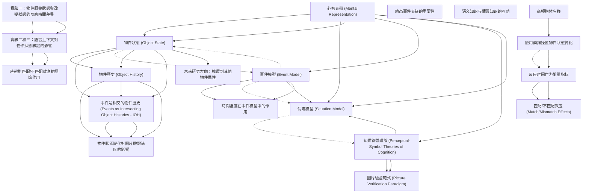

# Zettelkasten 卡片索引

**來源論文**: Kang-2020_Mental_Simulation
**作者**: 
**年份**: 2025
**生成日期**: 2025-10-29 16:41
**卡片總數**: 20

---

## 📚 卡片清單

### 1. [心智表徵 (Mental Representation)](zettel_cards/CogSci-20251029-001.md)
- **ID**: `CogSci-20251029-001`
- **類型**: 
- **核心**: "To understand language people form mental representations of described situations."
- **標籤**: `心智模型`, `語言理解`, `情境模擬`

### 2. [物件狀態 (Object State)](zettel_cards/CogSci-20251029-002.md)
- **ID**: `CogSci-20251029-002`
- **類型**: 
- **核心**: "For example, an object may go through changes due to an external action (e.g., The chef chopped the onion)."
- **標籤**: `物件`, `狀態改變`, `事件模型`

### 3. [事件模型 (Event Model)](zettel_cards/CogSci-20251029-003.md)
- **ID**: `CogSci-20251029-003`
- **類型**: 
- **核心**: "Theories of event models have recognized that events can be encoded across multiple dimensions (Zwaan, Langston, & Graesser, 1995; Zwaan & Radvansky, 1998; Zwaan, 2016), including location (e.g., Glenberg, Meyer, & Lindem, 1987; Kukona, Altmann, & Kamide, 2014; Radvansky, 2005; Radvansky & Copeland, 2006; Radvansky & Copeland, 2010), time (Radvansky, Zwaan, Federico, & Franklin, 1998; Speer & Zacks, 2005; Zwaan, 1996), goals, and agents."
- **標籤**: `事件`, `情境模型`, `語言理解`

### 4. [知覺符號理論 (Perceptual-Symbol Theories of Cognition)](zettel_cards/CogSci-20251029-004.md)
- **ID**: `CogSci-20251029-004`
- **類型**: 
- **核心**: "According to these theories, concepts of objects are perceptual symbols that arise during perceptual and motor experiences, which can later activate previous experiences and the relevant neural systems."
- **標籤**: `知覺`, `符號`, `認知`, `模擬`

### 5. [情境模型 (Situation Model)](zettel_cards/CogSci-20251029-005.md)
- **ID**: `CogSci-20251029-005`
- **類型**: 
- **核心**: "We construct, update, and retrieve the situation models based on these dimensions."
- **標籤**: `情境`, `模型`, `語言理解`, `認知`

### 6. [物件歷史 (Object History)](zettel_cards/CogSci-20251029-006.md)
- **ID**: `CogSci-20251029-006`
- **類型**: 
- **核心**: "Therefore, an object in the modified state has its own 'history' that includes its association with its prior original self and with changes to its states across time."
- **標籤**: `物件`, `歷史`, `狀態`, `時間`

### 7. [事件是相交的物件歷史 (Events as Intersecting Object Histories - IOH)](zettel_cards/CogSci-20251029-007.md)
- **ID**: `CogSci-20251029-007`
- **類型**: 
- **核心**: "Altmann and Ekves (2019) further proposed the 'events as intersecting object histories' (IOH) model that encoding events (whether we directly experience them or learn about them through language) involves constructing dynamic representations of intersecting object histories."
- **標籤**: `事件`, `物件`, `歷史`, `模型`

### 8. [時間維度在事件模型中的作用](zettel_cards/CogSci-20251029-008.md)
- **ID**: `CogSci-20251029-008`
- **類型**: 
- **核心**: "Linguistic information, such as the tense of sentences, can also be used as a cue for 'time shift' (e.g., Altmann & Kamide, 2007; Ferretti, Kutas, & McRae, 2007; Madden & Zwaan, 2003)."
- **標籤**: `時間`, `時態`, `事件模型`, `語言理解`

### 9. [物件狀態變化對圖片驗證速度的影響](zettel_cards/CogSci-20251029-009.md)
- **ID**: `CogSci-20251029-009`
- **類型**: 
- **核心**: "In the present study, we aimed to explore whether object state-change influences the speed of picture verification."
- **標籤**: `物件`, `狀態變化`, `圖片驗證`, `語言理解`

### 10. [圖片驗證範式 (Picture Verification Paradigm)](zettel_cards/CogSci-20251029-010.md)
- **ID**: `CogSci-20251029-010`
- **類型**: 
- **核心**: "Using the picture verification paradigm, Stanfield and Zwaan (2001) asked participants to read sentences like 'The carpenter pounded the nail into the wall,' and to verify whether an object displayed on a picture (e.g., a nail) was mentioned in the sentence."
- **標籤**: `圖片驗證`, `方法`, `實驗`, `心理學`

### 11. [實驗一：物件原始狀態與改變狀態的反應時間差異](zettel_cards/CogSci-20251029-011.md)
- **ID**: `CogSci-20251029-011`
- **類型**: 
- **核心**: "When no linguistic context was provided, participants responded faster to the original state of the object compared to the changed state (Experiment 1)."
- **標籤**: `實驗結果`, `物件狀態`, `反應時間`, `原始狀態`

### 12. [實驗二和三：語言上下文對物件狀態驗證的影響](zettel_cards/CogSci-20251029-012.md)
- **ID**: `CogSci-20251029-012`
- **類型**: 
- **核心**: "However, when linguistic context was provided, participants responded faster to the modified state when it matched, rather than mismatched, the expected outcome of the described event (Experiment 2 and Experiment 3)."
- **標籤**: `實驗結果`, `語言上下文`, `物件狀態`, `反應時間`, `匹配效應`

### 13. [時態對匹配/不匹配效應的調節作用](zettel_cards/CogSci-20251029-013.md)
- **ID**: `CogSci-20251029-013`
- **類型**: 
- **核心**: "Interestingly, as for the original state, the match/mismatch effects were only revealed after reading the past tense (Experiment 2) sentences but not the future-tense sentences (Experiment 3)."
- **標籤**: `實驗結果`, `時態`, `匹配效應`, `語言理解`

### 14. [动态事件表征的重要性](zettel_cards/CogSci-20251029-014.md)
- **ID**: `CogSci-20251029-014`
- **類型**: 
- **核心**: "Our findings highlight the need to take account of the dynamics of event representation in language comprehension that capture the interplay between general semantic knowledge about objects and the episodic knowledge introduced by the sentential context."
- **標籤**: `动态事件表征`, `语言理解`, `语义知识`, `情景知识`

### 15. [语义知识与情景知识的互动](zettel_cards/CogSci-20251029-015.md)
- **ID**: `CogSci-20251029-015`
- **類型**: 
- **核心**: "the interplay between general semantic knowledge about objects and the episodic knowledge introduced by the sentential context."
- **標籤**: `语义知识`, `情景知识`, `语言理解`

### 16. [高频物体名称](zettel_cards/CogSci-20251029-016.md)
- **ID**: `CogSci-20251029-016`
- **類型**: 
- **核心**: "32 high-frequency object names (e.g., ice cream, banana,"
- **標籤**: `物体名称`, `高频`, `实验材料`

### 17. [使用動詞操縱物件狀態變化](zettel_cards/CogSci-20251029-017.md)
- **ID**: `CogSci-20251029-017`
- **類型**: 
- **核心**: "In Experiment 2, we manipulated object state-change by using two different verbs – one indicating a minimal/no change and the other a substantial change. An example is The woman chose/dropped the ice cream."
- **標籤**: `動詞`, `物件狀態`, `實驗操縱`

### 18. [反应时间作为衡量指标](zettel_cards/CogSci-20251029-018.md)
- **ID**: `CogSci-20251029-018`
- **類型**: 
- **核心**: "We expected to find quicker response times when the object representation matched the picture probe compared to when it mismatched the probe."
- **標籤**: `反应时间`, `衡量指标`, `语言理解`

### 19. [匹配/不匹配效应 (Match/Mismatch Effects)](zettel_cards/CogSci-20251029-019.md)
- **ID**: `CogSci-20251029-019`
- **類型**: 
- **核心**: "can we expect match/mismatch effects after the object experiences a change of state?"
- **標籤**: `匹配效应`, `不匹配效应`, `物件状态`, `语言理解`

### 20. [未來研究方向：擴展到其他物件屬性](zettel_cards/CogSci-20251029-020.md)
- **ID**: `CogSci-20251029-020`
- **類型**: 
- **核心**: 無 (此卡片是根據論文的討論部分推測的未來研究方向)
- **標籤**: `物件`, `屬性`, `狀態變化`, `未來研究`

---

## 🗺️ 概念網絡圖

---

## 🏷️ 標籤索引

### 心智模型
- [[CogSci-20251029-001]] 心智表徵 (Mental Representation)

### 語言理解
- [[CogSci-20251029-001]] 心智表徵 (Mental Representation)
- [[CogSci-20251029-003]] 事件模型 (Event Model)
- [[CogSci-20251029-005]] 情境模型 (Situation Model)
- [[CogSci-20251029-008]] 時間維度在事件模型中的作用
- [[CogSci-20251029-009]] 物件狀態變化對圖片驗證速度的影響
- [[CogSci-20251029-013]] 時態對匹配/不匹配效應的調節作用

### 情境模擬
- [[CogSci-20251029-001]] 心智表徵 (Mental Representation)

### 物件
- [[CogSci-20251029-002]] 物件狀態 (Object State)
- [[CogSci-20251029-006]] 物件歷史 (Object History)
- [[CogSci-20251029-007]] 事件是相交的物件歷史 (Events as Intersecting Object Histories - IOH)
- [[CogSci-20251029-009]] 物件狀態變化對圖片驗證速度的影響
- [[CogSci-20251029-020]] 未來研究方向：擴展到其他物件屬性

### 狀態改變
- [[CogSci-20251029-002]] 物件狀態 (Object State)

### 事件模型
- [[CogSci-20251029-002]] 物件狀態 (Object State)
- [[CogSci-20251029-008]] 時間維度在事件模型中的作用

### 事件
- [[CogSci-20251029-003]] 事件模型 (Event Model)
- [[CogSci-20251029-007]] 事件是相交的物件歷史 (Events as Intersecting Object Histories - IOH)

### 情境模型
- [[CogSci-20251029-003]] 事件模型 (Event Model)

### 知覺
- [[CogSci-20251029-004]] 知覺符號理論 (Perceptual-Symbol Theories of Cognition)

### 符號
- [[CogSci-20251029-004]] 知覺符號理論 (Perceptual-Symbol Theories of Cognition)

### 認知
- [[CogSci-20251029-004]] 知覺符號理論 (Perceptual-Symbol Theories of Cognition)
- [[CogSci-20251029-005]] 情境模型 (Situation Model)

### 模擬
- [[CogSci-20251029-004]] 知覺符號理論 (Perceptual-Symbol Theories of Cognition)

### 情境
- [[CogSci-20251029-005]] 情境模型 (Situation Model)

### 模型
- [[CogSci-20251029-005]] 情境模型 (Situation Model)
- [[CogSci-20251029-007]] 事件是相交的物件歷史 (Events as Intersecting Object Histories - IOH)

### 歷史
- [[CogSci-20251029-006]] 物件歷史 (Object History)
- [[CogSci-20251029-007]] 事件是相交的物件歷史 (Events as Intersecting Object Histories - IOH)

### 狀態
- [[CogSci-20251029-006]] 物件歷史 (Object History)

### 時間
- [[CogSci-20251029-006]] 物件歷史 (Object History)
- [[CogSci-20251029-008]] 時間維度在事件模型中的作用

### 時態
- [[CogSci-20251029-008]] 時間維度在事件模型中的作用
- [[CogSci-20251029-013]] 時態對匹配/不匹配效應的調節作用

### 狀態變化
- [[CogSci-20251029-009]] 物件狀態變化對圖片驗證速度的影響
- [[CogSci-20251029-020]] 未來研究方向：擴展到其他物件屬性

### 圖片驗證
- [[CogSci-20251029-009]] 物件狀態變化對圖片驗證速度的影響
- [[CogSci-20251029-010]] 圖片驗證範式 (Picture Verification Paradigm)

### 方法
- [[CogSci-20251029-010]] 圖片驗證範式 (Picture Verification Paradigm)

### 實驗
- [[CogSci-20251029-010]] 圖片驗證範式 (Picture Verification Paradigm)

### 心理學
- [[CogSci-20251029-010]] 圖片驗證範式 (Picture Verification Paradigm)

### 實驗結果
- [[CogSci-20251029-011]] 實驗一：物件原始狀態與改變狀態的反應時間差異
- [[CogSci-20251029-012]] 實驗二和三：語言上下文對物件狀態驗證的影響
- [[CogSci-20251029-013]] 時態對匹配/不匹配效應的調節作用

### 物件狀態
- [[CogSci-20251029-011]] 實驗一：物件原始狀態與改變狀態的反應時間差異
- [[CogSci-20251029-012]] 實驗二和三：語言上下文對物件狀態驗證的影響
- [[CogSci-20251029-017]] 使用動詞操縱物件狀態變化

### 反應時間
- [[CogSci-20251029-011]] 實驗一：物件原始狀態與改變狀態的反應時間差異
- [[CogSci-20251029-012]] 實驗二和三：語言上下文對物件狀態驗證的影響

### 原始狀態
- [[CogSci-20251029-011]] 實驗一：物件原始狀態與改變狀態的反應時間差異

### 語言上下文
- [[CogSci-20251029-012]] 實驗二和三：語言上下文對物件狀態驗證的影響

### 匹配效應
- [[CogSci-20251029-012]] 實驗二和三：語言上下文對物件狀態驗證的影響
- [[CogSci-20251029-013]] 時態對匹配/不匹配效應的調節作用

### 动态事件表征
- [[CogSci-20251029-014]] 动态事件表征的重要性

### 语言理解
- [[CogSci-20251029-014]] 动态事件表征的重要性
- [[CogSci-20251029-015]] 语义知识与情景知识的互动
- [[CogSci-20251029-018]] 反应时间作为衡量指标
- [[CogSci-20251029-019]] 匹配/不匹配效应 (Match/Mismatch Effects)

### 语义知识
- [[CogSci-20251029-014]] 动态事件表征的重要性
- [[CogSci-20251029-015]] 语义知识与情景知识的互动

### 情景知识
- [[CogSci-20251029-014]] 动态事件表征的重要性
- [[CogSci-20251029-015]] 语义知识与情景知识的互动

### 物体名称
- [[CogSci-20251029-016]] 高频物体名称

### 高频
- [[CogSci-20251029-016]] 高频物体名称

### 实验材料
- [[CogSci-20251029-016]] 高频物体名称

### 動詞
- [[CogSci-20251029-017]] 使用動詞操縱物件狀態變化

### 實驗操縱
- [[CogSci-20251029-017]] 使用動詞操縱物件狀態變化

### 反应时间
- [[CogSci-20251029-018]] 反应时间作为衡量指标

### 衡量指标
- [[CogSci-20251029-018]] 反应时间作为衡量指标

### 匹配效应
- [[CogSci-20251029-019]] 匹配/不匹配效应 (Match/Mismatch Effects)

### 不匹配效应
- [[CogSci-20251029-019]] 匹配/不匹配效应 (Match/Mismatch Effects)

### 物件状态
- [[CogSci-20251029-019]] 匹配/不匹配效应 (Match/Mismatch Effects)

### 屬性
- [[CogSci-20251029-020]] 未來研究方向：擴展到其他物件屬性

### 未來研究
- [[CogSci-20251029-020]] 未來研究方向：擴展到其他物件屬性

---

## 📖 閱讀建議順序

1. [[CogSci-20251029-005]] 情境模型 (Situation Model)

2. [[CogSci-20251029-008]] 時間維度在事件模型中的作用

3. [[CogSci-20251029-009]] 物件狀態變化對圖片驗證速度的影響

4. [[CogSci-20251029-010]] 圖片驗證範式 (Picture Verification Paradigm)

5. [[CogSci-20251029-013]] 時態對匹配/不匹配效應的調節作用

6. [[CogSci-20251029-014]] 动态事件表征的重要性

7. [[CogSci-20251029-015]] 语义知识与情景知识的互动

8. [[CogSci-20251029-019]] 匹配/不匹配效应 (Match/Mismatch Effects)

9. [[CogSci-20251029-020]] 未來研究方向：擴展到其他物件屬性

10. [[CogSci-20251029-004]] 知覺符號理論 (Perceptual-Symbol Theories of Cognition)

11. [[CogSci-20251029-007]] 事件是相交的物件歷史 (Events as Intersecting Object Histories - IOH)

12. [[CogSci-20251029-011]] 實驗一：物件原始狀態與改變狀態的反應時間差異

13. [[CogSci-20251029-012]] 實驗二和三：語言上下文對物件狀態驗證的影響

14. [[CogSci-20251029-016]] 高频物体名称

15. [[CogSci-20251029-017]] 使用動詞操縱物件狀態變化

16. [[CogSci-20251029-018]] 反应时间作为衡量指标

17. [[CogSci-20251029-003]] 事件模型 (Event Model)

18. [[CogSci-20251029-006]] 物件歷史 (Object History)

19. [[CogSci-20251029-002]] 物件狀態 (Object State)

20. [[CogSci-20251029-001]] 心智表徵 (Mental Representation)

---

*本索引由 Knowledge Production System 自動生成*