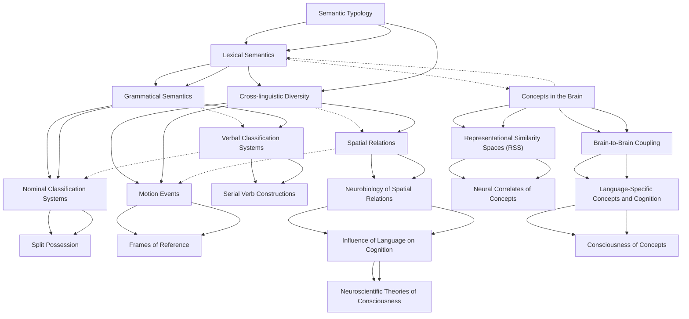

# Zettelkasten 卡片索引

**來源論文**: Kemmerer2019_Concepts_Brain
**作者**: 
**年份**: 2025
**生成日期**: 2025-10-29 15:51
**卡片總數**: 20

---

## 📚 卡片清單

### 1. [Semantic Typology](zettel_cards/Linguistics-20251029-001.md)
- **ID**: `Linguistics-20251029-001`
- **類型**: 
- **核心**: "Within the broad field of linguistics, the division that concentrates on cross- linguistic similarities and differences is called typology, and within it the branch that focuses even more narrowly on conceptual represen- tation is called semantic typology"
- **標籤**: `Linguistics`, `Semantic Typology`, `Cross-linguistic comparison`

### 2. [Lexical Semantics](zettel_cards/Linguistics-20251029-002.md)
- **ID**: `Linguistics-20251029-002`
- **類型**: 
- **核心**: "Lexical semantics"
- **標籤**: `Lexical Semantics`, `Semantics`, `Words`

### 3. [Grammatical Semantics](zettel_cards/Linguistics-20251029-003.md)
- **ID**: `Linguistics-20251029-003`
- **類型**: 
- **核心**: "Grammatical semantics"
- **標籤**: `Grammatical Semantics`, `Grammar`, `Semantics`

### 4. [Cross-linguistic Diversity](zettel_cards/Linguistics-20251029-004.md)
- **ID**: `Linguistics-20251029-004`
- **類型**: 
- **核心**: "even though there are many similarities in how human languages carve up the world into multifarious conceptual categories, there are far more differences."
- **標籤**: `Cross-linguistic Diversity`, `Linguistic Typology`, `Language Variation`

### 5. [Concepts in the Brain](zettel_cards/Linguistics-20251029-005.md)
- **ID**: `Linguistics-20251029-005`
- **類型**: 
- **核心**: "Flexible, multilevel models of the neural substrates of concepts"
- **標籤**: `Concepts`, `Brain`, `Cognitive Neuroscience`, `Neural Substrates`

### 6. [Nominal Classification Systems](zettel_cards/Linguistics-20251029-006.md)
- **ID**: `Linguistics-20251029-006`
- **類型**: 
- **核心**: "Nominal classification systems"
- **標籤**: `Nominal Classification`, `Noun Classes`, `Grammar`

### 7. [Verbal Classification Systems](zettel_cards/Linguistics-20251029-007.md)
- **ID**: `Linguistics-20251029-007`
- **類型**: 
- **核心**: "Verbal classification systems"
- **標籤**: `Verbal Classification`, `Verb Classes`, `Grammar`

### 8. [Motion Events](zettel_cards/Linguistics-20251029-008.md)
- **ID**: `Linguistics-20251029-008`
- **類型**: 
- **核心**: "Motion events"
- **標籤**: `Motion Events`, `Spatial Language`, `Verbs`, `Frames of Reference`

### 9. [Spatial Relations](zettel_cards/Linguistics-20251029-009.md)
- **ID**: `Linguistics-20251029-009`
- **類型**: 
- **核心**: "Typology"
- **標籤**: `Spatial Relations`, `Spatial Language`, `Prepositions`

### 10. [Representational Similarity Spaces (RSS)](zettel_cards/Linguistics-20251029-010.md)
- **ID**: `Linguistics-20251029-010`
- **類型**: 
- **核心**: "Representational similarity spaces in the brain"
- **標籤**: `Representational Similarity Analysis`, `Cognitive Neuroscience`, `Brain Imaging`, `Concepts`

### 11. [Brain-to-Brain Coupling](zettel_cards/Linguistics-20251029-011.md)
- **ID**: `Linguistics-20251029-011`
- **類型**: 
- **核心**: "Linguistic communication as brain- to- brain coupling"
- **標籤**: `Brain-to-Brain Coupling`, `Communication`, `Neuroscience`, `Language`

### 12. [Split Possession](zettel_cards/Linguistics-20251029-012.md)
- **ID**: `Linguistics-20251029-012`
- **類型**: 
- **核心**: "Split possession"
- **標籤**: `Possession`, `Grammar`, `Nouns`

### 13. [Serial Verb Constructions](zettel_cards/Linguistics-20251029-013.md)
- **ID**: `Linguistics-20251029-013`
- **類型**: 
- **核心**: "Serial verb constructions"
- **標籤**: `Serial Verb Constructions`, `Verbs`, `Syntax`

### 14. [Frames of Reference](zettel_cards/Linguistics-20251029-014.md)
- **ID**: `Linguistics-20251029-014`
- **類型**: 
- **核心**: "Frames of Reference"
- **標籤**: `Frames of Reference`, `Spatial Language`, `Motion Events`

### 15. [Neurobiology of Spatial Relations](zettel_cards/Linguistics-20251029-015.md)
- **ID**: `Linguistics-20251029-015`
- **類型**: 
- **核心**: "Neurobiology"
- **標籤**: `Spatial Relations`, `Brain`, `Neuroscience`, `Hippocampus`

### 16. [Neural Correlates of Concepts](zettel_cards/Linguistics-20251029-016.md)
- **ID**: `Linguistics-20251029-016`
- **類型**: 
- **核心**: "Partly shared neural substrates for verbal and nonverbal semantic tasks: Insights and uncertainties"
- **標籤**: `Neural Correlates`, `Semantic Tasks`, `Verbal`, `Nonverbal`

### 17. [Language-Specific Concepts and Cognition](zettel_cards/Linguistics-20251029-017.md)
- **ID**: `Linguistics-20251029-017`
- **類型**: 
- **核心**: "How Do Language- Specific Concepts Relate to Cognition?"
- **標籤**: `Language-Specific Concepts`, `Cognition`, `Linguistic Relativity`

### 18. [Influence of Language on Cognition](zettel_cards/Linguistics-20251029-018.md)
- **ID**: `Linguistics-20251029-018`
- **類型**: 
- **核心**: "Language- specific concepts nonetheless do influence some forms of cognition"
- **標籤**: `Cognition`, `Language`, `Language-Specific Concepts`

### 19. [Consciousness of Concepts](zettel_cards/Linguistics-20251029-019.md)
- **ID**: `Linguistics-20251029-019`
- **類型**: 
- **核心**: "Are We Ever Conscious of Concepts?"
- **標籤**: `Consciousness`, `Concepts`, `Neuroscience`

### 20. [Neuroscientific Theories of Consciousness](zettel_cards/Linguistics-20251029-020.md)
- **ID**: `Linguistics-20251029-020`
- **類型**: 
- **核心**: "Implications for neuroscientific theories of consciousness"
- **標籤**: `Consciousness`, `Theories`, `Neuroscience`

---

## 🗺️ 概念網絡圖

---

## 🏷️ 標籤索引

### Linguistics
- [[Linguistics-20251029-001]] Semantic Typology

### Semantic Typology
- [[Linguistics-20251029-001]] Semantic Typology

### Cross-linguistic comparison
- [[Linguistics-20251029-001]] Semantic Typology

### Lexical Semantics
- [[Linguistics-20251029-002]] Lexical Semantics

### Semantics
- [[Linguistics-20251029-002]] Lexical Semantics
- [[Linguistics-20251029-003]] Grammatical Semantics

### Words
- [[Linguistics-20251029-002]] Lexical Semantics

### Grammatical Semantics
- [[Linguistics-20251029-003]] Grammatical Semantics

### Grammar
- [[Linguistics-20251029-003]] Grammatical Semantics
- [[Linguistics-20251029-006]] Nominal Classification Systems
- [[Linguistics-20251029-007]] Verbal Classification Systems
- [[Linguistics-20251029-012]] Split Possession

### Cross-linguistic Diversity
- [[Linguistics-20251029-004]] Cross-linguistic Diversity

### Linguistic Typology
- [[Linguistics-20251029-004]] Cross-linguistic Diversity

### Language Variation
- [[Linguistics-20251029-004]] Cross-linguistic Diversity

### Concepts
- [[Linguistics-20251029-005]] Concepts in the Brain
- [[Linguistics-20251029-010]] Representational Similarity Spaces (RSS)
- [[Linguistics-20251029-019]] Consciousness of Concepts

### Brain
- [[Linguistics-20251029-005]] Concepts in the Brain
- [[Linguistics-20251029-015]] Neurobiology of Spatial Relations

### Cognitive Neuroscience
- [[Linguistics-20251029-005]] Concepts in the Brain
- [[Linguistics-20251029-010]] Representational Similarity Spaces (RSS)

### Neural Substrates
- [[Linguistics-20251029-005]] Concepts in the Brain

### Nominal Classification
- [[Linguistics-20251029-006]] Nominal Classification Systems

### Noun Classes
- [[Linguistics-20251029-006]] Nominal Classification Systems

### Verbal Classification
- [[Linguistics-20251029-007]] Verbal Classification Systems

### Verb Classes
- [[Linguistics-20251029-007]] Verbal Classification Systems

### Motion Events
- [[Linguistics-20251029-008]] Motion Events
- [[Linguistics-20251029-014]] Frames of Reference

### Spatial Language
- [[Linguistics-20251029-008]] Motion Events
- [[Linguistics-20251029-009]] Spatial Relations
- [[Linguistics-20251029-014]] Frames of Reference

### Verbs
- [[Linguistics-20251029-008]] Motion Events
- [[Linguistics-20251029-013]] Serial Verb Constructions

### Frames of Reference
- [[Linguistics-20251029-008]] Motion Events
- [[Linguistics-20251029-014]] Frames of Reference

### Spatial Relations
- [[Linguistics-20251029-009]] Spatial Relations
- [[Linguistics-20251029-015]] Neurobiology of Spatial Relations

### Prepositions
- [[Linguistics-20251029-009]] Spatial Relations

### Representational Similarity Analysis
- [[Linguistics-20251029-010]] Representational Similarity Spaces (RSS)

### Brain Imaging
- [[Linguistics-20251029-010]] Representational Similarity Spaces (RSS)

### Brain-to-Brain Coupling
- [[Linguistics-20251029-011]] Brain-to-Brain Coupling

### Communication
- [[Linguistics-20251029-011]] Brain-to-Brain Coupling

### Neuroscience
- [[Linguistics-20251029-011]] Brain-to-Brain Coupling
- [[Linguistics-20251029-015]] Neurobiology of Spatial Relations
- [[Linguistics-20251029-019]] Consciousness of Concepts
- [[Linguistics-20251029-020]] Neuroscientific Theories of Consciousness

### Language
- [[Linguistics-20251029-011]] Brain-to-Brain Coupling
- [[Linguistics-20251029-018]] Influence of Language on Cognition

### Possession
- [[Linguistics-20251029-012]] Split Possession

### Nouns
- [[Linguistics-20251029-012]] Split Possession

### Serial Verb Constructions
- [[Linguistics-20251029-013]] Serial Verb Constructions

### Syntax
- [[Linguistics-20251029-013]] Serial Verb Constructions

### Hippocampus
- [[Linguistics-20251029-015]] Neurobiology of Spatial Relations

### Neural Correlates
- [[Linguistics-20251029-016]] Neural Correlates of Concepts

### Semantic Tasks
- [[Linguistics-20251029-016]] Neural Correlates of Concepts

### Verbal
- [[Linguistics-20251029-016]] Neural Correlates of Concepts

### Nonverbal
- [[Linguistics-20251029-016]] Neural Correlates of Concepts

### Language-Specific Concepts
- [[Linguistics-20251029-017]] Language-Specific Concepts and Cognition
- [[Linguistics-20251029-018]] Influence of Language on Cognition

### Cognition
- [[Linguistics-20251029-017]] Language-Specific Concepts and Cognition
- [[Linguistics-20251029-018]] Influence of Language on Cognition

### Linguistic Relativity
- [[Linguistics-20251029-017]] Language-Specific Concepts and Cognition

### Consciousness
- [[Linguistics-20251029-019]] Consciousness of Concepts
- [[Linguistics-20251029-020]] Neuroscientific Theories of Consciousness

### Theories
- [[Linguistics-20251029-020]] Neuroscientific Theories of Consciousness

---

## 📖 閱讀建議順序

1. [[Linguistics-20251029-012]] Split Possession

2. [[Linguistics-20251029-013]] Serial Verb Constructions

3. [[Linguistics-20251029-014]] Frames of Reference

4. [[Linguistics-20251029-016]] Neural Correlates of Concepts

5. [[Linguistics-20251029-019]] Consciousness of Concepts

6. [[Linguistics-20251029-020]] Neuroscientific Theories of Consciousness

7. [[Linguistics-20251029-002]] Lexical Semantics

8. [[Linguistics-20251029-006]] Nominal Classification Systems

9. [[Linguistics-20251029-007]] Verbal Classification Systems

10. [[Linguistics-20251029-008]] Motion Events

11. [[Linguistics-20251029-009]] Spatial Relations

12. [[Linguistics-20251029-010]] Representational Similarity Spaces (RSS)

13. [[Linguistics-20251029-011]] Brain-to-Brain Coupling

14. [[Linguistics-20251029-015]] Neurobiology of Spatial Relations

15. [[Linguistics-20251029-017]] Language-Specific Concepts and Cognition

16. [[Linguistics-20251029-018]] Influence of Language on Cognition

17. [[Linguistics-20251029-001]] Semantic Typology

18. [[Linguistics-20251029-003]] Grammatical Semantics

19. [[Linguistics-20251029-004]] Cross-linguistic Diversity

20. [[Linguistics-20251029-005]] Concepts in the Brain

---

*本索引由 Knowledge Production System 自動生成*