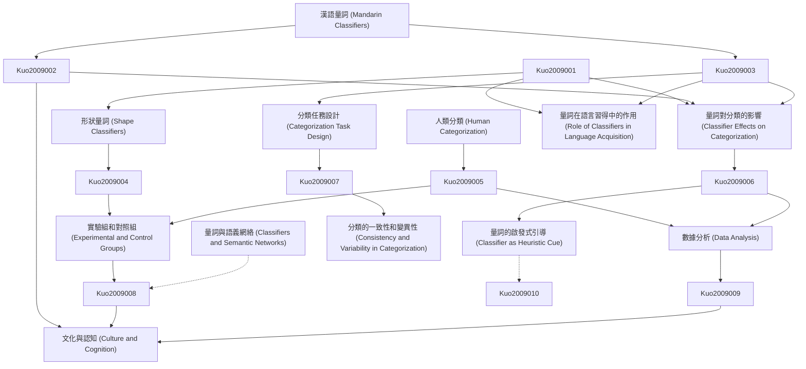

# Zettelkasten 卡片索引

**來源論文**: Classifier Effects on Human Categorization: The Role of Shape Classifiers in Mandarin Chinese
**作者**: kuo, jenny yi-chun, sera, maria d.
**年份**: None
**生成日期**: 2025-11-04 15:10
**卡片總數**: 12

---

## 📚 卡片清單

### 1. [漢語量詞 (Mandarin Classifiers)](zettel_cards/Kuo-2009-001.md)
- **ID**: `Kuo-2009-001`
- **類型**: 
- **核心**: 量詞是漢語中用來分類名詞的詞彙單位，它們出現在數詞和名詞之間。
- **標籤**: `漢語`, `量詞`, `語法`

### 2. [形狀量詞 (Shape Classifiers)](zettel_cards/Kuo-2009-002.md)
- **ID**: `Kuo-2009-002`
- **類型**: 
- **核心**: 形狀量詞是根據名詞所指事物的形狀進行分類的量詞，例如「一片葉子」中的「片」。
- **標籤**: `漢語`, `量詞`, `形狀`, `語義`

### 3. [人類分類 (Human Categorization)](zettel_cards/Kuo-2009-003.md)
- **ID**: `Kuo-2009-003`
- **類型**: 
- **核心**: 人類分類是指人類將事物組織成類別的認知過程，基於相似性和差異性。
- **標籤**: `認知`, `分類`, `心理學`, `語義`

### 4. [量詞對分類的影響 (Classifier Effects on Categorization)](zettel_cards/Kuo-2009-004.md)
- **ID**: `Kuo-2009-004`
- **類型**: 
- **核心**: 量詞的使用可能會影響人們對名詞所指事物的分類方式和認知。
- **標籤**: `漢語`, `量詞`, `分類`, `認知`

### 5. [分類任務設計 (Categorization Task Design)](zettel_cards/Kuo-2009-005.md)
- **ID**: `Kuo-2009-005`
- **類型**: 
- **核心**: 分類任務設計旨在通過實驗來研究人類的分類行為，通常包括提供一系列刺激，並要求參與者將它們分組。
- **標籤**: `實驗`, `分類`, `心理學`, `方法`

### 6. [實驗組和對照組 (Experimental and Control Groups)](zettel_cards/Kuo-2009-006.md)
- **ID**: `Kuo-2009-006`
- **類型**: 
- **核心**: 實驗組接受特定的量詞引導，對照組則沒有，用於比較量詞是否對分類產生影響。
- **標籤**: `實驗`, `設計`, `控制`, `方法`

### 7. [數據分析 (Data Analysis)](zettel_cards/Kuo-2009-007.md)
- **ID**: `Kuo-2009-007`
- **類型**: 
- **核心**: 使用統計方法分析分類數據，以確定量詞對分類行為的顯著影響。
- **標籤**: `統計`, `分析`, `數據`, `方法`

### 8. [量詞的啟發式引導 (Classifier as Heuristic Cue)](zettel_cards/Kuo-2009-008.md)
- **ID**: `Kuo-2009-008`
- **類型**: 
- **核心**: 量詞可以作為一種啟發式線索，引導人們對事物進行分類。
- **標籤**: `量詞`, `啟發式`, `分類`, `認知`

### 9. [分類的一致性和變異性 (Consistency and Variability in Categorization)](zettel_cards/Kuo-2009-009.md)
- **ID**: `Kuo-2009-009`
- **類型**: 
- **核心**: 量詞可能會提高或降低分類的一致性，取決於量詞的語義明確性和文化相關性。
- **標籤**: `量詞`, `分類`, `一致性`, `變異性`

### 10. [量詞與語義網絡 (Classifiers and Semantic Networks)](zettel_cards/Kuo-2009-010.md)
- **ID**: `Kuo-2009-010`
- **類型**: 
- **核心**: 量詞在語義網絡中扮演節點角色，與特定名詞及其屬性相關聯，影響概念激活和語義推理。
- **標籤**: `語義網絡`, `量詞`, `概念`, `認知`

### 11. [文化與認知 (Culture and Cognition)](zettel_cards/Kuo-2009-011.md)
- **ID**: `Kuo-2009-011`
- **類型**: 
- **核心**: 文化背景如何影響人們對量詞的理解和使用，以及量詞如何反過來影響人們的認知方式？
- **標籤**: `文化`, `認知`, `量詞`, `漢語`

### 12. [量詞在語言習得中的作用 (Role of Classifiers in Language Acquisition)](zettel_cards/Kuo-2009-012.md)
- **ID**: `Kuo-2009-012`
- **類型**: 
- **核心**: 量詞的習得對兒童的認知發展有何影響？
- **標籤**: `語言習得`, `量詞`, `認知發展`, `兒童`

---

## 🗺️ 概念網絡圖

---

## 🏷️ 標籤索引

### 漢語
- [[Kuo-2009-001]] 漢語量詞 (Mandarin Classifiers)
- [[Kuo-2009-002]] 形狀量詞 (Shape Classifiers)
- [[Kuo-2009-004]] 量詞對分類的影響 (Classifier Effects on Categorization)
- [[Kuo-2009-011]] 文化與認知 (Culture and Cognition)

### 量詞
- [[Kuo-2009-001]] 漢語量詞 (Mandarin Classifiers)
- [[Kuo-2009-002]] 形狀量詞 (Shape Classifiers)
- [[Kuo-2009-004]] 量詞對分類的影響 (Classifier Effects on Categorization)
- [[Kuo-2009-008]] 量詞的啟發式引導 (Classifier as Heuristic Cue)
- [[Kuo-2009-009]] 分類的一致性和變異性 (Consistency and Variability in Categorization)
- [[Kuo-2009-010]] 量詞與語義網絡 (Classifiers and Semantic Networks)
- [[Kuo-2009-011]] 文化與認知 (Culture and Cognition)
- [[Kuo-2009-012]] 量詞在語言習得中的作用 (Role of Classifiers in Language Acquisition)

### 語法
- [[Kuo-2009-001]] 漢語量詞 (Mandarin Classifiers)

### 形狀
- [[Kuo-2009-002]] 形狀量詞 (Shape Classifiers)

### 語義
- [[Kuo-2009-002]] 形狀量詞 (Shape Classifiers)
- [[Kuo-2009-003]] 人類分類 (Human Categorization)

### 認知
- [[Kuo-2009-003]] 人類分類 (Human Categorization)
- [[Kuo-2009-004]] 量詞對分類的影響 (Classifier Effects on Categorization)
- [[Kuo-2009-008]] 量詞的啟發式引導 (Classifier as Heuristic Cue)
- [[Kuo-2009-010]] 量詞與語義網絡 (Classifiers and Semantic Networks)
- [[Kuo-2009-011]] 文化與認知 (Culture and Cognition)

### 分類
- [[Kuo-2009-003]] 人類分類 (Human Categorization)
- [[Kuo-2009-004]] 量詞對分類的影響 (Classifier Effects on Categorization)
- [[Kuo-2009-005]] 分類任務設計 (Categorization Task Design)
- [[Kuo-2009-008]] 量詞的啟發式引導 (Classifier as Heuristic Cue)
- [[Kuo-2009-009]] 分類的一致性和變異性 (Consistency and Variability in Categorization)

### 心理學
- [[Kuo-2009-003]] 人類分類 (Human Categorization)
- [[Kuo-2009-005]] 分類任務設計 (Categorization Task Design)

### 實驗
- [[Kuo-2009-005]] 分類任務設計 (Categorization Task Design)
- [[Kuo-2009-006]] 實驗組和對照組 (Experimental and Control Groups)

### 方法
- [[Kuo-2009-005]] 分類任務設計 (Categorization Task Design)
- [[Kuo-2009-006]] 實驗組和對照組 (Experimental and Control Groups)
- [[Kuo-2009-007]] 數據分析 (Data Analysis)

### 設計
- [[Kuo-2009-006]] 實驗組和對照組 (Experimental and Control Groups)

### 控制
- [[Kuo-2009-006]] 實驗組和對照組 (Experimental and Control Groups)

### 統計
- [[Kuo-2009-007]] 數據分析 (Data Analysis)

### 分析
- [[Kuo-2009-007]] 數據分析 (Data Analysis)

### 數據
- [[Kuo-2009-007]] 數據分析 (Data Analysis)

### 啟發式
- [[Kuo-2009-008]] 量詞的啟發式引導 (Classifier as Heuristic Cue)

### 一致性
- [[Kuo-2009-009]] 分類的一致性和變異性 (Consistency and Variability in Categorization)

### 變異性
- [[Kuo-2009-009]] 分類的一致性和變異性 (Consistency and Variability in Categorization)

### 語義網絡
- [[Kuo-2009-010]] 量詞與語義網絡 (Classifiers and Semantic Networks)

### 概念
- [[Kuo-2009-010]] 量詞與語義網絡 (Classifiers and Semantic Networks)

### 文化
- [[Kuo-2009-011]] 文化與認知 (Culture and Cognition)

### 語言習得
- [[Kuo-2009-012]] 量詞在語言習得中的作用 (Role of Classifiers in Language Acquisition)

### 認知發展
- [[Kuo-2009-012]] 量詞在語言習得中的作用 (Role of Classifiers in Language Acquisition)

### 兒童
- [[Kuo-2009-012]] 量詞在語言習得中的作用 (Role of Classifiers in Language Acquisition)

---

## 📖 閱讀建議順序

1. [[Kuo-2009-001]] 漢語量詞 (Mandarin Classifiers)

2. [[Kuo-2009-002]] 形狀量詞 (Shape Classifiers)

3. [[Kuo-2009-003]] 人類分類 (Human Categorization)

4. [[Kuo-2009-004]] 量詞對分類的影響 (Classifier Effects on Categorization)

5. [[Kuo-2009-005]] 分類任務設計 (Categorization Task Design)

6. [[Kuo-2009-006]] 實驗組和對照組 (Experimental and Control Groups)

7. [[Kuo-2009-007]] 數據分析 (Data Analysis)

8. [[Kuo-2009-008]] 量詞的啟發式引導 (Classifier as Heuristic Cue)

9. [[Kuo-2009-009]] 分類的一致性和變異性 (Consistency and Variability in Categorization)

10. [[Kuo-2009-010]] 量詞與語義網絡 (Classifiers and Semantic Networks)

11. [[Kuo-2009-011]] 文化與認知 (Culture and Cognition)

12. [[Kuo-2009-012]] 量詞在語言習得中的作用 (Role of Classifiers in Language Acquisition)

---

*本索引由 Knowledge Production System 自動生成*