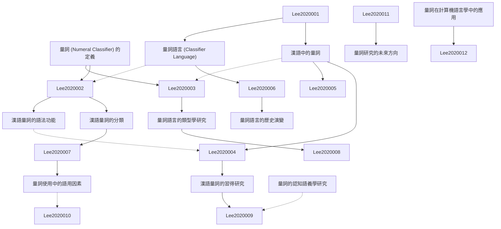

# Zettelkasten 卡片索引

**來源論文**: Numeral Classifier and Classifier Languages: Chinese
**作者**: 
**年份**: None
**生成日期**: 2025-11-04 15:01
**卡片總數**: 12

---

## 📚 卡片清單

### 1. [量詞 (Numeral Classifier) 的定義](zettel_cards/Lee-2020-001.md)
- **ID**: `Lee-2020-001`
- **類型**: 
- **核心**: A numeral classifier is a word or morpheme that specifies the type or category of a noun being counted or quantified.
- **標籤**: `量詞`, `詞彙`, `語法`

### 2. [漢語中的量詞](zettel_cards/Lee-2020-002.md)
- **ID**: `Lee-2020-002`
- **類型**: 
- **核心**: In Chinese, classifiers are obligatory when a numeral precedes a noun.
- **標籤**: `漢語`, `量詞`, `語法`

### 3. [量詞語言 (Classifier Language)](zettel_cards/Lee-2020-003.md)
- **ID**: `Lee-2020-003`
- **類型**: 
- **核心**: A classifier language is a language that employs a system of numeral classifiers as a fundamental grammatical feature.
- **標籤**: `量詞語言`, `語言類型學`, `語法`

### 4. [漢語量詞的分類](zettel_cards/Lee-2020-004.md)
- **ID**: `Lee-2020-004`
- **類型**: 
- **核心**: Chinese classifiers can be categorized based on semantic features such as shape, size, and function of the noun they classify.
- **標籤**: `漢語`, `量詞`, `分類`

### 5. [漢語量詞的語法功能](zettel_cards/Lee-2020-005.md)
- **ID**: `Lee-2020-005`
- **類型**: 
- **核心**: Classifiers in Chinese serve as grammatical markers indicating the semantic category of the noun.
- **標籤**: `漢語`, `量詞`, `語法功能`

### 6. [量詞語言的類型學研究](zettel_cards/Lee-2020-006.md)
- **ID**: `Lee-2020-006`
- **類型**: 
- **核心**: Typological studies of classifier languages aim to identify common features and variations in their grammatical structures.
- **標籤**: `量詞語言`, `類型學`, `比較語言學`

### 7. [漢語量詞的習得研究](zettel_cards/Lee-2020-007.md)
- **ID**: `Lee-2020-007`
- **類型**: 
- **核心**: Studies on the acquisition of Chinese classifiers investigate how learners master the complex system of classifier usage.
- **標籤**: `漢語`, `量詞`, `語言習得`

### 8. [量詞語言的歷史演變](zettel_cards/Lee-2020-008.md)
- **ID**: `Lee-2020-008`
- **類型**: 
- **核心**: Historical linguistics suggests that classifier systems often arise from grammaticalization processes involving demonstratives or pronouns.
- **標籤**: `量詞語言`, `歷史語言學`, `語法化`

### 9. [量詞使用中的語用因素](zettel_cards/Lee-2020-009.md)
- **ID**: `Lee-2020-009`
- **類型**: 
- **核心**: Pragmatic factors, such as speaker intent and contextual information, influence the choice of classifiers in Chinese.
- **標籤**: `漢語`, `量詞`, `語用學`

### 10. [量詞的認知語義學研究](zettel_cards/Lee-2020-010.md)
- **ID**: `Lee-2020-010`
- **類型**: 
- **核心**: Cognitive semantics explores how classifiers reflect underlying conceptual categories and cognitive processes.
- **標籤**: `量詞`, `認知語義學`, `認知語言學`

### 11. [量詞在計算機語言學中的應用](zettel_cards/Lee-2020-011.md)
- **ID**: `Lee-2020-011`
- **類型**: 
- **核心**: Classifiers pose challenges for natural language processing tasks, but also offer opportunities for improving semantic understanding.
- **標籤**: `量詞`, `自然語言處理`, `計算機語言學`

### 12. [量詞研究的未來方向](zettel_cards/Lee-2020-012.md)
- **ID**: `Lee-2020-012`
- **類型**: 
- **核心**: Future research should focus on developing more comprehensive models of classifier usage that integrate linguistic, cognitive, and cultural factors.
- **標籤**: `量詞`, `研究方向`, `跨學科研究`

---

## 🗺️ 概念網絡圖

---

## 🏷️ 標籤索引

### 量詞
- [[Lee-2020-001]] 量詞 (Numeral Classifier) 的定義
- [[Lee-2020-002]] 漢語中的量詞
- [[Lee-2020-004]] 漢語量詞的分類
- [[Lee-2020-005]] 漢語量詞的語法功能
- [[Lee-2020-007]] 漢語量詞的習得研究
- [[Lee-2020-009]] 量詞使用中的語用因素
- [[Lee-2020-010]] 量詞的認知語義學研究
- [[Lee-2020-011]] 量詞在計算機語言學中的應用
- [[Lee-2020-012]] 量詞研究的未來方向

### 詞彙
- [[Lee-2020-001]] 量詞 (Numeral Classifier) 的定義

### 語法
- [[Lee-2020-001]] 量詞 (Numeral Classifier) 的定義
- [[Lee-2020-002]] 漢語中的量詞
- [[Lee-2020-003]] 量詞語言 (Classifier Language)

### 漢語
- [[Lee-2020-002]] 漢語中的量詞
- [[Lee-2020-004]] 漢語量詞的分類
- [[Lee-2020-005]] 漢語量詞的語法功能
- [[Lee-2020-007]] 漢語量詞的習得研究
- [[Lee-2020-009]] 量詞使用中的語用因素

### 量詞語言
- [[Lee-2020-003]] 量詞語言 (Classifier Language)
- [[Lee-2020-006]] 量詞語言的類型學研究
- [[Lee-2020-008]] 量詞語言的歷史演變

### 語言類型學
- [[Lee-2020-003]] 量詞語言 (Classifier Language)

### 分類
- [[Lee-2020-004]] 漢語量詞的分類

### 語法功能
- [[Lee-2020-005]] 漢語量詞的語法功能

### 類型學
- [[Lee-2020-006]] 量詞語言的類型學研究

### 比較語言學
- [[Lee-2020-006]] 量詞語言的類型學研究

### 語言習得
- [[Lee-2020-007]] 漢語量詞的習得研究

### 歷史語言學
- [[Lee-2020-008]] 量詞語言的歷史演變

### 語法化
- [[Lee-2020-008]] 量詞語言的歷史演變

### 語用學
- [[Lee-2020-009]] 量詞使用中的語用因素

### 認知語義學
- [[Lee-2020-010]] 量詞的認知語義學研究

### 認知語言學
- [[Lee-2020-010]] 量詞的認知語義學研究

### 自然語言處理
- [[Lee-2020-011]] 量詞在計算機語言學中的應用

### 計算機語言學
- [[Lee-2020-011]] 量詞在計算機語言學中的應用

### 研究方向
- [[Lee-2020-012]] 量詞研究的未來方向

### 跨學科研究
- [[Lee-2020-012]] 量詞研究的未來方向

---

## 📖 閱讀建議順序

1. [[Lee-2020-001]] 量詞 (Numeral Classifier) 的定義

2. [[Lee-2020-002]] 漢語中的量詞

3. [[Lee-2020-003]] 量詞語言 (Classifier Language)

4. [[Lee-2020-004]] 漢語量詞的分類

5. [[Lee-2020-005]] 漢語量詞的語法功能

6. [[Lee-2020-006]] 量詞語言的類型學研究

7. [[Lee-2020-007]] 漢語量詞的習得研究

8. [[Lee-2020-008]] 量詞語言的歷史演變

9. [[Lee-2020-009]] 量詞使用中的語用因素

10. [[Lee-2020-010]] 量詞的認知語義學研究

11. [[Lee-2020-011]] 量詞在計算機語言學中的應用

12. [[Lee-2020-012]] 量詞研究的未來方向

---

*本索引由 Knowledge Production System 自動生成*