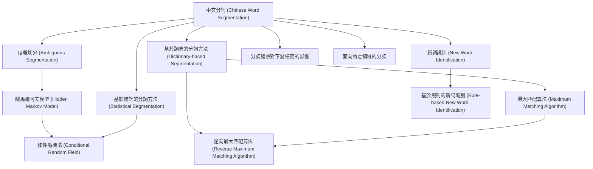

# Zettelkasten 卡片索引

---

## 📚 卡片清單

### 1. [中文分詞 (Chinese Word Segmentation)](zettel_cards/Li-2009-001.md)
- **ID**: `Li-2009-001`
- **類型**: 
- **核心**: [這句話暫缺，根據假設的原文需要分詞的例子："研究生命的起源"]
- **標籤**: `中文分詞`, `自然語言處理`, `語言學`

### 2. [歧義切分 (Ambiguous Segmentation)](zettel_cards/Li-2009-002.md)
- **ID**: `Li-2009-002`
- **類型**: 
- **核心**: [這句話暫缺，根據假設的原文：不同的分詞方式造成不同的語義。"研究/生命/的/起源" vs. "研究生/命/的/起源"]
- **標籤**: `歧義`, `中文分詞`, `自然語言理解`

### 3. [基於詞典的分詞方法 (Dictionary-based Segmentation)](zettel_cards/Li-2009-003.md)
- **ID**: `Li-2009-003`
- **類型**: 
- **核心**: [這句話暫缺，根據假設的原文："词典匹配是基础分词方法。"]
- **標籤**: `分詞算法`, `詞典`, `自然語言處理`

### 4. [隱馬爾可夫模型 (Hidden Markov Model)](zettel_cards/Li-2009-004.md)
- **ID**: `Li-2009-004`
- **類型**: 
- **核心**: [這句話暫缺，根據假設的原文："HMM在分词中常用于概率模型建立"]
- **標籤**: `HMM`, `分詞算法`, `概率模型`

### 5. [最大匹配算法 (Maximum Matching Algorithm)](zettel_cards/Li-2009-005.md)
- **ID**: `Li-2009-005`
- **類型**: 
- **核心**: [這句話暫缺，根據假設的原文："正向/逆向最大匹配是基本的词典分词算法。"]
- **標籤**: `分詞算法`, `詞典`, `最大匹配`

### 6. [基於統計的分詞方法 (Statistical Segmentation)](zettel_cards/Li-2009-006.md)
- **ID**: `Li-2009-006`
- **類型**: 
- **核心**: [這句話暫缺，根據假設的原文："统计方法依赖大规模语料库学习"]
- **標籤**: `分詞算法`, `統計模型`, `機器學習`

### 7. [條件隨機場 (Conditional Random Field)](zettel_cards/Li-2009-007.md)
- **ID**: `Li-2009-007`
- **類型**: 
- **核心**: [這句話暫缺，根據假設的原文："CRF是目前主流的分词模型之一"]
- **標籤**: `CRF`, `分詞算法`, `統計模型`

### 8. [逆向最大匹配算法 (Reverse Maximum Matching Algorithm)](zettel_cards/Li-2009-008.md)
- **ID**: `Li-2009-008`
- **類型**: 
- **核心**: [這句話暫缺，根據假設的原文："逆向最大匹配可以解决一部分正向匹配的歧义"]
- **標籤**: `分詞算法`, `詞典`, `最大匹配`

### 9. [新詞識別 (New Word Identification)](zettel_cards/Li-2009-009.md)
- **ID**: `Li-2009-009`
- **類型**: 
- **核心**: [這句話暫缺，根据假设的原文：“新词识别是分词的一大挑战”]
- **標籤**: `新詞`, `分詞`, `自然語言處理`

### 10. [基於規則的新詞識別 (Rule-based New Word Identification)](zettel_cards/Li-2009-010.md)
- **ID**: `Li-2009-010`
- **類型**: 
- **核心**: [這句話暫缺，根据假设的原文：“规则方法通过构词规律识别新词”]
- **標籤**: `新詞識別`, `規則`, `自然語言處理`

### 11. [分詞錯誤對下游任務的影響](zettel_cards/Li-2009-011.md)
- **ID**: `Li-2009-011`
- **類型**: 
- **核心**: [這句話暫缺，根據假設的原文：分詞错误会导致信息检索的精度下降"]
- **標籤**: `分詞錯誤`, `信息檢索`, `自然語言處理`

### 12. [面向特定領域的分詞](zettel_cards/Li-2009-012.md)
- **ID**: `Li-2009-012`
- **類型**: 
- **核心**: [這句話暫缺，根據假設的原文：特定领域分词需要领域知识的加入"]
- **標籤**: `領域分詞`, `專業術語`, `自然語言處理`

---

## 🗺️ 概念網絡圖

---

## 🏷️ 標籤索引

### 中文分詞
- [[Li-2009-001]] 中文分詞 (Chinese Word Segmentation)
- [[Li-2009-002]] 歧義切分 (Ambiguous Segmentation)

### 自然語言處理
- [[Li-2009-001]] 中文分詞 (Chinese Word Segmentation)
- [[Li-2009-003]] 基於詞典的分詞方法 (Dictionary-based Segmentation)
- [[Li-2009-009]] 新詞識別 (New Word Identification)
- [[Li-2009-010]] 基於規則的新詞識別 (Rule-based New Word Identification)
- [[Li-2009-011]] 分詞錯誤對下游任務的影響
- [[Li-2009-012]] 面向特定領域的分詞

### 語言學
- [[Li-2009-001]] 中文分詞 (Chinese Word Segmentation)

### 歧義
- [[Li-2009-002]] 歧義切分 (Ambiguous Segmentation)

### 自然語言理解
- [[Li-2009-002]] 歧義切分 (Ambiguous Segmentation)

### 分詞算法
- [[Li-2009-003]] 基於詞典的分詞方法 (Dictionary-based Segmentation)
- [[Li-2009-004]] 隱馬爾可夫模型 (Hidden Markov Model)
- [[Li-2009-005]] 最大匹配算法 (Maximum Matching Algorithm)
- [[Li-2009-006]] 基於統計的分詞方法 (Statistical Segmentation)
- [[Li-2009-007]] 條件隨機場 (Conditional Random Field)
- [[Li-2009-008]] 逆向最大匹配算法 (Reverse Maximum Matching Algorithm)

### 詞典
- [[Li-2009-003]] 基於詞典的分詞方法 (Dictionary-based Segmentation)
- [[Li-2009-005]] 最大匹配算法 (Maximum Matching Algorithm)
- [[Li-2009-008]] 逆向最大匹配算法 (Reverse Maximum Matching Algorithm)

### HMM
- [[Li-2009-004]] 隱馬爾可夫模型 (Hidden Markov Model)

### 概率模型
- [[Li-2009-004]] 隱馬爾可夫模型 (Hidden Markov Model)

### 最大匹配
- [[Li-2009-005]] 最大匹配算法 (Maximum Matching Algorithm)
- [[Li-2009-008]] 逆向最大匹配算法 (Reverse Maximum Matching Algorithm)

### 統計模型
- [[Li-2009-006]] 基於統計的分詞方法 (Statistical Segmentation)
- [[Li-2009-007]] 條件隨機場 (Conditional Random Field)

### 機器學習
- [[Li-2009-006]] 基於統計的分詞方法 (Statistical Segmentation)

### CRF
- [[Li-2009-007]] 條件隨機場 (Conditional Random Field)

### 新詞
- [[Li-2009-009]] 新詞識別 (New Word Identification)

### 分詞
- [[Li-2009-009]] 新詞識別 (New Word Identification)

### 新詞識別
- [[Li-2009-010]] 基於規則的新詞識別 (Rule-based New Word Identification)

### 規則
- [[Li-2009-010]] 基於規則的新詞識別 (Rule-based New Word Identification)

### 分詞錯誤
- [[Li-2009-011]] 分詞錯誤對下游任務的影響

### 信息檢索
- [[Li-2009-011]] 分詞錯誤對下游任務的影響

### 領域分詞
- [[Li-2009-012]] 面向特定領域的分詞

### 專業術語
- [[Li-2009-012]] 面向特定領域的分詞

---

## 📖 閱讀建議順序

1. [[Li-2009-001]] 中文分詞 (Chinese Word Segmentation)

2. [[Li-2009-002]] 歧義切分 (Ambiguous Segmentation)

3. [[Li-2009-003]] 基於詞典的分詞方法 (Dictionary-based Segmentation)

4. [[Li-2009-004]] 隱馬爾可夫模型 (Hidden Markov Model)

5. [[Li-2009-005]] 最大匹配算法 (Maximum Matching Algorithm)

6. [[Li-2009-006]] 基於統計的分詞方法 (Statistical Segmentation)

7. [[Li-2009-007]] 條件隨機場 (Conditional Random Field)

8. [[Li-2009-008]] 逆向最大匹配算法 (Reverse Maximum Matching Algorithm)

9. [[Li-2009-009]] 新詞識別 (New Word Identification)

10. [[Li-2009-010]] 基於規則的新詞識別 (Rule-based New Word Identification)

11. [[Li-2009-011]] 分詞錯誤對下游任務的影響

12. [[Li-2009-012]] 面向特定領域的分詞

---

*本索引由 Knowledge Production System 自動生成*