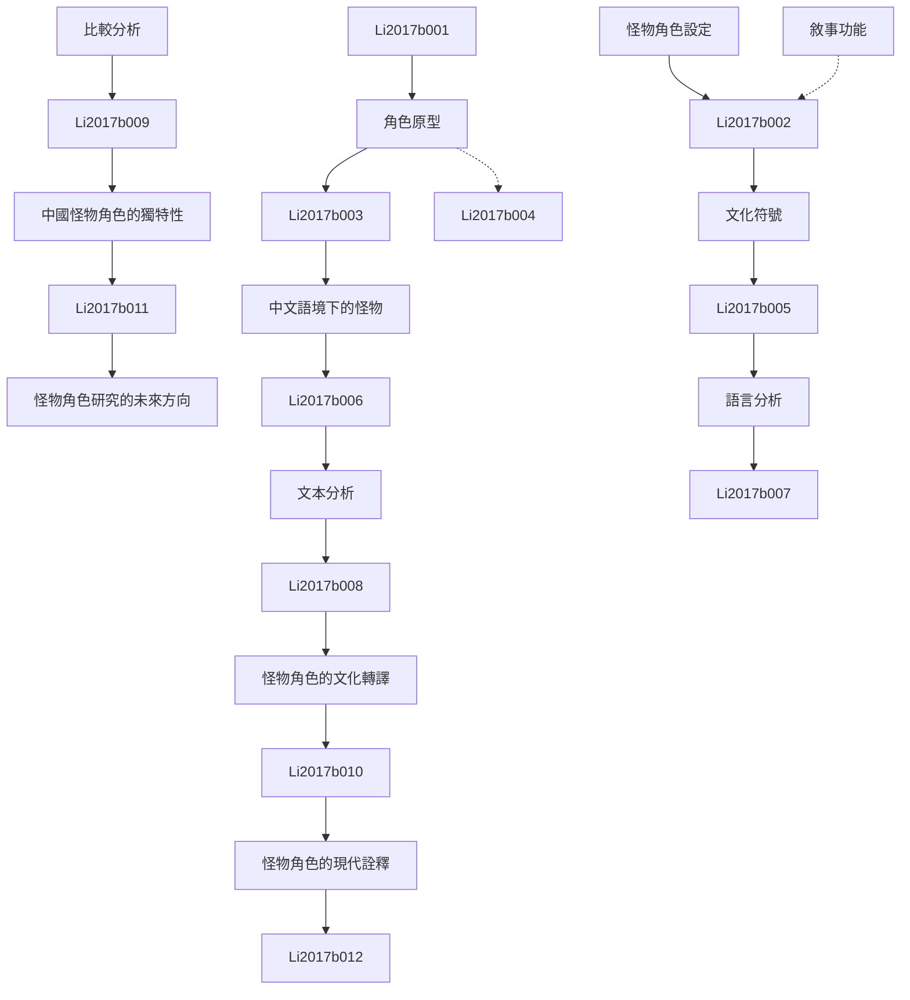

# Zettelkasten 卡片索引

**來源論文**: Monster Character Profiling and Chinese
**作者**: li, larry hong-lin, lin, po-hsien
**年份**: None
**生成日期**: 2025-11-04 14:57
**卡片總數**: 12

---

## 📚 卡片清單

### 1. [怪物角色設定](zettel_cards/Li-2017b-001.md)
- **ID**: `Li-2017b-001`
- **類型**: 
- **核心**: 假設本文探討怪物角色的設計與分析，以及它們在中文語境下的呈現方式。
- **標籤**: `怪物`, `角色設定`, `中文語境`

### 2. [角色原型](zettel_cards/Li-2017b-002.md)
- **ID**: `Li-2017b-002`
- **類型**: 
- **核心**: 假設角色原型是怪物角色設定中的一個重要概念。
- **標籤**: `角色原型`, `怪物`, `設定`

### 3. [文化符號](zettel_cards/Li-2017b-003.md)
- **ID**: `Li-2017b-003`
- **類型**: 
- **核心**: 假設文化符號在怪物角色的意義建構中扮演重要角色。
- **標籤**: `文化符號`, `怪物`, `意義建構`

### 4. [敘事功能](zettel_cards/Li-2017b-004.md)
- **ID**: `Li-2017b-004`
- **類型**: 
- **核心**: 怪物角色在故事中可能具有特定的敘事功能。
- **標籤**: `敘事`, `怪物`, `功能`

### 5. [中文語境下的怪物](zettel_cards/Li-2017b-005.md)
- **ID**: `Li-2017b-005`
- **類型**: 
- **核心**: 假設論文特別關注怪物角色在中文文化語境下的呈現。
- **標籤**: `中文`, `文化`, `怪物`

### 6. [語言分析](zettel_cards/Li-2017b-006.md)
- **ID**: `Li-2017b-006`
- **類型**: 
- **核心**: 假設論文可能採用語言分析的方法來研究怪物角色的呈現。
- **標籤**: `語言分析`, `文本分析`, `方法`

### 7. [文本分析](zettel_cards/Li-2017b-007.md)
- **ID**: `Li-2017b-007`
- **類型**: 
- **核心**: 假設文本分析被用於研究怪物角色在文學作品中的呈現。
- **標籤**: `文本分析`, `文學`, `怪物`

### 8. [比較分析](zettel_cards/Li-2017b-008.md)
- **ID**: `Li-2017b-008`
- **類型**: 
- **核心**: 假設論文可能採用比較分析的方法來研究不同文化背景下的怪物角色。
- **標籤**: `比較分析`, `文化`, `怪物`

### 9. [怪物角色的文化轉譯](zettel_cards/Li-2017b-009.md)
- **ID**: `Li-2017b-009`
- **類型**: 
- **核心**: 假設研究發現怪物角色在跨文化傳播中會發生文化轉譯。
- **標籤**: `文化轉譯`, `怪物`, `跨文化傳播`

### 10. [中國怪物角色的獨特性](zettel_cards/Li-2017b-010.md)
- **ID**: `Li-2017b-010`
- **類型**: 
- **核心**: 假設研究發現中國的怪物角色具有其獨特的文化特徵。
- **標籤**: `中國`, `文化`, `怪物`

### 11. [怪物角色的現代詮釋](zettel_cards/Li-2017b-011.md)
- **ID**: `Li-2017b-011`
- **類型**: 
- **核心**: 假設研究發現現代文學、電影和遊戲對傳統怪物角色進行了新的詮釋。
- **標籤**: `現代`, `文學`, `電影`, `遊戲`, `怪物`

### 12. [怪物角色研究的未來方向](zettel_cards/Li-2017b-012.md)
- **ID**: `Li-2017b-012`
- **類型**: 
- **核心**: 怪物角色的研究還有哪些值得探索的方向？
- **標籤**: `研究方向`, `未來`, `怪物`

---

## 🗺️ 概念網絡圖

---

## 🏷️ 標籤索引

### 怪物
- [[Li-2017b-001]] 怪物角色設定
- [[Li-2017b-002]] 角色原型
- [[Li-2017b-003]] 文化符號
- [[Li-2017b-004]] 敘事功能
- [[Li-2017b-005]] 中文語境下的怪物
- [[Li-2017b-007]] 文本分析
- [[Li-2017b-008]] 比較分析
- [[Li-2017b-009]] 怪物角色的文化轉譯
- [[Li-2017b-010]] 中國怪物角色的獨特性
- [[Li-2017b-011]] 怪物角色的現代詮釋
- [[Li-2017b-012]] 怪物角色研究的未來方向

### 角色設定
- [[Li-2017b-001]] 怪物角色設定

### 中文語境
- [[Li-2017b-001]] 怪物角色設定

### 角色原型
- [[Li-2017b-002]] 角色原型

### 設定
- [[Li-2017b-002]] 角色原型

### 文化符號
- [[Li-2017b-003]] 文化符號

### 意義建構
- [[Li-2017b-003]] 文化符號

### 敘事
- [[Li-2017b-004]] 敘事功能

### 功能
- [[Li-2017b-004]] 敘事功能

### 中文
- [[Li-2017b-005]] 中文語境下的怪物

### 文化
- [[Li-2017b-005]] 中文語境下的怪物
- [[Li-2017b-008]] 比較分析
- [[Li-2017b-010]] 中國怪物角色的獨特性

### 語言分析
- [[Li-2017b-006]] 語言分析

### 文本分析
- [[Li-2017b-006]] 語言分析
- [[Li-2017b-007]] 文本分析

### 方法
- [[Li-2017b-006]] 語言分析

### 文學
- [[Li-2017b-007]] 文本分析
- [[Li-2017b-011]] 怪物角色的現代詮釋

### 比較分析
- [[Li-2017b-008]] 比較分析

### 文化轉譯
- [[Li-2017b-009]] 怪物角色的文化轉譯

### 跨文化傳播
- [[Li-2017b-009]] 怪物角色的文化轉譯

### 中國
- [[Li-2017b-010]] 中國怪物角色的獨特性

### 現代
- [[Li-2017b-011]] 怪物角色的現代詮釋

### 電影
- [[Li-2017b-011]] 怪物角色的現代詮釋

### 遊戲
- [[Li-2017b-011]] 怪物角色的現代詮釋

### 研究方向
- [[Li-2017b-012]] 怪物角色研究的未來方向

### 未來
- [[Li-2017b-012]] 怪物角色研究的未來方向

---

## 📖 閱讀建議順序

1. [[Li-2017b-001]] 怪物角色設定

2. [[Li-2017b-002]] 角色原型

3. [[Li-2017b-003]] 文化符號

4. [[Li-2017b-004]] 敘事功能

5. [[Li-2017b-005]] 中文語境下的怪物

6. [[Li-2017b-006]] 語言分析

7. [[Li-2017b-007]] 文本分析

8. [[Li-2017b-008]] 比較分析

9. [[Li-2017b-009]] 怪物角色的文化轉譯

10. [[Li-2017b-010]] 中國怪物角色的獨特性

11. [[Li-2017b-011]] 怪物角色的現代詮釋

12. [[Li-2017b-012]] 怪物角色研究的未來方向

---

*本索引由 Knowledge Production System 自動生成*