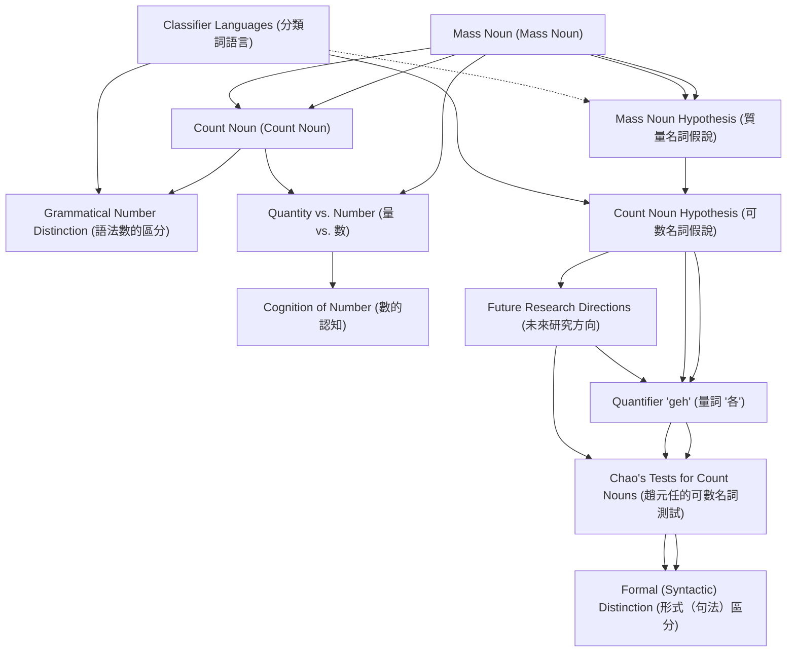

# Zettelkasten 卡片索引

**來源論文**: Chinese Classifiers and Count Nouns
**作者**: 
**年份**: 2025
**生成日期**: 2025-10-29 15:44
**卡片總數**: 12

---

## 📚 卡片清單

### 1. [Mass Noun (Mass Noun)](zettel_cards/Linguistics-20251029-001.md)
- **ID**: `Linguistics-20251029-001`
- **類型**: 
- **核心**: "I use mass noun interchangeably with non-count noun, and noun with common noun."
- **標籤**: `Mass Noun`, `Non-Count Noun`, `Common Noun`

### 2. [Count Noun (Count Noun)](zettel_cards/Linguistics-20251029-002.md)
- **ID**: `Linguistics-20251029-002`
- **類型**: 
- **核心**: "The count noun cow, taking the singular or plural form, can combine directly with numerals."
- **標籤**: `Count Noun`, `Numerals`, `Grammatical Number`

### 3. [Mass Noun Hypothesis (質量名詞假說)](zettel_cards/Linguistics-20251029-003.md)
- **ID**: `Linguistics-20251029-003`
- **類型**: 
- **核心**: "(MH1) Classifier languages have no count nouns. (MH2) All the common nouns of classifier languages are mass nouns."
- **標籤**: `Mass Noun Hypothesis`, `Classifier Languages`, `Count Nouns`

### 4. [Classifier Languages (分類詞語言)](zettel_cards/Linguistics-20251029-004.md)
- **ID**: `Linguistics-20251029-004`
- **類型**: 
- **核心**: "Such languages, called classifier languages, include Chinese, Japanese, Korean, Thai, and many other East and Southeast Asian languages."
- **標籤**: `Classifier Languages`, `Chinese`, `Japanese`, `Korean`, `Thai`

### 5. [Grammatical Number Distinction (語法數的區分)](zettel_cards/Linguistics-20251029-005.md)
- **ID**: `Linguistics-20251029-005`
- **類型**: 
- **核心**: "(a*) These languages draw no grammatical number distinction."
- **標籤**: `Grammatical Number`, `Classifier Languages`, `Mass Noun Hypothesis`

### 6. [Count Noun Hypothesis (可數名詞假說)](zettel_cards/Linguistics-20251029-006.md)
- **ID**: `Linguistics-20251029-006`
- **類型**: 
- **核心**: "(CH1) Classifier languages have count nouns as well as mass nouns. (CH2) T hey have morphosyntactic devices for distinguishing count nouns from mass nouns."
- **標籤**: `Count Noun Hypothesis`, `Classifier Languages`, `Count Nouns`, `Mass Nouns`, `Morphosyntax`

### 7. [Quantifier 'geh' (量詞 '各')](zettel_cards/Linguistics-20251029-007.md)
- **ID**: `Linguistics-20251029-007`
- **類型**: 
- **核心**: "I shall argue that Chinese, like many other classifier languages, has count nouns because it has a counterpart of each (viz., geh 各) that selects count nouns."
- **標籤**: `Quantifier`, `各`, `Count Nouns`, `Chinese`

### 8. [Chao's Tests for Count Nouns (趙元任的可數名詞測試)](zettel_cards/Linguistics-20251029-008.md)
- **ID**: `Linguistics-20251029-008`
- **類型**: 
- **核心**: "(C1) “ Mass nouns do not take the individual classifier” ge, 個 (ibid., p. 508f). (C2) B etween the numeral phrase of the form Num+CL*10 and the noun N, “one can insert an optional de for mass nouns but not for individual nouns”, i.e., count nouns (ibid., p. 509)."
- **標籤**: `Yuen Ren Chao`, `Count Nouns`, `Classifiers`, `de`

### 9. [Formal (Syntactic) Distinction (形式（句法）區分)](zettel_cards/Linguistics-20251029-009.md)
- **ID**: `Linguistics-20251029-009`
- **類型**: 
- **核心**: "Chao draws a “formal” or syntactic distinction between mass and count nouns of Chinese."
- **標籤**: `Syntactic`, `Distinction`, `Mass Nouns`, `Count Nouns`

### 10. [Quantity vs. Number (量 vs. 數)](zettel_cards/Linguistics-20251029-010.md)
- **ID**: `Linguistics-20251029-010`
- **類型**: 
- **核心**: "The linguistic distinction between mass and count nouns is closely related to the ontological distinction between stuff and individuals, and that between the quantity (i.e., amount) of stuff and number of individuals."
- **標籤**: `Quantity`, `Number`, `Mass Nouns`, `Count Nouns`, `Ontology`

### 11. [Cognition of Number (數的認知)](zettel_cards/Linguistics-20251029-011.md)
- **ID**: `Linguistics-20251029-011`
- **類型**: 
- **核心**: "Many studies of animals’ and human infants’ cognition of number suggest that humans conceive individuals and their numbers differently from stuff and its quantity without or before acquiring languages."
- **標籤**: `Number Cognition`, `Infants`, `Animals`, `Mass vs Count`

### 12. [Future Research Directions (未來研究方向)](zettel_cards/Linguistics-20251029-012.md)
- **ID**: `Linguistics-20251029-012`
- **類型**: 
- **核心**: "But this argument for the Mass Noun Hypothesis has a conspicuous prob-lem. Languages with all the above-mentioned features might have other devices that one can use to distinguish count nouns from mass nouns."
- **標籤**: `Mass Noun Hypothesis`, `Classifier Languages`, `Count Nouns`, `Future Research`

---

## 🗺️ 概念網絡圖

---

## 🏷️ 標籤索引

### Mass Noun
- [[Linguistics-20251029-001]] Mass Noun (Mass Noun)

### Non-Count Noun
- [[Linguistics-20251029-001]] Mass Noun (Mass Noun)

### Common Noun
- [[Linguistics-20251029-001]] Mass Noun (Mass Noun)

### Count Noun
- [[Linguistics-20251029-002]] Count Noun (Count Noun)

### Numerals
- [[Linguistics-20251029-002]] Count Noun (Count Noun)

### Grammatical Number
- [[Linguistics-20251029-002]] Count Noun (Count Noun)
- [[Linguistics-20251029-005]] Grammatical Number Distinction (語法數的區分)

### Mass Noun Hypothesis
- [[Linguistics-20251029-003]] Mass Noun Hypothesis (質量名詞假說)
- [[Linguistics-20251029-005]] Grammatical Number Distinction (語法數的區分)
- [[Linguistics-20251029-012]] Future Research Directions (未來研究方向)

### Classifier Languages
- [[Linguistics-20251029-003]] Mass Noun Hypothesis (質量名詞假說)
- [[Linguistics-20251029-004]] Classifier Languages (分類詞語言)
- [[Linguistics-20251029-005]] Grammatical Number Distinction (語法數的區分)
- [[Linguistics-20251029-006]] Count Noun Hypothesis (可數名詞假說)
- [[Linguistics-20251029-012]] Future Research Directions (未來研究方向)

### Count Nouns
- [[Linguistics-20251029-003]] Mass Noun Hypothesis (質量名詞假說)
- [[Linguistics-20251029-006]] Count Noun Hypothesis (可數名詞假說)
- [[Linguistics-20251029-007]] Quantifier 'geh' (量詞 '各')
- [[Linguistics-20251029-008]] Chao's Tests for Count Nouns (趙元任的可數名詞測試)
- [[Linguistics-20251029-009]] Formal (Syntactic) Distinction (形式（句法）區分)
- [[Linguistics-20251029-010]] Quantity vs. Number (量 vs. 數)
- [[Linguistics-20251029-012]] Future Research Directions (未來研究方向)

### Chinese
- [[Linguistics-20251029-004]] Classifier Languages (分類詞語言)
- [[Linguistics-20251029-007]] Quantifier 'geh' (量詞 '各')

### Japanese
- [[Linguistics-20251029-004]] Classifier Languages (分類詞語言)

### Korean
- [[Linguistics-20251029-004]] Classifier Languages (分類詞語言)

### Thai
- [[Linguistics-20251029-004]] Classifier Languages (分類詞語言)

### Count Noun Hypothesis
- [[Linguistics-20251029-006]] Count Noun Hypothesis (可數名詞假說)

### Mass Nouns
- [[Linguistics-20251029-006]] Count Noun Hypothesis (可數名詞假說)
- [[Linguistics-20251029-009]] Formal (Syntactic) Distinction (形式（句法）區分)
- [[Linguistics-20251029-010]] Quantity vs. Number (量 vs. 數)

### Morphosyntax
- [[Linguistics-20251029-006]] Count Noun Hypothesis (可數名詞假說)

### Quantifier
- [[Linguistics-20251029-007]] Quantifier 'geh' (量詞 '各')

### 各
- [[Linguistics-20251029-007]] Quantifier 'geh' (量詞 '各')

### Yuen Ren Chao
- [[Linguistics-20251029-008]] Chao's Tests for Count Nouns (趙元任的可數名詞測試)

### Classifiers
- [[Linguistics-20251029-008]] Chao's Tests for Count Nouns (趙元任的可數名詞測試)

### de
- [[Linguistics-20251029-008]] Chao's Tests for Count Nouns (趙元任的可數名詞測試)

### Syntactic
- [[Linguistics-20251029-009]] Formal (Syntactic) Distinction (形式（句法）區分)

### Distinction
- [[Linguistics-20251029-009]] Formal (Syntactic) Distinction (形式（句法）區分)

### Quantity
- [[Linguistics-20251029-010]] Quantity vs. Number (量 vs. 數)

### Number
- [[Linguistics-20251029-010]] Quantity vs. Number (量 vs. 數)

### Ontology
- [[Linguistics-20251029-010]] Quantity vs. Number (量 vs. 數)

### Number Cognition
- [[Linguistics-20251029-011]] Cognition of Number (數的認知)

### Infants
- [[Linguistics-20251029-011]] Cognition of Number (數的認知)

### Animals
- [[Linguistics-20251029-011]] Cognition of Number (數的認知)

### Mass vs Count
- [[Linguistics-20251029-011]] Cognition of Number (數的認知)

### Future Research
- [[Linguistics-20251029-012]] Future Research Directions (未來研究方向)

---

## 📖 閱讀建議順序

1. [[Linguistics-20251029-003]] Mass Noun Hypothesis (質量名詞假說)

2. [[Linguistics-20251029-005]] Grammatical Number Distinction (語法數的區分)

3. [[Linguistics-20251029-009]] Formal (Syntactic) Distinction (形式（句法）區分)

4. [[Linguistics-20251029-011]] Cognition of Number (數的認知)

5. [[Linguistics-20251029-012]] Future Research Directions (未來研究方向)

6. [[Linguistics-20251029-002]] Count Noun (Count Noun)

7. [[Linguistics-20251029-004]] Classifier Languages (分類詞語言)

8. [[Linguistics-20251029-007]] Quantifier 'geh' (量詞 '各')

9. [[Linguistics-20251029-008]] Chao's Tests for Count Nouns (趙元任的可數名詞測試)

10. [[Linguistics-20251029-010]] Quantity vs. Number (量 vs. 數)

11. [[Linguistics-20251029-006]] Count Noun Hypothesis (可數名詞假說)

12. [[Linguistics-20251029-001]] Mass Noun (Mass Noun)

---

*本索引由 Knowledge Production System 自動生成*