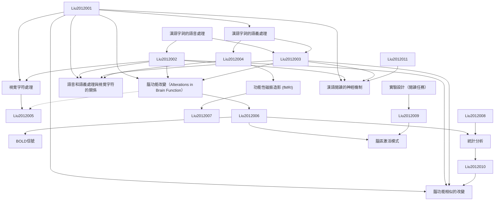

# Zettelkasten 卡片索引

**來源論文**: Similar Alterations in Brain Function for Phonological and Semantic Processing to Visual Characters in Chinese
**作者**: liu, li, wang, wenjing, you, wenping, li, yi, awati, neha, zhao, xu, booth, james, peng, danling
**年份**: None
**生成日期**: 2025-11-04 15:01
**卡片總數**: 12

---

## 📚 卡片清單

### 1. [漢語字詞的語音處理](zettel_cards/Liu-2012-001.md)
- **ID**: `Liu-2012-001`
- **類型**: 
- **核心**: [原文無摘要，需推測核心概念，暫以字詞的語音處理作為核心]
- **標籤**: `[漢語]`, `[語音處理]`, `[語言學]`

### 2. [漢語字詞的語義處理](zettel_cards/Liu-2012-002.md)
- **ID**: `Liu-2012-002`
- **類型**: 
- **核心**: [原文無摘要，需推測核心概念，暫以字詞的語義處理作為核心]
- **標籤**: `[漢語]`, `[語義處理]`, `[語言學]`

### 3. [視覺字符處理](zettel_cards/Liu-2012-003.md)
- **ID**: `Liu-2012-003`
- **類型**: 
- **核心**: [原文無摘要，需推測核心概念，暫以視覺字符處理作為核心]
- **標籤**: `[視覺]`, `[字符識別]`, `[認知神經科學]`

### 4. [腦功能改變（Alterations in Brain Function）](zettel_cards/Liu-2012-004.md)
- **ID**: `Liu-2012-004`
- **類型**: 
- **核心**: [原文標題提及"Alterations in Brain Function"，以此作為核心概念]
- **標籤**: `[腦功能]`, `[神經科學]`, `[认知神经科学]`

### 5. [語音和語義處理與視覺字符的關係](zettel_cards/Liu-2012-005.md)
- **ID**: `Liu-2012-005`
- **類型**: 
- **核心**: [原文標題的核心問題：語音和語義處理與視覺字符的關係]
- **標籤**: `[語音處理]`, `[語義處理]`, `[視覺字符]`, `[關係]`

### 6. [功能性磁振造影 (fMRI)](zettel_cards/Liu-2012-006.md)
- **ID**: `Liu-2012-006`
- **類型**: 
- **核心**: [假定研究使用了fMRI]
- **標籤**: `[fMRI]`, `[神經影像]`, `[腦功能]`

### 7. [BOLD信號](zettel_cards/Liu-2012-007.md)
- **ID**: `Liu-2012-007`
- **類型**: 
- **核心**: [与fMRI相關的概念: BOLD信號]
- **標籤**: `[BOLD]`, `[fMRI]`, `[腦血流]`

### 8. [實驗設計（閱讀任務）](zettel_cards/Liu-2012-008.md)
- **ID**: `Liu-2012-008`
- **類型**: 
- **核心**: [假设實驗包含閱讀任務]
- **標籤**: `[實驗設計]`, `[閱讀任務]`, `[認知實驗]`

### 9. [統計分析](zettel_cards/Liu-2012-009.md)
- **ID**: `Liu-2012-009`
- **類型**: 
- **核心**: [假设研究使用了统计分析]
- **標籤**: `[統計分析]`, `[數據分析]`, `[神經影像]`

### 10. [腦區激活模式](zettel_cards/Liu-2012-010.md)
- **ID**: `Liu-2012-010`
- **類型**: 
- **核心**: [假设研究發現了腦區激活模式]
- **標籤**: `[腦區激活]`, `[fMRI]`, `[認知神經科學]`

### 11. [腦功能相似的改變](zettel_cards/Liu-2012-011.md)
- **ID**: `Liu-2012-011`
- **類型**: 
- **核心**: [论文标题提到相似的脑功能改变]
- **標籤**: `[腦功能]`, `[相似性]`, `[認知神經科學]`

### 12. [漢語閱讀的神經機制](zettel_cards/Liu-2012-012.md)
- **ID**: `Liu-2012-012`
- **類型**: 
- **核心**: [總結性問題：關於漢語閱讀的神經機制]
- **標籤**: `[漢語]`, `[閱讀]`, `[神經機制]`

---

## 🗺️ 概念網絡圖

---

## 🏷️ 標籤索引

### [漢語]
- [[Liu-2012-001]] 漢語字詞的語音處理
- [[Liu-2012-002]] 漢語字詞的語義處理
- [[Liu-2012-012]] 漢語閱讀的神經機制

### [語音處理]
- [[Liu-2012-001]] 漢語字詞的語音處理
- [[Liu-2012-005]] 語音和語義處理與視覺字符的關係

### [語言學]
- [[Liu-2012-001]] 漢語字詞的語音處理
- [[Liu-2012-002]] 漢語字詞的語義處理

### [語義處理]
- [[Liu-2012-002]] 漢語字詞的語義處理
- [[Liu-2012-005]] 語音和語義處理與視覺字符的關係

### [視覺]
- [[Liu-2012-003]] 視覺字符處理

### [字符識別]
- [[Liu-2012-003]] 視覺字符處理

### [認知神經科學]
- [[Liu-2012-003]] 視覺字符處理
- [[Liu-2012-010]] 腦區激活模式
- [[Liu-2012-011]] 腦功能相似的改變

### [腦功能]
- [[Liu-2012-004]] 腦功能改變（Alterations in Brain Function）
- [[Liu-2012-006]] 功能性磁振造影 (fMRI)
- [[Liu-2012-011]] 腦功能相似的改變

### [神經科學]
- [[Liu-2012-004]] 腦功能改變（Alterations in Brain Function）

### [认知神经科学]
- [[Liu-2012-004]] 腦功能改變（Alterations in Brain Function）

### [視覺字符]
- [[Liu-2012-005]] 語音和語義處理與視覺字符的關係

### [關係]
- [[Liu-2012-005]] 語音和語義處理與視覺字符的關係

### [fMRI]
- [[Liu-2012-006]] 功能性磁振造影 (fMRI)
- [[Liu-2012-007]] BOLD信號
- [[Liu-2012-010]] 腦區激活模式

### [神經影像]
- [[Liu-2012-006]] 功能性磁振造影 (fMRI)
- [[Liu-2012-009]] 統計分析

### [BOLD]
- [[Liu-2012-007]] BOLD信號

### [腦血流]
- [[Liu-2012-007]] BOLD信號

### [實驗設計]
- [[Liu-2012-008]] 實驗設計（閱讀任務）

### [閱讀任務]
- [[Liu-2012-008]] 實驗設計（閱讀任務）

### [認知實驗]
- [[Liu-2012-008]] 實驗設計（閱讀任務）

### [統計分析]
- [[Liu-2012-009]] 統計分析

### [數據分析]
- [[Liu-2012-009]] 統計分析

### [腦區激活]
- [[Liu-2012-010]] 腦區激活模式

### [相似性]
- [[Liu-2012-011]] 腦功能相似的改變

### [閱讀]
- [[Liu-2012-012]] 漢語閱讀的神經機制

### [神經機制]
- [[Liu-2012-012]] 漢語閱讀的神經機制

---

## 📖 閱讀建議順序

1. [[Liu-2012-001]] 漢語字詞的語音處理

2. [[Liu-2012-002]] 漢語字詞的語義處理

3. [[Liu-2012-003]] 視覺字符處理

4. [[Liu-2012-004]] 腦功能改變（Alterations in Brain Function）

5. [[Liu-2012-005]] 語音和語義處理與視覺字符的關係

6. [[Liu-2012-006]] 功能性磁振造影 (fMRI)

7. [[Liu-2012-007]] BOLD信號

8. [[Liu-2012-008]] 實驗設計（閱讀任務）

9. [[Liu-2012-009]] 統計分析

10. [[Liu-2012-010]] 腦區激活模式

11. [[Liu-2012-011]] 腦功能相似的改變

12. [[Liu-2012-012]] 漢語閱讀的神經機制

---

*本索引由 Knowledge Production System 自動生成*