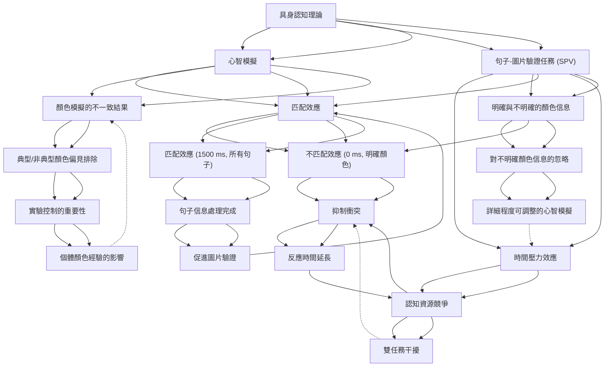

# Zettelkasten 卡片索引

**來源論文**: Liu-2024b_Mental_Simulation
**作者**: 
**年份**: 2025
**生成日期**: 2025-10-29 16:42
**卡片總數**: 20

---

## 📚 卡片清單

### 1. [具身認知理論](zettel_cards/CogSci-20251029-001.md)
- **ID**: `CogSci-20251029-001`
- **類型**: 
- **核心**: "Theories of grounded cognition suggest that people comprehend language through mental simulations grounded in the sensorimotor system (Barsalou 1999, 2008)."
- **標籤**: `具身認知`, `語言理解`, `心智模擬`, `感知運動系統`

### 2. [心智模擬](zettel_cards/CogSci-20251029-002.md)
- **ID**: `CogSci-20251029-002`
- **類型**: 
- **核心**: "Researchers have argued that the mental simulation of concepts during language comprehension partially reactivates the neural networks engaged during previous experiences (Connell 2007; de Koning et al. 2017)."
- **標籤**: `心智模擬`, `語言理解`, `神經網絡`, `經驗重現`

### 3. [句子-圖片驗證任務 (SPV)](zettel_cards/CogSci-20251029-003.md)
- **ID**: `CogSci-20251029-003`
- **類型**: 
- **核心**: "Stanfield and Zwaan (2001) first investigated this hypoth-esis through a creative application of the sentence-picture verification (SPV) task."
- **標籤**: `句子-圖片驗證`, `SPV`, `實驗方法`, `心理學`

### 4. [匹配效應](zettel_cards/CogSci-20251029-004.md)
- **ID**: `CogSci-20251029-004`
- **類型**: 
- **核心**: "The results revealed a matching effect; the participants responded faster when the orientation of the presented object matched the orientation implied in the previous sentence, supporting the involvement of sensorimotor areas in cognitive processing."
- **標籤**: `匹配效應`, `SPV`, `反應時間`, `心智模擬`

### 5. [顏色模擬的不一致結果](zettel_cards/CogSci-20251029-005.md)
- **ID**: `CogSci-20251029-005`
- **類型**: 
- **核心**: "Regarding mental simulations of colour during language comprehension, mixed results have been reported."
- **標籤**: `顏色模擬`, `SPV`, `不一致結果`, `語言理解`

### 6. [時間壓力效應](zettel_cards/CogSci-20251029-006.md)
- **ID**: `CogSci-20251029-006`
- **類型**: 
- **核心**: "Our results also indicated that ongoing colour simulation with time pressure impacted the participant responses."
- **標籤**: `時間壓力`, `顏色模擬`, `反應時間`, `認知資源`

### 7. [明確與不明確的顏色信息](zettel_cards/CogSci-20251029-007.md)
- **ID**: `CogSci-20251029-007`
- **類型**: 
- **核心**: "In Experiment 2, the participants encountered sentences containing both clear and unclear colour information and, after either a 0 ms or 1500 ms interval, completed picture verification tasks with a novel object."
- **標籤**: `顏色信息`, `明確性`, `SPV`, `實驗設計`

### 8. [不匹配效應 (0 ms, 明確顏色)](zettel_cards/CogSci-20251029-008.md)
- **ID**: `CogSci-20251029-008`
- **類型**: 
- **核心**: "A mismatching effect appeared in the 0 ms condition after clear colour information sentences..."
- **標籤**: `不匹配效應`, `SPV`, `顏色`, `明確性`

### 9. [匹配效應 (1500 ms, 所有句子)](zettel_cards/CogSci-20251029-009.md)
- **ID**: `CogSci-20251029-009`
- **類型**: 
- **核心**: "...and a matching effect appeared in the 1500 ms condition for all sentences."
- **標籤**: `匹配效應`, `SPV`, `顏色`, `延遲`

### 10. [典型/非典型顏色偏見排除](zettel_cards/CogSci-20251029-010.md)
- **ID**: `CogSci-20251029-010`
- **類型**: 
- **核心**: "Employing the SPV task and using novel objects, we examined whether there is a mental simulation of colour after excluding typical/atypical colour bias..."
- **標籤**: `實驗設計`, `顏色偏見`, `新穎物體`, `SPV`

### 11. [認知資源競爭](zettel_cards/CogSci-20251029-011.md)
- **ID**: `CogSci-20251029-011`
- **類型**: 
- **核心**: "Thus, two tasks may compete for the common cognitive resources of mental simulation, resulting in conflicts (Pashler 1994; Zhang and Lu 2013)."
- **標籤**: `認知資源`, `競爭`, `心智模擬`, `SPV`

### 12. [對不明確顏色信息的忽略](zettel_cards/CogSci-20251029-012.md)
- **ID**: `CogSci-20251029-012`
- **類型**: 
- **核心**: "The participants ignored unclear colour information under time pressure, but without time pressure, they constructed simulations that were as detailed as possible, regardless of whether the implicit colour information in the sentence was clear."
- **標籤**: `不明確信息`, `時間壓力`, `顏色模擬`, `忽略`

### 13. [抑制衝突](zettel_cards/CogSci-20251029-013.md)
- **ID**: `CogSci-20251029-013`
- **類型**: 
- **核心**: "Comprehenders may need to consume additional cognitive resources to suppress the interference caused by conflicts (Bai et al. 2021; Ye and Zhou 2009), resulting in reaction time extension and mismatching effects."
- **標籤**: `抑制`, `衝突`, `認知資源`, `不匹配效應`

### 14. [句子信息處理完成](zettel_cards/CogSci-20251029-014.md)
- **ID**: `CogSci-20251029-014`
- **類型**: 
- **核心**: "When the pictures are presented at the late stage, the processing of sentence information by the comprehender has already finished."
- **標籤**: `句子處理`, `完成`, `後期階段`, `SPV`

### 15. [實驗控制的重要性](zettel_cards/CogSci-20251029-015.md)
- **ID**: `CogSci-20251029-015`
- **類型**: 
- **核心**: "This outcome may have been caused by differences in individual experiences of object colour or the experimental process, leading to inconsistent durations of mental simulation formation, which manifested as a matching advantage or a mismatching advantage when the objects appeared at 500 ms."
- **標籤**: `實驗控制`, `個體差異`, `顏色經驗`, `心智模擬`

### 16. [雙任務干擾](zettel_cards/CogSci-20251029-016.md)
- **ID**: `CogSci-20251029-016`
- **類型**: 
- **核心**: "When pictures are presented at the early stages of comprehension, the comprehenders may need to deal with both sentence comprehension and picture verification tasks simultaneously."
- **標籤**: `雙任務`, `干擾`, `句子理解`, `圖片驗證`

### 17. [詳細程度可調整的心智模擬](zettel_cards/CogSci-20251029-017.md)
- **ID**: `CogSci-20251029-017`
- **類型**: 
- **核心**: "they constructed simulations that were as detailed as possible, regardless of whether the implicit colour information in the sentence was clear."
- **標籤**: `心智模擬`, `詳細程度`, `可調整`, `顏色信息`

### 18. [反應時間延長](zettel_cards/CogSci-20251029-018.md)
- **ID**: `CogSci-20251029-018`
- **類型**: 
- **核心**: "...resulting in reaction time extension and mismatching effects."
- **標籤**: `反應時間`, `延長`, `不匹配效應`, `抑制衝突`

### 19. [促進圖片驗證](zettel_cards/CogSci-20251029-019.md)
- **ID**: `CogSci-20251029-019`
- **類型**: 
- **核心**: "Therefore, mental simulation based on sentence information was able to promote picture verification under the matching condition, and hence, the matching effect occurred."
- **標籤**: `心智模擬`, `促進`, `圖片驗證`, `匹配效應`

### 20. [個體顏色經驗的影響](zettel_cards/CogSci-20251029-020.md)
- **ID**: `CogSci-20251029-020`
- **類型**: 
- **核心**: "This outcome may have been caused by differences in individual experiences of object colour or the experimental process..."
- **標籤**: `個體經驗`, `顏色`, `實驗過程`, `影響`

---

## 🗺️ 概念網絡圖

---

## 🏷️ 標籤索引

### 具身認知
- [[CogSci-20251029-001]] 具身認知理論

### 語言理解
- [[CogSci-20251029-001]] 具身認知理論
- [[CogSci-20251029-002]] 心智模擬
- [[CogSci-20251029-005]] 顏色模擬的不一致結果

### 心智模擬
- [[CogSci-20251029-001]] 具身認知理論
- [[CogSci-20251029-002]] 心智模擬
- [[CogSci-20251029-004]] 匹配效應
- [[CogSci-20251029-011]] 認知資源競爭
- [[CogSci-20251029-015]] 實驗控制的重要性
- [[CogSci-20251029-017]] 詳細程度可調整的心智模擬
- [[CogSci-20251029-019]] 促進圖片驗證

### 感知運動系統
- [[CogSci-20251029-001]] 具身認知理論

### 神經網絡
- [[CogSci-20251029-002]] 心智模擬

### 經驗重現
- [[CogSci-20251029-002]] 心智模擬

### 句子-圖片驗證
- [[CogSci-20251029-003]] 句子-圖片驗證任務 (SPV)

### SPV
- [[CogSci-20251029-003]] 句子-圖片驗證任務 (SPV)
- [[CogSci-20251029-004]] 匹配效應
- [[CogSci-20251029-005]] 顏色模擬的不一致結果
- [[CogSci-20251029-007]] 明確與不明確的顏色信息
- [[CogSci-20251029-008]] 不匹配效應 (0 ms, 明確顏色)
- [[CogSci-20251029-009]] 匹配效應 (1500 ms, 所有句子)
- [[CogSci-20251029-010]] 典型/非典型顏色偏見排除
- [[CogSci-20251029-011]] 認知資源競爭
- [[CogSci-20251029-014]] 句子信息處理完成

### 實驗方法
- [[CogSci-20251029-003]] 句子-圖片驗證任務 (SPV)

### 心理學
- [[CogSci-20251029-003]] 句子-圖片驗證任務 (SPV)

### 匹配效應
- [[CogSci-20251029-004]] 匹配效應
- [[CogSci-20251029-009]] 匹配效應 (1500 ms, 所有句子)
- [[CogSci-20251029-019]] 促進圖片驗證

### 反應時間
- [[CogSci-20251029-004]] 匹配效應
- [[CogSci-20251029-006]] 時間壓力效應
- [[CogSci-20251029-018]] 反應時間延長

### 顏色模擬
- [[CogSci-20251029-005]] 顏色模擬的不一致結果
- [[CogSci-20251029-006]] 時間壓力效應
- [[CogSci-20251029-012]] 對不明確顏色信息的忽略

### 不一致結果
- [[CogSci-20251029-005]] 顏色模擬的不一致結果

### 時間壓力
- [[CogSci-20251029-006]] 時間壓力效應
- [[CogSci-20251029-012]] 對不明確顏色信息的忽略

### 認知資源
- [[CogSci-20251029-006]] 時間壓力效應
- [[CogSci-20251029-011]] 認知資源競爭
- [[CogSci-20251029-013]] 抑制衝突

### 顏色信息
- [[CogSci-20251029-007]] 明確與不明確的顏色信息
- [[CogSci-20251029-017]] 詳細程度可調整的心智模擬

### 明確性
- [[CogSci-20251029-007]] 明確與不明確的顏色信息
- [[CogSci-20251029-008]] 不匹配效應 (0 ms, 明確顏色)

### 實驗設計
- [[CogSci-20251029-007]] 明確與不明確的顏色信息
- [[CogSci-20251029-010]] 典型/非典型顏色偏見排除

### 不匹配效應
- [[CogSci-20251029-008]] 不匹配效應 (0 ms, 明確顏色)
- [[CogSci-20251029-013]] 抑制衝突
- [[CogSci-20251029-018]] 反應時間延長

### 顏色
- [[CogSci-20251029-008]] 不匹配效應 (0 ms, 明確顏色)
- [[CogSci-20251029-009]] 匹配效應 (1500 ms, 所有句子)
- [[CogSci-20251029-020]] 個體顏色經驗的影響

### 延遲
- [[CogSci-20251029-009]] 匹配效應 (1500 ms, 所有句子)

### 顏色偏見
- [[CogSci-20251029-010]] 典型/非典型顏色偏見排除

### 新穎物體
- [[CogSci-20251029-010]] 典型/非典型顏色偏見排除

### 競爭
- [[CogSci-20251029-011]] 認知資源競爭

### 不明確信息
- [[CogSci-20251029-012]] 對不明確顏色信息的忽略

### 忽略
- [[CogSci-20251029-012]] 對不明確顏色信息的忽略

### 抑制
- [[CogSci-20251029-013]] 抑制衝突

### 衝突
- [[CogSci-20251029-013]] 抑制衝突

### 句子處理
- [[CogSci-20251029-014]] 句子信息處理完成

### 完成
- [[CogSci-20251029-014]] 句子信息處理完成

### 後期階段
- [[CogSci-20251029-014]] 句子信息處理完成

### 實驗控制
- [[CogSci-20251029-015]] 實驗控制的重要性

### 個體差異
- [[CogSci-20251029-015]] 實驗控制的重要性

### 顏色經驗
- [[CogSci-20251029-015]] 實驗控制的重要性

### 雙任務
- [[CogSci-20251029-016]] 雙任務干擾

### 干擾
- [[CogSci-20251029-016]] 雙任務干擾

### 句子理解
- [[CogSci-20251029-016]] 雙任務干擾

### 圖片驗證
- [[CogSci-20251029-016]] 雙任務干擾
- [[CogSci-20251029-019]] 促進圖片驗證

### 詳細程度
- [[CogSci-20251029-017]] 詳細程度可調整的心智模擬

### 可調整
- [[CogSci-20251029-017]] 詳細程度可調整的心智模擬

### 延長
- [[CogSci-20251029-018]] 反應時間延長

### 抑制衝突
- [[CogSci-20251029-018]] 反應時間延長

### 促進
- [[CogSci-20251029-019]] 促進圖片驗證

### 個體經驗
- [[CogSci-20251029-020]] 個體顏色經驗的影響

### 實驗過程
- [[CogSci-20251029-020]] 個體顏色經驗的影響

### 影響
- [[CogSci-20251029-020]] 個體顏色經驗的影響

---

## 📖 閱讀建議順序

1. [[CogSci-20251029-016]] 雙任務干擾

2. [[CogSci-20251029-017]] 詳細程度可調整的心智模擬

3. [[CogSci-20251029-018]] 反應時間延長

4. [[CogSci-20251029-019]] 促進圖片驗證

5. [[CogSci-20251029-020]] 個體顏色經驗的影響

6. [[CogSci-20251029-005]] 顏色模擬的不一致結果

7. [[CogSci-20251029-006]] 時間壓力效應

8. [[CogSci-20251029-008]] 不匹配效應 (0 ms, 明確顏色)

9. [[CogSci-20251029-009]] 匹配效應 (1500 ms, 所有句子)

10. [[CogSci-20251029-010]] 典型/非典型顏色偏見排除

11. [[CogSci-20251029-012]] 對不明確顏色信息的忽略

12. [[CogSci-20251029-013]] 抑制衝突

13. [[CogSci-20251029-014]] 句子信息處理完成

14. [[CogSci-20251029-015]] 實驗控制的重要性

15. [[CogSci-20251029-001]] 具身認知理論

16. [[CogSci-20251029-002]] 心智模擬

17. [[CogSci-20251029-004]] 匹配效應

18. [[CogSci-20251029-007]] 明確與不明確的顏色信息

19. [[CogSci-20251029-011]] 認知資源競爭

20. [[CogSci-20251029-003]] 句子-圖片驗證任務 (SPV)

---

*本索引由 Knowledge Production System 自動生成*