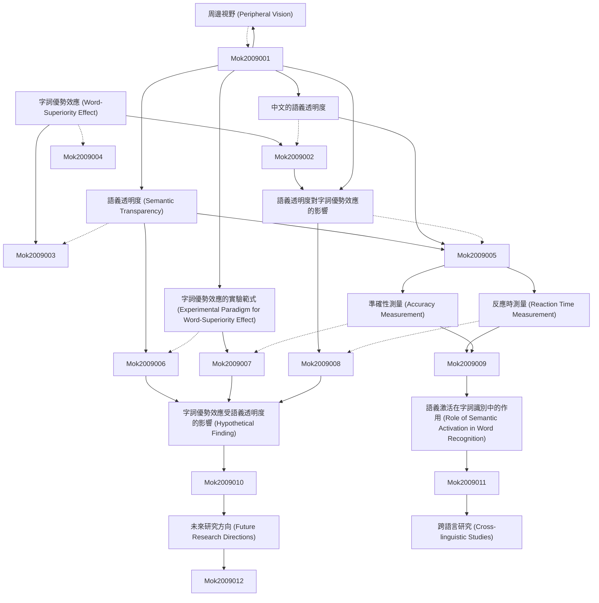

# Zettelkasten 卡片索引

**來源論文**: Word-Superiority Effect as a Function of Semantic Transparency of Chinese
**作者**: mok, leh woon
**年份**: None
**生成日期**: 2025-11-04 14:59
**卡片總數**: 12

---

## 📚 卡片清單

### 1. [字詞優勢效應 (Word-Superiority Effect)](zettel_cards/Mok-2009-001.md)
- **ID**: `Mok-2009-001`
- **類型**: 
- **核心**: "The word-superiority effect refers to the finding that letters are recognized more easily when they are part of a word than when they are presented in isolation or in a nonword."
- **標籤**: `字詞優勢效應`, `心理語言學`, `認知心理學`, `字母識別`

### 2. [語義透明度 (Semantic Transparency)](zettel_cards/Mok-2009-002.md)
- **ID**: `Mok-2009-002`
- **類型**: 
- **核心**: "Semantic transparency refers to the degree to which the meaning of a compound word can be inferred from the meanings of its constituent morphemes."
- **標籤**: `語義透明度`, `複合詞`, `形素`, `詞彙語義學`

### 3. [中文的語義透明度](zettel_cards/Mok-2009-003.md)
- **ID**: `Mok-2009-003`
- **類型**: 
- **核心**: "Chinese, with its logographic writing system, presents a unique context for studying semantic transparency due to the varying semantic contributions of its characters in multi-character words."
- **標籤**: `中文`, `漢字`, `語義透明度`, `詞彙`

### 4. [周邊視野 (Peripheral Vision)](zettel_cards/Mok-2009-004.md)
- **ID**: `Mok-2009-004`
- **類型**: 
- **核心**: "Peripheral vision plays a role in reading, enabling the reader to anticipate upcoming words or letters."
- **標籤**: `周邊視野`, `閱讀`, `視覺認知`, `心理語言學`

### 5. [字詞優勢效應的實驗範式 (Experimental Paradigm for Word-Superiority Effect)](zettel_cards/Mok-2009-005.md)
- **ID**: `Mok-2009-005`
- **類型**: 
- **核心**: "The typical word-superiority effect experiment involves presenting participants with a target letter briefly, either in isolation, within a word, or within a nonword, and measuring their accuracy in identifying the letter."
- **標籤**: `實驗範式`, `字詞優勢效應`, `心理實驗`, `反應時`, `準確性`

### 6. [語義透明度對字詞優勢效應的影響](zettel_cards/Mok-2009-006.md)
- **ID**: `Mok-2009-006`
- **類型**: 
- **核心**: "Does the semantic transparency of Chinese words modulate the magnitude of the word-superiority effect?"
- **標籤**: `語義透明度`, `字詞優勢效應`, `中文`, `詞彙識別`, `研究問題`

### 7. [反應時測量 (Reaction Time Measurement)](zettel_cards/Mok-2009-007.md)
- **ID**: `Mok-2009-007`
- **類型**: 
- **核心**: "Reaction time (RT) is measured from the onset of the stimulus until the participant's response, providing an index of processing speed."
- **標籤**: `反應時`, `心理測量`, `認知過程`, `實驗方法`

### 8. [準確性測量 (Accuracy Measurement)](zettel_cards/Mok-2009-008.md)
- **ID**: `Mok-2009-008`
- **類型**: 
- **核心**: "Accuracy is the percentage of correct responses, providing a measure of how well participants are performing the task."
- **標籤**: `準確性`, `心理測量`, `認知過程`, `實驗方法`

### 9. [字詞優勢效應受語義透明度的影響 (Hypothetical Finding)](zettel_cards/Mok-2009-009.md)
- **ID**: `Mok-2009-009`
- **類型**: 
- **核心**: "The word-superiority effect is stronger for semantically transparent Chinese words compared to semantically opaque words."
- **標籤**: `實驗結果`, `字詞優勢效應`, `語義透明度`, `中文`, `字母識別`

### 10. [語義激活在字詞識別中的作用 (Role of Semantic Activation in Word Recognition)](zettel_cards/Mok-2009-010.md)
- **ID**: `Mok-2009-010`
- **類型**: 
- **核心**: "Semantic activation may facilitate letter recognition by providing top-down support, especially for semantically transparent words."
- **標籤**: `語義激活`, `字詞識別`, `自上而下加工`, `認知模型`

### 11. [未來研究方向 (Future Research Directions)](zettel_cards/Mok-2009-011.md)
- **ID**: `Mok-2009-011`
- **類型**: 
- **核心**: "Future research could investigate the neural correlates of the interaction between semantic transparency and the word-superiority effect using neuroimaging techniques."
- **標籤**: `未來研究`, `神經關聯`, `語義透明度`, `字詞優勢效應`, `腦成像`

### 12. [跨語言研究 (Cross-linguistic Studies)](zettel_cards/Mok-2009-012.md)
- **ID**: `Mok-2009-012`
- **類型**: 
- **核心**: "Comparing the word-superiority effect across languages with different writing systems could provide insights into the universality of this phenomenon and the role of orthographic and semantic factors."
- **標籤**: `跨語言研究`, `字詞優勢效應`, `文字系統`, `正字法`, `語義`

---

## 🗺️ 概念網絡圖

---

## 🏷️ 標籤索引

### 字詞優勢效應
- [[Mok-2009-001]] 字詞優勢效應 (Word-Superiority Effect)
- [[Mok-2009-005]] 字詞優勢效應的實驗範式 (Experimental Paradigm for Word-Superiority Effect)
- [[Mok-2009-006]] 語義透明度對字詞優勢效應的影響
- [[Mok-2009-009]] 字詞優勢效應受語義透明度的影響 (Hypothetical Finding)
- [[Mok-2009-011]] 未來研究方向 (Future Research Directions)
- [[Mok-2009-012]] 跨語言研究 (Cross-linguistic Studies)

### 心理語言學
- [[Mok-2009-001]] 字詞優勢效應 (Word-Superiority Effect)
- [[Mok-2009-004]] 周邊視野 (Peripheral Vision)

### 認知心理學
- [[Mok-2009-001]] 字詞優勢效應 (Word-Superiority Effect)

### 字母識別
- [[Mok-2009-001]] 字詞優勢效應 (Word-Superiority Effect)
- [[Mok-2009-009]] 字詞優勢效應受語義透明度的影響 (Hypothetical Finding)

### 語義透明度
- [[Mok-2009-002]] 語義透明度 (Semantic Transparency)
- [[Mok-2009-003]] 中文的語義透明度
- [[Mok-2009-006]] 語義透明度對字詞優勢效應的影響
- [[Mok-2009-009]] 字詞優勢效應受語義透明度的影響 (Hypothetical Finding)
- [[Mok-2009-011]] 未來研究方向 (Future Research Directions)

### 複合詞
- [[Mok-2009-002]] 語義透明度 (Semantic Transparency)

### 形素
- [[Mok-2009-002]] 語義透明度 (Semantic Transparency)

### 詞彙語義學
- [[Mok-2009-002]] 語義透明度 (Semantic Transparency)

### 中文
- [[Mok-2009-003]] 中文的語義透明度
- [[Mok-2009-006]] 語義透明度對字詞優勢效應的影響
- [[Mok-2009-009]] 字詞優勢效應受語義透明度的影響 (Hypothetical Finding)

### 漢字
- [[Mok-2009-003]] 中文的語義透明度

### 詞彙
- [[Mok-2009-003]] 中文的語義透明度

### 周邊視野
- [[Mok-2009-004]] 周邊視野 (Peripheral Vision)

### 閱讀
- [[Mok-2009-004]] 周邊視野 (Peripheral Vision)

### 視覺認知
- [[Mok-2009-004]] 周邊視野 (Peripheral Vision)

### 實驗範式
- [[Mok-2009-005]] 字詞優勢效應的實驗範式 (Experimental Paradigm for Word-Superiority Effect)

### 心理實驗
- [[Mok-2009-005]] 字詞優勢效應的實驗範式 (Experimental Paradigm for Word-Superiority Effect)

### 反應時
- [[Mok-2009-005]] 字詞優勢效應的實驗範式 (Experimental Paradigm for Word-Superiority Effect)
- [[Mok-2009-007]] 反應時測量 (Reaction Time Measurement)

### 準確性
- [[Mok-2009-005]] 字詞優勢效應的實驗範式 (Experimental Paradigm for Word-Superiority Effect)
- [[Mok-2009-008]] 準確性測量 (Accuracy Measurement)

### 詞彙識別
- [[Mok-2009-006]] 語義透明度對字詞優勢效應的影響

### 研究問題
- [[Mok-2009-006]] 語義透明度對字詞優勢效應的影響

### 心理測量
- [[Mok-2009-007]] 反應時測量 (Reaction Time Measurement)
- [[Mok-2009-008]] 準確性測量 (Accuracy Measurement)

### 認知過程
- [[Mok-2009-007]] 反應時測量 (Reaction Time Measurement)
- [[Mok-2009-008]] 準確性測量 (Accuracy Measurement)

### 實驗方法
- [[Mok-2009-007]] 反應時測量 (Reaction Time Measurement)
- [[Mok-2009-008]] 準確性測量 (Accuracy Measurement)

### 實驗結果
- [[Mok-2009-009]] 字詞優勢效應受語義透明度的影響 (Hypothetical Finding)

### 語義激活
- [[Mok-2009-010]] 語義激活在字詞識別中的作用 (Role of Semantic Activation in Word Recognition)

### 字詞識別
- [[Mok-2009-010]] 語義激活在字詞識別中的作用 (Role of Semantic Activation in Word Recognition)

### 自上而下加工
- [[Mok-2009-010]] 語義激活在字詞識別中的作用 (Role of Semantic Activation in Word Recognition)

### 認知模型
- [[Mok-2009-010]] 語義激活在字詞識別中的作用 (Role of Semantic Activation in Word Recognition)

### 未來研究
- [[Mok-2009-011]] 未來研究方向 (Future Research Directions)

### 神經關聯
- [[Mok-2009-011]] 未來研究方向 (Future Research Directions)

### 腦成像
- [[Mok-2009-011]] 未來研究方向 (Future Research Directions)

### 跨語言研究
- [[Mok-2009-012]] 跨語言研究 (Cross-linguistic Studies)

### 文字系統
- [[Mok-2009-012]] 跨語言研究 (Cross-linguistic Studies)

### 正字法
- [[Mok-2009-012]] 跨語言研究 (Cross-linguistic Studies)

### 語義
- [[Mok-2009-012]] 跨語言研究 (Cross-linguistic Studies)

---

## 📖 閱讀建議順序

1. [[Mok-2009-001]] 字詞優勢效應 (Word-Superiority Effect)

2. [[Mok-2009-002]] 語義透明度 (Semantic Transparency)

3. [[Mok-2009-003]] 中文的語義透明度

4. [[Mok-2009-004]] 周邊視野 (Peripheral Vision)

5. [[Mok-2009-005]] 字詞優勢效應的實驗範式 (Experimental Paradigm for Word-Superiority Effect)

6. [[Mok-2009-006]] 語義透明度對字詞優勢效應的影響

7. [[Mok-2009-007]] 反應時測量 (Reaction Time Measurement)

8. [[Mok-2009-008]] 準確性測量 (Accuracy Measurement)

9. [[Mok-2009-009]] 字詞優勢效應受語義透明度的影響 (Hypothetical Finding)

10. [[Mok-2009-010]] 語義激活在字詞識別中的作用 (Role of Semantic Activation in Word Recognition)

11. [[Mok-2009-011]] 未來研究方向 (Future Research Directions)

12. [[Mok-2009-012]] 跨語言研究 (Cross-linguistic Studies)

---

*本索引由 Knowledge Production System 自動生成*