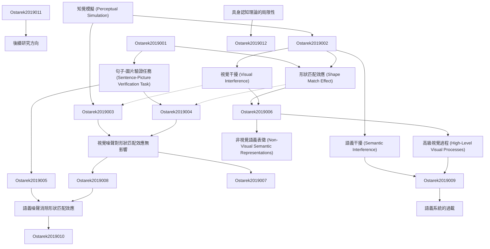

# Zettelkasten 卡片索引

---

## 📚 卡片清單

### 1. [知覺模擬 (Perceptual Simulation)](zettel_cards/Ostarek-2019-001.md)
- **ID**: `Ostarek-2019-001`
- **類型**: 
- **核心**: "Typically, this finding has been interpreted as evidence for perceptual simulation, i.e., that access to implicit shape information involves the activation of modality-specific visual processes."
- **標籤**: `知覺模擬`, `具身認知`, `語言理解`

### 2. [句子-圖片驗證任務 (Sentence-Picture Verification Task)](zettel_cards/Ostarek-2019-002.md)
- **ID**: `Ostarek-2019-002`
- **類型**: 
- **核心**: "Participants read or listen to sentences about objects that are implied to have a certain shape (e.g., The ranger saw the eagle in the sky; implying outstretched wings)."
- **標籤**: `實驗設計`, `行為研究`, `語言理解`

### 3. [形狀匹配效應 (Shape Match Effect)](zettel_cards/Ostarek-2019-003.md)
- **ID**: `Ostarek-2019-003`
- **類型**: 
- **核心**: "The critical finding (Zwaan & Pecher, 2012; Zwaan et al., 2002) is shorter response latencies in the matching condition, suggesting that the sentences activate information about object shape that is specific enough to produce a priming effect on the verification judgement."
- **標籤**: `行為數據`, `語言理解`, `啟動效應`

### 4. [視覺干擾 (Visual Interference)](zettel_cards/Ostarek-2019-004.md)
- **ID**: `Ostarek-2019-004`
- **類型**: 
- **核心**: "Here we directly test this hypothesis. Participants listened to sentences while seeing either visual noise that was previously shown to strongly interfere with basic visual processing or a blank screen."
- **標籤**: `實驗操作`, `干擾技術`, `認知控制`

### 5. [語義干擾 (Semantic Interference)](zettel_cards/Ostarek-2019-005.md)
- **ID**: `Ostarek-2019-005`
- **類型**: 
- **核心**: "When an interference technique was used that targeted high-level semantic processing (Experiment 3) however the match effect vanished."
- **標籤**: `實驗操作`, `干擾技術`, `語義處理`

### 6. [視覺噪聲對形狀匹配效應無影響](zettel_cards/Ostarek-2019-006.md)
- **ID**: `Ostarek-2019-006`
- **類型**: 
- **核心**: "Experiments 1 and 2 replicated the match effect but crucially visual noise did not modulate it."
- **標籤**: `實驗結果`, `視覺加工`, `語言理解`

### 7. [非視覺語義表徵 (Non-Visual Semantic Representations)](zettel_cards/Ostarek-2019-007.md)
- **ID**: `Ostarek-2019-007`
- **類型**: 
- **核心**: "Weconcludethattheshapematcheffectinthesentence-pictureverificationparadigmisunlikelytorelyonperceptualsimulation."
- **標籤**: `抽象表徵`, `概念語義`, `認知結構`

### 8. [高級視覺過程 (High-Level Visual Processes)](zettel_cards/Ostarek-2019-008.md)
- **ID**: `Ostarek-2019-008`
- **類型**: 
- **核心**: "Visual noises specifically targeting high-level visual processes (Experiment 4) only had a minimal effect on the match effect."
- **標籤**: `視覺層次`, `物體識別`, `注意力`

### 9. [語義噪聲消除形狀匹配效應](zettel_cards/Ostarek-2019-009.md)
- **ID**: `Ostarek-2019-009`
- **類型**: 
- **核心**: "Semantic noise strongly interfered with the access to shape information implicit in sentences, demonstrating that dynamic visually presented stimuli can be effective at interfering with the retrieval of conceptual shape information if the relevant system is targeted by the noise."
- **標籤**: `實驗結果`, `語義加工`, `認知干擾`

### 10. [語義系統的過載](zettel_cards/Ostarek-2019-010.md)
- **ID**: `Ostarek-2019-010`
- **類型**: 
- **核心**: "Itisplausiblethatthesemanticsystemissimplyoverloadedduetothehighrateofobjectsthatarebeingprocessed."
- **標籤**: `認知資源`, `注意力`, `信息處理`

### 11. [具身認知理論的局限性](zettel_cards/Ostarek-2019-011.md)
- **ID**: `Ostarek-2019-011`
- **類型**: 
- **核心**: "Congruency effects do not provide evidence that sensory-motorsystems produce them unless the task which language is found to have an effect on only involves sensory-motor processes."
- **標籤**: `理論評估`, `實驗證據`, `認知建模`

### 12. [後續研究方向](zettel_cards/Ostarek-2019-012.md)
- **ID**: `Ostarek-2019-012`
- **類型**: 
- **核心**: "It will be crucial for future studies to precisely delineate what determines the involvement and role of sensory processes in conceptual processing."
- **標籤**: `未來研究`, `認知機制`, `實驗設計`

---

## 🗺️ 概念網絡圖

---

## 🏷️ 標籤索引

### 知覺模擬
- [[Ostarek-2019-001]] 知覺模擬 (Perceptual Simulation)

### 具身認知
- [[Ostarek-2019-001]] 知覺模擬 (Perceptual Simulation)

### 語言理解
- [[Ostarek-2019-001]] 知覺模擬 (Perceptual Simulation)
- [[Ostarek-2019-002]] 句子-圖片驗證任務 (Sentence-Picture Verification Task)
- [[Ostarek-2019-003]] 形狀匹配效應 (Shape Match Effect)
- [[Ostarek-2019-006]] 視覺噪聲對形狀匹配效應無影響

### 實驗設計
- [[Ostarek-2019-002]] 句子-圖片驗證任務 (Sentence-Picture Verification Task)
- [[Ostarek-2019-012]] 後續研究方向

### 行為研究
- [[Ostarek-2019-002]] 句子-圖片驗證任務 (Sentence-Picture Verification Task)

### 行為數據
- [[Ostarek-2019-003]] 形狀匹配效應 (Shape Match Effect)

### 啟動效應
- [[Ostarek-2019-003]] 形狀匹配效應 (Shape Match Effect)

### 實驗操作
- [[Ostarek-2019-004]] 視覺干擾 (Visual Interference)
- [[Ostarek-2019-005]] 語義干擾 (Semantic Interference)

### 干擾技術
- [[Ostarek-2019-004]] 視覺干擾 (Visual Interference)
- [[Ostarek-2019-005]] 語義干擾 (Semantic Interference)

### 認知控制
- [[Ostarek-2019-004]] 視覺干擾 (Visual Interference)

### 語義處理
- [[Ostarek-2019-005]] 語義干擾 (Semantic Interference)

### 實驗結果
- [[Ostarek-2019-006]] 視覺噪聲對形狀匹配效應無影響
- [[Ostarek-2019-009]] 語義噪聲消除形狀匹配效應

### 視覺加工
- [[Ostarek-2019-006]] 視覺噪聲對形狀匹配效應無影響

### 抽象表徵
- [[Ostarek-2019-007]] 非視覺語義表徵 (Non-Visual Semantic Representations)

### 概念語義
- [[Ostarek-2019-007]] 非視覺語義表徵 (Non-Visual Semantic Representations)

### 認知結構
- [[Ostarek-2019-007]] 非視覺語義表徵 (Non-Visual Semantic Representations)

### 視覺層次
- [[Ostarek-2019-008]] 高級視覺過程 (High-Level Visual Processes)

### 物體識別
- [[Ostarek-2019-008]] 高級視覺過程 (High-Level Visual Processes)

### 注意力
- [[Ostarek-2019-008]] 高級視覺過程 (High-Level Visual Processes)
- [[Ostarek-2019-010]] 語義系統的過載

### 語義加工
- [[Ostarek-2019-009]] 語義噪聲消除形狀匹配效應

### 認知干擾
- [[Ostarek-2019-009]] 語義噪聲消除形狀匹配效應

### 認知資源
- [[Ostarek-2019-010]] 語義系統的過載

### 信息處理
- [[Ostarek-2019-010]] 語義系統的過載

### 理論評估
- [[Ostarek-2019-011]] 具身認知理論的局限性

### 實驗證據
- [[Ostarek-2019-011]] 具身認知理論的局限性

### 認知建模
- [[Ostarek-2019-011]] 具身認知理論的局限性

### 未來研究
- [[Ostarek-2019-012]] 後續研究方向

### 認知機制
- [[Ostarek-2019-012]] 後續研究方向

---

## 📖 閱讀建議順序

1. [[Ostarek-2019-001]] 知覺模擬 (Perceptual Simulation)

2. [[Ostarek-2019-002]] 句子-圖片驗證任務 (Sentence-Picture Verification Task)

3. [[Ostarek-2019-003]] 形狀匹配效應 (Shape Match Effect)

4. [[Ostarek-2019-004]] 視覺干擾 (Visual Interference)

5. [[Ostarek-2019-005]] 語義干擾 (Semantic Interference)

6. [[Ostarek-2019-006]] 視覺噪聲對形狀匹配效應無影響

7. [[Ostarek-2019-007]] 非視覺語義表徵 (Non-Visual Semantic Representations)

8. [[Ostarek-2019-008]] 高級視覺過程 (High-Level Visual Processes)

9. [[Ostarek-2019-009]] 語義噪聲消除形狀匹配效應

10. [[Ostarek-2019-010]] 語義系統的過載

11. [[Ostarek-2019-011]] 具身認知理論的局限性

12. [[Ostarek-2019-012]] 後續研究方向

---

*本索引由 Knowledge Production System 自動生成*