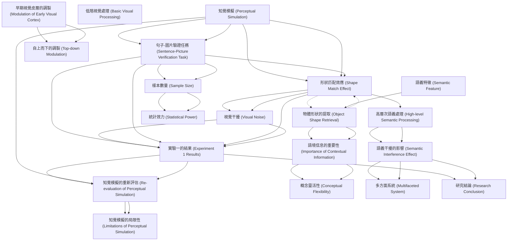

# Zettelkasten 卡片索引

**來源論文**: Ostarek-2019a_Mental_Simulation
**作者**: 
**年份**: 2025
**生成日期**: 2025-10-29 16:43
**卡片總數**: 20

---

## 📚 卡片清單

### 1. [知覺模擬 (Perceptual Simulation)](zettel_cards/CogSci-20251029-001.md)
- **ID**: `CogSci-20251029-001`
- **類型**: 
- **核心**: "Many studies have shown that sentences implying an object to have a certain shape produce a robust reaction time advantage for shape-matching pictures in the sentence-picture verification task."
- **標籤**: `語言理解`, `概念處理`, `具身認知`

### 2. [句子-圖片驗證任務 (Sentence-Picture Verification Task)](zettel_cards/CogSci-20251029-002.md)
- **ID**: `CogSci-20251029-002`
- **類型**: 
- **核心**: "Participants listened to sentences while seeing either visual noise that was previously shown to strongly interfere with basic visual processing or a blank screen."
- **標籤**: `實驗方法`, `認知心理學`, `語言處理`

### 3. [形狀匹配效應 (Shape Match Effect)](zettel_cards/CogSci-20251029-003.md)
- **ID**: `CogSci-20251029-003`
- **類型**: 
- **核心**: "The critical finding (Zwaan & Pecher, 2012; Zwaan et al., 2002) is shorter response latencies in the matching condition, suggesting that the sentences activate information about object shape that is specific enough to produce a priming effect on the verification judgement."
- **標籤**: `實驗結果`, `反應時間`, `啟動效應`

### 4. [視覺干擾 (Visual Noise)](zettel_cards/CogSci-20251029-004.md)
- **ID**: `CogSci-20251029-004`
- **類型**: 
- **核心**: "Experiment 1 used the same kind of visual interference that was recently shown to impair access to visual information during semantic processing (Edmiston & Lupyan, 2017; Ostarek & Huettig, 2017a), consisting of dynamically changing Mondrian-type masks that are usually used for continuous flash suppression and are designed to maximally interfere with basic visual processing (Tsuchiya & Koch, 2005)."
- **標籤**: `實驗控制`, `干擾技術`, `視覺心理學`

### 5. [高層次語義處理 (High-level Semantic Processing)](zettel_cards/CogSci-20251029-005.md)
- **ID**: `CogSci-20251029-005`
- **類型**: 
- **核心**: "When an interference technique was used that targeted high-level semantic processing (Experiment 3) however the match effect vanished."
- **標籤**: `語義學`, `認知過程`, `語言學`

### 6. [實驗一的結果 (Experiment 1 Results)](zettel_cards/CogSci-20251029-006.md)
- **ID**: `CogSci-20251029-006`
- **類型**: 
- **核心**: "Experiments 1 and 2 replicated the match effect but crucially visual noise did not modulate it."
- **標籤**: `實驗結果`, `知覺模擬`, `視覺干擾`

### 7. [樣本數量 (Sample Size)](zettel_cards/CogSci-20251029-007.md)
- **ID**: `CogSci-20251029-007`
- **類型**: 
- **核心**: "We opted for a higher number of participants compared to previous studies using this paradigm based on the fact that our design included the additional factor of Visual Condition (visual noise vs. blank screen) and the conviction that high-powered studies are needed in the field of experimental psychology (Pashler & Wagenmakers, 2012)."
- **標籤**: `研究設計`, `統計效力`, `實驗方法`

### 8. [知覺模擬的重新評估 (Re-evaluation of Perceptual Simulation)](zettel_cards/CogSci-20251029-008.md)
- **ID**: `CogSci-20251029-008`
- **類型**: 
- **核心**: "Here we directly test this hypothesis."
- **標籤**: `研究假設`, `知覺模擬`, `具身認知`

### 9. [語義干擾的影響 (Semantic Interference Effect)](zettel_cards/CogSci-20251029-009.md)
- **ID**: `CogSci-20251029-009`
- **類型**: 
- **核心**: "When an interference technique was used that targeted high-level semantic processing (Experiment 3) however the match effect vanished."
- **標籤**: `實驗結果`, `語義處理`, `干擾效應`

### 10. [物體形狀的提取 (Object Shape Retrieval)](zettel_cards/CogSci-20251029-010.md)
- **ID**: `CogSci-20251029-010`
- **類型**: 
- **核心**: "Using the sentence-picture verification task, a classic experiment by Zwaan, Stanfield, and Yaxley (2002) provided evidence that contextually appropriate shape information is readily activated during sentence comprehension."
- **標籤**: `概念提取`, `形狀表徵`, `語言理解`

### 11. [語境信息的重要性 (Importance of Contextual Information)](zettel_cards/CogSci-20251029-011.md)
- **ID**: `CogSci-20251029-011`
- **類型**: 
- **核心**: "As many objects can occur in multiple different shapes, listeners often need to incorporate contextual information in order to retrieve the appropriate shape representations."
- **標籤**: `語境效應`, `概念表徵`, `語言理解`

### 12. [概念靈活性 (Conceptual Flexibility)](zettel_cards/CogSci-20251029-012.md)
- **ID**: `CogSci-20251029-012`
- **類型**: 
- **核心**: "This view is theoretically appealing because it nicely accounts for the high degree of conceptual flexibility (Barsalou, 1993; Hoenig, Sim, Bochev, Herrnberger, & Kiefer, 2008; Ostarek & Huettig, 2017a; van Dam, van Dijk, Bekkering, & Rueschemeyer, 2012; Yee & Thompson-Schill, 2016) by conceiving of conceptual processing as a form of ad hoc sampling from a feature space that is constrained by both long-term memory and immediate context."
- **標籤**: `概念表徵`, `知識結構`, `認知靈活性`

### 13. [低階視覺處理 (Basic Visual Processing)](zettel_cards/CogSci-20251029-013.md)
- **ID**: `CogSci-20251029-013`
- **類型**: 
- **核心**: "Here we directly test this hypothesis. Participants listened to sentences while seeing either visual noise that was previously shown to strongly interfere with basic visual processing or a blank screen."
- **標籤**: `視覺認知`, `知覺過程`, `認知神經科學`

### 14. [早期視覺皮層的調製 (Modulation of Early Visual Cortex)](zettel_cards/CogSci-20251029-014.md)
- **ID**: `CogSci-20251029-014`
- **類型**: 
- **核心**: "processing of shape information in early visual cortex has been shown to be modulated in the sentence-picture verification task (Hirschfeld et al., 2011)"
- **標籤**: `神經科學`, `腦活動`, `視覺皮層`

### 15. [自上而下的調製 (Top-down Modulation)](zettel_cards/CogSci-20251029-015.md)
- **ID**: `CogSci-20251029-015`
- **類型**: 
- **核心**: "suggesting a top-down modulation of early visual processing as a function of shape match vs. mismatch."
- **標籤**: `認知控制`, `認知過程`, `信息處理`

### 16. [語義特徵 (Semantic Feature)](zettel_cards/CogSci-20251029-016.md)
- **ID**: `CogSci-20251029-016`
- **類型**: 
- **核心**: "The present study focuses on one particular semantic feature; object shape."
- **標籤**: `語義學`, `語言理解`, `概念表徵`

### 17. [統計效力 (Statistical Power)](zettel_cards/CogSci-20251029-017.md)
- **ID**: `CogSci-20251029-017`
- **類型**: 
- **核心**: "and the conviction that high-powered studies are needed in the field of experimental psychology (Pashler & Wagenmakers, 2012)."
- **標籤**: `研究方法`, `統計學`, `實驗設計`

### 18. [多方面系統 (Multifaceted System)](zettel_cards/CogSci-20251029-018.md)
- **ID**: `CogSci-20251029-018`
- **類型**: 
- **核心**: "Recent behavioural and neuroimaging studies have begun to unravel the underlying mechanisms and started painting a multifaceted picture of a widely distributed system that includes modality-specific processes..."
- **標籤**: `認知系統`, `腦網絡`, `認知神經科學`

### 19. [知覺模擬的局限性 (Limitations of Perceptual Simulation)](zettel_cards/CogSci-20251029-019.md)
- **ID**: `CogSci-20251029-019`
- **類型**: 
- **核心**: "However, one does not need to invoke simulation in order to explain the behavioural pattern, as studies using the sentence-picture verification paradigm can only tell us something about the kind of information that is accessed, but not about the kinds of processes and representations involved."
- **標籤**: `研究局限`, `理論假設`, `認知模型`

### 20. [研究結論 (Research Conclusion)](zettel_cards/CogSci-20251029-020.md)
- **ID**: `CogSci-20251029-020`
- **類型**: 
- **核心**: "We conclude that the shape match effect in the sentence-picture verification paradigm is unlikely to rely on perceptual simulation."
- **標籤**: `研究總結`, `實驗結論`, `語言理解`

---

## 🗺️ 概念網絡圖

---

## 🏷️ 標籤索引

### 語言理解
- [[CogSci-20251029-001]] 知覺模擬 (Perceptual Simulation)
- [[CogSci-20251029-010]] 物體形狀的提取 (Object Shape Retrieval)
- [[CogSci-20251029-011]] 語境信息的重要性 (Importance of Contextual Information)
- [[CogSci-20251029-016]] 語義特徵 (Semantic Feature)
- [[CogSci-20251029-020]] 研究結論 (Research Conclusion)

### 概念處理
- [[CogSci-20251029-001]] 知覺模擬 (Perceptual Simulation)

### 具身認知
- [[CogSci-20251029-001]] 知覺模擬 (Perceptual Simulation)
- [[CogSci-20251029-008]] 知覺模擬的重新評估 (Re-evaluation of Perceptual Simulation)

### 實驗方法
- [[CogSci-20251029-002]] 句子-圖片驗證任務 (Sentence-Picture Verification Task)
- [[CogSci-20251029-007]] 樣本數量 (Sample Size)

### 認知心理學
- [[CogSci-20251029-002]] 句子-圖片驗證任務 (Sentence-Picture Verification Task)

### 語言處理
- [[CogSci-20251029-002]] 句子-圖片驗證任務 (Sentence-Picture Verification Task)

### 實驗結果
- [[CogSci-20251029-003]] 形狀匹配效應 (Shape Match Effect)
- [[CogSci-20251029-006]] 實驗一的結果 (Experiment 1 Results)
- [[CogSci-20251029-009]] 語義干擾的影響 (Semantic Interference Effect)

### 反應時間
- [[CogSci-20251029-003]] 形狀匹配效應 (Shape Match Effect)

### 啟動效應
- [[CogSci-20251029-003]] 形狀匹配效應 (Shape Match Effect)

### 實驗控制
- [[CogSci-20251029-004]] 視覺干擾 (Visual Noise)

### 干擾技術
- [[CogSci-20251029-004]] 視覺干擾 (Visual Noise)

### 視覺心理學
- [[CogSci-20251029-004]] 視覺干擾 (Visual Noise)

### 語義學
- [[CogSci-20251029-005]] 高層次語義處理 (High-level Semantic Processing)
- [[CogSci-20251029-016]] 語義特徵 (Semantic Feature)

### 認知過程
- [[CogSci-20251029-005]] 高層次語義處理 (High-level Semantic Processing)
- [[CogSci-20251029-015]] 自上而下的調製 (Top-down Modulation)

### 語言學
- [[CogSci-20251029-005]] 高層次語義處理 (High-level Semantic Processing)

### 知覺模擬
- [[CogSci-20251029-006]] 實驗一的結果 (Experiment 1 Results)
- [[CogSci-20251029-008]] 知覺模擬的重新評估 (Re-evaluation of Perceptual Simulation)

### 視覺干擾
- [[CogSci-20251029-006]] 實驗一的結果 (Experiment 1 Results)

### 研究設計
- [[CogSci-20251029-007]] 樣本數量 (Sample Size)

### 統計效力
- [[CogSci-20251029-007]] 樣本數量 (Sample Size)

### 研究假設
- [[CogSci-20251029-008]] 知覺模擬的重新評估 (Re-evaluation of Perceptual Simulation)

### 語義處理
- [[CogSci-20251029-009]] 語義干擾的影響 (Semantic Interference Effect)

### 干擾效應
- [[CogSci-20251029-009]] 語義干擾的影響 (Semantic Interference Effect)

### 概念提取
- [[CogSci-20251029-010]] 物體形狀的提取 (Object Shape Retrieval)

### 形狀表徵
- [[CogSci-20251029-010]] 物體形狀的提取 (Object Shape Retrieval)

### 語境效應
- [[CogSci-20251029-011]] 語境信息的重要性 (Importance of Contextual Information)

### 概念表徵
- [[CogSci-20251029-011]] 語境信息的重要性 (Importance of Contextual Information)
- [[CogSci-20251029-012]] 概念靈活性 (Conceptual Flexibility)
- [[CogSci-20251029-016]] 語義特徵 (Semantic Feature)

### 知識結構
- [[CogSci-20251029-012]] 概念靈活性 (Conceptual Flexibility)

### 認知靈活性
- [[CogSci-20251029-012]] 概念靈活性 (Conceptual Flexibility)

### 視覺認知
- [[CogSci-20251029-013]] 低階視覺處理 (Basic Visual Processing)

### 知覺過程
- [[CogSci-20251029-013]] 低階視覺處理 (Basic Visual Processing)

### 認知神經科學
- [[CogSci-20251029-013]] 低階視覺處理 (Basic Visual Processing)
- [[CogSci-20251029-018]] 多方面系統 (Multifaceted System)

### 神經科學
- [[CogSci-20251029-014]] 早期視覺皮層的調製 (Modulation of Early Visual Cortex)

### 腦活動
- [[CogSci-20251029-014]] 早期視覺皮層的調製 (Modulation of Early Visual Cortex)

### 視覺皮層
- [[CogSci-20251029-014]] 早期視覺皮層的調製 (Modulation of Early Visual Cortex)

### 認知控制
- [[CogSci-20251029-015]] 自上而下的調製 (Top-down Modulation)

### 信息處理
- [[CogSci-20251029-015]] 自上而下的調製 (Top-down Modulation)

### 研究方法
- [[CogSci-20251029-017]] 統計效力 (Statistical Power)

### 統計學
- [[CogSci-20251029-017]] 統計效力 (Statistical Power)

### 實驗設計
- [[CogSci-20251029-017]] 統計效力 (Statistical Power)

### 認知系統
- [[CogSci-20251029-018]] 多方面系統 (Multifaceted System)

### 腦網絡
- [[CogSci-20251029-018]] 多方面系統 (Multifaceted System)

### 研究局限
- [[CogSci-20251029-019]] 知覺模擬的局限性 (Limitations of Perceptual Simulation)

### 理論假設
- [[CogSci-20251029-019]] 知覺模擬的局限性 (Limitations of Perceptual Simulation)

### 認知模型
- [[CogSci-20251029-019]] 知覺模擬的局限性 (Limitations of Perceptual Simulation)

### 研究總結
- [[CogSci-20251029-020]] 研究結論 (Research Conclusion)

### 實驗結論
- [[CogSci-20251029-020]] 研究結論 (Research Conclusion)

---

## 📖 閱讀建議順序

1. [[CogSci-20251029-012]] 概念靈活性 (Conceptual Flexibility)

2. [[CogSci-20251029-013]] 低階視覺處理 (Basic Visual Processing)

3. [[CogSci-20251029-015]] 自上而下的調製 (Top-down Modulation)

4. [[CogSci-20251029-016]] 語義特徵 (Semantic Feature)

5. [[CogSci-20251029-017]] 統計效力 (Statistical Power)

6. [[CogSci-20251029-018]] 多方面系統 (Multifaceted System)

7. [[CogSci-20251029-019]] 知覺模擬的局限性 (Limitations of Perceptual Simulation)

8. [[CogSci-20251029-020]] 研究結論 (Research Conclusion)

9. [[CogSci-20251029-004]] 視覺干擾 (Visual Noise)

10. [[CogSci-20251029-005]] 高層次語義處理 (High-level Semantic Processing)

11. [[CogSci-20251029-007]] 樣本數量 (Sample Size)

12. [[CogSci-20251029-008]] 知覺模擬的重新評估 (Re-evaluation of Perceptual Simulation)

13. [[CogSci-20251029-010]] 物體形狀的提取 (Object Shape Retrieval)

14. [[CogSci-20251029-011]] 語境信息的重要性 (Importance of Contextual Information)

15. [[CogSci-20251029-014]] 早期視覺皮層的調製 (Modulation of Early Visual Cortex)

16. [[CogSci-20251029-003]] 形狀匹配效應 (Shape Match Effect)

17. [[CogSci-20251029-006]] 實驗一的結果 (Experiment 1 Results)

18. [[CogSci-20251029-009]] 語義干擾的影響 (Semantic Interference Effect)

19. [[CogSci-20251029-001]] 知覺模擬 (Perceptual Simulation)

20. [[CogSci-20251029-002]] 句子-圖片驗證任務 (Sentence-Picture Verification Task)

---

*本索引由 Knowledge Production System 自動生成*