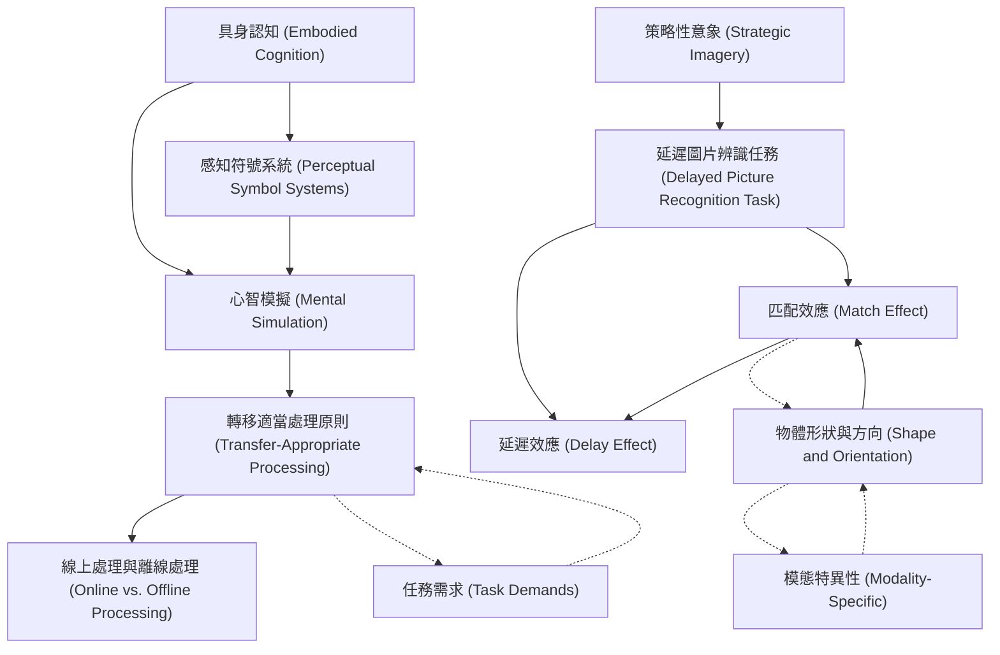

# Zettelkasten 卡片索引

---

## 📚 卡片清單

### 1. [具身認知 (Embodied Cognition)](zettel_cards/Pecher-2009-001.md)
- **ID**: `Pecher-2009-001`
- **類型**: 
- **核心**: "According to theories of embodied cognition, language comprehenders simulate sensorimotor experiences to represent the meaning of what they read."
- **標籤**: `Embodied Cognition`, `Language Comprehension`, `Sensorimotor Simulation`

### 2. [感知符號系統 (Perceptual Symbol Systems)](zettel_cards/Pecher-2009-002.md)
- **ID**: `Pecher-2009-002`
- **類型**: 
- **核心**: "During perception and action, the patterns of activation that result from experience are captured."
- **標籤**: `Perceptual Symbol`, `Sensorimotor`, `Conceptual Representation`

### 3. [心智模擬 (Mental Simulation)](zettel_cards/Pecher-2009-003.md)
- **ID**: `Pecher-2009-003`
- **類型**: 
- **核心**: "During thought a concept is represented by perceptual symbols through a simulation of sensorimotor interaction with the concept."
- **標籤**: `Mental Simulation`, `Sensorimotor`, `Language Comprehension`

### 4. [轉移適當處理原則 (Transfer-Appropriate Processing)](zettel_cards/Pecher-2009-004.md)
- **ID**: `Pecher-2009-004`
- **類型**: 
- **核心**: "Memory performance should be affected by the overlap between the mental representation at study and the physical appearance of the stimuli presented at test, as is predicted by the transfer-appropriate processing principle"
- **標籤**: `Memory`, `Transfer-Appropriate Processing`, `Encoding`, `Retrieval`

### 5. [延遲圖片辨識任務 (Delayed Picture Recognition Task)](zettel_cards/Pecher-2009-005.md)
- **ID**: `Pecher-2009-005`
- **類型**: 
- **核心**: "During the implicit study phase, participants were presented with sentences implying a particular orientation or shape...Once the complete list of sentences had been read, pictures were presented in a surprise recognition memory task."
- **標籤**: `Experiment`, `Methodology`, `Memory`, `Picture Recognition`

### 6. [匹配效應 (Match Effect)](zettel_cards/Pecher-2009-006.md)
- **ID**: `Pecher-2009-006`
- **類型**: 
- **核心**: "Recognition performance was better if the orientation or shape of the object matched that implied by the sentence than when it did not match."
- **標籤**: `Match Effect`, `Recognition Memory`, `Sensorimotor Simulation`

### 7. [延遲效應 (Delay Effect)](zettel_cards/Pecher-2009-007.md)
- **ID**: `Pecher-2009-007`
- **類型**: 
- **核心**: "Theseresultssuggestthatpreviouslyfoundmatcheffectswerenotduetostrategicimageryandshowthatdetailsofsensorimotorsimulationsareretainedoverlongerperiods."
- **標籤**: `Delay`, `Memory Retention`, `Sensorimotor Simulation`

### 8. [線上處理與離線處理 (Online vs. Offline Processing)](zettel_cards/Pecher-2009-008.md)
- **ID**: `Pecher-2009-008`
- **類型**: 
- **核心**: "The present study shows that similar findings are obtained for sentence comprehension. Not only is memory for the content of sentences sensitive to modality-specific information, it is also sensitive to the specific properties of the visual simulation that was formed during the comprehension process."
- **標籤**: `Online Processing`, `Offline Processing`, `Sentence Comprehension`, `Modality-Specific Information`

### 9. [策略性意象 (Strategic Imagery)](zettel_cards/Pecher-2009-009.md)
- **ID**: `Pecher-2009-009`
- **類型**: 
- **核心**: "Thus, their results leave open the possibility that visual simulations are only used when the task demands strategic imagery, and that they are not automatically used during normal language comprehension."
- **標籤**: `Strategic Imagery`, `Automatic Processing`, `Language Comprehension`

### 10. [物體形狀與方向 (Shape and Orientation)](zettel_cards/Pecher-2009-010.md)
- **ID**: `Pecher-2009-010`
- **類型**: 
- **核心**: "For the orientation condition the pictures were rotated in order to present objects at two different orientations. For the shape condition different pictures were used that represented the same object in different shapes (e.g., an opened and a closed tube of toothpaste)."
- **標籤**: `Shape`, `Orientation`, `Visual Perception`, `Object Recognition`

### 11. [模態特異性 (Modality-Specific)](zettel_cards/Pecher-2009-011.md)
- **ID**: `Pecher-2009-011`
- **類型**: 
- **核心**: "According to this view, modality-specific systems that support perception and action are also used to represent knowledge during offline processing."
- **標籤**: `Modality-Specific`, `Perception`, `Action`, `Knowledge Representation`

### 12. [任務需求 (Task Demands)](zettel_cards/Pecher-2009-012.md)
- **ID**: `Pecher-2009-012`
- **類型**: 
- **核心**: "Participants may have used conscious imagery while reading the sentence in order to quickly recognize the picture as old or new."
- **標籤**: `Task Demands`, `Strategic Imagery`, `Conscious Processing`

---

## 🗺️ 概念網絡圖

---

## 🏷️ 標籤索引

### Embodied Cognition
- [[Pecher-2009-001]] 具身認知 (Embodied Cognition)

### Language Comprehension
- [[Pecher-2009-001]] 具身認知 (Embodied Cognition)
- [[Pecher-2009-003]] 心智模擬 (Mental Simulation)
- [[Pecher-2009-009]] 策略性意象 (Strategic Imagery)

### Sensorimotor Simulation
- [[Pecher-2009-001]] 具身認知 (Embodied Cognition)
- [[Pecher-2009-006]] 匹配效應 (Match Effect)
- [[Pecher-2009-007]] 延遲效應 (Delay Effect)

### Perceptual Symbol
- [[Pecher-2009-002]] 感知符號系統 (Perceptual Symbol Systems)

### Sensorimotor
- [[Pecher-2009-002]] 感知符號系統 (Perceptual Symbol Systems)
- [[Pecher-2009-003]] 心智模擬 (Mental Simulation)

### Conceptual Representation
- [[Pecher-2009-002]] 感知符號系統 (Perceptual Symbol Systems)

### Mental Simulation
- [[Pecher-2009-003]] 心智模擬 (Mental Simulation)

### Memory
- [[Pecher-2009-004]] 轉移適當處理原則 (Transfer-Appropriate Processing)
- [[Pecher-2009-005]] 延遲圖片辨識任務 (Delayed Picture Recognition Task)

### Transfer-Appropriate Processing
- [[Pecher-2009-004]] 轉移適當處理原則 (Transfer-Appropriate Processing)

### Encoding
- [[Pecher-2009-004]] 轉移適當處理原則 (Transfer-Appropriate Processing)

### Retrieval
- [[Pecher-2009-004]] 轉移適當處理原則 (Transfer-Appropriate Processing)

### Experiment
- [[Pecher-2009-005]] 延遲圖片辨識任務 (Delayed Picture Recognition Task)

### Methodology
- [[Pecher-2009-005]] 延遲圖片辨識任務 (Delayed Picture Recognition Task)

### Picture Recognition
- [[Pecher-2009-005]] 延遲圖片辨識任務 (Delayed Picture Recognition Task)

### Match Effect
- [[Pecher-2009-006]] 匹配效應 (Match Effect)

### Recognition Memory
- [[Pecher-2009-006]] 匹配效應 (Match Effect)

### Delay
- [[Pecher-2009-007]] 延遲效應 (Delay Effect)

### Memory Retention
- [[Pecher-2009-007]] 延遲效應 (Delay Effect)

### Online Processing
- [[Pecher-2009-008]] 線上處理與離線處理 (Online vs. Offline Processing)

### Offline Processing
- [[Pecher-2009-008]] 線上處理與離線處理 (Online vs. Offline Processing)

### Sentence Comprehension
- [[Pecher-2009-008]] 線上處理與離線處理 (Online vs. Offline Processing)

### Modality-Specific Information
- [[Pecher-2009-008]] 線上處理與離線處理 (Online vs. Offline Processing)

### Strategic Imagery
- [[Pecher-2009-009]] 策略性意象 (Strategic Imagery)
- [[Pecher-2009-012]] 任務需求 (Task Demands)

### Automatic Processing
- [[Pecher-2009-009]] 策略性意象 (Strategic Imagery)

### Shape
- [[Pecher-2009-010]] 物體形狀與方向 (Shape and Orientation)

### Orientation
- [[Pecher-2009-010]] 物體形狀與方向 (Shape and Orientation)

### Visual Perception
- [[Pecher-2009-010]] 物體形狀與方向 (Shape and Orientation)

### Object Recognition
- [[Pecher-2009-010]] 物體形狀與方向 (Shape and Orientation)

### Modality-Specific
- [[Pecher-2009-011]] 模態特異性 (Modality-Specific)

### Perception
- [[Pecher-2009-011]] 模態特異性 (Modality-Specific)

### Action
- [[Pecher-2009-011]] 模態特異性 (Modality-Specific)

### Knowledge Representation
- [[Pecher-2009-011]] 模態特異性 (Modality-Specific)

### Task Demands
- [[Pecher-2009-012]] 任務需求 (Task Demands)

### Conscious Processing
- [[Pecher-2009-012]] 任務需求 (Task Demands)

---

## 📖 閱讀建議順序

1. [[Pecher-2009-001]] 具身認知 (Embodied Cognition)

2. [[Pecher-2009-002]] 感知符號系統 (Perceptual Symbol Systems)

3. [[Pecher-2009-003]] 心智模擬 (Mental Simulation)

4. [[Pecher-2009-004]] 轉移適當處理原則 (Transfer-Appropriate Processing)

5. [[Pecher-2009-005]] 延遲圖片辨識任務 (Delayed Picture Recognition Task)

6. [[Pecher-2009-006]] 匹配效應 (Match Effect)

7. [[Pecher-2009-007]] 延遲效應 (Delay Effect)

8. [[Pecher-2009-008]] 線上處理與離線處理 (Online vs. Offline Processing)

9. [[Pecher-2009-009]] 策略性意象 (Strategic Imagery)

10. [[Pecher-2009-010]] 物體形狀與方向 (Shape and Orientation)

11. [[Pecher-2009-011]] 模態特異性 (Modality-Specific)

12. [[Pecher-2009-012]] 任務需求 (Task Demands)

---

*本索引由 Knowledge Production System 自動生成*