# Zettelkasten 卡片索引

**來源論文**: Pecher-2009_Mental_Simulation
**作者**: 
**年份**: 2025
**生成日期**: 2025-10-29 16:44
**卡片總數**: 20

---

## 📚 卡片清單

### 1. [具身認知 (Embodied Cognition)](zettel_cards/CogSci-20251029-001.md)
- **ID**: `CogSci-20251029-001`
- **類型**: 
- **核心**: "According to theories of embodied cognition, language comprehenders simulate sensorimotor experiences to represent the meaning of what they read."
- **標籤**: `具身認知`, `語言理解`, `感知運動模擬`

### 2. [感知符號理論 (Perceptual Symbols Theory)](zettel_cards/CogSci-20251029-002.md)
- **ID**: `CogSci-20251029-002`
- **類型**: 
- **核心**: "During thought a concept is represented by perceptual symbols through a simulation of sensorimotor interaction with the concept."
- **標籤**: `感知符號`, `模擬`, `概念表徵`

### 3. [心理模擬 (Mental Simulation)](zettel_cards/CogSci-20251029-003.md)
- **ID**: `CogSci-20251029-003`
- **類型**: 
- **核心**: "Evidence for the role of visual simulations in representing the meaning of language was obtained by Stanfield and Zwaan (2001) and Zwaan et al. (2002; see also Holt & Beilock, 2006)."
- **標籤**: `心理模擬`, `語言理解`, `視覺模擬`

### 4. [物體方向一致性效應 (Object Orientation Matching Effect)](zettel_cards/CogSci-20251029-004.md)
- **ID**: `CogSci-20251029-004`
- **類型**: 
- **核心**: "Participants were faster and more accurate to recognize the object when the orientation of the picture matched the orientation implied by the sentence than when it did not match."
- **標籤**: `方向一致性`, `語言理解`, `認知反應`

### 5. [物體形狀一致性效應 (Object Shape Matching Effect)](zettel_cards/CogSci-20251029-005.md)
- **ID**: `CogSci-20251029-005`
- **類型**: 
- **核心**: "Similar results were obtained by Zwaan et al. for pictures that matched or did not match the implied shape of an object (e.g., The ranger saw the eagle in the sky, followed by a picture of an eagle with folded wings or with outstretched wings)."
- **標籤**: `形狀一致性`, `語言理解`, `認知反應`

### 6. [策略性意象 (Strategic Imagery)](zettel_cards/CogSci-20251029-006.md)
- **ID**: `CogSci-20251029-006`
- **類型**: 
- **核心**: "Because participants had to compare the object mentioned in the sentence to a picture that was presented immediately after the sentence, this may have motivated the strategic use of visual imagery during sentence reading."
- **標籤**: `策略性意象`, `視覺意象`, `認知策略`

### 7. [延遲圖片辨識任務 (Delayed Picture Recognition Task)](zettel_cards/CogSci-20251029-007.md)
- **ID**: `CogSci-20251029-007`
- **類型**: 
- **核心**: "During the implicit study phase, participants were presented with sentences implying a particular orientation or shape (e.g., The handyman made a hole in the wall with his drill, which implies a drill in horizontal orientation)."
- **標籤**: `延遲辨識`, `實驗設計`, `記憶研究`

### 8. [判斷句子合理性 (Sensibleness Judgement)](zettel_cards/CogSci-20251029-008.md)
- **ID**: `CogSci-20251029-008`
- **類型**: 
- **核心**: "They judged the sensibleness of these sentences and a set of distractor sentences (e.g., Wendy didn’t notice that a child had crawled into her soda can)."
- **標籤**: `句子判斷`, `任務設計`, `認知實驗`

### 9. [轉移適當處理原則 (Transfer-Appropriate Processing Principle)](zettel_cards/CogSci-20251029-009.md)
- **ID**: `CogSci-20251029-009`
- **類型**: 
- **核心**: "Memory performance should be affected by the overlap between the mental representation at study and the physical appearance of the stimuli presented at test, as is predicted by the transfer-appropriate processing principle (Durgunog˘lu & Roediger, 1987; Morris, Bransford, & Franks, 1977)."
- **標籤**: `轉移適當性`, `記憶`, `認知心理學`

### 10. [實驗組延遲時間 (Experimental Group Delay)](zettel_cards/CogSci-20251029-010.md)
- **ID**: `CogSci-20251029-010`
- **類型**: 
- **核心**: "One group of participants was tested immediately after the sentence reading task, and another group of participants was tested after an unrelated intervening task that lasted about 45 min."
- **標籤**: `延遲時間`, `實驗設計`, `認知實驗`

### 11. [研究材料 (Study Materials)](zettel_cards/CogSci-20251029-011.md)
- **ID**: `CogSci-20251029-011`
- **類型**: 
- **核心**: "All sentences were Dutch. The pictures were selected from various sources (Bonin, Peereman, Malardier, Meot, & Chalard, 2003; Stanfield & Zwaan, 2001; Starreveld,
- **標籤**: `實驗材料`, `荷蘭語`, `圖片資料`

### 12. [圖片來源與控制 (Picture Source and Control)](zettel_cards/CogSci-20251029-012.md)
- **ID**: `CogSci-20251029-012`
- **類型**: 
- **核心**: "created. These pictures served as nonstudied distractors on the recognition memory test."
- **標籤**: `分心圖片`, `圖片控制`, `實驗設計`

### 13. [實驗程序 (Experimental Procedure)](zettel_cards/CogSci-20251029-013.md)
- **ID**: `CogSci-20251029-013`
- **類型**: 
- **核心**: "During the recognition test, the studied items were intermixed with new items, and participants were asked to indicate whether they remembered having studied the picture during the study phase."
- **標籤**: `辨識測試`, `實驗流程`, `記憶研究`

### 14. [數據分析 (Data Analysis)](zettel_cards/CogSci-20251029-014.md)
- **ID**: `CogSci-20251029-014`
- **類型**: 
- **核心**: "The proportion of correctly recognized old items (hits) and the proportion of incorrectly recognized new items (false alarms) were subjected to an analysis of variance (ANOVA) with delay (immediate vs. delayed) as a between-subjects variable and match (match vs. mismatch) as a within-subjects variable."
- **標籤**: `方差分析`, `統計方法`, `數據處理`

### 15. [主要發現 (Main Finding)](zettel_cards/CogSci-20251029-015.md)
- **ID**: `CogSci-20251029-015`
- **類型**: 
- **核心**: "Recognition performance was better if the orientation or shape of the object matched that implied by the sentence, both immediately after reading the complete list of sentences and after a 45-min delay."
- **標籤**: `一致性效應`, `延遲效應`, `記憶表現`

### 16. [對策略性意象的反駁 (Rejection of Strategic Imagery)](zettel_cards/CogSci-20251029-016.md)
- **ID**: `CogSci-20251029-016`
- **類型**: 
- **核心**: "These results suggest that previously found match effects were not due to strategic imagery and show that details of sensorimotor simulations are retained over longer periods."
- **標籤**: `策略性意象`, `感知運動模擬`, `實驗結果`

### 17. [感知運動模擬的保留 (Retention of Sensorimotor Simulations)](zettel_cards/CogSci-20251029-017.md)
- **ID**: `CogSci-20251029-017`
- **類型**: 
- **核心**: "show that details of sensorimotor simulations are retained over longer periods."
- **標籤**: `感知運動模擬`, `記憶保留`, `長期記憶`

### 18. [研究局限性 (Study Limitations)](zettel_cards/CogSci-20251029-018.md)
- **ID**: `CogSci-20251029-018`
- **類型**: 
- **核心**: (論文中未直接明確指出，但可推斷)
- **標籤**: `局限性`, `未來研究`, `研究方向`

### 19. [未來研究方向：神經機制 (Future Research: Neural Mechanisms)](zettel_cards/CogSci-20251029-019.md)
- **ID**: `CogSci-20251029-019`
- **類型**: 
- **核心**: (論文中未直接明確指出，但可推斷)
- **標籤**: `神經機制`, `大腦活動`, `認知神經科學`

### 20. [未來研究方向：個體差異 (Future Research: Individual Differences)](zettel_cards/CogSci-20251029-020.md)
- **ID**: `CogSci-20251029-020`
- **類型**: 
- **核心**: (論文中未直接明確指出，但可推斷)
- **標籤**: `個體差異`, `認知風格`, `語言能力`

---

## 🗺️ 概念網絡圖

```mermaid
graph TD

    CogSci-20251029-001["具身認知 (Embodied Cognition)"]

    CogSci-20251029-002["感知符號理論 (Perceptual Symbols Theory)"]

    CogSci-20251029-003["心理模擬 (Mental Simulation)"]

    CogSci-20251029-004["物體方向一致性效應 (Object Orientation Matching Effect)"]

    CogSci-20251029-005["物體形狀一致性效應 (Object Shape Matching Effect)"]

    CogSci-20251029-006["策略性意象 (Strategic Imagery)"]

    CogSci-20251029-007["延遲圖片辨識任務 (Delayed Picture Recognition Task)"]

    CogSci-20251029-008["判斷句子合理性 (Sensibleness Judgement)"]

    CogSci-20251029-009["轉移適當處理原則 (Transfer-Appropriate Processing Principle)"]

    CogSci-20251029-010["實驗組延遲時間 (Experimental Group Delay)"]

    CogSci-20251029-011["研究材料 (Study Materials)"]

    CogSci-20251029-012["圖片來源與控制 (Picture Source and Control)"]

    CogSci-20251029-013["實驗程序 (Experimental Procedure)"]

    CogSci-20251029-014["數據分析 (Data Analysis)"]

    CogSci-20251029-015["主要發現 (Main Finding)"]

    CogSci-20251029-016["對策略性意象的反駁 (Rejection of Strategic Imagery)"]

    CogSci-20251029-017["感知運動模擬的保留 (Retention of Sensorimotor Simulations)"]

    CogSci-20251029-018["研究局限性 (Study Limitations)"]

    CogSci-20251029-019["未來研究方向：神經機制 (Future Research: Neural Mechanisms)"]

    CogSci-20251029-020["未來研究方向：個體差異 (Future Research: Individual Differences)"]






    CogSci-20251029-001 --> CogSci-20251029-002

    CogSci-20251029-001 --> CogSci-20251029-003






    CogSci-20251029-001 --> CogSci-20251029-002




    CogSci-20251029-002 --> CogSci-20251029-004






    CogSci-20251029-001 --> CogSci-20251029-003




    CogSci-20251029-003 --> CogSci-20251029-005






    CogSci-20251029-003 --> CogSci-20251029-004





    CogSci-20251029-004 -.-> CogSci-20251029-005





    CogSci-20251029-003 --> CogSci-20251029-005





    CogSci-20251029-005 -.-> CogSci-20251029-004










    CogSci-20251029-007 --> CogSci-20251029-008






    CogSci-20251029-007 --> CogSci-20251029-008







    CogSci-20251029-003 --> CogSci-20251029-009







    CogSci-20251029-007 --> CogSci-20251029-010











    CogSci-20251029-007 --> CogSci-20251029-012







    CogSci-20251029-007 --> CogSci-20251029-013











    CogSci-20251029-004 --> CogSci-20251029-015

    CogSci-20251029-005 --> CogSci-20251029-015







    CogSci-20251029-006 --> CogSci-20251029-016







    CogSci-20251029-001 --> CogSci-20251029-017








    CogSci-20251029-018 --> CogSci-20251029-019

    CogSci-20251029-018 --> CogSci-20251029-020






    CogSci-20251029-018 --> CogSci-20251029-019







    CogSci-20251029-018 --> CogSci-20251029-020





```

---

## 🏷️ 標籤索引

### 具身認知
- [[CogSci-20251029-001]] 具身認知 (Embodied Cognition)

### 語言理解
- [[CogSci-20251029-001]] 具身認知 (Embodied Cognition)
- [[CogSci-20251029-003]] 心理模擬 (Mental Simulation)
- [[CogSci-20251029-004]] 物體方向一致性效應 (Object Orientation Matching Effect)
- [[CogSci-20251029-005]] 物體形狀一致性效應 (Object Shape Matching Effect)

### 感知運動模擬
- [[CogSci-20251029-001]] 具身認知 (Embodied Cognition)
- [[CogSci-20251029-016]] 對策略性意象的反駁 (Rejection of Strategic Imagery)
- [[CogSci-20251029-017]] 感知運動模擬的保留 (Retention of Sensorimotor Simulations)

### 感知符號
- [[CogSci-20251029-002]] 感知符號理論 (Perceptual Symbols Theory)

### 模擬
- [[CogSci-20251029-002]] 感知符號理論 (Perceptual Symbols Theory)

### 概念表徵
- [[CogSci-20251029-002]] 感知符號理論 (Perceptual Symbols Theory)

### 心理模擬
- [[CogSci-20251029-003]] 心理模擬 (Mental Simulation)

### 視覺模擬
- [[CogSci-20251029-003]] 心理模擬 (Mental Simulation)

### 方向一致性
- [[CogSci-20251029-004]] 物體方向一致性效應 (Object Orientation Matching Effect)

### 認知反應
- [[CogSci-20251029-004]] 物體方向一致性效應 (Object Orientation Matching Effect)
- [[CogSci-20251029-005]] 物體形狀一致性效應 (Object Shape Matching Effect)

### 形狀一致性
- [[CogSci-20251029-005]] 物體形狀一致性效應 (Object Shape Matching Effect)

### 策略性意象
- [[CogSci-20251029-006]] 策略性意象 (Strategic Imagery)
- [[CogSci-20251029-016]] 對策略性意象的反駁 (Rejection of Strategic Imagery)

### 視覺意象
- [[CogSci-20251029-006]] 策略性意象 (Strategic Imagery)

### 認知策略
- [[CogSci-20251029-006]] 策略性意象 (Strategic Imagery)

### 延遲辨識
- [[CogSci-20251029-007]] 延遲圖片辨識任務 (Delayed Picture Recognition Task)

### 實驗設計
- [[CogSci-20251029-007]] 延遲圖片辨識任務 (Delayed Picture Recognition Task)
- [[CogSci-20251029-010]] 實驗組延遲時間 (Experimental Group Delay)
- [[CogSci-20251029-012]] 圖片來源與控制 (Picture Source and Control)

### 記憶研究
- [[CogSci-20251029-007]] 延遲圖片辨識任務 (Delayed Picture Recognition Task)
- [[CogSci-20251029-013]] 實驗程序 (Experimental Procedure)

### 句子判斷
- [[CogSci-20251029-008]] 判斷句子合理性 (Sensibleness Judgement)

### 任務設計
- [[CogSci-20251029-008]] 判斷句子合理性 (Sensibleness Judgement)

### 認知實驗
- [[CogSci-20251029-008]] 判斷句子合理性 (Sensibleness Judgement)
- [[CogSci-20251029-010]] 實驗組延遲時間 (Experimental Group Delay)

### 轉移適當性
- [[CogSci-20251029-009]] 轉移適當處理原則 (Transfer-Appropriate Processing Principle)

### 記憶
- [[CogSci-20251029-009]] 轉移適當處理原則 (Transfer-Appropriate Processing Principle)

### 認知心理學
- [[CogSci-20251029-009]] 轉移適當處理原則 (Transfer-Appropriate Processing Principle)

### 延遲時間
- [[CogSci-20251029-010]] 實驗組延遲時間 (Experimental Group Delay)

### 實驗材料
- [[CogSci-20251029-011]] 研究材料 (Study Materials)

### 荷蘭語
- [[CogSci-20251029-011]] 研究材料 (Study Materials)

### 圖片資料
- [[CogSci-20251029-011]] 研究材料 (Study Materials)

### 分心圖片
- [[CogSci-20251029-012]] 圖片來源與控制 (Picture Source and Control)

### 圖片控制
- [[CogSci-20251029-012]] 圖片來源與控制 (Picture Source and Control)

### 辨識測試
- [[CogSci-20251029-013]] 實驗程序 (Experimental Procedure)

### 實驗流程
- [[CogSci-20251029-013]] 實驗程序 (Experimental Procedure)

### 方差分析
- [[CogSci-20251029-014]] 數據分析 (Data Analysis)

### 統計方法
- [[CogSci-20251029-014]] 數據分析 (Data Analysis)

### 數據處理
- [[CogSci-20251029-014]] 數據分析 (Data Analysis)

### 一致性效應
- [[CogSci-20251029-015]] 主要發現 (Main Finding)

### 延遲效應
- [[CogSci-20251029-015]] 主要發現 (Main Finding)

### 記憶表現
- [[CogSci-20251029-015]] 主要發現 (Main Finding)

### 實驗結果
- [[CogSci-20251029-016]] 對策略性意象的反駁 (Rejection of Strategic Imagery)

### 記憶保留
- [[CogSci-20251029-017]] 感知運動模擬的保留 (Retention of Sensorimotor Simulations)

### 長期記憶
- [[CogSci-20251029-017]] 感知運動模擬的保留 (Retention of Sensorimotor Simulations)

### 局限性
- [[CogSci-20251029-018]] 研究局限性 (Study Limitations)

### 未來研究
- [[CogSci-20251029-018]] 研究局限性 (Study Limitations)

### 研究方向
- [[CogSci-20251029-018]] 研究局限性 (Study Limitations)

### 神經機制
- [[CogSci-20251029-019]] 未來研究方向：神經機制 (Future Research: Neural Mechanisms)

### 大腦活動
- [[CogSci-20251029-019]] 未來研究方向：神經機制 (Future Research: Neural Mechanisms)

### 認知神經科學
- [[CogSci-20251029-019]] 未來研究方向：神經機制 (Future Research: Neural Mechanisms)

### 個體差異
- [[CogSci-20251029-020]] 未來研究方向：個體差異 (Future Research: Individual Differences)

### 認知風格
- [[CogSci-20251029-020]] 未來研究方向：個體差異 (Future Research: Individual Differences)

### 語言能力
- [[CogSci-20251029-020]] 未來研究方向：個體差異 (Future Research: Individual Differences)

---

## 📖 閱讀建議順序

1. [[CogSci-20251029-002]] 感知符號理論 (Perceptual Symbols Theory)

2. [[CogSci-20251029-008]] 判斷句子合理性 (Sensibleness Judgement)

3. [[CogSci-20251029-009]] 轉移適當處理原則 (Transfer-Appropriate Processing Principle)

4. [[CogSci-20251029-010]] 實驗組延遲時間 (Experimental Group Delay)

5. [[CogSci-20251029-011]] 研究材料 (Study Materials)

6. [[CogSci-20251029-012]] 圖片來源與控制 (Picture Source and Control)

7. [[CogSci-20251029-013]] 實驗程序 (Experimental Procedure)

8. [[CogSci-20251029-014]] 數據分析 (Data Analysis)

9. [[CogSci-20251029-015]] 主要發現 (Main Finding)

10. [[CogSci-20251029-016]] 對策略性意象的反駁 (Rejection of Strategic Imagery)

11. [[CogSci-20251029-017]] 感知運動模擬的保留 (Retention of Sensorimotor Simulations)

12. [[CogSci-20251029-019]] 未來研究方向：神經機制 (Future Research: Neural Mechanisms)

13. [[CogSci-20251029-020]] 未來研究方向：個體差異 (Future Research: Individual Differences)

14. [[CogSci-20251029-004]] 物體方向一致性效應 (Object Orientation Matching Effect)

15. [[CogSci-20251029-005]] 物體形狀一致性效應 (Object Shape Matching Effect)

16. [[CogSci-20251029-006]] 策略性意象 (Strategic Imagery)

17. [[CogSci-20251029-018]] 研究局限性 (Study Limitations)

18. [[CogSci-20251029-001]] 具身認知 (Embodied Cognition)

19. [[CogSci-20251029-003]] 心理模擬 (Mental Simulation)

20. [[CogSci-20251029-007]] 延遲圖片辨識任務 (Delayed Picture Recognition Task)

---

*本索引由 Knowledge Production System 自動生成*