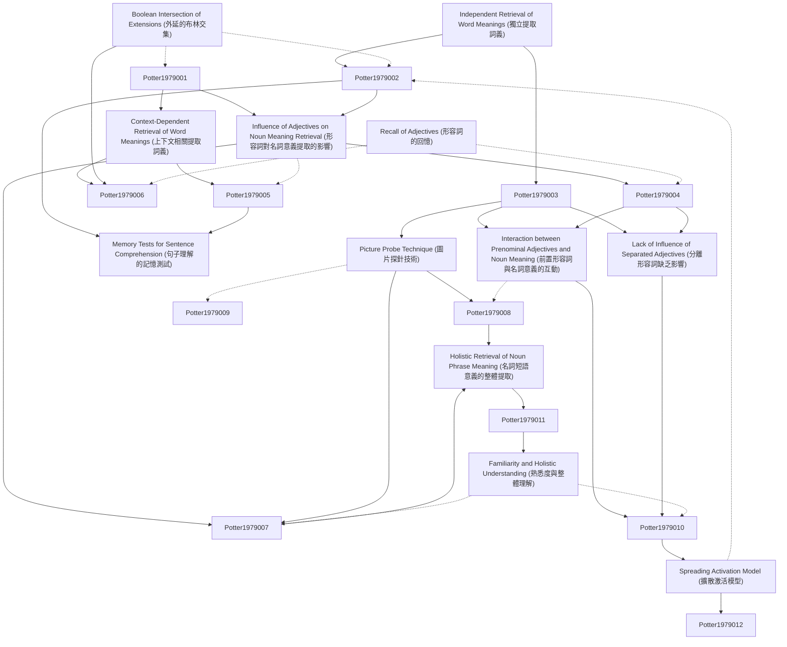

# Zettelkasten 卡片索引

**來源論文**: JOURNAL OF VERBAL LEARNING AND VERBAL BEHAVIOR 18, 509-521 (1979)
**作者**: Massachusetts Institute, Understanding Noun
**年份**: 1979
**生成日期**: 2025-11-04 16:40
**卡片總數**: 12

---

## 📚 卡片清單

### 1. [Independent Retrieval of Word Meanings (獨立提取詞義)](zettel_cards/Potter-1979-001.md)
- **ID**: `Potter-1979-001`
- **類型**: 
- **核心**: "One possibility is that the meaning of each word is retrieved independently of sentence context and then combined with that of the preceding words."
- **標籤**: `詞彙提取`, `語義理解`, `獨立提取`

### 2. [Context-Dependent Retrieval of Word Meanings (上下文相關提取詞義)](zettel_cards/Potter-1979-002.md)
- **ID**: `Potter-1979-002`
- **類型**: 
- **核心**: "A second possibility is that the preceding words influence the retrieval of a meaning for the word, such that the retrieved meaning is appropriate to the context."
- **標籤**: `詞彙提取`, `語義理解`, `上下文效應`

### 3. [Influence of Adjectives on Noun Meaning Retrieval (形容詞對名詞意義提取的影響)](zettel_cards/Potter-1979-003.md)
- **ID**: `Potter-1979-003`
- **類型**: 
- **核心**: "In this study we examine understanding of the noun in a noun phrase, asking to what extent the recovery of a meaning for the noun is influenced by a preceding adjective."
- **標籤**: `名詞短語`, `形容詞`, `意義提取`

### 4. [Picture Probe Technique (圖片探針技術)](zettel_cards/Potter-1979-004.md)
- **ID**: `Potter-1979-004`
- **類型**: 
- **核心**: "To examine the influence of a preceding adjective on initial retrieval of the meaning of a noun, we presented an immediate probe of the noun."
- **標籤**: `實驗方法`, `心理語言學`, `圖片探針`

### 5. [Boolean Intersection of Extensions (外延的布林交集)](zettel_cards/Potter-1979-005.md)
- **ID**: `Potter-1979-005`
- **類型**: 
- **核心**: "For example, a red ball is a thing that is both a ball and red."
- **標籤**: `詞彙組合`, `語義`, `布林邏輯`

### 6. [Memory Tests for Sentence Comprehension (句子理解的記憶測試)](zettel_cards/Potter-1979-006.md)
- **ID**: `Potter-1979-006`
- **類型**: 
- **核心**: "The experimental tests they have carried out typically measure memory for sentences."
- **標籤**: `實驗方法`, `心理語言學`, `記憶測試`

### 7. [Interaction between Prenominal Adjectives and Noun Meaning (前置形容詞與名詞意義的互動)](zettel_cards/Potter-1979-007.md)
- **ID**: `Potter-1979-007`
- **類型**: 
- **核心**: "When there was a prenominal adjective, the modified probe was 25 milliseconds faster than the typical probe."
- **標籤**: `形容詞`, `名詞`, `反應時間`

### 8. [Lack of Influence of Separated Adjectives (分離形容詞缺乏影響)](zettel_cards/Potter-1979-008.md)
- **ID**: `Potter-1979-008`
- **類型**: 
- **核心**: "Unlike prenominal adjectives, adjectives separated from the noun had little influence on the probe comparison in either the immediate or delayed conditions."
- **標籤**: `形容詞`, `名詞`, `語法結構`

### 9. [Recall of Adjectives (形容詞的回憶)](zettel_cards/Potter-1979-009.md)
- **ID**: `Potter-1979-009`
- **類型**: 
- **核心**: "Overall, 38 % of the adjectives were correctly recalled (less than .2 % were correctly guessed when they had not been in the sentence)."
- **標籤**: `記憶`, `形容詞`, `回憶率`

### 10. [Holistic Retrieval of Noun Phrase Meaning (名詞短語意義的整體提取)](zettel_cards/Potter-1979-010.md)
- **ID**: `Potter-1979-010`
- **類型**: 
- **核心**: "The results appear to show that the meaning of a noun phrase is retrieved as a single unit."
- **標籤**: `名詞短語`, `語義`, `整體性`

### 11. [Spreading Activation Model (擴散激活模型)](zettel_cards/Potter-1979-011.md)
- **ID**: `Potter-1979-011`
- **類型**: 
- **核心**: "With a model of this kind, priority is given to the pathway that first connects the concept nodes of the words in a noun phrase such as the burning house."
- **標籤**: `計算模型`, `語義網絡`, `擴散激活`

### 12. [Familiarity and Holistic Understanding (熟悉度與整體理解)](zettel_cards/Potter-1979-012.md)
- **ID**: `Potter-1979-012`
- **類型**: 
- **核心**: "A post hoc analysis suggests that context-dependent interpretation of noun meaning may be limited to phrases that express ideas already represented in memory."
- **標籤**: `熟悉度`, `語義理解`, `記憶表徵`

---

## 🗺️ 概念網絡圖

---

## 🏷️ 標籤索引

### 詞彙提取
- [[Potter-1979-001]] Independent Retrieval of Word Meanings (獨立提取詞義)
- [[Potter-1979-002]] Context-Dependent Retrieval of Word Meanings (上下文相關提取詞義)

### 語義理解
- [[Potter-1979-001]] Independent Retrieval of Word Meanings (獨立提取詞義)
- [[Potter-1979-002]] Context-Dependent Retrieval of Word Meanings (上下文相關提取詞義)
- [[Potter-1979-012]] Familiarity and Holistic Understanding (熟悉度與整體理解)

### 獨立提取
- [[Potter-1979-001]] Independent Retrieval of Word Meanings (獨立提取詞義)

### 上下文效應
- [[Potter-1979-002]] Context-Dependent Retrieval of Word Meanings (上下文相關提取詞義)

### 名詞短語
- [[Potter-1979-003]] Influence of Adjectives on Noun Meaning Retrieval (形容詞對名詞意義提取的影響)
- [[Potter-1979-010]] Holistic Retrieval of Noun Phrase Meaning (名詞短語意義的整體提取)

### 形容詞
- [[Potter-1979-003]] Influence of Adjectives on Noun Meaning Retrieval (形容詞對名詞意義提取的影響)
- [[Potter-1979-007]] Interaction between Prenominal Adjectives and Noun Meaning (前置形容詞與名詞意義的互動)
- [[Potter-1979-008]] Lack of Influence of Separated Adjectives (分離形容詞缺乏影響)
- [[Potter-1979-009]] Recall of Adjectives (形容詞的回憶)

### 意義提取
- [[Potter-1979-003]] Influence of Adjectives on Noun Meaning Retrieval (形容詞對名詞意義提取的影響)

### 實驗方法
- [[Potter-1979-004]] Picture Probe Technique (圖片探針技術)
- [[Potter-1979-006]] Memory Tests for Sentence Comprehension (句子理解的記憶測試)

### 心理語言學
- [[Potter-1979-004]] Picture Probe Technique (圖片探針技術)
- [[Potter-1979-006]] Memory Tests for Sentence Comprehension (句子理解的記憶測試)

### 圖片探針
- [[Potter-1979-004]] Picture Probe Technique (圖片探針技術)

### 詞彙組合
- [[Potter-1979-005]] Boolean Intersection of Extensions (外延的布林交集)

### 語義
- [[Potter-1979-005]] Boolean Intersection of Extensions (外延的布林交集)
- [[Potter-1979-010]] Holistic Retrieval of Noun Phrase Meaning (名詞短語意義的整體提取)

### 布林邏輯
- [[Potter-1979-005]] Boolean Intersection of Extensions (外延的布林交集)

### 記憶測試
- [[Potter-1979-006]] Memory Tests for Sentence Comprehension (句子理解的記憶測試)

### 名詞
- [[Potter-1979-007]] Interaction between Prenominal Adjectives and Noun Meaning (前置形容詞與名詞意義的互動)
- [[Potter-1979-008]] Lack of Influence of Separated Adjectives (分離形容詞缺乏影響)

### 反應時間
- [[Potter-1979-007]] Interaction between Prenominal Adjectives and Noun Meaning (前置形容詞與名詞意義的互動)

### 語法結構
- [[Potter-1979-008]] Lack of Influence of Separated Adjectives (分離形容詞缺乏影響)

### 記憶
- [[Potter-1979-009]] Recall of Adjectives (形容詞的回憶)

### 回憶率
- [[Potter-1979-009]] Recall of Adjectives (形容詞的回憶)

### 整體性
- [[Potter-1979-010]] Holistic Retrieval of Noun Phrase Meaning (名詞短語意義的整體提取)

### 計算模型
- [[Potter-1979-011]] Spreading Activation Model (擴散激活模型)

### 語義網絡
- [[Potter-1979-011]] Spreading Activation Model (擴散激活模型)

### 擴散激活
- [[Potter-1979-011]] Spreading Activation Model (擴散激活模型)

### 熟悉度
- [[Potter-1979-012]] Familiarity and Holistic Understanding (熟悉度與整體理解)

### 記憶表徵
- [[Potter-1979-012]] Familiarity and Holistic Understanding (熟悉度與整體理解)

---

## 📖 閱讀建議順序

1. [[Potter-1979-001]] Independent Retrieval of Word Meanings (獨立提取詞義)

2. [[Potter-1979-002]] Context-Dependent Retrieval of Word Meanings (上下文相關提取詞義)

3. [[Potter-1979-003]] Influence of Adjectives on Noun Meaning Retrieval (形容詞對名詞意義提取的影響)

4. [[Potter-1979-004]] Picture Probe Technique (圖片探針技術)

5. [[Potter-1979-005]] Boolean Intersection of Extensions (外延的布林交集)

6. [[Potter-1979-006]] Memory Tests for Sentence Comprehension (句子理解的記憶測試)

7. [[Potter-1979-007]] Interaction between Prenominal Adjectives and Noun Meaning (前置形容詞與名詞意義的互動)

8. [[Potter-1979-008]] Lack of Influence of Separated Adjectives (分離形容詞缺乏影響)

9. [[Potter-1979-009]] Recall of Adjectives (形容詞的回憶)

10. [[Potter-1979-010]] Holistic Retrieval of Noun Phrase Meaning (名詞短語意義的整體提取)

11. [[Potter-1979-011]] Spreading Activation Model (擴散激活模型)

12. [[Potter-1979-012]] Familiarity and Holistic Understanding (熟悉度與整體理解)

---

*本索引由 Knowledge Production System 自動生成*