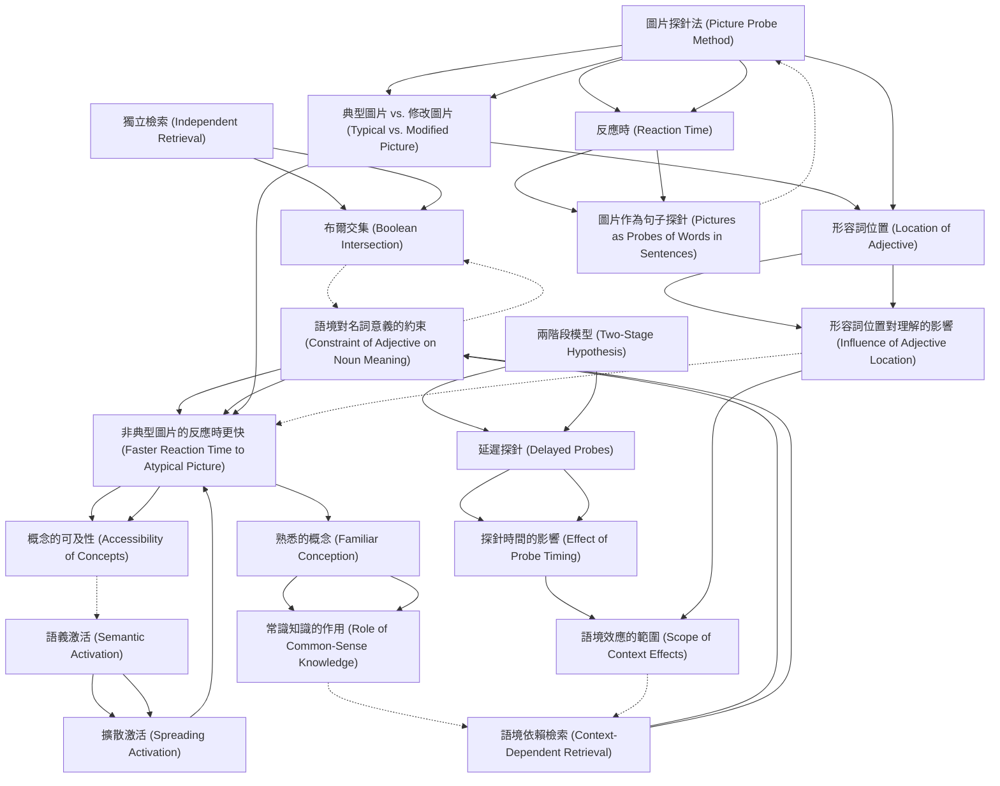

# Zettelkasten 卡片索引

**來源論文**: Potter-1979_Mental_Simulation
**作者**: 
**年份**: 2025
**生成日期**: 2025-10-29 16:44
**卡片總數**: 20

---

## 📚 卡片清單

### 1. [獨立檢索 (Independent Retrieval)](zettel_cards/CogSci-20251029-001.md)
- **ID**: `CogSci-20251029-001`
- **類型**: 
- **核心**: "One possibility is that the meaning of each word is retrieved independently of sentence context and then combined with that of the preceding words."
- **標籤**: `詞彙檢索`, `語義學`, `句子理解`

### 2. [語境依賴檢索 (Context-Dependent Retrieval)](zettel_cards/CogSci-20251029-002.md)
- **ID**: `CogSci-20251029-002`
- **類型**: 
- **核心**: "A second possibility is that the preceding words influence the retrieval of a meaning for the word, such that the retrieved meaning is appropriate to the context."
- **標籤**: `詞彙檢索`, `語義學`, `句子理解`, `語境效應`

### 3. [布爾交集 (Boolean Intersection)](zettel_cards/CogSci-20251029-003.md)
- **ID**: `CogSci-20251029-003`
- **類型**: 
- **核心**: "the extension of a noun phrase is the Boolean intersection of the extensions of the adjective(s) and the noun: For example, a red ball is a thing that is both a ball and red."
- **標籤**: `詞組理解`, `語義組合`, `邏輯`, `集合論`

### 4. [語境對名詞意義的約束 (Constraint of Adjective on Noun Meaning)](zettel_cards/CogSci-20251029-004.md)
- **ID**: `CogSci-20251029-004`
- **類型**: 
- **核心**: "If, however, the adjective burning constrains the understanding of house, the typical picture should be harder to match to house and the modified picture of a burning house should be easier to match, compared with the control sentence in which burning is omitted."
- **標籤**: `詞組理解`, `形容詞`, `名詞`, `語義約束`

### 5. [圖片探針法 (Picture Probe Method)](zettel_cards/CogSci-20251029-005.md)
- **ID**: `CogSci-20251029-005`
- **類型**: 
- **核心**: "Subjects listened to sentences such as It was already getting late when the man first saw the burning house ahead of him. A picture probe appeared immediately after the critical noun, in this case house."
- **標籤**: `實驗設計`, `心理語言學`, `語義激活`, `詞彙檢索`

### 6. [反應時 (Reaction Time)](zettel_cards/CogSci-20251029-006.md)
- **ID**: `CogSci-20251029-006`
- **類型**: 
- **核心**: "[...]picture probes were 40 milliseconds faster than word probes."
- **標籤**: `測量指標`, `心理學`, `認知科學`

### 7. [典型圖片 vs. 修改圖片 (Typical vs. Modified Picture)](zettel_cards/CogSci-20251029-007.md)
- **ID**: `CogSci-20251029-007`
- **類型**: 
- **核心**: "The picture illustrated the noun alone, the whole noun phrase (e.g., a burning house), or did not illustrate any noun in the sentence (see Figure 1)."
- **標籤**: `實驗材料`, `視覺刺激`, `語義匹配`

### 8. [語義激活 (Semantic Activation)](zettel_cards/CogSci-20251029-008.md)
- **ID**: `CogSci-20251029-008`
- **類型**: 
- **核心**: "Moreover, a picture appears to activate the corresponding concept at least as fast as a word."
- **標籤**: `認知心理學`, `心理語言學`, `知識表徵`

### 9. [擴散激活 (Spreading Activation)](zettel_cards/CogSci-20251029-009.md)
- **ID**: `CogSci-20251029-009`
- **類型**: 
- **核心**: (論文中未直接提及，但與語義激活相關，推斷使用) "The activation of one concept leads to the activation of related concepts in semantic memory."
- **標籤**: `認知模型`, `知識表徵`, `聯想`

### 10. [兩階段模型 (Two-Stage Hypothesis)](zettel_cards/CogSci-20251029-010.md)
- **ID**: `CogSci-20251029-010`
- **類型**: 
- **核心**: "Even if the meaning of a noun is retrieved in a context-free manner, a combined meaning for the noun phrase should be computed subsequently."
- **標籤**: `句子理解`, `模型`, `階段性處理`

### 11. [形容詞位置 (Location of Adjective)](zettel_cards/CogSci-20251029-011.md)
- **ID**: `CogSci-20251029-011`
- **類型**: 
- **核心**: "To assess the scope of the (possible) influence of the adjective, in one condition it was directly prenominal (part of the noun phrase) and in a second condition it was presented in an earlier part of the sentence."
- **標籤**: `實驗變量`, `語法結構`, `句子結構`

### 12. [非典型圖片的反應時更快 (Faster Reaction Time to Atypical Picture)](zettel_cards/CogSci-20251029-012.md)
- **ID**: `CogSci-20251029-012`
- **類型**: 
- **核心**: "Even when the probe appeared immediately after an adjective~noun pair, an atypical picture incorporating the adjective was responded to more rapidly than a more typical picture."
- **標籤**: `實驗結果`, `語義效應`, `詞彙檢索`

### 13. [熟悉的概念 (Familiar Conception)](zettel_cards/CogSci-20251029-013.md)
- **ID**: `CogSci-20251029-013`
- **類型**: 
- **核心**: "The results suggest that a noun's meaning is retrieved in conjunction with the adjective, not independently, when the phrase describes a familiar conception such as a burning house."
- **標籤**: `認知`, `語義`, `常識知識`

### 14. [圖片作為句子探針 (Pictures as Probes of Words in Sentences)](zettel_cards/CogSci-20251029-014.md)
- **ID**: `CogSci-20251029-014`
- **類型**: 
- **核心**: "Several lines of evidence indicate that a picture of an object taps the same conceptual representation as its written or spoken name."
- **標籤**: `心理學方法`, `實驗設計`, `認知研究`

### 15. [延遲探針 (Delayed Probes)](zettel_cards/CogSci-20251029-015.md)
- **ID**: `CogSci-20251029-015`
- **類型**: 
- **核心**: "To test the hypothesis that there are two stages, half the probes were presented at the end of the sentence rather than immediately after the critical noun; a combined meaning for the noun phrase should be available by that time."
- **標籤**: `實驗設計`, `時間因素`, `句子理解`

### 16. [形容詞位置對理解的影響 (Influence of Adjective Location)](zettel_cards/CogSci-20251029-016.md)
- **ID**: `CogSci-20251029-016`
- **類型**: 
- **核心**: (需要從論文中推斷，因為論文中沒有直接的總結性語句) "The location of the adjective (prenominal vs. separated) may influence the strength of the adjective's constraint on noun meaning retrieval."
- **標籤**: `實驗結果`, `語法`, `詞彙檢索`

### 17. [概念的可及性 (Accessibility of Concepts)](zettel_cards/CogSci-20251029-017.md)
- **ID**: `CogSci-20251029-017`
- **類型**: 
- **核心**: (需要從論文中推斷，因為論文中沒有直接的總結性語句)"Context influences the accessibility of different features or aspects of a concept."
- **標籤**: `認知心理學`, `語義記憶`, `概念表徵`

### 18. [常識知識的作用 (Role of Common-Sense Knowledge)](zettel_cards/CogSci-20251029-018.md)
- **ID**: `CogSci-20251029-018`
- **類型**: 
- **核心**: (需要從論文中推斷，因為論文中沒有直接的總結性語句) "Prior knowledge and experience play a significant role in shaping our understanding of noun phrases."
- **標籤**: `知識表徵`, `推理`, `認知`

### 19. [探針時間的影響 (Effect of Probe Timing)](zettel_cards/CogSci-20251029-019.md)
- **ID**: `CogSci-20251029-019`
- **類型**: 
- **核心**: (需要從論文中總結，論文本身提出這個問題) "How does the timing of the probe (immediate vs. delayed) affect the accessibility of different interpretations of the noun phrase?"
- **標籤**: `研究問題`, `心理語言學`, `句子理解`

### 20. [語境效應的範圍 (Scope of Context Effects)](zettel_cards/CogSci-20251029-020.md)
- **ID**: `CogSci-20251029-020`
- **類型**: 
- **核心**: (需要從論文中總結，論文本身提出這個問題) "To what extent does the context of a sentence influence the retrieval of a noun's meaning, and how far does this influence extend?"
- **標籤**: `研究問題`, `心理語言學`, `語義學`

---

## 🗺️ 概念網絡圖

---

## 🏷️ 標籤索引

### 詞彙檢索
- [[CogSci-20251029-001]] 獨立檢索 (Independent Retrieval)
- [[CogSci-20251029-002]] 語境依賴檢索 (Context-Dependent Retrieval)
- [[CogSci-20251029-005]] 圖片探針法 (Picture Probe Method)
- [[CogSci-20251029-012]] 非典型圖片的反應時更快 (Faster Reaction Time to Atypical Picture)
- [[CogSci-20251029-016]] 形容詞位置對理解的影響 (Influence of Adjective Location)

### 語義學
- [[CogSci-20251029-001]] 獨立檢索 (Independent Retrieval)
- [[CogSci-20251029-002]] 語境依賴檢索 (Context-Dependent Retrieval)
- [[CogSci-20251029-020]] 語境效應的範圍 (Scope of Context Effects)

### 句子理解
- [[CogSci-20251029-001]] 獨立檢索 (Independent Retrieval)
- [[CogSci-20251029-002]] 語境依賴檢索 (Context-Dependent Retrieval)
- [[CogSci-20251029-010]] 兩階段模型 (Two-Stage Hypothesis)
- [[CogSci-20251029-015]] 延遲探針 (Delayed Probes)
- [[CogSci-20251029-019]] 探針時間的影響 (Effect of Probe Timing)

### 語境效應
- [[CogSci-20251029-002]] 語境依賴檢索 (Context-Dependent Retrieval)

### 詞組理解
- [[CogSci-20251029-003]] 布爾交集 (Boolean Intersection)
- [[CogSci-20251029-004]] 語境對名詞意義的約束 (Constraint of Adjective on Noun Meaning)

### 語義組合
- [[CogSci-20251029-003]] 布爾交集 (Boolean Intersection)

### 邏輯
- [[CogSci-20251029-003]] 布爾交集 (Boolean Intersection)

### 集合論
- [[CogSci-20251029-003]] 布爾交集 (Boolean Intersection)

### 形容詞
- [[CogSci-20251029-004]] 語境對名詞意義的約束 (Constraint of Adjective on Noun Meaning)

### 名詞
- [[CogSci-20251029-004]] 語境對名詞意義的約束 (Constraint of Adjective on Noun Meaning)

### 語義約束
- [[CogSci-20251029-004]] 語境對名詞意義的約束 (Constraint of Adjective on Noun Meaning)

### 實驗設計
- [[CogSci-20251029-005]] 圖片探針法 (Picture Probe Method)
- [[CogSci-20251029-014]] 圖片作為句子探針 (Pictures as Probes of Words in Sentences)
- [[CogSci-20251029-015]] 延遲探針 (Delayed Probes)

### 心理語言學
- [[CogSci-20251029-005]] 圖片探針法 (Picture Probe Method)
- [[CogSci-20251029-008]] 語義激活 (Semantic Activation)
- [[CogSci-20251029-019]] 探針時間的影響 (Effect of Probe Timing)
- [[CogSci-20251029-020]] 語境效應的範圍 (Scope of Context Effects)

### 語義激活
- [[CogSci-20251029-005]] 圖片探針法 (Picture Probe Method)

### 測量指標
- [[CogSci-20251029-006]] 反應時 (Reaction Time)

### 心理學
- [[CogSci-20251029-006]] 反應時 (Reaction Time)

### 認知科學
- [[CogSci-20251029-006]] 反應時 (Reaction Time)

### 實驗材料
- [[CogSci-20251029-007]] 典型圖片 vs. 修改圖片 (Typical vs. Modified Picture)

### 視覺刺激
- [[CogSci-20251029-007]] 典型圖片 vs. 修改圖片 (Typical vs. Modified Picture)

### 語義匹配
- [[CogSci-20251029-007]] 典型圖片 vs. 修改圖片 (Typical vs. Modified Picture)

### 認知心理學
- [[CogSci-20251029-008]] 語義激活 (Semantic Activation)
- [[CogSci-20251029-017]] 概念的可及性 (Accessibility of Concepts)

### 知識表徵
- [[CogSci-20251029-008]] 語義激活 (Semantic Activation)
- [[CogSci-20251029-009]] 擴散激活 (Spreading Activation)
- [[CogSci-20251029-018]] 常識知識的作用 (Role of Common-Sense Knowledge)

### 認知模型
- [[CogSci-20251029-009]] 擴散激活 (Spreading Activation)

### 聯想
- [[CogSci-20251029-009]] 擴散激活 (Spreading Activation)

### 模型
- [[CogSci-20251029-010]] 兩階段模型 (Two-Stage Hypothesis)

### 階段性處理
- [[CogSci-20251029-010]] 兩階段模型 (Two-Stage Hypothesis)

### 實驗變量
- [[CogSci-20251029-011]] 形容詞位置 (Location of Adjective)

### 語法結構
- [[CogSci-20251029-011]] 形容詞位置 (Location of Adjective)

### 句子結構
- [[CogSci-20251029-011]] 形容詞位置 (Location of Adjective)

### 實驗結果
- [[CogSci-20251029-012]] 非典型圖片的反應時更快 (Faster Reaction Time to Atypical Picture)
- [[CogSci-20251029-016]] 形容詞位置對理解的影響 (Influence of Adjective Location)

### 語義效應
- [[CogSci-20251029-012]] 非典型圖片的反應時更快 (Faster Reaction Time to Atypical Picture)

### 認知
- [[CogSci-20251029-013]] 熟悉的概念 (Familiar Conception)
- [[CogSci-20251029-018]] 常識知識的作用 (Role of Common-Sense Knowledge)

### 語義
- [[CogSci-20251029-013]] 熟悉的概念 (Familiar Conception)

### 常識知識
- [[CogSci-20251029-013]] 熟悉的概念 (Familiar Conception)

### 心理學方法
- [[CogSci-20251029-014]] 圖片作為句子探針 (Pictures as Probes of Words in Sentences)

### 認知研究
- [[CogSci-20251029-014]] 圖片作為句子探針 (Pictures as Probes of Words in Sentences)

### 時間因素
- [[CogSci-20251029-015]] 延遲探針 (Delayed Probes)

### 語法
- [[CogSci-20251029-016]] 形容詞位置對理解的影響 (Influence of Adjective Location)

### 語義記憶
- [[CogSci-20251029-017]] 概念的可及性 (Accessibility of Concepts)

### 概念表徵
- [[CogSci-20251029-017]] 概念的可及性 (Accessibility of Concepts)

### 推理
- [[CogSci-20251029-018]] 常識知識的作用 (Role of Common-Sense Knowledge)

### 研究問題
- [[CogSci-20251029-019]] 探針時間的影響 (Effect of Probe Timing)
- [[CogSci-20251029-020]] 語境效應的範圍 (Scope of Context Effects)

---

## 📖 閱讀建議順序

1. [[CogSci-20251029-003]] 布爾交集 (Boolean Intersection)

2. [[CogSci-20251029-009]] 擴散激活 (Spreading Activation)

3. [[CogSci-20251029-014]] 圖片作為句子探針 (Pictures as Probes of Words in Sentences)

4. [[CogSci-20251029-017]] 概念的可及性 (Accessibility of Concepts)

5. [[CogSci-20251029-018]] 常識知識的作用 (Role of Common-Sense Knowledge)

6. [[CogSci-20251029-019]] 探針時間的影響 (Effect of Probe Timing)

7. [[CogSci-20251029-020]] 語境效應的範圍 (Scope of Context Effects)

8. [[CogSci-20251029-001]] 獨立檢索 (Independent Retrieval)

9. [[CogSci-20251029-002]] 語境依賴檢索 (Context-Dependent Retrieval)

10. [[CogSci-20251029-004]] 語境對名詞意義的約束 (Constraint of Adjective on Noun Meaning)

11. [[CogSci-20251029-006]] 反應時 (Reaction Time)

12. [[CogSci-20251029-007]] 典型圖片 vs. 修改圖片 (Typical vs. Modified Picture)

13. [[CogSci-20251029-008]] 語義激活 (Semantic Activation)

14. [[CogSci-20251029-010]] 兩階段模型 (Two-Stage Hypothesis)

15. [[CogSci-20251029-011]] 形容詞位置 (Location of Adjective)

16. [[CogSci-20251029-013]] 熟悉的概念 (Familiar Conception)

17. [[CogSci-20251029-015]] 延遲探針 (Delayed Probes)

18. [[CogSci-20251029-016]] 形容詞位置對理解的影響 (Influence of Adjective Location)

19. [[CogSci-20251029-012]] 非典型圖片的反應時更快 (Faster Reaction Time to Atypical Picture)

20. [[CogSci-20251029-005]] 圖片探針法 (Picture Probe Method)

---

*本索引由 Knowledge Production System 自動生成*