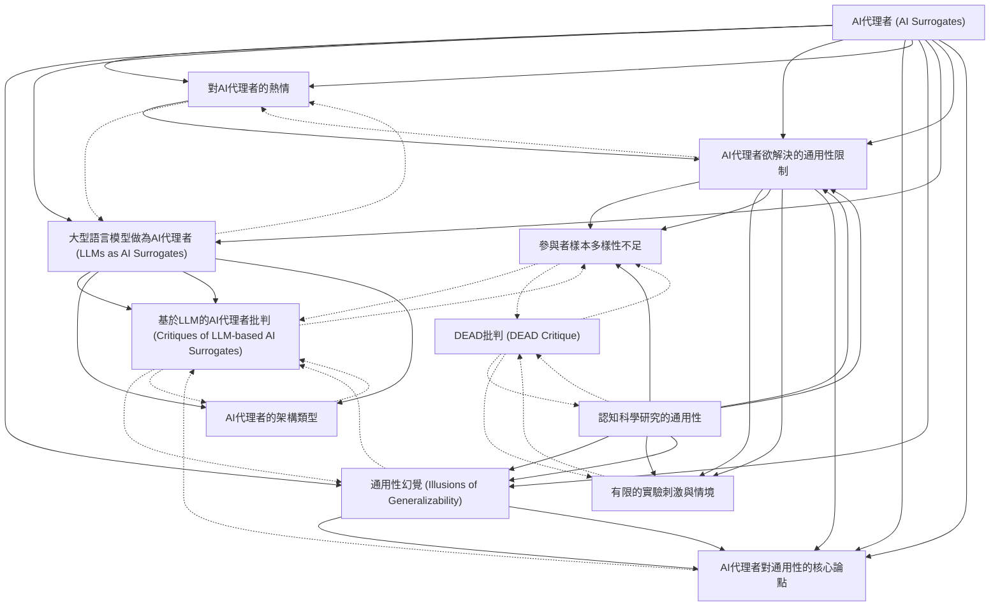

# Zettelkasten 卡片索引

**來源論文**: AI代理者能否取代人類做為認知科學研究對象
**作者**: 
**年份**: 2025
**生成日期**: 2025-10-29 14:15
**卡片總數**: 12

---

## 📚 卡片清單

### 1. [AI代理者 (AI Surrogates)](zettel_cards/Research-20251029-001.md)
- **ID**: `Research-20251029-001`
- **類型**: 
- **核心**: AI Surrogates: AI models designed to simulate human research participants for the purpose of generating new knowledge about human cognition and behavior.
- **標籤**: `AI代理者`, `認知科學`, `模擬`, `研究參與者`

### 2. [對AI代理者的熱情](zettel_cards/Research-20251029-002.md)
- **ID**: `Research-20251029-002`
- **類型**: 
- **核心**: Recent advances in artificial intelligence (AI) have generated enthusiasm for using AI simulations of human research participants to generate new knowledge about human cognition and behavior.
- **標籤**: `AI進展`, `認知科學研究`, `潛力`, `期望`

### 3. [認知科學研究的通用性](zettel_cards/Research-20251029-003.md)
- **ID**: `Research-20251029-003`
- **類型**: 
- **核心**: withincognitive science, generalizability concerns whether a scientific claim applies beyond the specific conditions of the study producing that claim, for example to different human populations or environmental contexts.
- **標籤**: `通用性`, `認知科學`, `研究效度`, `適用範圍`

### 4. [通用性幻覺 (Illusions of Generalizability)](zettel_cards/Research-20251029-004.md)
- **ID**: `Research-20251029-004`
- **類型**: 
- **核心**: AI Surrogates perpetuate illusions of generalizability, where we believe our findings are more generalizable than they actually are.
- **標籤**: `認知偏誤`, `研究局限`, `AI代理者影響`, `錯誤信念`

### 5. [大型語言模型做為AI代理者 (LLMs as AI Surrogates)](zettel_cards/Research-20251029-005.md)
- **ID**: `Research-20251029-005`
- **類型**: 
- **核心**: Currently, most AI Surrogates are based on LLMs, but they need not be; see Box 1 in the main text for an overview of how scientists are using AI Surrogates in research.
- **標籤**: `LLM`, `AI架構`, `認知模擬`, `技術基礎`

### 6. [基於LLM的AI代理者批判 (Critiques of LLM-based AI Surrogates)](zettel_cards/Research-20251029-006.md)
- **ID**: `Research-20251029-006`
- **類型**: 
- **核心**: LLMs over-represent majority viewpoints that dominate their training data and lack the variability of responses typically observed in human samples.
- **標籤**: `LLM限制`, `數據偏見`, `缺乏變異性`, `模擬局限`

### 7. [AI代理者欲解決的通用性限制](zettel_cards/Research-20251029-007.md)
- **ID**: `Research-20251029-007`
- **類型**: 
- **核心**: Advocates of AI Surrogates argue that this technology can address two major constraints on the generalizability of cognitive science research.
- **標籤**: `研究挑戰`, `AI解決方案`, `認知科學`, `通用性`

### 8. [參與者樣本多樣性不足](zettel_cards/Research-20251029-008.md)
- **ID**: `Research-20251029-008`
- **類型**: 
- **核心**: most participantsamples are insufficiently diverse for grounding claims about universalized cognitive processes.
- **標籤**: `樣本偏差`, `多樣性`, `研究局限`, `人類研究`

### 9. [有限的實驗刺激與情境](zettel_cards/Research-20251029-009.md)
- **ID**: `Research-20251029-009`
- **類型**: 
- **核心**: individual laboratory experiments probe an insufficient range of stimuli and contexts to defend broad claims about cognition and behavior.
- **標籤**: `實驗設計`, `情境限制`, `刺激範圍`, `研究局限`

### 10. [AI代理者對通用性的核心論點](zettel_cards/Research-20251029-010.md)
- **ID**: `Research-20251029-010`
- **類型**: 
- **核心**: AI Surrogates cannot improve the generalizability of cognitive science because this approach inherently excludes certain populations and research topics.
- **標籤**: `論文主旨`, `批判性分析`, `內在限制`, `排除性`

### 11. [AI代理者的架構類型](zettel_cards/Research-20251029-011.md)
- **ID**: `Research-20251029-011`
- **類型**: 
- **核心**: The first wave of AI Surrogate studies used off-the-shelf LLMs (primarily those in OpenAI’s GPT productline) and compared their outputs to those of human participants.
- **標籤**: `AI模型`, `提示工程`, `微調`, `增強模型`

### 12. [DEAD批判 (DEAD Critique)](zettel_cards/Research-20251029-012.md)
- **ID**: `Research-20251029-012`
- **類型**: 
- **核心**: Decontextualized, Engineered, Anonymized, Disembodied (DEAD): short-hand reminder and reflexive critique of the limiting features of many human subject experiments.
- **標籤**: `研究方法論`, `批判性理論`, `環境影響`, `實驗局限`

---

## 🗺️ 概念網絡圖

---

## 🏷️ 標籤索引

### AI代理者
- [[Research-20251029-001]] AI代理者 (AI Surrogates)

### 認知科學
- [[Research-20251029-001]] AI代理者 (AI Surrogates)
- [[Research-20251029-003]] 認知科學研究的通用性
- [[Research-20251029-007]] AI代理者欲解決的通用性限制

### 模擬
- [[Research-20251029-001]] AI代理者 (AI Surrogates)

### 研究參與者
- [[Research-20251029-001]] AI代理者 (AI Surrogates)

### AI進展
- [[Research-20251029-002]] 對AI代理者的熱情

### 認知科學研究
- [[Research-20251029-002]] 對AI代理者的熱情

### 潛力
- [[Research-20251029-002]] 對AI代理者的熱情

### 期望
- [[Research-20251029-002]] 對AI代理者的熱情

### 通用性
- [[Research-20251029-003]] 認知科學研究的通用性
- [[Research-20251029-007]] AI代理者欲解決的通用性限制

### 研究效度
- [[Research-20251029-003]] 認知科學研究的通用性

### 適用範圍
- [[Research-20251029-003]] 認知科學研究的通用性

### 認知偏誤
- [[Research-20251029-004]] 通用性幻覺 (Illusions of Generalizability)

### 研究局限
- [[Research-20251029-004]] 通用性幻覺 (Illusions of Generalizability)
- [[Research-20251029-008]] 參與者樣本多樣性不足
- [[Research-20251029-009]] 有限的實驗刺激與情境

### AI代理者影響
- [[Research-20251029-004]] 通用性幻覺 (Illusions of Generalizability)

### 錯誤信念
- [[Research-20251029-004]] 通用性幻覺 (Illusions of Generalizability)

### LLM
- [[Research-20251029-005]] 大型語言模型做為AI代理者 (LLMs as AI Surrogates)

### AI架構
- [[Research-20251029-005]] 大型語言模型做為AI代理者 (LLMs as AI Surrogates)

### 認知模擬
- [[Research-20251029-005]] 大型語言模型做為AI代理者 (LLMs as AI Surrogates)

### 技術基礎
- [[Research-20251029-005]] 大型語言模型做為AI代理者 (LLMs as AI Surrogates)

### LLM限制
- [[Research-20251029-006]] 基於LLM的AI代理者批判 (Critiques of LLM-based AI Surrogates)

### 數據偏見
- [[Research-20251029-006]] 基於LLM的AI代理者批判 (Critiques of LLM-based AI Surrogates)

### 缺乏變異性
- [[Research-20251029-006]] 基於LLM的AI代理者批判 (Critiques of LLM-based AI Surrogates)

### 模擬局限
- [[Research-20251029-006]] 基於LLM的AI代理者批判 (Critiques of LLM-based AI Surrogates)

### 研究挑戰
- [[Research-20251029-007]] AI代理者欲解決的通用性限制

### AI解決方案
- [[Research-20251029-007]] AI代理者欲解決的通用性限制

### 樣本偏差
- [[Research-20251029-008]] 參與者樣本多樣性不足

### 多樣性
- [[Research-20251029-008]] 參與者樣本多樣性不足

### 人類研究
- [[Research-20251029-008]] 參與者樣本多樣性不足

### 實驗設計
- [[Research-20251029-009]] 有限的實驗刺激與情境

### 情境限制
- [[Research-20251029-009]] 有限的實驗刺激與情境

### 刺激範圍
- [[Research-20251029-009]] 有限的實驗刺激與情境

### 論文主旨
- [[Research-20251029-010]] AI代理者對通用性的核心論點

### 批判性分析
- [[Research-20251029-010]] AI代理者對通用性的核心論點

### 內在限制
- [[Research-20251029-010]] AI代理者對通用性的核心論點

### 排除性
- [[Research-20251029-010]] AI代理者對通用性的核心論點

### AI模型
- [[Research-20251029-011]] AI代理者的架構類型

### 提示工程
- [[Research-20251029-011]] AI代理者的架構類型

### 微調
- [[Research-20251029-011]] AI代理者的架構類型

### 增強模型
- [[Research-20251029-011]] AI代理者的架構類型

### 研究方法論
- [[Research-20251029-012]] DEAD批判 (DEAD Critique)

### 批判性理論
- [[Research-20251029-012]] DEAD批判 (DEAD Critique)

### 環境影響
- [[Research-20251029-012]] DEAD批判 (DEAD Critique)

### 實驗局限
- [[Research-20251029-012]] DEAD批判 (DEAD Critique)

---

## 📖 閱讀建議順序

1. [[Research-20251029-002]] 對AI代理者的熱情

2. [[Research-20251029-006]] 基於LLM的AI代理者批判 (Critiques of LLM-based AI Surrogates)

3. [[Research-20251029-008]] 參與者樣本多樣性不足

4. [[Research-20251029-009]] 有限的實驗刺激與情境

5. [[Research-20251029-010]] AI代理者對通用性的核心論點

6. [[Research-20251029-011]] AI代理者的架構類型

7. [[Research-20251029-012]] DEAD批判 (DEAD Critique)

8. [[Research-20251029-004]] 通用性幻覺 (Illusions of Generalizability)

9. [[Research-20251029-003]] 認知科學研究的通用性

10. [[Research-20251029-005]] 大型語言模型做為AI代理者 (LLMs as AI Surrogates)

11. [[Research-20251029-007]] AI代理者欲解決的通用性限制

12. [[Research-20251029-001]] AI代理者 (AI Surrogates)

---

*本索引由 Knowledge Production System 自動生成*