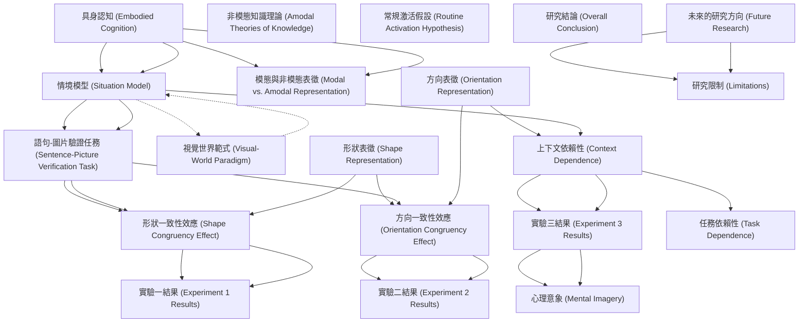

# Zettelkasten 卡片索引

**來源論文**: Rommers-2013_Mental_Simulation
**作者**: 
**年份**: 2025
**生成日期**: 2025-10-29 16:45
**卡片總數**: 20

---

## 📚 卡片清單

### 1. [具身認知 (Embodied Cognition)](zettel_cards/CogSci-20251029-001.md)
- **ID**: `CogSci-20251029-001`
- **類型**: 
- **核心**: "high-level cognitive processes such as language, memory, and thought involve reenactment or simulation of perception and action states."
- **標籤**: `Embodied Cognition`, `Language Processing`, `Simulation`

### 2. [情境模型 (Situation Model)](zettel_cards/CogSci-20251029-002.md)
- **ID**: `CogSci-20251029-002`
- **類型**: 
- **核心**: "visual representations form a necessary part of the situation model assembled during comprehension."
- **標籤**: `Situation Model`, `Language Comprehension`, `Visual Representation`

### 3. [模態與非模態表徵 (Modal vs. Amodal Representation)](zettel_cards/CogSci-20251029-003.md)
- **ID**: `CogSci-20251029-003`
- **類型**: 
- **核心**: "theories of embodied cognition assume that “a simulator produces simulations that are always partial and sketchy, never complete” (Barsalou, 1999, p. 586)."
- **標籤**: `Modal Representation`, `Amodal Representation`, `Embodied Cognition`

### 4. [非模態知識理論 (Amodal Theories of Knowledge)](zettel_cards/CogSci-20251029-004.md)
- **ID**: `CogSci-20251029-004`
- **類型**: 
- **核心**: "amodal theories of knowledge (e.g., Kintsch, 2008), in which the format of high-level cognitive processes is dissociated from perceptual processes."
- **標籤**: `Amodal`, `Knowledge Representation`, `Kintsch`

### 5. [語句-圖片驗證任務 (Sentence-Picture Verification Task)](zettel_cards/CogSci-20251029-005.md)
- **ID**: `CogSci-20251029-005`
- **類型**: 
- **核心**: "Participants more quickly decided that a subsequently viewed object (e.g., an eagle) had been mentioned in the sentence when its shape corresponded to that implied in the sentence than when these shapes mismatched."
- **標籤**: `Sentence-Picture Verification`, `Experimental Design`, `Language Processing`

### 6. [視覺世界範式 (Visual-World Paradigm)](zettel_cards/CogSci-20251029-006.md)
- **ID**: `CogSci-20251029-006`
- **類型**: 
- **核心**: "participants listen to spoken sentences while viewing arrays of objects."
- **標籤**: `Visual-World Paradigm`, `Eye-Tracking`, `Language Processing`

### 7. [形狀表徵 (Shape Representation)](zettel_cards/CogSci-20251029-007.md)
- **ID**: `CogSci-20251029-007`
- **類型**: 
- **核心**: "Whenever one processes a word that refers to an object (e.g., tomato), one activates a visual representation that specifies its shape (e.g., round)"
- **標籤**: `Shape`, `Visual Representation`, `Language Processing`

### 8. [方向表徵 (Orientation Representation)](zettel_cards/CogSci-20251029-008.md)
- **ID**: `CogSci-20251029-008`
- **類型**: 
- **核心**: "participants were faster to indicate that an object (e.g., a vertically oriented nail) had been mentioned in a preceding sentence when its orientation matched that implied in the sentence"
- **標籤**: `Orientation`, `Visual Representation`, `Language Processing`

### 9. [形狀一致性效應 (Shape Congruency Effect)](zettel_cards/CogSci-20251029-009.md)
- **ID**: `CogSci-20251029-009`
- **類型**: 
- **核心**: "Participants more quickly decided that a subsequently viewed object (e.g., an eagle) had been mentioned in the sentence when its shape corresponded to that implied in the sentence than when these shapes mismatched."
- **標籤**: `Shape Congruency`, `Sentence-Picture Verification`, `Visual Representation`

### 10. [方向一致性效應 (Orientation Congruency Effect)](zettel_cards/CogSci-20251029-010.md)
- **ID**: `CogSci-20251029-010`
- **類型**: 
- **核心**: "participants were faster to indicate that an object (e.g., a vertically oriented nail) had been mentioned in a preceding sentence when its orientation matched that implied in the sentence (e.g., “The carpenter hammered the nail into the floor”) than when these orientations mismatched"
- **標籤**: `Orientation Congruency`, `Sentence-Picture Verification`, `Visual Representation`

### 11. [上下文依賴性 (Context Dependence)](zettel_cards/CogSci-20251029-011.md)
- **ID**: `CogSci-20251029-011`
- **類型**: 
- **核心**: "the activation of perceptual representations in linguistic or conceptual tasks may depend on context"
- **標籤**: `Context`, `Language Processing`, `Perceptual Representations`

### 12. [實驗一結果 (Experiment 1 Results)](zettel_cards/CogSci-20251029-012.md)
- **ID**: `CogSci-20251029-012`
- **類型**: 
- **核心**: "Orientation information did not reliably influence performance in any of the experiments. Shape representations influenced performance most strongly when participants were asked to compare a sentence with a picture"
- **標籤**: `Experiment 1`, `Shape`, `Orientation`, `Sentence-Picture Verification`

### 13. [實驗二結果 (Experiment 2 Results)](zettel_cards/CogSci-20251029-013.md)
- **ID**: `CogSci-20251029-013`
- **類型**: 
- **核心**: "Orientation information did not reliably influence performance in any of the experiments."
- **標籤**: `Experiment 2`, `Shape`, `Orientation`, `Sentence Verification`

### 14. [實驗三結果 (Experiment 3 Results)](zettel_cards/CogSci-20251029-014.md)
- **ID**: `CogSci-20251029-014`
- **類型**: 
- **核心**: "Shape representations influenced performance most strongly when participants were explicitly asked to use mental imagery while reading the sentences."
- **標籤**: `Experiment 3`, `Shape`, `Mental Imagery`, `Language Processing`

### 15. [心理意象 (Mental Imagery)](zettel_cards/CogSci-20251029-015.md)
- **ID**: `CogSci-20251029-015`
- **類型**: 
- **核心**: "Shape representations influenced performance most strongly when participants were explicitly asked to use mental imagery while reading the sentences."
- **標籤**: `Mental Imagery`, `Cognition`, `Simulation`

### 16. [任務依賴性 (Task Dependence)](zettel_cards/CogSci-20251029-016.md)
- **ID**: `CogSci-20251029-016`
- **類型**: 
- **核心**: "They could be activated as a necessary part of the comprehension process, or they could be less crucial and influence performance in a task-dependent manner."
- **標籤**: `Task Dependence`, `Language Processing`, `Visual Representation`

### 17. [常規激活假設 (Routine Activation Hypothesis)](zettel_cards/CogSci-20251029-017.md)
- **ID**: `CogSci-20251029-017`
- **類型**: 
- **核心**: "visual representations may routinely be activated during language processing"
- **標籤**: `Routine Activation`, `Visual Representation`, `Language Processing`

### 18. [研究結論 (Overall Conclusion)](zettel_cards/CogSci-20251029-018.md)
- **ID**: `CogSci-20251029-018`
- **類型**: 
- **核心**: "Thus, in contrast to previous claims, implied visual information often does not contribute substantially to the comprehension process during normal reading."
- **標籤**: `Conclusion`, `Visual Information`, `Language Comprehension`

### 19. [未來的研究方向 (Future Research)](zettel_cards/CogSci-20251029-019.md)
- **ID**: `CogSci-20251029-019`
- **類型**: 
- **核心**: "To answer this question, the conditions under which such representations become activated must be determined."
- **標籤**: `Future Research`, `Visual Representation`, `Language Processing`

### 20. [研究限制 (Limitations)](zettel_cards/CogSci-20251029-020.md)
- **ID**: `CogSci-20251029-020`
- **類型**: 
- **核心**: [這篇論文中沒有明確指出研究限制，但我們可以推測]
- **標籤**: `Limitations`, `Research Design`, `Generalizability`

---

## 🗺️ 概念網絡圖

---

## 🏷️ 標籤索引

### Embodied Cognition
- [[CogSci-20251029-001]] 具身認知 (Embodied Cognition)
- [[CogSci-20251029-003]] 模態與非模態表徵 (Modal vs. Amodal Representation)

### Language Processing
- [[CogSci-20251029-001]] 具身認知 (Embodied Cognition)
- [[CogSci-20251029-005]] 語句-圖片驗證任務 (Sentence-Picture Verification Task)
- [[CogSci-20251029-006]] 視覺世界範式 (Visual-World Paradigm)
- [[CogSci-20251029-007]] 形狀表徵 (Shape Representation)
- [[CogSci-20251029-008]] 方向表徵 (Orientation Representation)
- [[CogSci-20251029-011]] 上下文依賴性 (Context Dependence)
- [[CogSci-20251029-014]] 實驗三結果 (Experiment 3 Results)
- [[CogSci-20251029-016]] 任務依賴性 (Task Dependence)
- [[CogSci-20251029-017]] 常規激活假設 (Routine Activation Hypothesis)
- [[CogSci-20251029-019]] 未來的研究方向 (Future Research)

### Simulation
- [[CogSci-20251029-001]] 具身認知 (Embodied Cognition)
- [[CogSci-20251029-015]] 心理意象 (Mental Imagery)

### Situation Model
- [[CogSci-20251029-002]] 情境模型 (Situation Model)

### Language Comprehension
- [[CogSci-20251029-002]] 情境模型 (Situation Model)
- [[CogSci-20251029-018]] 研究結論 (Overall Conclusion)

### Visual Representation
- [[CogSci-20251029-002]] 情境模型 (Situation Model)
- [[CogSci-20251029-007]] 形狀表徵 (Shape Representation)
- [[CogSci-20251029-008]] 方向表徵 (Orientation Representation)
- [[CogSci-20251029-009]] 形狀一致性效應 (Shape Congruency Effect)
- [[CogSci-20251029-010]] 方向一致性效應 (Orientation Congruency Effect)
- [[CogSci-20251029-016]] 任務依賴性 (Task Dependence)
- [[CogSci-20251029-017]] 常規激活假設 (Routine Activation Hypothesis)
- [[CogSci-20251029-019]] 未來的研究方向 (Future Research)

### Modal Representation
- [[CogSci-20251029-003]] 模態與非模態表徵 (Modal vs. Amodal Representation)

### Amodal Representation
- [[CogSci-20251029-003]] 模態與非模態表徵 (Modal vs. Amodal Representation)

### Amodal
- [[CogSci-20251029-004]] 非模態知識理論 (Amodal Theories of Knowledge)

### Knowledge Representation
- [[CogSci-20251029-004]] 非模態知識理論 (Amodal Theories of Knowledge)

### Kintsch
- [[CogSci-20251029-004]] 非模態知識理論 (Amodal Theories of Knowledge)

### Sentence-Picture Verification
- [[CogSci-20251029-005]] 語句-圖片驗證任務 (Sentence-Picture Verification Task)
- [[CogSci-20251029-009]] 形狀一致性效應 (Shape Congruency Effect)
- [[CogSci-20251029-010]] 方向一致性效應 (Orientation Congruency Effect)
- [[CogSci-20251029-012]] 實驗一結果 (Experiment 1 Results)

### Experimental Design
- [[CogSci-20251029-005]] 語句-圖片驗證任務 (Sentence-Picture Verification Task)

### Visual-World Paradigm
- [[CogSci-20251029-006]] 視覺世界範式 (Visual-World Paradigm)

### Eye-Tracking
- [[CogSci-20251029-006]] 視覺世界範式 (Visual-World Paradigm)

### Shape
- [[CogSci-20251029-007]] 形狀表徵 (Shape Representation)
- [[CogSci-20251029-012]] 實驗一結果 (Experiment 1 Results)
- [[CogSci-20251029-013]] 實驗二結果 (Experiment 2 Results)
- [[CogSci-20251029-014]] 實驗三結果 (Experiment 3 Results)

### Orientation
- [[CogSci-20251029-008]] 方向表徵 (Orientation Representation)
- [[CogSci-20251029-012]] 實驗一結果 (Experiment 1 Results)
- [[CogSci-20251029-013]] 實驗二結果 (Experiment 2 Results)

### Shape Congruency
- [[CogSci-20251029-009]] 形狀一致性效應 (Shape Congruency Effect)

### Orientation Congruency
- [[CogSci-20251029-010]] 方向一致性效應 (Orientation Congruency Effect)

### Context
- [[CogSci-20251029-011]] 上下文依賴性 (Context Dependence)

### Perceptual Representations
- [[CogSci-20251029-011]] 上下文依賴性 (Context Dependence)

### Experiment 1
- [[CogSci-20251029-012]] 實驗一結果 (Experiment 1 Results)

### Experiment 2
- [[CogSci-20251029-013]] 實驗二結果 (Experiment 2 Results)

### Sentence Verification
- [[CogSci-20251029-013]] 實驗二結果 (Experiment 2 Results)

### Experiment 3
- [[CogSci-20251029-014]] 實驗三結果 (Experiment 3 Results)

### Mental Imagery
- [[CogSci-20251029-014]] 實驗三結果 (Experiment 3 Results)
- [[CogSci-20251029-015]] 心理意象 (Mental Imagery)

### Cognition
- [[CogSci-20251029-015]] 心理意象 (Mental Imagery)

### Task Dependence
- [[CogSci-20251029-016]] 任務依賴性 (Task Dependence)

### Routine Activation
- [[CogSci-20251029-017]] 常規激活假設 (Routine Activation Hypothesis)

### Conclusion
- [[CogSci-20251029-018]] 研究結論 (Overall Conclusion)

### Visual Information
- [[CogSci-20251029-018]] 研究結論 (Overall Conclusion)

### Future Research
- [[CogSci-20251029-019]] 未來的研究方向 (Future Research)

### Limitations
- [[CogSci-20251029-020]] 研究限制 (Limitations)

### Research Design
- [[CogSci-20251029-020]] 研究限制 (Limitations)

### Generalizability
- [[CogSci-20251029-020]] 研究限制 (Limitations)

---

## 📖 閱讀建議順序

1. [[CogSci-20251029-003]] 模態與非模態表徵 (Modal vs. Amodal Representation)

2. [[CogSci-20251029-004]] 非模態知識理論 (Amodal Theories of Knowledge)

3. [[CogSci-20251029-006]] 視覺世界範式 (Visual-World Paradigm)

4. [[CogSci-20251029-012]] 實驗一結果 (Experiment 1 Results)

5. [[CogSci-20251029-013]] 實驗二結果 (Experiment 2 Results)

6. [[CogSci-20251029-015]] 心理意象 (Mental Imagery)

7. [[CogSci-20251029-016]] 任務依賴性 (Task Dependence)

8. [[CogSci-20251029-017]] 常規激活假設 (Routine Activation Hypothesis)

9. [[CogSci-20251029-018]] 研究結論 (Overall Conclusion)

10. [[CogSci-20251029-020]] 研究限制 (Limitations)

11. [[CogSci-20251029-007]] 形狀表徵 (Shape Representation)

12. [[CogSci-20251029-008]] 方向表徵 (Orientation Representation)

13. [[CogSci-20251029-009]] 形狀一致性效應 (Shape Congruency Effect)

14. [[CogSci-20251029-010]] 方向一致性效應 (Orientation Congruency Effect)

15. [[CogSci-20251029-014]] 實驗三結果 (Experiment 3 Results)

16. [[CogSci-20251029-019]] 未來的研究方向 (Future Research)

17. [[CogSci-20251029-001]] 具身認知 (Embodied Cognition)

18. [[CogSci-20251029-002]] 情境模型 (Situation Model)

19. [[CogSci-20251029-005]] 語句-圖片驗證任務 (Sentence-Picture Verification Task)

20. [[CogSci-20251029-011]] 上下文依賴性 (Context Dependence)

---

*本索引由 Knowledge Production System 自動生成*