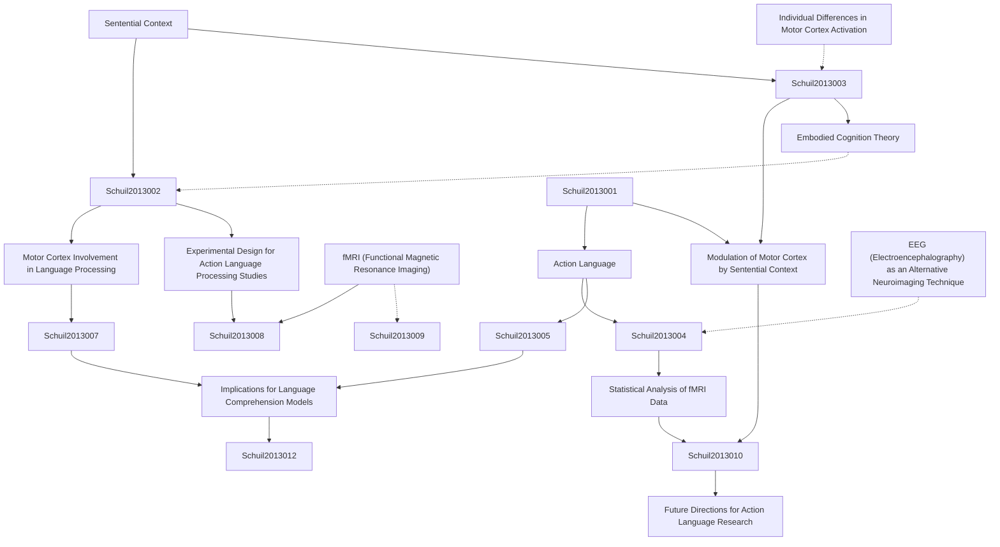

# Zettelkasten 卡片索引

---

## 📚 卡片清單

### 1. [Sentential Context](zettel_cards/Schuil-2013-001.md)
- **ID**: `Schuil-2013-001`
- **類型**: 
- **核心**: The influence of preceding and surrounding words on the interpretation of a target word or phrase.
- **標籤**: `語言理解`, `情境效應`, `句子處理`

### 2. [Action Language](zettel_cards/Schuil-2013-002.md)
- **ID**: `Schuil-2013-002`
- **類型**: 
- **核心**: Language that describes actions, movements, or physical activities.
- **標籤**: `動作語義`, `具身認知`, `語言學`

### 3. [Motor Cortex Involvement in Language Processing](zettel_cards/Schuil-2013-003.md)
- **ID**: `Schuil-2013-003`
- **類型**: 
- **核心**: The hypothesis that understanding action-related language recruits the motor cortex, suggesting a link between language and action.
- **標籤**: `運動皮層`, `語言處理`, `具身認知`

### 4. [fMRI (Functional Magnetic Resonance Imaging)](zettel_cards/Schuil-2013-004.md)
- **ID**: `Schuil-2013-004`
- **類型**: 
- **核心**: A neuroimaging technique that measures brain activity by detecting changes associated with blood flow.
- **標籤**: `神經影像學`, `大腦活動`, `研究方法`

### 5. [Modulation of Motor Cortex by Sentential Context](zettel_cards/Schuil-2013-005.md)
- **ID**: `Schuil-2013-005`
- **類型**: 
- **核心**: Sentential context influences the degree to which the motor cortex is activated during action language processing.
- **標籤**: `情境調節`, `運動皮層`, `動作語言`

### 6. [Experimental Design for Action Language Processing Studies](zettel_cards/Schuil-2013-006.md)
- **ID**: `Schuil-2013-006`
- **類型**: 
- **核心**: Utilizing sentences that describe actions with varying degrees of contextual support to examine motor cortex activation.
- **標籤**: `實驗設計`, `動作語言`, `運動皮層`

### 7. [Embodied Cognition Theory](zettel_cards/Schuil-2013-007.md)
- **ID**: `Schuil-2013-007`
- **類型**: 
- **核心**: The theory that cognition is grounded in bodily experience and sensory-motor processes.
- **標籤**: `具身認知`, `認知科學`, `心理學`

### 8. [Statistical Analysis of fMRI Data](zettel_cards/Schuil-2013-008.md)
- **ID**: `Schuil-2013-008`
- **類型**: 
- **核心**: Employing statistical methods to analyze fMRI data and identify brain regions showing significant activation.
- **標籤**: `統計分析`, `fMRI數據`, `神經科學`

### 9. [EEG (Electroencephalography) as an Alternative Neuroimaging Technique](zettel_cards/Schuil-2013-009.md)
- **ID**: `Schuil-2013-009`
- **類型**: 
- **核心**: A neuroimaging technique that measures brain activity using electrodes placed on the scalp.
- **標籤**: `腦電圖`, `神經影像學`, `研究方法`

### 10. [Implications for Language Comprehension Models](zettel_cards/Schuil-2013-010.md)
- **ID**: `Schuil-2013-010`
- **類型**: 
- **核心**: The findings suggest that language comprehension models should incorporate the influence of context and embodied representations.
- **標籤**: `語言理解模型`, `情境`, `具身表徵`

### 11. [Individual Differences in Motor Cortex Activation](zettel_cards/Schuil-2013-011.md)
- **ID**: `Schuil-2013-011`
- **類型**: 
- **核心**: Do individual differences in motor experience or physical activity correlate with differences in motor cortex activation during language processing?
- **標籤**: `個體差異`, `運動經驗`, `運動皮層`

### 12. [Future Directions for Action Language Research](zettel_cards/Schuil-2013-012.md)
- **ID**: `Schuil-2013-012`
- **類型**: 
- **核心**: Investigating the neural mechanisms underlying the modulation of motor cortex activity by sentential context during action language processing.
- **標籤**: `動作語言`, `研究方向`, `神經機制`

---

## 🗺️ 概念網絡圖

---

## 🏷️ 標籤索引

### 語言理解
- [[Schuil-2013-001]] Sentential Context

### 情境效應
- [[Schuil-2013-001]] Sentential Context

### 句子處理
- [[Schuil-2013-001]] Sentential Context

### 動作語義
- [[Schuil-2013-002]] Action Language

### 具身認知
- [[Schuil-2013-002]] Action Language
- [[Schuil-2013-003]] Motor Cortex Involvement in Language Processing
- [[Schuil-2013-007]] Embodied Cognition Theory

### 語言學
- [[Schuil-2013-002]] Action Language

### 運動皮層
- [[Schuil-2013-003]] Motor Cortex Involvement in Language Processing
- [[Schuil-2013-005]] Modulation of Motor Cortex by Sentential Context
- [[Schuil-2013-006]] Experimental Design for Action Language Processing Studies
- [[Schuil-2013-011]] Individual Differences in Motor Cortex Activation

### 語言處理
- [[Schuil-2013-003]] Motor Cortex Involvement in Language Processing

### 神經影像學
- [[Schuil-2013-004]] fMRI (Functional Magnetic Resonance Imaging)
- [[Schuil-2013-009]] EEG (Electroencephalography) as an Alternative Neuroimaging Technique

### 大腦活動
- [[Schuil-2013-004]] fMRI (Functional Magnetic Resonance Imaging)

### 研究方法
- [[Schuil-2013-004]] fMRI (Functional Magnetic Resonance Imaging)
- [[Schuil-2013-009]] EEG (Electroencephalography) as an Alternative Neuroimaging Technique

### 情境調節
- [[Schuil-2013-005]] Modulation of Motor Cortex by Sentential Context

### 動作語言
- [[Schuil-2013-005]] Modulation of Motor Cortex by Sentential Context
- [[Schuil-2013-006]] Experimental Design for Action Language Processing Studies
- [[Schuil-2013-012]] Future Directions for Action Language Research

### 實驗設計
- [[Schuil-2013-006]] Experimental Design for Action Language Processing Studies

### 認知科學
- [[Schuil-2013-007]] Embodied Cognition Theory

### 心理學
- [[Schuil-2013-007]] Embodied Cognition Theory

### 統計分析
- [[Schuil-2013-008]] Statistical Analysis of fMRI Data

### fMRI數據
- [[Schuil-2013-008]] Statistical Analysis of fMRI Data

### 神經科學
- [[Schuil-2013-008]] Statistical Analysis of fMRI Data

### 腦電圖
- [[Schuil-2013-009]] EEG (Electroencephalography) as an Alternative Neuroimaging Technique

### 語言理解模型
- [[Schuil-2013-010]] Implications for Language Comprehension Models

### 情境
- [[Schuil-2013-010]] Implications for Language Comprehension Models

### 具身表徵
- [[Schuil-2013-010]] Implications for Language Comprehension Models

### 個體差異
- [[Schuil-2013-011]] Individual Differences in Motor Cortex Activation

### 運動經驗
- [[Schuil-2013-011]] Individual Differences in Motor Cortex Activation

### 研究方向
- [[Schuil-2013-012]] Future Directions for Action Language Research

### 神經機制
- [[Schuil-2013-012]] Future Directions for Action Language Research

---

## 📖 閱讀建議順序

1. [[Schuil-2013-001]] Sentential Context

2. [[Schuil-2013-002]] Action Language

3. [[Schuil-2013-003]] Motor Cortex Involvement in Language Processing

4. [[Schuil-2013-004]] fMRI (Functional Magnetic Resonance Imaging)

5. [[Schuil-2013-005]] Modulation of Motor Cortex by Sentential Context

6. [[Schuil-2013-006]] Experimental Design for Action Language Processing Studies

7. [[Schuil-2013-007]] Embodied Cognition Theory

8. [[Schuil-2013-008]] Statistical Analysis of fMRI Data

9. [[Schuil-2013-009]] EEG (Electroencephalography) as an Alternative Neuroimaging Technique

10. [[Schuil-2013-010]] Implications for Language Comprehension Models

11. [[Schuil-2013-011]] Individual Differences in Motor Cortex Activation

12. [[Schuil-2013-012]] Future Directions for Action Language Research

---

*本索引由 Knowledge Production System 自動生成*