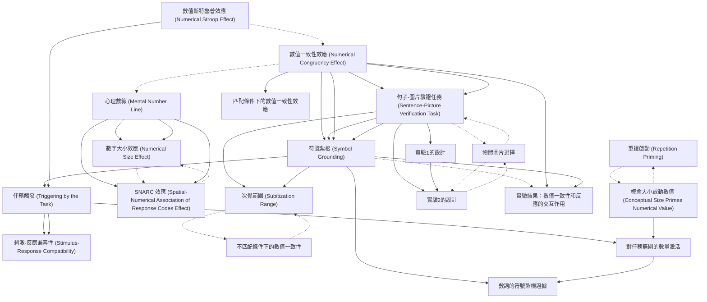

# Zettelkasten 卡片索引

**來源論文**: Setic-2017_Mental_Simulation
**作者**: 
**年份**: 2025
**生成日期**: 2025-10-29 16:46
**卡片總數**: 20

---

## 📚 卡片清單

### 1. [數值一致性效應 (Numerical Congruency Effect)](zettel_cards/CogSci-20251029-001.md)
- **ID**: `CogSci-20251029-001`
- **類型**: 
- **核心**: "In two experiments, we showed that irrelevant numerical information influenced the speed of sentence-picture verification."
- **標籤**: `數值認知`, `一致性效應`, `注意力`, `句子理解`

### 2. [句子-圖片驗證任務 (Sentence-Picture Verification Task)](zettel_cards/CogSci-20251029-002.md)
- **ID**: `CogSci-20251029-002`
- **類型**: 
- **核心**: "Participants were asked to verify whether the concept mentioned in a sentence matched the object presented in a subsequent picture."
- **標籤**: `實驗設計`, `認知心理學`, `句子理解`, `圖片處理`

### 3. [符號紮根 (Symbol Grounding)](zettel_cards/CogSci-20251029-003.md)
- **ID**: `CogSci-20251029-003`
- **類型**: 
- **核心**: "The results are interpreted as evidence for the symbol grounding of number words in perceptual representation of small quantities, that is, quantities falling into the subitization range."
- **標籤**: `數值認知`, `具身認知`, `知覺表徵`, `心理表徵`

### 4. [次覺範圍 (Subitization Range)](zettel_cards/CogSci-20251029-004.md)
- **ID**: `CogSci-20251029-004`
- **類型**: 
- **核心**: "...quantities falling into the subitization range."
- **標籤**: `數值認知`, `小數量`, `知覺能力`, `注意力`

### 5. [心理數線 (Mental Number Line)](zettel_cards/CogSci-20251029-005.md)
- **ID**: `CogSci-20251029-005`
- **類型**: 
- **核心**: "One of the dominant theoretical frameworks in numerical cognition proposes that numerals and number words acquire their meaning by being mapped onto a nonsymbolic analog representation known as a mental “number line”"
- **標籤**: `數值認知`, `空間表徵`, `心理表徵`, `大小效應`

### 6. [數字大小效應 (Numerical Size Effect)](zettel_cards/CogSci-20251029-006.md)
- **ID**: `CogSci-20251029-006`
- **類型**: 
- **核心**: "Behavioral findings such as numerical size and distance effects (Moyer & Landauer, 1967; 1973)..."
- **標籤**: `數值認知`, `反應時間`, `比較任務`, `心理物理學`

### 7. [SNARC 效應 (Spatial-Numerical Association of Response Codes Effect)](zettel_cards/CogSci-20251029-007.md)
- **ID**: `CogSci-20251029-007`
- **類型**: 
- **核心**: "...the spatial-numerical association of response codes (SNARC) effect (Dehaene, Bossini, & Giraux, 1993)..."
- **標籤**: `數值認知`, `空間認知`, `反應偏好`, `左右`

### 8. [重複啟動 (Repetition Priming)](zettel_cards/CogSci-20251029-008.md)
- **ID**: `CogSci-20251029-008`
- **類型**: 
- **核心**: "Koechlin, Naccache, Block, and Dehaene (1999) examined repetition priming across different number notations."
- **標籤**: `數值認知`, `啟動效應`, `表徵形式`, `心理實驗`

### 9. [數值斯特魯普效應 (Numerical Stroop Effect)](zettel_cards/CogSci-20251029-009.md)
- **ID**: `CogSci-20251029-009`
- **類型**: 
- **核心**: "Another line of research on numerical Stroop and size congruency effects has also been taken as an evidence for the automatic activation of number meaning."
- **標籤**: `數值認知`, `衝突控制`, `自動化加工`, `注意力`

### 10. [任務觸發 (Triggering by the Task)](zettel_cards/CogSci-20251029-010.md)
- **ID**: `CogSci-20251029-010`
- **類型**: 
- **核心**: "Ganor-Stern, Tzelgov, and Meiran (2013) argued that the activation of unintended processing on irrelevant dimensions is triggered or elicited by intended actions required by the experimental task."
- **標籤**: `注意力`, `任務設定`, `加工深度`, `實驗心理學`

### 11. [刺激-反應兼容性 (Stimulus-Response Compatibility)](zettel_cards/CogSci-20251029-011.md)
- **ID**: `CogSci-20251029-011`
- **類型**: 
- **核心**: "Santens and Verguts (2011) found evidence that the size congruity effect is a consequence of the alignment between stimulus dimensions (physical and numerical size) and response codes."
- **標籤**: `注意力`, `反應時間`, `實驗設計`, `認知控制`

### 12. [概念大小啟動數值 (Conceptual Size Primes Numerical Value)](zettel_cards/CogSci-20251029-012.md)
- **ID**: `CogSci-20251029-012`
- **類型**: 
- **核心**: "Recently, Gabay, Leibovich, Henik, and Gronau (2013) showed that conceptual size can prime numerical value in a task that does not require the activation of magnitude representation."
- **標籤**: `數值認知`, `啟動效應`, `概念表徵`, `加工過程`

### 13. [實驗1的設計](zettel_cards/CogSci-20251029-013.md)
- **ID**: `CogSci-20251029-013`
- **類型**: 
- **核心**: "In Experiment 1, participants read statements such as three dogs."
- **標籤**: `實驗設計`, `數值認知`, `句子理解`, `圖片驗證`

### 14. [實驗2的設計](zettel_cards/CogSci-20251029-014.md)
- **ID**: `CogSci-20251029-014`
- **類型**: 
- **核心**: "In Experiment 2, they read sentences such as three dogs were wandering in the street."
- **標籤**: `實驗設計`, `數值認知`, `句子理解`, `圖片驗證`

### 15. [物體圖片選擇](zettel_cards/CogSci-20251029-015.md)
- **ID**: `CogSci-20251029-015`
- **類型**: 
- **核心**: "Drawings of objects were taken from Rossion and Pourtois’ (2004) version of the Snodgrass and Vanderwart (1980) standardized database, with color and texture added to the objects."
- **標籤**: `實驗材料`, `圖片處理`, `認知心理學`, `標準化數據庫`

### 16. [實驗結果：數值一致性和反應的交互作用](zettel_cards/CogSci-20251029-016.md)
- **ID**: `CogSci-20251029-016`
- **類型**: 
- **核心**: "In both experiments, the verification speed revealed the interaction between response and numerical congruency."
- **標籤**: `實驗結果`, `數值認知`, `句子理解`, `交互作用`

### 17. [匹配條件下的數值一致性效應](zettel_cards/CogSci-20251029-017.md)
- **ID**: `CogSci-20251029-017`
- **類型**: 
- **核心**: "The verification times for concept-object match were faster when there was also numerical congruence (compared with incongruence) between the number word and quantity."
- **標籤**: `實驗結果`, `數值認知`, `句子理解`, `反應時間`

### 18. [不匹配條件下的數值一致性](zettel_cards/CogSci-20251029-018.md)
- **ID**: `CogSci-20251029-018`
- **類型**: 
- **核心**: "On the other hand, there was no difference between numerical congruence and incongruence when the concept and object mismatched."
- **標籤**: `實驗結果`, `數值認知`, `句子理解`, `反應時間`

### 19. [對任務無關的數量激活](zettel_cards/CogSci-20251029-019.md)
- **ID**: `CogSci-20251029-019`
- **類型**: 
- **核心**: "Following their steps, we asked whether numbers can prime numerosity under conditions that do not trigger the activation of the numerical dimension."
- **標籤**: `研究問題`, `數值認知`, `啟動效應`, `實驗設計`

### 20. [數詞的符號紮根證據](zettel_cards/CogSci-20251029-020.md)
- **ID**: `CogSci-20251029-020`
- **類型**: 
- **核心**: "The aim of the present work is to examine whether an interaction between numbers and their quantities exists in a task that does not require numerical processing at all..."
- **標籤**: `研究問題`, `數值認知`, `符號紮根`, `知覺表徵`

---

## 🗺️ 概念網絡圖

---

## 🏷️ 標籤索引

### 數值認知
- [[CogSci-20251029-001]] 數值一致性效應 (Numerical Congruency Effect)
- [[CogSci-20251029-003]] 符號紮根 (Symbol Grounding)
- [[CogSci-20251029-004]] 次覺範圍 (Subitization Range)
- [[CogSci-20251029-005]] 心理數線 (Mental Number Line)
- [[CogSci-20251029-006]] 數字大小效應 (Numerical Size Effect)
- [[CogSci-20251029-007]] SNARC 效應 (Spatial-Numerical Association of Response Codes Effect)
- [[CogSci-20251029-008]] 重複啟動 (Repetition Priming)
- [[CogSci-20251029-009]] 數值斯特魯普效應 (Numerical Stroop Effect)
- [[CogSci-20251029-012]] 概念大小啟動數值 (Conceptual Size Primes Numerical Value)
- [[CogSci-20251029-013]] 實驗1的設計
- [[CogSci-20251029-014]] 實驗2的設計
- [[CogSci-20251029-016]] 實驗結果：數值一致性和反應的交互作用
- [[CogSci-20251029-017]] 匹配條件下的數值一致性效應
- [[CogSci-20251029-018]] 不匹配條件下的數值一致性
- [[CogSci-20251029-019]] 對任務無關的數量激活
- [[CogSci-20251029-020]] 數詞的符號紮根證據

### 一致性效應
- [[CogSci-20251029-001]] 數值一致性效應 (Numerical Congruency Effect)

### 注意力
- [[CogSci-20251029-001]] 數值一致性效應 (Numerical Congruency Effect)
- [[CogSci-20251029-004]] 次覺範圍 (Subitization Range)
- [[CogSci-20251029-009]] 數值斯特魯普效應 (Numerical Stroop Effect)
- [[CogSci-20251029-010]] 任務觸發 (Triggering by the Task)
- [[CogSci-20251029-011]] 刺激-反應兼容性 (Stimulus-Response Compatibility)

### 句子理解
- [[CogSci-20251029-001]] 數值一致性效應 (Numerical Congruency Effect)
- [[CogSci-20251029-002]] 句子-圖片驗證任務 (Sentence-Picture Verification Task)
- [[CogSci-20251029-013]] 實驗1的設計
- [[CogSci-20251029-014]] 實驗2的設計
- [[CogSci-20251029-016]] 實驗結果：數值一致性和反應的交互作用
- [[CogSci-20251029-017]] 匹配條件下的數值一致性效應
- [[CogSci-20251029-018]] 不匹配條件下的數值一致性

### 實驗設計
- [[CogSci-20251029-002]] 句子-圖片驗證任務 (Sentence-Picture Verification Task)
- [[CogSci-20251029-011]] 刺激-反應兼容性 (Stimulus-Response Compatibility)
- [[CogSci-20251029-013]] 實驗1的設計
- [[CogSci-20251029-014]] 實驗2的設計
- [[CogSci-20251029-019]] 對任務無關的數量激活

### 認知心理學
- [[CogSci-20251029-002]] 句子-圖片驗證任務 (Sentence-Picture Verification Task)
- [[CogSci-20251029-015]] 物體圖片選擇

### 圖片處理
- [[CogSci-20251029-002]] 句子-圖片驗證任務 (Sentence-Picture Verification Task)
- [[CogSci-20251029-015]] 物體圖片選擇

### 具身認知
- [[CogSci-20251029-003]] 符號紮根 (Symbol Grounding)

### 知覺表徵
- [[CogSci-20251029-003]] 符號紮根 (Symbol Grounding)
- [[CogSci-20251029-020]] 數詞的符號紮根證據

### 心理表徵
- [[CogSci-20251029-003]] 符號紮根 (Symbol Grounding)
- [[CogSci-20251029-005]] 心理數線 (Mental Number Line)

### 小數量
- [[CogSci-20251029-004]] 次覺範圍 (Subitization Range)

### 知覺能力
- [[CogSci-20251029-004]] 次覺範圍 (Subitization Range)

### 空間表徵
- [[CogSci-20251029-005]] 心理數線 (Mental Number Line)

### 大小效應
- [[CogSci-20251029-005]] 心理數線 (Mental Number Line)

### 反應時間
- [[CogSci-20251029-006]] 數字大小效應 (Numerical Size Effect)
- [[CogSci-20251029-011]] 刺激-反應兼容性 (Stimulus-Response Compatibility)
- [[CogSci-20251029-017]] 匹配條件下的數值一致性效應
- [[CogSci-20251029-018]] 不匹配條件下的數值一致性

### 比較任務
- [[CogSci-20251029-006]] 數字大小效應 (Numerical Size Effect)

### 心理物理學
- [[CogSci-20251029-006]] 數字大小效應 (Numerical Size Effect)

### 空間認知
- [[CogSci-20251029-007]] SNARC 效應 (Spatial-Numerical Association of Response Codes Effect)

### 反應偏好
- [[CogSci-20251029-007]] SNARC 效應 (Spatial-Numerical Association of Response Codes Effect)

### 左右
- [[CogSci-20251029-007]] SNARC 效應 (Spatial-Numerical Association of Response Codes Effect)

### 啟動效應
- [[CogSci-20251029-008]] 重複啟動 (Repetition Priming)
- [[CogSci-20251029-012]] 概念大小啟動數值 (Conceptual Size Primes Numerical Value)
- [[CogSci-20251029-019]] 對任務無關的數量激活

### 表徵形式
- [[CogSci-20251029-008]] 重複啟動 (Repetition Priming)

### 心理實驗
- [[CogSci-20251029-008]] 重複啟動 (Repetition Priming)

### 衝突控制
- [[CogSci-20251029-009]] 數值斯特魯普效應 (Numerical Stroop Effect)

### 自動化加工
- [[CogSci-20251029-009]] 數值斯特魯普效應 (Numerical Stroop Effect)

### 任務設定
- [[CogSci-20251029-010]] 任務觸發 (Triggering by the Task)

### 加工深度
- [[CogSci-20251029-010]] 任務觸發 (Triggering by the Task)

### 實驗心理學
- [[CogSci-20251029-010]] 任務觸發 (Triggering by the Task)

### 認知控制
- [[CogSci-20251029-011]] 刺激-反應兼容性 (Stimulus-Response Compatibility)

### 概念表徵
- [[CogSci-20251029-012]] 概念大小啟動數值 (Conceptual Size Primes Numerical Value)

### 加工過程
- [[CogSci-20251029-012]] 概念大小啟動數值 (Conceptual Size Primes Numerical Value)

### 圖片驗證
- [[CogSci-20251029-013]] 實驗1的設計
- [[CogSci-20251029-014]] 實驗2的設計

### 實驗材料
- [[CogSci-20251029-015]] 物體圖片選擇

### 標準化數據庫
- [[CogSci-20251029-015]] 物體圖片選擇

### 實驗結果
- [[CogSci-20251029-016]] 實驗結果：數值一致性和反應的交互作用
- [[CogSci-20251029-017]] 匹配條件下的數值一致性效應
- [[CogSci-20251029-018]] 不匹配條件下的數值一致性

### 交互作用
- [[CogSci-20251029-016]] 實驗結果：數值一致性和反應的交互作用

### 研究問題
- [[CogSci-20251029-019]] 對任務無關的數量激活
- [[CogSci-20251029-020]] 數詞的符號紮根證據

### 符號紮根
- [[CogSci-20251029-020]] 數詞的符號紮根證據

---

## 📖 閱讀建議順序

1. [[CogSci-20251029-004]] 次覺範圍 (Subitization Range)

2. [[CogSci-20251029-006]] 數字大小效應 (Numerical Size Effect)

3. [[CogSci-20251029-007]] SNARC 效應 (Spatial-Numerical Association of Response Codes Effect)

4. [[CogSci-20251029-008]] 重複啟動 (Repetition Priming)

5. [[CogSci-20251029-011]] 刺激-反應兼容性 (Stimulus-Response Compatibility)

6. [[CogSci-20251029-014]] 實驗2的設計

7. [[CogSci-20251029-015]] 物體圖片選擇

8. [[CogSci-20251029-016]] 實驗結果：數值一致性和反應的交互作用

9. [[CogSci-20251029-017]] 匹配條件下的數值一致性效應

10. [[CogSci-20251029-018]] 不匹配條件下的數值一致性

11. [[CogSci-20251029-020]] 數詞的符號紮根證據

12. [[CogSci-20251029-009]] 數值斯特魯普效應 (Numerical Stroop Effect)

13. [[CogSci-20251029-012]] 概念大小啟動數值 (Conceptual Size Primes Numerical Value)

14. [[CogSci-20251029-013]] 實驗1的設計

15. [[CogSci-20251029-019]] 對任務無關的數量激活

16. [[CogSci-20251029-005]] 心理數線 (Mental Number Line)

17. [[CogSci-20251029-010]] 任務觸發 (Triggering by the Task)

18. [[CogSci-20251029-002]] 句子-圖片驗證任務 (Sentence-Picture Verification Task)

19. [[CogSci-20251029-003]] 符號紮根 (Symbol Grounding)

20. [[CogSci-20251029-001]] 數值一致性效應 (Numerical Congruency Effect)

---

*本索引由 Knowledge Production System 自動生成*