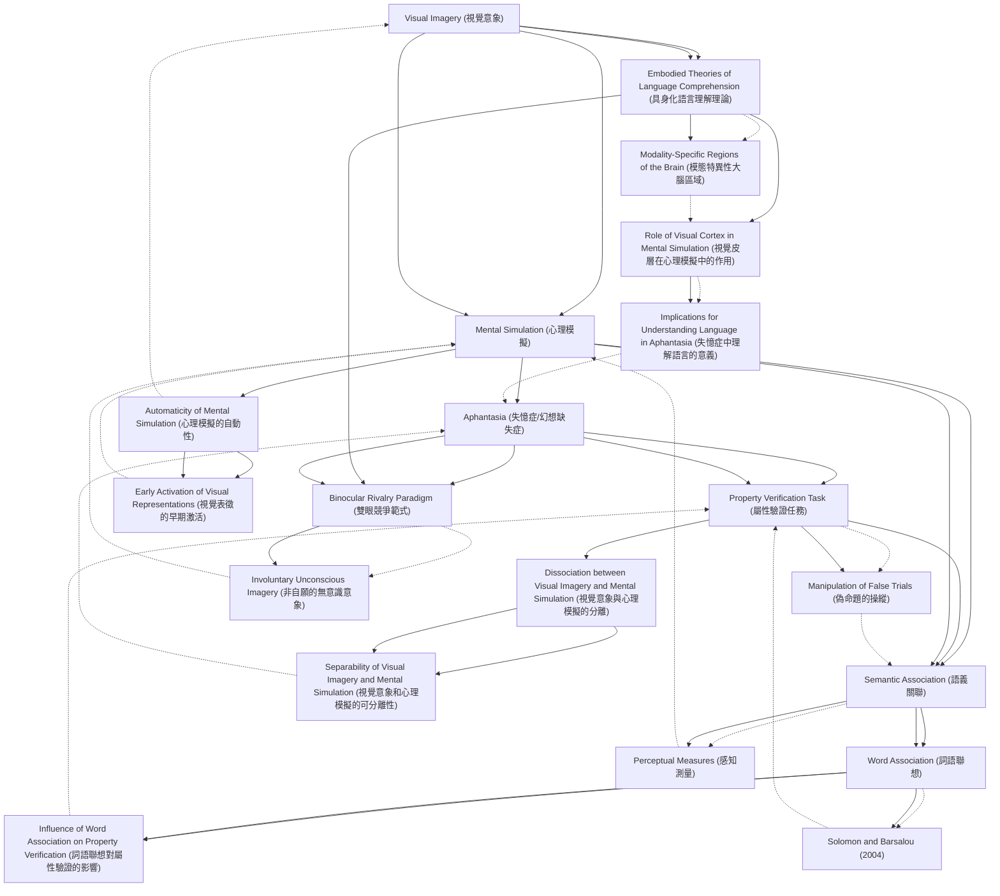

# Zettelkasten 卡片索引

**來源論文**: Speed-2025_Mental_Simulation
**作者**: 
**年份**: 2025
**生成日期**: 2025-10-29 16:47
**卡片總數**: 20

---

## 📚 卡片清單

### 1. [Visual Imagery (視覺意象)](zettel_cards/CogSci-20251029-001.md)
- **ID**: `CogSci-20251029-001`
- **類型**: 
- **核心**: "Humans can voluntarily and purposefully create internal visual images in their mind, known as visual imagery."
- **標籤**: `Visual Imagery`, `Cognition`, `Mental Representation`

### 2. [Mental Simulation (心理模擬)](zettel_cards/CogSci-20251029-002.md)
- **ID**: `CogSci-20251029-002`
- **類型**: 
- **核心**: "...a separate, less conscious, more automatic process, known as mental simulation, is used (Mak & Faber, 2024; Muraki et al., 2023b)."
- **標籤**: `Mental Simulation`, `Language Comprehension`, `Embodiment`

### 3. [Aphantasia (失憶症/幻想缺失症)](zettel_cards/CogSci-20251029-003.md)
- **ID**: `CogSci-20251029-003`
- **類型**: 
- **核心**: "Aphantasia is a condition in which people are unable to experience conscious voluntary visual imagery (Zeman, 2024; Zeman et al., 2015), and often imagery in other sensory modalities as well (Dawes et al., 2024)."
- **標籤**: `Aphantasia`, `Visual Imagery`, `Cognitive Difference`

### 4. [Property Verification Task (屬性驗證任務)](zettel_cards/CogSci-20251029-004.md)
- **ID**: `CogSci-20251029-004`
- **類型**: 
- **核心**: "We investigated this issue by having aphantasics (people who are unable to experience conscious voluntary visual imagery) and control participants perform a property verification task in which they were asked whether a property is a physical part of an object (e.g., is mane a physical part of a lion?)."
- **標籤**: `Property Verification`, `Experimental Design`, `Aphantasia`

### 5. [Semantic Association (語義關聯)](zettel_cards/CogSci-20251029-005.md)
- **ID**: `CogSci-20251029-005`
- **類型**: 
- **核心**: "...the two words either were associated (semantically related) but did not form an object–part combination (monkey–banana), or were not associated (apple–cloud)."
- **標籤**: `Semantic Association`, `Language`, `Cognitive Psychology`

### 6. [Embodied Theories of Language Comprehension (具身化語言理解理論)](zettel_cards/CogSci-20251029-006.md)
- **ID**: `CogSci-20251029-006`
- **類型**: 
- **核心**: "...embodied theories of language comprehension that propose that activation of modality-specific regions of the brain takes place during language comprehension (Barsalou, 2008; Meteyard et al., 2012)."
- **標籤**: `Embodiment`, `Language Comprehension`, `Neuroscience`

### 7. [Binocular Rivalry Paradigm (雙眼競爭範式)](zettel_cards/CogSci-20251029-007.md)
- **ID**: `CogSci-20251029-007`
- **類型**: 
- **核心**: "Evidence from the binocular rivalry paradigm suggests that people with aphantasia are impaired in both voluntary, conscious, and involuntary, unconscious imagery (Keogh & Pearson, 2021; Purkart et al., 2025)..."
- **標籤**: `Binocular Rivalry`, `Aphantasia`, `Imagery Assessment`

### 8. [Word Association (詞語聯想)](zettel_cards/CogSci-20251029-008.md)
- **ID**: `CogSci-20251029-008`
- **類型**: 
- **核心**: "Solomon and Barsalou (Memory & Cognition, 32, 244–259, 2004) demonstrated that word association influenced responses when the words in the false trials were not associated, whereas when they were associated, perceptual measures most strongly influenced the results, indicating mental simulation."
- **標籤**: `Word Association`, `Cognitive Psychology`, `Memory`

### 9. [Automaticity of Mental Simulation (心理模擬的自動性)](zettel_cards/CogSci-20251029-009.md)
- **ID**: `CogSci-20251029-009`
- **類型**: 
- **核心**: "Mental simulation is also considered to be automatic and involuntary."
- **標籤**: `Automaticity`, `Mental Simulation`, `Cognitive Processes`

### 10. [Dissociation between Visual Imagery and Mental Simulation (視覺意象與心理模擬的分離)](zettel_cards/CogSci-20251029-010.md)
- **ID**: `CogSci-20251029-010`
- **類型**: 
- **核心**: "These results suggest that visual imagery and mental simulation are at least somewhat separable cognitive processes."
- **標籤**: `Dissociation`, `Visual Imagery`, `Mental Simulation`

### 11. [Role of Visual Cortex in Mental Simulation (視覺皮層在心理模擬中的作用)](zettel_cards/CogSci-20251029-011.md)
- **ID**: `CogSci-20251029-011`
- **類型**: 
- **核心**: "Visual brain regions are also activated when comprehending language (Mak et al., 2023; Pulvermüller & Hauk, 2006; Saygin et al., 2010; Simmons et al., 2007; van Dam et al., 2012)."
- **標籤**: `Visual Cortex`, `Mental Simulation`, `Language Comprehension`, `Neuroscience`

### 12. [Manipulation of False Trials (偽命題的操縱)](zettel_cards/CogSci-20251029-012.md)
- **ID**: `CogSci-20251029-012`
- **類型**: 
- **核心**: "We manipulated the false trials so that the two words either were associated (semantically related) but did not form an object–part combination (monkey–banana), or were not associated (apple–cloud)."
- **標籤**: `False Trials`, `Experimental Manipulation`, `Semantic Association`

### 13. [Perceptual Measures (感知測量)](zettel_cards/CogSci-20251029-013.md)
- **ID**: `CogSci-20251029-013`
- **類型**: 
- **核心**: "...when they were associated, perceptual measures most strongly influenced the results, indicating mental simulation."
- **標籤**: `Perceptual Measures`, `Mental Simulation`, `Word Association`

### 14. [Modality-Specific Regions of the Brain (模態特異性大腦區域)](zettel_cards/CogSci-20251029-014.md)
- **ID**: `CogSci-20251029-014`
- **類型**: 
- **核心**: "modality-specific regions of the brain are activated as an implicit part of people understanding language."
- **標籤**: `Brain Regions`, `Modality-Specific`, `Language Comprehension`, `Embodied Cognition`

### 15. [Involuntary Unconscious Imagery (非自願的無意識意象)](zettel_cards/CogSci-20251029-015.md)
- **ID**: `CogSci-20251029-015`
- **類型**: 
- **核心**: "The current evidence for whether people with aphantasia can engage in involuntary unconscious imagery, which may be more related to mental simulation, is mixed."
- **標籤**: `Involuntary Imagery`, `Unconscious Imagery`, `Aphantasia`, `Mental Simulation`

### 16. [Influence of Word Association on Property Verification (詞語聯想對屬性驗證的影響)](zettel_cards/CogSci-20251029-016.md)
- **ID**: `CogSci-20251029-016`
- **類型**: 
- **核心**: "Solomon and Barsalou (Memory & Cognition, 32, 244–259, 2004) demonstrated that word association influenced responses when the words in the false trials were not associated, whereas when they were associated, perceptual measures most strongly influenced the results, indicating mental simulation."
- **標籤**: `Word Association`, `Property Verification`, `Semantic Priming`

### 17. [Solomon and Barsalou (2004)](zettel_cards/CogSci-20251029-017.md)
- **ID**: `CogSci-20251029-017`
- **類型**: 
- **核心**: "Solomon and Barsalou (Memory & Cognition, 32, 244–259, 2004) demonstrated that word association influenced responses when the words in the false trials were not associated, whereas when they were associated, perceptual measures most strongly influenced the results, indicating mental simulation."
- **標籤**: `Solomon and Barsalou`, `Word Association`, `Property Verification`, `Landmark Study`

### 18. [Early Activation of Visual Representations (視覺表徵的早期激活)](zettel_cards/CogSci-20251029-018.md)
- **ID**: `CogSci-20251029-018`
- **類型**: 
- **核心**: "For example, activation of visual representations during language comprehension has been found to occur as early as 200 ms after word onset (Ostarek & Huettig, 2017)."
- **標籤**: `Visual Representations`, `Language Comprehension`, `Automaticity`

### 19. [Separability of Visual Imagery and Mental Simulation (視覺意象和心理模擬的可分離性)](zettel_cards/CogSci-20251029-019.md)
- **ID**: `CogSci-20251029-019`
- **類型**: 
- **核心**: "These results suggest that visual imagery and mental simulation are at least somewhat separable cognitive processes."
- **標籤**: `Separability`, `Visual Imagery`, `Mental Simulation`, `Aphantasia`

### 20. [Implications for Understanding Language in Aphantasia (失憶症中理解語言的意義)](zettel_cards/CogSci-20251029-020.md)
- **ID**: `CogSci-20251029-020`
- **類型**: 
- **核心**: "If visual imagery underlies language comprehension, it is puzzling why people with aphantasia do not report difficulties with understanding spoken and written language."
- **標籤**: `Aphantasia`, `Language Comprehension`, `Visual Imagery`

---

## 🗺️ 概念網絡圖

---

## 🏷️ 標籤索引

### Visual Imagery
- [[CogSci-20251029-001]] Visual Imagery (視覺意象)
- [[CogSci-20251029-003]] Aphantasia (失憶症/幻想缺失症)
- [[CogSci-20251029-010]] Dissociation between Visual Imagery and Mental Simulation (視覺意象與心理模擬的分離)
- [[CogSci-20251029-019]] Separability of Visual Imagery and Mental Simulation (視覺意象和心理模擬的可分離性)
- [[CogSci-20251029-020]] Implications for Understanding Language in Aphantasia (失憶症中理解語言的意義)

### Cognition
- [[CogSci-20251029-001]] Visual Imagery (視覺意象)

### Mental Representation
- [[CogSci-20251029-001]] Visual Imagery (視覺意象)

### Mental Simulation
- [[CogSci-20251029-002]] Mental Simulation (心理模擬)
- [[CogSci-20251029-009]] Automaticity of Mental Simulation (心理模擬的自動性)
- [[CogSci-20251029-010]] Dissociation between Visual Imagery and Mental Simulation (視覺意象與心理模擬的分離)
- [[CogSci-20251029-011]] Role of Visual Cortex in Mental Simulation (視覺皮層在心理模擬中的作用)
- [[CogSci-20251029-013]] Perceptual Measures (感知測量)
- [[CogSci-20251029-015]] Involuntary Unconscious Imagery (非自願的無意識意象)
- [[CogSci-20251029-019]] Separability of Visual Imagery and Mental Simulation (視覺意象和心理模擬的可分離性)

### Language Comprehension
- [[CogSci-20251029-002]] Mental Simulation (心理模擬)
- [[CogSci-20251029-006]] Embodied Theories of Language Comprehension (具身化語言理解理論)
- [[CogSci-20251029-011]] Role of Visual Cortex in Mental Simulation (視覺皮層在心理模擬中的作用)
- [[CogSci-20251029-014]] Modality-Specific Regions of the Brain (模態特異性大腦區域)
- [[CogSci-20251029-018]] Early Activation of Visual Representations (視覺表徵的早期激活)
- [[CogSci-20251029-020]] Implications for Understanding Language in Aphantasia (失憶症中理解語言的意義)

### Embodiment
- [[CogSci-20251029-002]] Mental Simulation (心理模擬)
- [[CogSci-20251029-006]] Embodied Theories of Language Comprehension (具身化語言理解理論)

### Aphantasia
- [[CogSci-20251029-003]] Aphantasia (失憶症/幻想缺失症)
- [[CogSci-20251029-004]] Property Verification Task (屬性驗證任務)
- [[CogSci-20251029-007]] Binocular Rivalry Paradigm (雙眼競爭範式)
- [[CogSci-20251029-015]] Involuntary Unconscious Imagery (非自願的無意識意象)
- [[CogSci-20251029-019]] Separability of Visual Imagery and Mental Simulation (視覺意象和心理模擬的可分離性)
- [[CogSci-20251029-020]] Implications for Understanding Language in Aphantasia (失憶症中理解語言的意義)

### Cognitive Difference
- [[CogSci-20251029-003]] Aphantasia (失憶症/幻想缺失症)

### Property Verification
- [[CogSci-20251029-004]] Property Verification Task (屬性驗證任務)
- [[CogSci-20251029-016]] Influence of Word Association on Property Verification (詞語聯想對屬性驗證的影響)
- [[CogSci-20251029-017]] Solomon and Barsalou (2004)

### Experimental Design
- [[CogSci-20251029-004]] Property Verification Task (屬性驗證任務)

### Semantic Association
- [[CogSci-20251029-005]] Semantic Association (語義關聯)
- [[CogSci-20251029-012]] Manipulation of False Trials (偽命題的操縱)

### Language
- [[CogSci-20251029-005]] Semantic Association (語義關聯)

### Cognitive Psychology
- [[CogSci-20251029-005]] Semantic Association (語義關聯)
- [[CogSci-20251029-008]] Word Association (詞語聯想)

### Neuroscience
- [[CogSci-20251029-006]] Embodied Theories of Language Comprehension (具身化語言理解理論)
- [[CogSci-20251029-011]] Role of Visual Cortex in Mental Simulation (視覺皮層在心理模擬中的作用)

### Binocular Rivalry
- [[CogSci-20251029-007]] Binocular Rivalry Paradigm (雙眼競爭範式)

### Imagery Assessment
- [[CogSci-20251029-007]] Binocular Rivalry Paradigm (雙眼競爭範式)

### Word Association
- [[CogSci-20251029-008]] Word Association (詞語聯想)
- [[CogSci-20251029-013]] Perceptual Measures (感知測量)
- [[CogSci-20251029-016]] Influence of Word Association on Property Verification (詞語聯想對屬性驗證的影響)
- [[CogSci-20251029-017]] Solomon and Barsalou (2004)

### Memory
- [[CogSci-20251029-008]] Word Association (詞語聯想)

### Automaticity
- [[CogSci-20251029-009]] Automaticity of Mental Simulation (心理模擬的自動性)
- [[CogSci-20251029-018]] Early Activation of Visual Representations (視覺表徵的早期激活)

### Cognitive Processes
- [[CogSci-20251029-009]] Automaticity of Mental Simulation (心理模擬的自動性)

### Dissociation
- [[CogSci-20251029-010]] Dissociation between Visual Imagery and Mental Simulation (視覺意象與心理模擬的分離)

### Visual Cortex
- [[CogSci-20251029-011]] Role of Visual Cortex in Mental Simulation (視覺皮層在心理模擬中的作用)

### False Trials
- [[CogSci-20251029-012]] Manipulation of False Trials (偽命題的操縱)

### Experimental Manipulation
- [[CogSci-20251029-012]] Manipulation of False Trials (偽命題的操縱)

### Perceptual Measures
- [[CogSci-20251029-013]] Perceptual Measures (感知測量)

### Brain Regions
- [[CogSci-20251029-014]] Modality-Specific Regions of the Brain (模態特異性大腦區域)

### Modality-Specific
- [[CogSci-20251029-014]] Modality-Specific Regions of the Brain (模態特異性大腦區域)

### Embodied Cognition
- [[CogSci-20251029-014]] Modality-Specific Regions of the Brain (模態特異性大腦區域)

### Involuntary Imagery
- [[CogSci-20251029-015]] Involuntary Unconscious Imagery (非自願的無意識意象)

### Unconscious Imagery
- [[CogSci-20251029-015]] Involuntary Unconscious Imagery (非自願的無意識意象)

### Semantic Priming
- [[CogSci-20251029-016]] Influence of Word Association on Property Verification (詞語聯想對屬性驗證的影響)

### Solomon and Barsalou
- [[CogSci-20251029-017]] Solomon and Barsalou (2004)

### Landmark Study
- [[CogSci-20251029-017]] Solomon and Barsalou (2004)

### Visual Representations
- [[CogSci-20251029-018]] Early Activation of Visual Representations (視覺表徵的早期激活)

### Separability
- [[CogSci-20251029-019]] Separability of Visual Imagery and Mental Simulation (視覺意象和心理模擬的可分離性)

---

## 📖 閱讀建議順序

1. [[CogSci-20251029-012]] Manipulation of False Trials (偽命題的操縱)

2. [[CogSci-20251029-013]] Perceptual Measures (感知測量)

3. [[CogSci-20251029-014]] Modality-Specific Regions of the Brain (模態特異性大腦區域)

4. [[CogSci-20251029-015]] Involuntary Unconscious Imagery (非自願的無意識意象)

5. [[CogSci-20251029-016]] Influence of Word Association on Property Verification (詞語聯想對屬性驗證的影響)

6. [[CogSci-20251029-017]] Solomon and Barsalou (2004)

7. [[CogSci-20251029-018]] Early Activation of Visual Representations (視覺表徵的早期激活)

8. [[CogSci-20251029-019]] Separability of Visual Imagery and Mental Simulation (視覺意象和心理模擬的可分離性)

9. [[CogSci-20251029-020]] Implications for Understanding Language in Aphantasia (失憶症中理解語言的意義)

10. [[CogSci-20251029-007]] Binocular Rivalry Paradigm (雙眼競爭範式)

11. [[CogSci-20251029-009]] Automaticity of Mental Simulation (心理模擬的自動性)

12. [[CogSci-20251029-010]] Dissociation between Visual Imagery and Mental Simulation (視覺意象與心理模擬的分離)

13. [[CogSci-20251029-011]] Role of Visual Cortex in Mental Simulation (視覺皮層在心理模擬中的作用)

14. [[CogSci-20251029-001]] Visual Imagery (視覺意象)

15. [[CogSci-20251029-002]] Mental Simulation (心理模擬)

16. [[CogSci-20251029-003]] Aphantasia (失憶症/幻想缺失症)

17. [[CogSci-20251029-004]] Property Verification Task (屬性驗證任務)

18. [[CogSci-20251029-005]] Semantic Association (語義關聯)

19. [[CogSci-20251029-006]] Embodied Theories of Language Comprehension (具身化語言理解理論)

20. [[CogSci-20251029-008]] Word Association (詞語聯想)

---

*本索引由 Knowledge Production System 自動生成*