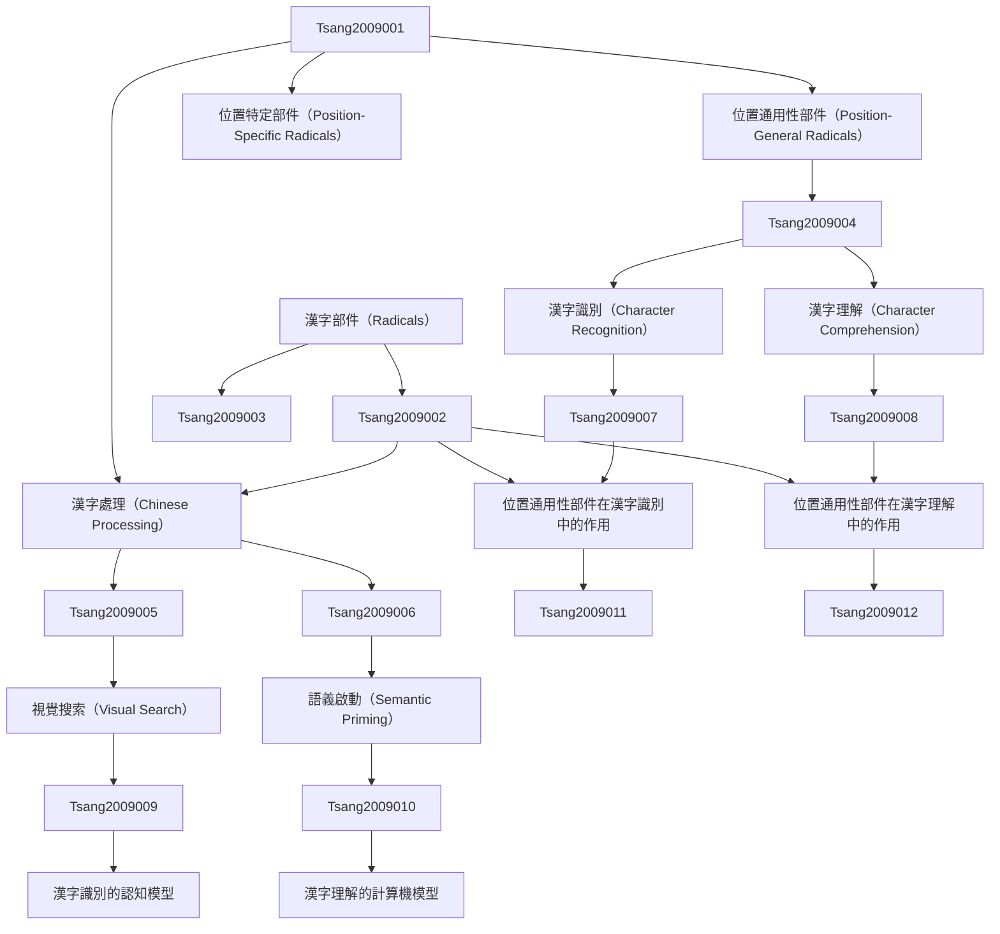

# Zettelkasten 卡片索引

**來源論文**: Do Position-General Radicals Have a Role to Play in Processing Chinese
**作者**: tsang, yiu-kei, chen, hsuan-chih
**年份**: None
**生成日期**: 2025-11-04 15:02
**卡片總數**: 12

---

## 📚 卡片清單

### 1. [漢字部件（Radicals）](zettel_cards/Tsang-2009-001.md)
- **ID**: `Tsang-2009-001`
- **類型**: 
- **核心**: **待原文補充**
- **標籤**: `漢字`, `部件`, `語言學`, `認知心理學`

### 2. [位置通用性部件（Position-General Radicals）](zettel_cards/Tsang-2009-002.md)
- **ID**: `Tsang-2009-002`
- **類型**: 
- **核心**: **待原文補充**
- **標籤**: `漢字`, `部件`, `位置通用`, `語言學`

### 3. [位置特定部件（Position-Specific Radicals）](zettel_cards/Tsang-2009-003.md)
- **ID**: `Tsang-2009-003`
- **類型**: 
- **核心**: **待原文補充**
- **標籤**: `漢字`, `部件`, `位置特定`, `語言學`

### 4. [漢字處理（Chinese Processing）](zettel_cards/Tsang-2009-004.md)
- **ID**: `Tsang-2009-004`
- **類型**: 
- **核心**: **待原文補充**
- **標籤**: `漢字`, `處理`, `認知心理學`, `語言學`

### 5. [漢字識別（Character Recognition）](zettel_cards/Tsang-2009-005.md)
- **ID**: `Tsang-2009-005`
- **類型**: 
- **核心**: **待原文補充**
- **標籤**: `漢字`, `識別`, `認知心理學`, `視覺`

### 6. [漢字理解（Character Comprehension）](zettel_cards/Tsang-2009-006.md)
- **ID**: `Tsang-2009-006`
- **類型**: 
- **核心**: **待原文補充**
- **標籤**: `漢字`, `理解`, `認知心理學`, `語義`

### 7. [視覺搜索（Visual Search）](zettel_cards/Tsang-2009-007.md)
- **ID**: `Tsang-2009-007`
- **類型**: 
- **核心**: **待原文補充**
- **標籤**: `視覺`, `搜索`, `認知心理學`, `方法論`

### 8. [語義啟動（Semantic Priming）](zettel_cards/Tsang-2009-008.md)
- **ID**: `Tsang-2009-008`
- **類型**: 
- **核心**: **待原文補充**
- **標籤**: `語義`, `啟動`, `認知心理學`, `方法論`

### 9. [位置通用性部件在漢字識別中的作用](zettel_cards/Tsang-2009-009.md)
- **ID**: `Tsang-2009-009`
- **類型**: 
- **核心**: **Do Position-General Radicals Have a Role to Play in Processing Chinese**
- **標籤**: `漢字`, `部件`, `位置通用`, `識別`, `認知心理學`

### 10. [位置通用性部件在漢字理解中的作用](zettel_cards/Tsang-2009-010.md)
- **ID**: `Tsang-2009-010`
- **類型**: 
- **核心**: **待原文補充**
- **標籤**: `漢字`, `部件`, `位置通用`, `理解`, `認知心理學`

### 11. [漢字識別的認知模型](zettel_cards/Tsang-2009-011.md)
- **ID**: `Tsang-2009-011`
- **類型**: 
- **核心**: **待原文補充**
- **標籤**: `漢字`, `識別`, `認知模型`, `計算機模型`

### 12. [漢字理解的計算機模型](zettel_cards/Tsang-2009-012.md)
- **ID**: `Tsang-2009-012`
- **類型**: 
- **核心**: **待原文補充**
- **標籤**: `漢字`, `理解`, `計算機模型`, `自然語言處理`

---

## 🗺️ 概念網絡圖

---

## 🏷️ 標籤索引

### 漢字
- [[Tsang-2009-001]] 漢字部件（Radicals）
- [[Tsang-2009-002]] 位置通用性部件（Position-General Radicals）
- [[Tsang-2009-003]] 位置特定部件（Position-Specific Radicals）
- [[Tsang-2009-004]] 漢字處理（Chinese Processing）
- [[Tsang-2009-005]] 漢字識別（Character Recognition）
- [[Tsang-2009-006]] 漢字理解（Character Comprehension）
- [[Tsang-2009-009]] 位置通用性部件在漢字識別中的作用
- [[Tsang-2009-010]] 位置通用性部件在漢字理解中的作用
- [[Tsang-2009-011]] 漢字識別的認知模型
- [[Tsang-2009-012]] 漢字理解的計算機模型

### 部件
- [[Tsang-2009-001]] 漢字部件（Radicals）
- [[Tsang-2009-002]] 位置通用性部件（Position-General Radicals）
- [[Tsang-2009-003]] 位置特定部件（Position-Specific Radicals）
- [[Tsang-2009-009]] 位置通用性部件在漢字識別中的作用
- [[Tsang-2009-010]] 位置通用性部件在漢字理解中的作用

### 語言學
- [[Tsang-2009-001]] 漢字部件（Radicals）
- [[Tsang-2009-002]] 位置通用性部件（Position-General Radicals）
- [[Tsang-2009-003]] 位置特定部件（Position-Specific Radicals）
- [[Tsang-2009-004]] 漢字處理（Chinese Processing）

### 認知心理學
- [[Tsang-2009-001]] 漢字部件（Radicals）
- [[Tsang-2009-004]] 漢字處理（Chinese Processing）
- [[Tsang-2009-005]] 漢字識別（Character Recognition）
- [[Tsang-2009-006]] 漢字理解（Character Comprehension）
- [[Tsang-2009-007]] 視覺搜索（Visual Search）
- [[Tsang-2009-008]] 語義啟動（Semantic Priming）
- [[Tsang-2009-009]] 位置通用性部件在漢字識別中的作用
- [[Tsang-2009-010]] 位置通用性部件在漢字理解中的作用

### 位置通用
- [[Tsang-2009-002]] 位置通用性部件（Position-General Radicals）
- [[Tsang-2009-009]] 位置通用性部件在漢字識別中的作用
- [[Tsang-2009-010]] 位置通用性部件在漢字理解中的作用

### 位置特定
- [[Tsang-2009-003]] 位置特定部件（Position-Specific Radicals）

### 處理
- [[Tsang-2009-004]] 漢字處理（Chinese Processing）

### 識別
- [[Tsang-2009-005]] 漢字識別（Character Recognition）
- [[Tsang-2009-009]] 位置通用性部件在漢字識別中的作用
- [[Tsang-2009-011]] 漢字識別的認知模型

### 視覺
- [[Tsang-2009-005]] 漢字識別（Character Recognition）
- [[Tsang-2009-007]] 視覺搜索（Visual Search）

### 理解
- [[Tsang-2009-006]] 漢字理解（Character Comprehension）
- [[Tsang-2009-010]] 位置通用性部件在漢字理解中的作用
- [[Tsang-2009-012]] 漢字理解的計算機模型

### 語義
- [[Tsang-2009-006]] 漢字理解（Character Comprehension）
- [[Tsang-2009-008]] 語義啟動（Semantic Priming）

### 搜索
- [[Tsang-2009-007]] 視覺搜索（Visual Search）

### 方法論
- [[Tsang-2009-007]] 視覺搜索（Visual Search）
- [[Tsang-2009-008]] 語義啟動（Semantic Priming）

### 啟動
- [[Tsang-2009-008]] 語義啟動（Semantic Priming）

### 認知模型
- [[Tsang-2009-011]] 漢字識別的認知模型

### 計算機模型
- [[Tsang-2009-011]] 漢字識別的認知模型
- [[Tsang-2009-012]] 漢字理解的計算機模型

### 自然語言處理
- [[Tsang-2009-012]] 漢字理解的計算機模型

---

## 📖 閱讀建議順序

1. [[Tsang-2009-001]] 漢字部件（Radicals）

2. [[Tsang-2009-002]] 位置通用性部件（Position-General Radicals）

3. [[Tsang-2009-003]] 位置特定部件（Position-Specific Radicals）

4. [[Tsang-2009-004]] 漢字處理（Chinese Processing）

5. [[Tsang-2009-005]] 漢字識別（Character Recognition）

6. [[Tsang-2009-006]] 漢字理解（Character Comprehension）

7. [[Tsang-2009-007]] 視覺搜索（Visual Search）

8. [[Tsang-2009-008]] 語義啟動（Semantic Priming）

9. [[Tsang-2009-009]] 位置通用性部件在漢字識別中的作用

10. [[Tsang-2009-010]] 位置通用性部件在漢字理解中的作用

11. [[Tsang-2009-011]] 漢字識別的認知模型

12. [[Tsang-2009-012]] 漢字理解的計算機模型

---

*本索引由 Knowledge Production System 自動生成*