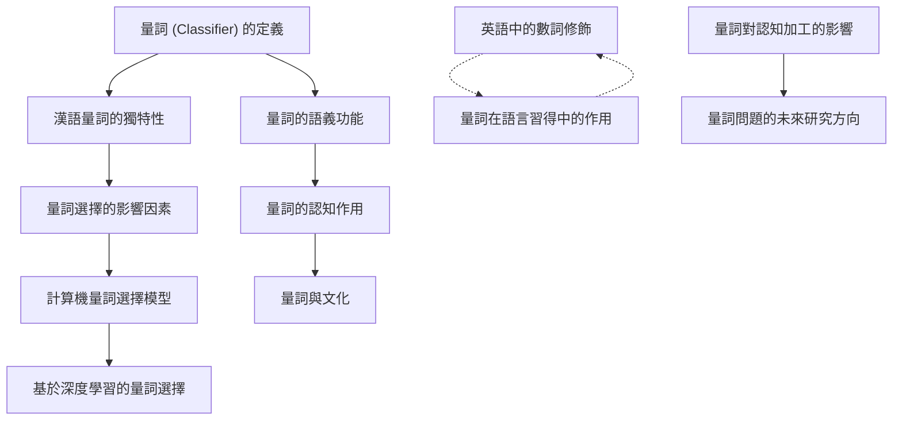

# Zettelkasten 卡片索引

---

## 📚 卡片清單

### 1. [量詞 (Classifier) 的定義](zettel_cards/Tzeng-1991-001.md)
- **ID**: `Tzeng-1991-001`
- **類型**: 
- **核心**: "A classifier is a word or morpheme used to classify a noun."
- **標籤**: `量詞`, `名詞分類`, `詞彙語義`

### 2. [漢語量詞的獨特性](zettel_cards/Tzeng-1991-002.md)
- **ID**: `Tzeng-1991-002`
- **類型**: 
- **核心**: "Chinese classifiers are obligatory in many contexts, unlike in English."
- **標籤**: `漢語語法`, `語言類型學`, `量詞的強制性`

### 3. [量詞的語義功能](zettel_cards/Tzeng-1991-003.md)
- **ID**: `Tzeng-1991-003`
- **類型**: 
- **核心**: "Classifiers provide semantic information about the noun they modify."
- **標籤**: `語義學`, `詞彙語義`, `認知語言學`

### 4. [量詞選擇的影響因素](zettel_cards/Tzeng-1991-004.md)
- **ID**: `Tzeng-1991-004`
- **類型**: 
- **核心**: "The choice of classifier is influenced by semantic features of the noun and contextual factors."
- **標籤**: `語境`, `語用學`, `詞彙選擇`

### 5. [英語中的數詞修飾](zettel_cards/Tzeng-1991-005.md)
- **ID**: `Tzeng-1991-005`
- **類型**: 
- **核心**: "In English, number words directly modify nouns without an intervening classifier."
- **標籤**: `英語語法`, `數詞`, `名詞修飾`

### 6. [量詞的認知作用](zettel_cards/Tzeng-1991-006.md)
- **ID**: `Tzeng-1991-006`
- **類型**: 
- **核心**: "Classifiers may reflect underlying cognitive categories."
- **標籤**: `認知科學`, `心理語言學`, `分類`

### 7. [計算機量詞選擇模型](zettel_cards/Tzeng-1991-007.md)
- **ID**: `Tzeng-1991-007`
- **類型**: 
- **核心**: "Computational models can be developed to predict classifier choice based on noun features and context."
- **標籤**: `自然語言處理`, `機器學習`, `量詞選擇模型`

### 8. [量詞在語言習得中的作用](zettel_cards/Tzeng-1991-008.md)
- **ID**: `Tzeng-1991-008`
- **類型**: 
- **核心**: "The acquisition of classifiers is a challenging task for second language learners of Chinese."
- **標籤**: `語言習得`, `第二語言習得`, `漢語作為第二語言`

### 9. [量詞與文化](zettel_cards/Tzeng-1991-009.md)
- **ID**: `Tzeng-1991-009`
- **類型**: 
- **核心**: "Classifiers may be culturally specific and reflect cultural values."
- **標籤**: `文化語言學`, `語言與文化`, `量詞的文化意義`

### 10. [基於深度學習的量詞選擇](zettel_cards/Tzeng-1991-010.md)
- **ID**: `Tzeng-1991-010`
- **類型**: 
- **核心**: "Deep learning models can learn complex patterns in classifier choice from large datasets."
- **標籤**: `深度學習`, `自然語言處理`, `神经网络`

### 11. [量詞對認知加工的影響](zettel_cards/Tzeng-1991-011.md)
- **ID**: `Tzeng-1991-011`
- **類型**: 
- **核心**: "The use of classifiers may influence cognitive processing during language comprehension."
- **標籤**: `認知加工`, `語言理解`, `心理語言學`

### 12. [量詞問題的未來研究方向](zettel_cards/Tzeng-1991-012.md)
- **ID**: `Tzeng-1991-012`
- **類型**: 
- **核心**: "Future research should explore the interaction between classifiers, syntax, semantics, and pragmatics in more detail."
- **標籤**: `研究方向`, `跨學科`, `語言學`

---

## 🗺️ 概念網絡圖

---

## 🏷️ 標籤索引

### 量詞
- [[Tzeng-1991-001]] 量詞 (Classifier) 的定義

### 名詞分類
- [[Tzeng-1991-001]] 量詞 (Classifier) 的定義

### 詞彙語義
- [[Tzeng-1991-001]] 量詞 (Classifier) 的定義
- [[Tzeng-1991-003]] 量詞的語義功能

### 漢語語法
- [[Tzeng-1991-002]] 漢語量詞的獨特性

### 語言類型學
- [[Tzeng-1991-002]] 漢語量詞的獨特性

### 量詞的強制性
- [[Tzeng-1991-002]] 漢語量詞的獨特性

### 語義學
- [[Tzeng-1991-003]] 量詞的語義功能

### 認知語言學
- [[Tzeng-1991-003]] 量詞的語義功能

### 語境
- [[Tzeng-1991-004]] 量詞選擇的影響因素

### 語用學
- [[Tzeng-1991-004]] 量詞選擇的影響因素

### 詞彙選擇
- [[Tzeng-1991-004]] 量詞選擇的影響因素

### 英語語法
- [[Tzeng-1991-005]] 英語中的數詞修飾

### 數詞
- [[Tzeng-1991-005]] 英語中的數詞修飾

### 名詞修飾
- [[Tzeng-1991-005]] 英語中的數詞修飾

### 認知科學
- [[Tzeng-1991-006]] 量詞的認知作用

### 心理語言學
- [[Tzeng-1991-006]] 量詞的認知作用
- [[Tzeng-1991-011]] 量詞對認知加工的影響

### 分類
- [[Tzeng-1991-006]] 量詞的認知作用

### 自然語言處理
- [[Tzeng-1991-007]] 計算機量詞選擇模型
- [[Tzeng-1991-010]] 基於深度學習的量詞選擇

### 機器學習
- [[Tzeng-1991-007]] 計算機量詞選擇模型

### 量詞選擇模型
- [[Tzeng-1991-007]] 計算機量詞選擇模型

### 語言習得
- [[Tzeng-1991-008]] 量詞在語言習得中的作用

### 第二語言習得
- [[Tzeng-1991-008]] 量詞在語言習得中的作用

### 漢語作為第二語言
- [[Tzeng-1991-008]] 量詞在語言習得中的作用

### 文化語言學
- [[Tzeng-1991-009]] 量詞與文化

### 語言與文化
- [[Tzeng-1991-009]] 量詞與文化

### 量詞的文化意義
- [[Tzeng-1991-009]] 量詞與文化

### 深度學習
- [[Tzeng-1991-010]] 基於深度學習的量詞選擇

### 神经网络
- [[Tzeng-1991-010]] 基於深度學習的量詞選擇

### 認知加工
- [[Tzeng-1991-011]] 量詞對認知加工的影響

### 語言理解
- [[Tzeng-1991-011]] 量詞對認知加工的影響

### 研究方向
- [[Tzeng-1991-012]] 量詞問題的未來研究方向

### 跨學科
- [[Tzeng-1991-012]] 量詞問題的未來研究方向

### 語言學
- [[Tzeng-1991-012]] 量詞問題的未來研究方向

---

## 📖 閱讀建議順序

1. [[Tzeng-1991-001]] 量詞 (Classifier) 的定義

2. [[Tzeng-1991-002]] 漢語量詞的獨特性

3. [[Tzeng-1991-003]] 量詞的語義功能

4. [[Tzeng-1991-004]] 量詞選擇的影響因素

5. [[Tzeng-1991-005]] 英語中的數詞修飾

6. [[Tzeng-1991-006]] 量詞的認知作用

7. [[Tzeng-1991-007]] 計算機量詞選擇模型

8. [[Tzeng-1991-008]] 量詞在語言習得中的作用

9. [[Tzeng-1991-009]] 量詞與文化

10. [[Tzeng-1991-010]] 基於深度學習的量詞選擇

11. [[Tzeng-1991-011]] 量詞對認知加工的影響

12. [[Tzeng-1991-012]] 量詞問題的未來研究方向

---

*本索引由 Knowledge Production System 自動生成*