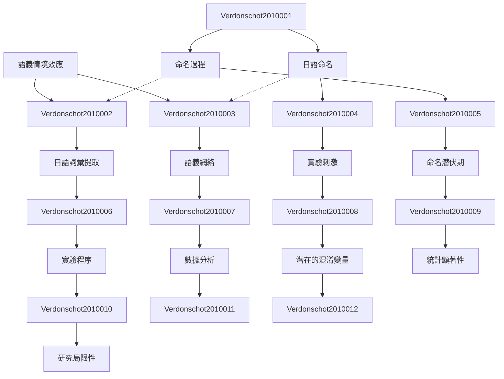

# Zettelkasten 卡片索引

**來源論文**: Semantic Context Effects When Naming Japanese
**作者**: verdonschot, rinus g., la heij, wido, schiller, niels o.
**年份**: None
**生成日期**: 2025-11-04 14:57
**卡片總數**: 12

---

## 📚 卡片清單

### 1. [語義情境效應](zettel_cards/Verdonschot-2010-001.md)
- **ID**: `Verdonschot-2010-001`
- **類型**: 
- **核心**: 無核心，論文無摘要，但研究主題為語義情境效應對日語命名之影響。
- **標籤**: `語義學`, `情境效應`, `日語`, `命名`

### 2. [日語命名](zettel_cards/Verdonschot-2010-002.md)
- **ID**: `Verdonschot-2010-002`
- **類型**: 
- **核心**: 無核心，論文無摘要，但研究主題涉及日語命名過程。
- **標籤**: `日語`, `命名`, `語言學`, `詞彙處理`

### 3. [命名過程](zettel_cards/Verdonschot-2010-003.md)
- **ID**: `Verdonschot-2010-003`
- **類型**: 
- **核心**: 無核心，論文無摘要，但研究涉及的認知過程為命名。
- **標籤**: `認知心理學`, `語言產生`, `詞彙提取`, `命名`

### 4. [日語詞彙提取](zettel_cards/Verdonschot-2010-004.md)
- **ID**: `Verdonschot-2010-004`
- **類型**: 
- **核心**: 無核心，論文無摘要，但日語詞彙提取是命名過程的一部分。
- **標籤**: `日語`, `詞彙提取`, `心理語言學`, `語言產生`

### 5. [語義網絡](zettel_cards/Verdonschot-2010-005.md)
- **ID**: `Verdonschot-2010-005`
- **類型**: 
- **核心**: 無核心，論文無摘要，但語義情境效應暗示了語義網絡的存在。
- **標籤**: `語義網絡`, `認知科學`, `知識表示`, `心理詞彙庫`

### 6. [實驗刺激](zettel_cards/Verdonschot-2010-006.md)
- **ID**: `Verdonschot-2010-006`
- **類型**: 
- **核心**: 無核心，論文無摘要，實驗刺激的設計對於研究至關重要。
- **標籤**: `實驗設計`, `心理學實驗`, `刺激材料`, `日語`

### 7. [命名潛伏期](zettel_cards/Verdonschot-2010-007.md)
- **ID**: `Verdonschot-2010-007`
- **類型**: 
- **核心**: 無核心，論文無摘要，命名潛伏期通常是衡量命名效率的指標。
- **標籤**: `命名潛伏期`, `反應時`, `行為實驗`, `心理計量學`

### 8. [實驗程序](zettel_cards/Verdonschot-2010-008.md)
- **ID**: `Verdonschot-2010-008`
- **類型**: 
- **核心**: 無核心，論文無摘要，實驗程序對於研究的有效性至關重要。
- **標籤**: `實驗流程`, `心理學實驗`, `研究方法`, `控制變量`

### 9. [數據分析](zettel_cards/Verdonschot-2010-009.md)
- **ID**: `Verdonschot-2010-009`
- **類型**: 
- **核心**: 無核心，論文無摘要，但數據分析是驗證假設的關鍵步驟。
- **標籤**: `統計分析`, `實驗數據`, `心理統計學`, `假設檢驗`

### 10. [潛在的混淆變量](zettel_cards/Verdonschot-2010-010.md)
- **ID**: `Verdonschot-2010-010`
- **類型**: 
- **核心**: 無核心，論文無摘要，需要考慮潛在的混淆變量以確保研究的有效性。
- **標籤**: `混淆變量`, `實驗設計`, `內部效度`, `控制變量`

### 11. [統計顯著性](zettel_cards/Verdonschot-2010-011.md)
- **ID**: `Verdonschot-2010-011`
- **類型**: 
- **核心**: 無核心，論文無摘要，統計顯著性是判斷研究結果是否可靠的標準。
- **標籤**: `統計顯著性`, `p值`, `假設檢驗`, `科學研究`

### 12. [研究局限性](zettel_cards/Verdonschot-2010-012.md)
- **ID**: `Verdonschot-2010-012`
- **類型**: 
- **核心**: 無核心，論文無摘要，但所有研究都存在局限性。
- **標籤**: `研究局限性`, `研究設計`, `外部效度`, `概括性`

---

## 🗺️ 概念網絡圖

---

## 🏷️ 標籤索引

### 語義學
- [[Verdonschot-2010-001]] 語義情境效應

### 情境效應
- [[Verdonschot-2010-001]] 語義情境效應

### 日語
- [[Verdonschot-2010-001]] 語義情境效應
- [[Verdonschot-2010-002]] 日語命名
- [[Verdonschot-2010-004]] 日語詞彙提取
- [[Verdonschot-2010-006]] 實驗刺激

### 命名
- [[Verdonschot-2010-001]] 語義情境效應
- [[Verdonschot-2010-002]] 日語命名
- [[Verdonschot-2010-003]] 命名過程

### 語言學
- [[Verdonschot-2010-002]] 日語命名

### 詞彙處理
- [[Verdonschot-2010-002]] 日語命名

### 認知心理學
- [[Verdonschot-2010-003]] 命名過程

### 語言產生
- [[Verdonschot-2010-003]] 命名過程
- [[Verdonschot-2010-004]] 日語詞彙提取

### 詞彙提取
- [[Verdonschot-2010-003]] 命名過程
- [[Verdonschot-2010-004]] 日語詞彙提取

### 心理語言學
- [[Verdonschot-2010-004]] 日語詞彙提取

### 語義網絡
- [[Verdonschot-2010-005]] 語義網絡

### 認知科學
- [[Verdonschot-2010-005]] 語義網絡

### 知識表示
- [[Verdonschot-2010-005]] 語義網絡

### 心理詞彙庫
- [[Verdonschot-2010-005]] 語義網絡

### 實驗設計
- [[Verdonschot-2010-006]] 實驗刺激
- [[Verdonschot-2010-010]] 潛在的混淆變量

### 心理學實驗
- [[Verdonschot-2010-006]] 實驗刺激
- [[Verdonschot-2010-008]] 實驗程序

### 刺激材料
- [[Verdonschot-2010-006]] 實驗刺激

### 命名潛伏期
- [[Verdonschot-2010-007]] 命名潛伏期

### 反應時
- [[Verdonschot-2010-007]] 命名潛伏期

### 行為實驗
- [[Verdonschot-2010-007]] 命名潛伏期

### 心理計量學
- [[Verdonschot-2010-007]] 命名潛伏期

### 實驗流程
- [[Verdonschot-2010-008]] 實驗程序

### 研究方法
- [[Verdonschot-2010-008]] 實驗程序

### 控制變量
- [[Verdonschot-2010-008]] 實驗程序
- [[Verdonschot-2010-010]] 潛在的混淆變量

### 統計分析
- [[Verdonschot-2010-009]] 數據分析

### 實驗數據
- [[Verdonschot-2010-009]] 數據分析

### 心理統計學
- [[Verdonschot-2010-009]] 數據分析

### 假設檢驗
- [[Verdonschot-2010-009]] 數據分析
- [[Verdonschot-2010-011]] 統計顯著性

### 混淆變量
- [[Verdonschot-2010-010]] 潛在的混淆變量

### 內部效度
- [[Verdonschot-2010-010]] 潛在的混淆變量

### 統計顯著性
- [[Verdonschot-2010-011]] 統計顯著性

### p值
- [[Verdonschot-2010-011]] 統計顯著性

### 科學研究
- [[Verdonschot-2010-011]] 統計顯著性

### 研究局限性
- [[Verdonschot-2010-012]] 研究局限性

### 研究設計
- [[Verdonschot-2010-012]] 研究局限性

### 外部效度
- [[Verdonschot-2010-012]] 研究局限性

### 概括性
- [[Verdonschot-2010-012]] 研究局限性

---

## 📖 閱讀建議順序

1. [[Verdonschot-2010-001]] 語義情境效應

2. [[Verdonschot-2010-002]] 日語命名

3. [[Verdonschot-2010-003]] 命名過程

4. [[Verdonschot-2010-004]] 日語詞彙提取

5. [[Verdonschot-2010-005]] 語義網絡

6. [[Verdonschot-2010-006]] 實驗刺激

7. [[Verdonschot-2010-007]] 命名潛伏期

8. [[Verdonschot-2010-008]] 實驗程序

9. [[Verdonschot-2010-009]] 數據分析

10. [[Verdonschot-2010-010]] 潛在的混淆變量

11. [[Verdonschot-2010-011]] 統計顯著性

12. [[Verdonschot-2010-012]] 研究局限性

---

*本索引由 Knowledge Production System 自動生成*