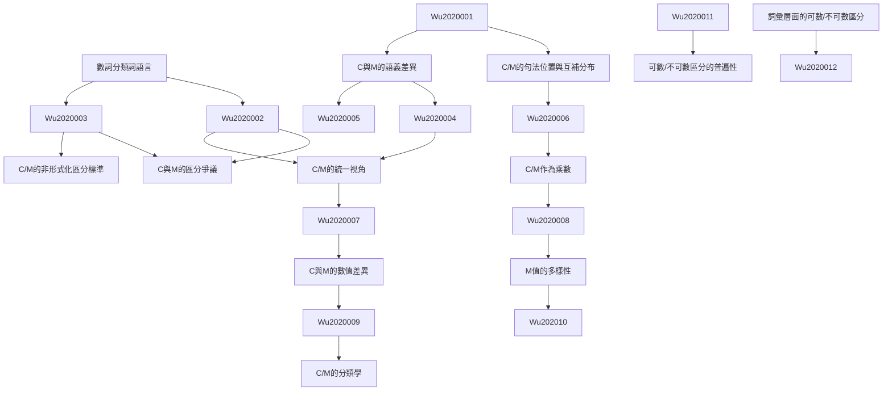

# Zettelkasten 卡片索引

## 📚 卡片清單

### 1. [數詞分類詞語言](zettel_cards/Wu-2020-001.md)
- **ID**: `Wu-2020-001`
- **核心**: In a numeral classifier language, a classifier (C) or measure word (M) is needed to link a noun (N) and its numerical quantifier (Num).

### 2. [C/M的句法位置與互補分布](zettel_cards/Wu-2020-002.md)
- **ID**: `Wu-2020-002`
- **核心**: This fact suggests that C and M in a classifier language form a single syntactic category, which we shall dub ‘C/M’.

### 3. [C與M的語義差異](zettel_cards/Wu-2020-003.md)
- **ID**: `Wu-2020-003`
- **核心**: A classifier categorizes a class of nouns by picking out some salient perceptual properties, either physically or functionally based, which are permanently associated with entities named by the class of nouns; a measure word does not categorize but denotes the quantity of the entity named by noun.

### 4. [C與M的區分爭議](zettel_cards/Wu-2020-004.md)
- **ID**: `Wu-2020-004`
- **核心**: The fact that C and M seem to converge and diverge at the same time has long put linguists in a quandary.

### 5. [C/M的非形式化區分標準](zettel_cards/Wu-2020-005.md)
- **ID**: `Wu-2020-005`
- **核心**: Yet, even for those that explicitly claim that C and M should be distinguished, the criteria proposed are often informal and imprecise.

### 6. [C/M的統一視角](zettel_cards/Wu-2020-006.md)
- **ID**: `Wu-2020-006`
- **核心**: In this paper we aim to accomplish three things. First, we will follow Her (2012a) in interpreting the convergence and divergence between Cs and Ms from a mathematical perspective and further argue that C/M as a single syntactic category can be classified into different subtypes in terms of their mathematical values.

### 7. [C/M作為乘數](zettel_cards/Wu-2020-007.md)
- **ID**: `Wu-2020-007`
- **核心**: From the multiplicative mathematical perspective proposed in Greenberg (1990[1972]: 172), Au Yeung (2007), and Her (2012a), C and M converge as the multiplicand, with Num as the multiplier.

### 8. [C與M的數值差異](zettel_cards/Wu-2020-008.md)
- **ID**: `Wu-2020-008`
- **核心**: Yet, crucially, a C’s value is numerical and necessarily 1, while an M’s value can be anything but 1, thus ¬1.

### 9. [M值的多樣性](zettel_cards/Wu-2020-009.md)
- **ID**: `Wu-2020-009`
- **核心**: An M’s value can therefore be numerical, e.g., 2, 6, 12, etc., or non-numerical, e.g., kilo, meter, liter, bottle, etc.

### 10. [C/M的分類學](zettel_cards/Wu-2020-010.md)
- **ID**: `Wu-2020-010`
- **核心**: This paper then proposes a new and comprehensive taxonomy based on the different kinds of mathematical values encoded in C/Ms and further proposes a formal semantic account of this taxonomy.

### 11. [詞彙層面的可數/不可數區分](zettel_cards/Wu-2020-011.md)
- **ID**: `Wu-2020-011`
- **核心**: Third, we will demonstrate that in carrying out the above two goals it is necessary to assume a lexical mass/count distinction in classifier languages.

### 12. [可數/不可數區分的普遍性](zettel_cards/Wu-2020-012.md)
- **ID**: `Wu-2020-012`
- **核心**: This position then leads to the conclusion that such a distinction is universal.

---

## 🗺️ 概念網絡圖

---

## 🏷️ 標籤索引

### 數詞分類詞
- [[Wu-2020-001]] 數詞分類詞語言

### 量詞
- [[Wu-2020-001]] 數詞分類詞語言
- [[Wu-2020-002]] C/M的句法位置與互補分布
- [[Wu-2020-003]] C與M的語義差異
- [[Wu-2020-004]] C與M的區分爭議
- [[Wu-2020-005]] C/M的非形式化區分標準
- [[Wu-2020-006]] C/M的統一視角
- [[Wu-2020-007]] C/M作為乘數
- [[Wu-2020-008]] C與M的數值差異
- [[Wu-2020-009]] M值的多樣性
- [[Wu-2020-010]] C/M的分類學

### 句法
- [[Wu-2020-001]] 數詞分類詞語言
- [[Wu-2020-002]] C/M的句法位置與互補分布

### 分類詞
- [[Wu-2020-002]] C/M的句法位置與互補分布
- [[Wu-2020-003]] C與M的語義差異
- [[Wu-2020-004]] C與M的區分爭議
- [[Wu-2020-005]] C/M的非形式化區分標準
- [[Wu-2020-006]] C/M的統一視角
- [[Wu-2020-007]] C/M作為乘數
- [[Wu-2020-008]] C與M的數值差異
- [[Wu-2020-010]] C/M的分類學
- [[Wu-2020-011]] 詞彙層面的可數/不可數區分

### C/M
- [[Wu-2020-002]] C/M的句法位置與互補分布

### 語義
- [[Wu-2020-003]] C與M的語義差異
- [[Wu-2020-010]] C/M的分類學

### 範疇化
- [[Wu-2020-003]] C與M的語義差異

### 爭議
- [[Wu-2020-004]] C與M的區分爭議

### 語言學
- [[Wu-2020-004]] C與M的區分爭議

### 標準
- [[Wu-2020-005]] C/M的非形式化區分標準

### 非形式化
- [[Wu-2020-005]] C/M的非形式化區分標準

### 數學
- [[Wu-2020-006]] C/M的統一視角
- [[Wu-2020-007]] C/M作為乘數
- [[Wu-2020-008]] C與M的數值差異
- [[Wu-2020-009]] M值的多樣性
- [[Wu-2020-010]] C/M的分類學

### 統一
- [[Wu-2020-006]] C/M的統一視角

### 乘數
- [[Wu-2020-007]] C/M作為乘數

### 被乘數
- [[Wu-2020-007]] C/M作為乘數

### 數值
- [[Wu-2020-008]] C與M的數值差異
- [[Wu-2020-009]] M值的多樣性

### 非數值
- [[Wu-2020-009]] M值的多樣性

### 分類學
- [[Wu-2020-010]] C/M的分類學

### 可數名詞
- [[Wu-2020-011]] 詞彙層面的可數/不可數區分
- [[Wu-2020-012]] 可數/不可數區分的普遍性

### 不可數名詞
- [[Wu-2020-011]] 詞彙層面的可數/不可數區分
- [[Wu-2020-012]] 可數/不可數區分的普遍性

### 詞彙
- [[Wu-2020-011]] 詞彙層面的可數/不可數區分
- [[Wu-2020-012]] 可數/不可數區分的普遍性

### 普遍性
- [[Wu-2020-012]] 可數/不可數區分的普遍性

---

## 📖 閱讀建議順序

1. [[Wu-2020-001]] 數詞分類詞語言

2. [[Wu-2020-002]] C/M的句法位置與互補分布

3. [[Wu-2020-003]] C與M的語義差異

4. [[Wu-2020-004]] C與M的區分爭議

5. [[Wu-2020-005]] C/M的非形式化區分標準

6. [[Wu-2020-006]] C/M的統一視角

7. [[Wu-2020-007]] C/M作為乘數

8. [[Wu-2020-008]] C與M的數值差異

9. [[Wu-2020-009]] M值的多樣性

10. [[Wu-2020-010]] C/M的分類學

11. [[Wu-2020-011]] 詞彙層面的可數/不可數區分

12. [[Wu-2020-012]] 可數/不可數區分的普遍性

---

*本索引由 Knowledge Production System 自動生成*