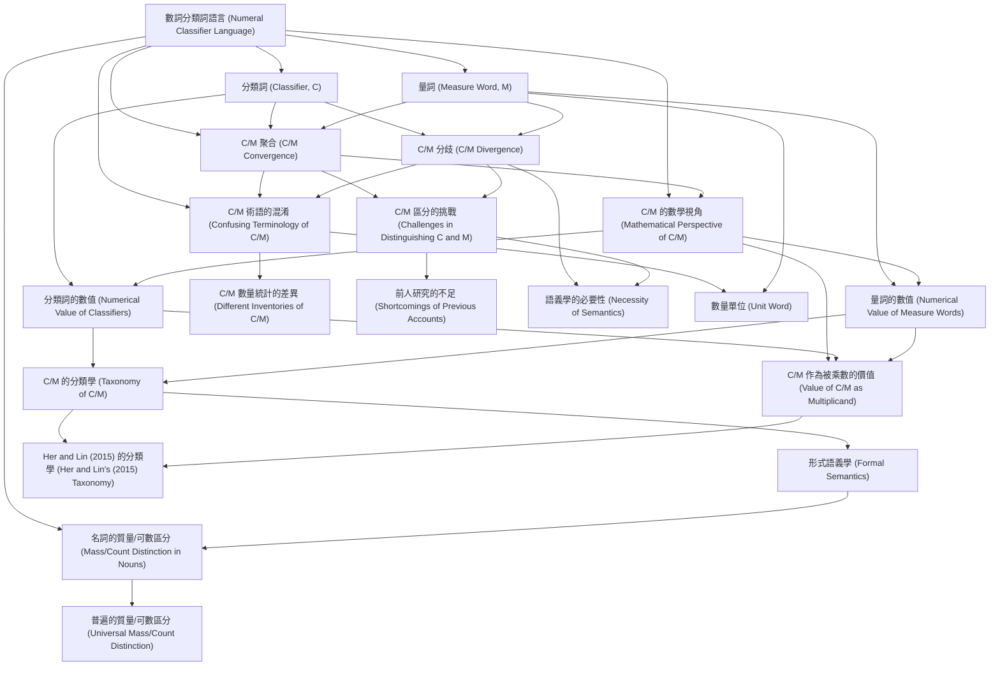

# Zettelkasten 卡片索引

**來源論文**: Wu2020_Taxonomy_Numeral_Classifiers
**作者**: 
**年份**: 2025
**生成日期**: 2025-10-29 15:47
**卡片總數**: 20

---

## 📚 卡片清單

### 1. [數詞分類詞語言 (Numeral Classifier Language)](zettel_cards/Linguistics-20251029-001.md)
- **ID**: `Linguistics-20251029-001`
- **類型**: 
- **核心**: "In a numeral classifier language, a classifier (C) or measure word (M) is needed to link a noun (N) and its numerical quantifier (Num)."
- **標籤**: `數詞分類詞`, `語言學`, `句法`

### 2. [分類詞 (Classifier, C)](zettel_cards/Linguistics-20251029-002.md)
- **ID**: `Linguistics-20251029-002`
- **類型**: 
- **核心**: "A classifier categorizes a class of nouns by picking out some salient perceptual properties, either physically or functionally based, which are permanently associated with entities named by the class of nouns"
- **標籤**: `分類詞`, `語義`, `類別`

### 3. [量詞 (Measure Word, M)](zettel_cards/Linguistics-20251029-003.md)
- **ID**: `Linguistics-20251029-003`
- **類型**: 
- **核心**: "a measure word does not categorize but denotes the quantity of the entity named by noun."
- **標籤**: `量詞`, `數量`, `計量`

### 4. [C/M 聚合 (C/M Convergence)](zettel_cards/Linguistics-20251029-004.md)
- **ID**: `Linguistics-20251029-004`
- **類型**: 
- **核心**: "This fact suggests that C and M in a classifier language form a single syntactic category, which we shall dub ‘C/M’."
- **標籤**: `句法`, `聚合`, `分類詞`, `量詞`

### 5. [C/M 分歧 (C/M Divergence)](zettel_cards/Linguistics-20251029-005.md)
- **ID**: `Linguistics-20251029-005`
- **類型**: 
- **核心**: "The undeniable fact that Ms quantify the head noun, but Cs must qualify the noun in terms of certain semantic features has compelled many researchers to claim that C and M are two distinct semantic and/or syntactic categories"
- **標籤**: `語義`, `分歧`, `分類詞`, `量詞`

### 6. [C/M 的數學視角 (Mathematical Perspective of C/M)](zettel_cards/Linguistics-20251029-006.md)
- **ID**: `Linguistics-20251029-006`
- **類型**: 
- **核心**: "From the multiplicative mathematical perspective proposed in Greenberg (1990[1972]: 172), Au Yeung (2007), and Her (2012a), C and M converge as the multiplicand, with Num as the multiplier."
- **標籤**: `數學`, `乘法`, `被乘數`, `乘數`

### 7. [分類詞的數值 (Numerical Value of Classifiers)](zettel_cards/Linguistics-20251029-007.md)
- **ID**: `Linguistics-20251029-007`
- **類型**: 
- **核心**: "a C’s value is numerical and necessarily 1"
- **標籤**: `數值`, `分類詞`, `數`

### 8. [量詞的數值 (Numerical Value of Measure Words)](zettel_cards/Linguistics-20251029-008.md)
- **ID**: `Linguistics-20251029-008`
- **類型**: 
- **核心**: "an M’s value can be anything but 1, thus ¬1."
- **標籤**: `數值`, `量詞`, `非一`

### 9. [C/M 的分類學 (Taxonomy of C/M)](zettel_cards/Linguistics-20251029-009.md)
- **ID**: `Linguistics-20251029-009`
- **類型**: 
- **核心**: "This paper then proposes a new and comprehensive taxonomy based on the different kinds of mathematical values encoded in C/Ms"
- **標籤**: `分類學`, `數學`, `數值`

### 10. [形式語義學 (Formal Semantics)](zettel_cards/Linguistics-20251029-010.md)
- **ID**: `Linguistics-20251029-010`
- **類型**: 
- **核心**: "This paper then proposes a new and comprehensive taxonomy based on the different kinds of mathematical values encoded in C/Ms and further proposes a formal semantic account of this taxonomy."
- **標籤**: `形式語義學`, `語義`, `分類學`

### 11. [名詞的質量/可數區分 (Mass/Count Distinction in Nouns)](zettel_cards/Linguistics-20251029-011.md)
- **ID**: `Linguistics-20251029-011`
- **類型**: 
- **核心**: "Third, we will demonstrate that in carrying out the above two goals it is necessary to assume a lexical mass/count distinction in classifier languages."
- **標籤**: `質量名詞`, `可數名詞`, `名詞`

### 12. [C/M 術語的混淆 (Confusing Terminology of C/M)](zettel_cards/Linguistics-20251029-012.md)
- **ID**: `Linguistics-20251029-012`
- **類型**: 
- **核心**: "As noted by some researchers, e.g., H. Zhang (2007: 45) and Her (2012a: 1669), the uncertain status of Cs and Ms is reflected in the often confusing terminology used in the literature."
- **標籤**: `術語`, `分類詞`, `量詞`

### 13. [C/M 數量統計的差異 (Different Inventories of C/M)](zettel_cards/Linguistics-20251029-013.md)
- **ID**: `Linguistics-20251029-013`
- **類型**: 
- **核心**: "Another symptom of the confused state of affairs, as noted by Her & Hsieh (2012: 128), is the drastically different inventories of ‘classifiers’, or linagci, compiled by different researchers for Mandarin Chinese"
- **標籤**: `數量`, `分類詞`, `量詞`, `統計`

### 14. [C/M 區分的挑戰 (Challenges in Distinguishing C and M)](zettel_cards/Linguistics-20251029-014.md)
- **ID**: `Linguistics-20251029-014`
- **類型**: 
- **核心**: "The problem is thus two-fold: how to precisely and insightfully distinguish C and M and yet also unify C/M at the same time."
- **標籤**: `區分`, `統一`, `分類詞`, `量詞`

### 15. [前人研究的不足 (Shortcomings of Previous Accounts)](zettel_cards/Linguistics-20251029-015.md)
- **ID**: `Linguistics-20251029-015`
- **類型**: 
- **核心**: "Previous accounts fall short one way or another."
- **標籤**: `侷限性`, `分類詞`, `量詞`

### 16. [C/M 作為被乘數的價值 (Value of C/M as Multiplicand)](zettel_cards/Linguistics-20251029-016.md)
- **ID**: `Linguistics-20251029-016`
- **類型**: 
- **核心**: "C/Ms are viewed as multiplicands with various kinds of values."
- **標籤**: `被乘數`, `數值`, `分類詞`, `量詞`

### 17. [Her and Lin (2015) 的分類學 (Her and Lin's (2015) Taxonomy)](zettel_cards/Linguistics-20251029-017.md)
- **ID**: `Linguistics-20251029-017`
- **類型**: 
- **核心**: "Thus, Her and Lin’s (2015) formal taxonomy of various subtypes under C/M will be discussed and supported."
- **標籤**: `分類學`, `形式化`, `亞型`

### 18. [語義學的必要性 (Necessity of Semantics)](zettel_cards/Linguistics-20251029-018.md)
- **ID**: `Linguistics-20251029-018`
- **類型**: 
- **核心**: "Wang (1994: 19-20) complains that ‘previous works in Chinese grammar treat classifiers and measure words on an equal footing’ and proclaims that ‘it is essential to tell classifiers from measure words both semantically and syntactically’."
- **標籤**: `語義`, `句法`, `重要性`

### 19. [數量單位 (Unit Word)](zettel_cards/Linguistics-20251029-019.md)
- **ID**: `Linguistics-20251029-019`
- **類型**: 
- **核心**: "some others use the term ‘measure word’, ‘measure’, ‘unit word’, or ‘numerative’ instead for the same purpose."
- **標籤**: `數量單位`, `量詞`, `術語`

### 20. [普遍的質量/可數區分 (Universal Mass/Count Distinction)](zettel_cards/Linguistics-20251029-020.md)
- **ID**: `Linguistics-20251029-020`
- **類型**: 
- **核心**: "This position then leads to the conclusion that such a distinction is universal."
- **標籤**: `質量名詞`, `可數名詞`, `普遍性`

---

## 🗺️ 概念網絡圖

---

## 🏷️ 標籤索引

### 數詞分類詞
- [[Linguistics-20251029-001]] 數詞分類詞語言 (Numeral Classifier Language)

### 語言學
- [[Linguistics-20251029-001]] 數詞分類詞語言 (Numeral Classifier Language)

### 句法
- [[Linguistics-20251029-001]] 數詞分類詞語言 (Numeral Classifier Language)
- [[Linguistics-20251029-004]] C/M 聚合 (C/M Convergence)
- [[Linguistics-20251029-018]] 語義學的必要性 (Necessity of Semantics)

### 分類詞
- [[Linguistics-20251029-002]] 分類詞 (Classifier, C)
- [[Linguistics-20251029-004]] C/M 聚合 (C/M Convergence)
- [[Linguistics-20251029-005]] C/M 分歧 (C/M Divergence)
- [[Linguistics-20251029-007]] 分類詞的數值 (Numerical Value of Classifiers)
- [[Linguistics-20251029-012]] C/M 術語的混淆 (Confusing Terminology of C/M)
- [[Linguistics-20251029-013]] C/M 數量統計的差異 (Different Inventories of C/M)
- [[Linguistics-20251029-014]] C/M 區分的挑戰 (Challenges in Distinguishing C and M)
- [[Linguistics-20251029-015]] 前人研究的不足 (Shortcomings of Previous Accounts)
- [[Linguistics-20251029-016]] C/M 作為被乘數的價值 (Value of C/M as Multiplicand)

### 語義
- [[Linguistics-20251029-002]] 分類詞 (Classifier, C)
- [[Linguistics-20251029-005]] C/M 分歧 (C/M Divergence)
- [[Linguistics-20251029-010]] 形式語義學 (Formal Semantics)
- [[Linguistics-20251029-018]] 語義學的必要性 (Necessity of Semantics)

### 類別
- [[Linguistics-20251029-002]] 分類詞 (Classifier, C)

### 量詞
- [[Linguistics-20251029-003]] 量詞 (Measure Word, M)
- [[Linguistics-20251029-004]] C/M 聚合 (C/M Convergence)
- [[Linguistics-20251029-005]] C/M 分歧 (C/M Divergence)
- [[Linguistics-20251029-008]] 量詞的數值 (Numerical Value of Measure Words)
- [[Linguistics-20251029-012]] C/M 術語的混淆 (Confusing Terminology of C/M)
- [[Linguistics-20251029-013]] C/M 數量統計的差異 (Different Inventories of C/M)
- [[Linguistics-20251029-014]] C/M 區分的挑戰 (Challenges in Distinguishing C and M)
- [[Linguistics-20251029-015]] 前人研究的不足 (Shortcomings of Previous Accounts)
- [[Linguistics-20251029-016]] C/M 作為被乘數的價值 (Value of C/M as Multiplicand)
- [[Linguistics-20251029-019]] 數量單位 (Unit Word)

### 數量
- [[Linguistics-20251029-003]] 量詞 (Measure Word, M)
- [[Linguistics-20251029-013]] C/M 數量統計的差異 (Different Inventories of C/M)

### 計量
- [[Linguistics-20251029-003]] 量詞 (Measure Word, M)

### 聚合
- [[Linguistics-20251029-004]] C/M 聚合 (C/M Convergence)

### 分歧
- [[Linguistics-20251029-005]] C/M 分歧 (C/M Divergence)

### 數學
- [[Linguistics-20251029-006]] C/M 的數學視角 (Mathematical Perspective of C/M)
- [[Linguistics-20251029-009]] C/M 的分類學 (Taxonomy of C/M)

### 乘法
- [[Linguistics-20251029-006]] C/M 的數學視角 (Mathematical Perspective of C/M)

### 被乘數
- [[Linguistics-20251029-006]] C/M 的數學視角 (Mathematical Perspective of C/M)
- [[Linguistics-20251029-016]] C/M 作為被乘數的價值 (Value of C/M as Multiplicand)

### 乘數
- [[Linguistics-20251029-006]] C/M 的數學視角 (Mathematical Perspective of C/M)

### 數值
- [[Linguistics-20251029-007]] 分類詞的數值 (Numerical Value of Classifiers)
- [[Linguistics-20251029-008]] 量詞的數值 (Numerical Value of Measure Words)
- [[Linguistics-20251029-009]] C/M 的分類學 (Taxonomy of C/M)
- [[Linguistics-20251029-016]] C/M 作為被乘數的價值 (Value of C/M as Multiplicand)

### 數
- [[Linguistics-20251029-007]] 分類詞的數值 (Numerical Value of Classifiers)

### 非一
- [[Linguistics-20251029-008]] 量詞的數值 (Numerical Value of Measure Words)

### 分類學
- [[Linguistics-20251029-009]] C/M 的分類學 (Taxonomy of C/M)
- [[Linguistics-20251029-010]] 形式語義學 (Formal Semantics)
- [[Linguistics-20251029-017]] Her and Lin (2015) 的分類學 (Her and Lin's (2015) Taxonomy)

### 形式語義學
- [[Linguistics-20251029-010]] 形式語義學 (Formal Semantics)

### 質量名詞
- [[Linguistics-20251029-011]] 名詞的質量/可數區分 (Mass/Count Distinction in Nouns)
- [[Linguistics-20251029-020]] 普遍的質量/可數區分 (Universal Mass/Count Distinction)

### 可數名詞
- [[Linguistics-20251029-011]] 名詞的質量/可數區分 (Mass/Count Distinction in Nouns)
- [[Linguistics-20251029-020]] 普遍的質量/可數區分 (Universal Mass/Count Distinction)

### 名詞
- [[Linguistics-20251029-011]] 名詞的質量/可數區分 (Mass/Count Distinction in Nouns)

### 術語
- [[Linguistics-20251029-012]] C/M 術語的混淆 (Confusing Terminology of C/M)
- [[Linguistics-20251029-019]] 數量單位 (Unit Word)

### 統計
- [[Linguistics-20251029-013]] C/M 數量統計的差異 (Different Inventories of C/M)

### 區分
- [[Linguistics-20251029-014]] C/M 區分的挑戰 (Challenges in Distinguishing C and M)

### 統一
- [[Linguistics-20251029-014]] C/M 區分的挑戰 (Challenges in Distinguishing C and M)

### 侷限性
- [[Linguistics-20251029-015]] 前人研究的不足 (Shortcomings of Previous Accounts)

### 形式化
- [[Linguistics-20251029-017]] Her and Lin (2015) 的分類學 (Her and Lin's (2015) Taxonomy)

### 亞型
- [[Linguistics-20251029-017]] Her and Lin (2015) 的分類學 (Her and Lin's (2015) Taxonomy)

### 重要性
- [[Linguistics-20251029-018]] 語義學的必要性 (Necessity of Semantics)

### 數量單位
- [[Linguistics-20251029-019]] 數量單位 (Unit Word)

### 普遍性
- [[Linguistics-20251029-020]] 普遍的質量/可數區分 (Universal Mass/Count Distinction)

---

## 📖 閱讀建議順序

1. [[Linguistics-20251029-013]] C/M 數量統計的差異 (Different Inventories of C/M)

2. [[Linguistics-20251029-015]] 前人研究的不足 (Shortcomings of Previous Accounts)

3. [[Linguistics-20251029-017]] Her and Lin (2015) 的分類學 (Her and Lin's (2015) Taxonomy)

4. [[Linguistics-20251029-018]] 語義學的必要性 (Necessity of Semantics)

5. [[Linguistics-20251029-019]] 數量單位 (Unit Word)

6. [[Linguistics-20251029-020]] 普遍的質量/可數區分 (Universal Mass/Count Distinction)

7. [[Linguistics-20251029-010]] 形式語義學 (Formal Semantics)

8. [[Linguistics-20251029-011]] 名詞的質量/可數區分 (Mass/Count Distinction in Nouns)

9. [[Linguistics-20251029-016]] C/M 作為被乘數的價值 (Value of C/M as Multiplicand)

10. [[Linguistics-20251029-007]] 分類詞的數值 (Numerical Value of Classifiers)

11. [[Linguistics-20251029-008]] 量詞的數值 (Numerical Value of Measure Words)

12. [[Linguistics-20251029-009]] C/M 的分類學 (Taxonomy of C/M)

13. [[Linguistics-20251029-012]] C/M 術語的混淆 (Confusing Terminology of C/M)

14. [[Linguistics-20251029-014]] C/M 區分的挑戰 (Challenges in Distinguishing C and M)

15. [[Linguistics-20251029-002]] 分類詞 (Classifier, C)

16. [[Linguistics-20251029-004]] C/M 聚合 (C/M Convergence)

17. [[Linguistics-20251029-005]] C/M 分歧 (C/M Divergence)

18. [[Linguistics-20251029-006]] C/M 的數學視角 (Mathematical Perspective of C/M)

19. [[Linguistics-20251029-003]] 量詞 (Measure Word, M)

20. [[Linguistics-20251029-001]] 數詞分類詞語言 (Numeral Classifier Language)

---

*本索引由 Knowledge Production System 自動生成*